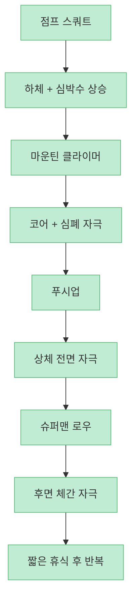
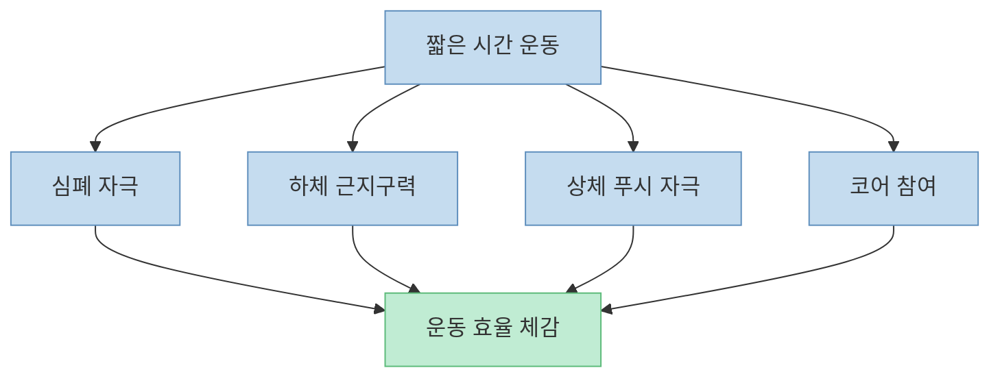
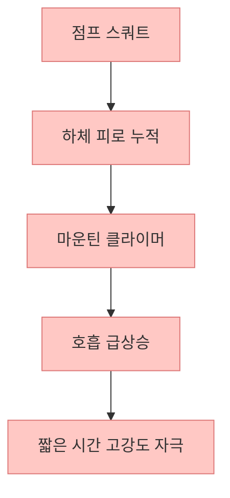
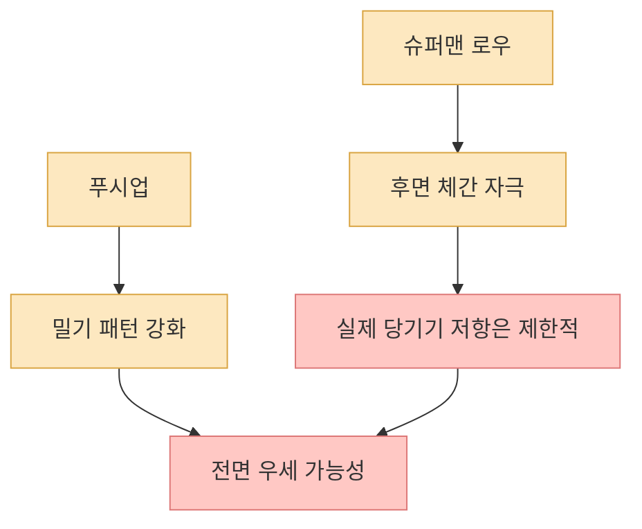
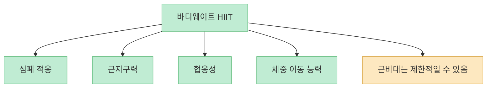
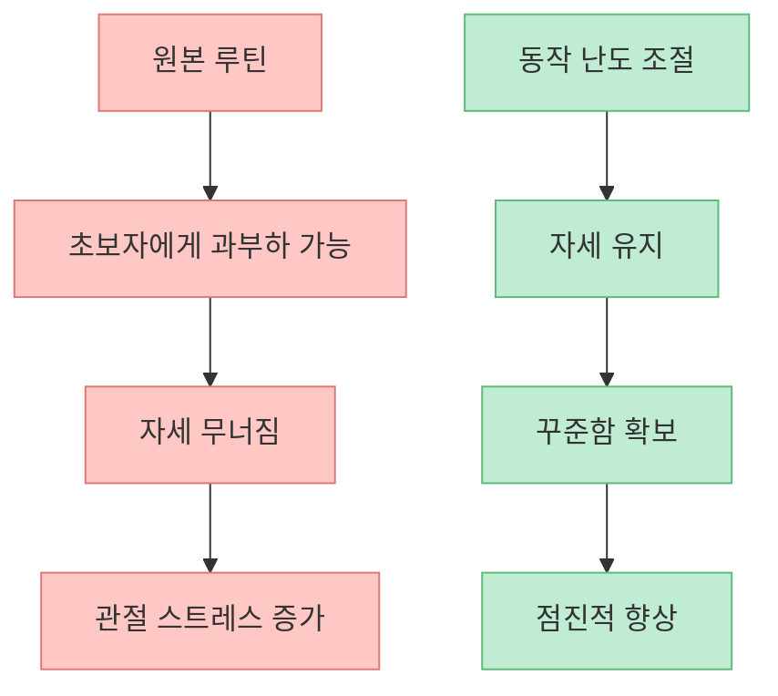
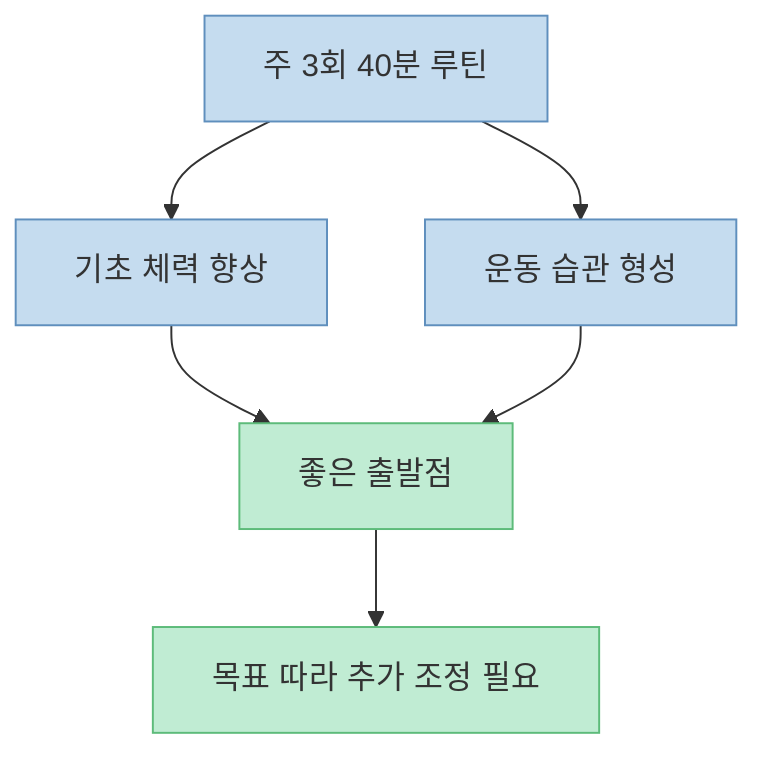

이 쇼츠는 주 3회, 한 번 40분이면 전신을 털어낼 수 있는 맨몸운동 루틴이 있다고 말합니다. 점프 스쿼트, 마운틴 클라이머, 푸시업, 슈퍼맨 로우를 인터벌처럼 묶어서 3~4라운드 돌리는 방식인데, 짧은 시간에 심폐와 근력을 동시에 몰아붙일 수 있다는 점에서 분명 매력적입니다. 다만 `"이걸로 평생 운동 걱정 끝"` 같은 표현은 과장이고, **무엇에 강하고 무엇은 부족한 루틴인지 구분해서 보는 편이 정확합니다.**

<!--more-->

## Sources

- [효과 미쳐버린 전신 맨몸운동 루틴](https://youtube.com/shorts/9tZcmSzXqUA)
- [Adult Activity: An Overview | CDC](https://www.cdc.gov/physical-activity-basics/guidelines/adults.html)
- [Physical activity - WHO](https://www.who.int/news-room/fact-sheets/detail/physical-activity)
- [High-Intensity Interval Training: For Fitness, for Health or Both? | ACSM](https://acsm.org/high-intensity-interval-training-fitness/)
- [High-Intensity Interval Training | ACSM's Health & Fitness Journal](https://journals.lww.com/acsm-healthfitness/fulltext/2013/05000/high_intensity_interval_training__efficient%2C.3.aspx)

## 1. 이 루틴의 본질은 맨몸 근력운동이라기보다 "전신형 바디웨이트 HIIT"에 가깝다

쇼츠에서 제시한 구성은 이렇습니다. [영상 0:15~0:40](https://youtu.be/9tZcmSzXqUA?t=15)

- 점프 스쿼트 20~40회  
- 마운틴 클라이머 40~60회  
- 푸시업 실패 지점까지  
- 슈퍼맨 로우 12~20회  
- 1분 휴식 후 3~4라운드 반복  

이건 전통적인 근비대 중심 웨이트 루틴보다는, **심박수를 높게 유지하면서 전신을 순환시키는 고강도 인터벌 트레이닝** 에 더 가깝습니다. ACSM이 설명하는 HIIT도 본질적으로 짧은 고강도 구간과 회복 구간을 번갈아 수행하면서 심폐 기능과 대사 자극을 높이는 방식입니다.

즉 이 루틴은 `전신 맨몸운동` 이면서도 더 정확하게는 **전신 서킷형 HIIT** 로 이해하는 편이 맞습니다.

## 2. 왜 시간이 적은 사람에게는 꽤 좋은가: 심폐와 근지구력을 동시에 건드릴 수 있기 때문이다

이 루틴의 강점은 분명합니다. 짧은 시간 안에:

- 다리 큰 근육을 쓰고  
- 심박수를 끌어올리고  
- 코어를 계속 동원하고  
- 상체 푸시 패턴까지 넣습니다  

CDC와 WHO는 성인에게 유산소 활동과 근력 강화 활동을 함께 권장합니다. 이 루틴은 완벽히 분리된 형태는 아니지만, **한 세션 안에서 심폐 자극과 근육 사용을 동시에 묶는다** 는 점이 시간이 없는 사람에게 유리합니다.

특히 `"운동할 시간이 없다"`는 사람에게는, 운동 종류를 지나치게 나누기보다 **한 번에 많이 건드리는 루틴** 이 지속 가능성을 높여 줄 수 있습니다.

## 3. 점프 스쿼트 + 마운틴 클라이머 조합은 생각보다 강하다: 하체 피로 위에 심폐를 얹기 때문이다

이 루틴의 체감 난이도가 높은 이유는 첫 두 동작의 조합에 있습니다. 점프 스쿼트는 반복할수록 하체 큰 근육과 파워를 강하게 쓰고, 마운틴 클라이머는 그 상태에서 심박수를 더 올립니다. 그래서 단순히 `몇 개 했는가`보다 **호흡이 어디까지 차오르느냐** 가 난도를 결정합니다.

ACSM 자료도 HIIT가 심폐 적응과 대사 측면에서 효율적일 수 있다고 설명합니다. 다만 그 말이 곧바로 "근육도 더 잘 붙는다"는 단순 공식으로 이어지지는 않습니다. 심폐 자극과 근지구력 향상에는 강하지만, **전통적인 저반복 고저항 근비대 자극과는 목적이 다릅니다.**

즉 이 루틴은 `운동량 대비 힘들다`는 느낌이 강할 가능성이 높고, 바로 그 점이 시간 효율의 원천이기도 합니다.

## 4. 하지만 "전신 종결"이라고 보기엔 당기는 동작이 약하다

쇼츠는 슈퍼맨 로우를 두고 맨몸으로 등 운동 효과를 낼 수 있는 거의 유일한 운동처럼 소개합니다. [영상 0:31~0:36](https://youtu.be/9tZcmSzXqUA?t=31) 그러나 이 부분은 다소 과장입니다. 슈퍼맨 계열 동작은 후면 체간, 척추기립근, 어깨 뒤쪽을 깨우는 데는 도움이 될 수 있지만, **풀업·로우처럼 실제 견갑 후인과 수평 당기기 저항을 충분히 주는 등 운동을 완전히 대체하긴 어렵습니다.**

이 루틴은 푸시업으로 전면 상체는 어느 정도 자극하지만, 후면 상체의 `당기기 패턴` 은 상대적으로 약합니다. 따라서 오래 이 루틴만 하면:

- 가슴·어깨 전면은 자주 쓰는데  
- 등 전체와 광배, 상완 이두 쪽 자극은 부족할 수 있습니다  

그래서 문틀 철봉, 밴드 로우, 인버티드 로우 같은 **당기기 보완 동작** 을 추가하면 루틴의 균형이 훨씬 좋아집니다.

## 5. 이 루틴이 잘 주는 것은 "근비대"보다 "근지구력 + 체력 + 체중 이동 능력"이다

쇼츠는 근육도 더 잘 붙는다고 말하지만, 그 표현은 조건부로 이해해야 합니다. 운동을 거의 안 하던 초보자라면 이 루틴만으로도 몸이 단단해지고, 체중이 가벼워지고, 팔·다리·코어가 눈에 띄게 강해질 수 있습니다. 하지만 이미 푸시업, 스쿼트, 인터벌에 익숙한 사람이라면, **근육을 크게 늘리는 자극은 상대적으로 제한적** 일 수 있습니다.

이 루틴이 잘 주는 적응은 대체로 다음입니다.

- 숨이 덜 차는 느낌  
- 반복 버티는 힘  
- 전신 협응  
- 체중을 내 몸으로 다루는 능력  

즉 이 루틴을 `몸매 조각 전용` 보다 **운동 체력 기반 만들기용** 으로 보면 훨씬 적절합니다.

## 6. 초보자는 반복 수보다 기술과 관절 스트레스를 먼저 봐야 한다

점프 스쿼트 20~40개, 마운틴 클라이머 40~60개, 푸시업 실패 지점까지는 초보자에게 꽤 높은 자극일 수 있습니다. 특히 점프 동작은:

- 무릎  
- 발목  
- 허리 착지 충격  

에 영향을 줄 수 있고, 푸시업 실패지점 반복은 어깨나 손목이 약한 사람에게 부담이 될 수 있습니다.

그래서 처음엔 그대로 따라 하기보다 이런 식으로 낮춰도 됩니다.

- 점프 스쿼트 → 일반 스쿼트 또는 반점프 스쿼트  
- 마운틴 클라이머 → 속도 낮추기  
- 푸시업 → 무릎 푸시업 / 박스 푸시업  
- 슈퍼맨 로우 → 반복 수 줄이고 자세 우선  

짧고 강한 루틴일수록, 처음엔 `얼마나 많이`보다 **얼마나 무너지지 않고** 하느냐가 더 중요합니다.

## 7. 주 3회 40분은 꽤 괜찮은 출발점이지만, 가이드라인 전체를 모두 대체하진 않는다

쇼츠는 주 3회 40분이면 평생 운동 걱정이 끝난다고 표현하지만, 그 문장은 동기부여용에 가깝습니다. CDC와 WHO는 성인에게 주당 유산소 활동과 주요 근육군을 대상으로 한 근력 강화 활동을 권장합니다. 이 루틴은 그 기준에 `가까워질 수는` 있지만, 개인 목표에 따라 부족할 수도 있습니다.

예를 들어:

- 체지방 감량이 목표라면 걷기·식단 관리가 함께 필요할 수 있고  
- 근육량 증가가 목표라면 저항 증량이 추가로 필요하고  
- 허리·무릎 문제가 있다면 동작 교체가 필요할 수 있습니다  

즉 이 루틴은 `끝판왕` 보다는, **시간이 없는 사람이 시작하기 좋은 강한 기본기 루틴** 으로 이해하는 편이 가장 현실적입니다.

## 핵심 요약

- 이 쇼츠의 루틴은 전통적 맨몸 근력운동보다 **전신 서킷형 HIIT** 에 가깝습니다.
- 짧은 시간 안에 심폐와 근지구력을 함께 자극할 수 있어 시간이 부족한 사람에게 유용합니다.
- 특히 점프 스쿼트와 마운틴 클라이머 조합이 심박수와 하체 피로를 크게 끌어올립니다.
- 다만 푸시 동작에 비해 **당기기 패턴이 약해서 등 운동은 보완이 필요** 합니다.
- 잘 주는 적응은 근비대보다 **체력, 근지구력, 협응, 체중 이동 능력** 쪽입니다.
- 초보자는 반복 수를 그대로 따라 하기보다 충격과 자세를 먼저 조절해야 합니다.
- 주 3회 40분은 훌륭한 출발점이지만, 모든 목표를 자동으로 해결해 주는 만능 루틴은 아닙니다.

## 결론

이 루틴의 진짜 장점은 `미친 효과` 같은 과장된 문구보다, **적은 시간 안에 전신을 꽤 빡세게 움직이게 만든다** 는 데 있습니다. 그래서 바쁜 사람에게는 아주 좋은 기본기 루틴이 될 수 있습니다. 다만 이것 하나로 모든 근육과 목표를 다 해결한다고 보기보다, **심폐 + 하체 + 푸시 중심의 강한 스타터 루틴** 으로 이해하고, 필요하면 당기기 운동과 난도 조절을 붙이는 것이 가장 현명합니다.
