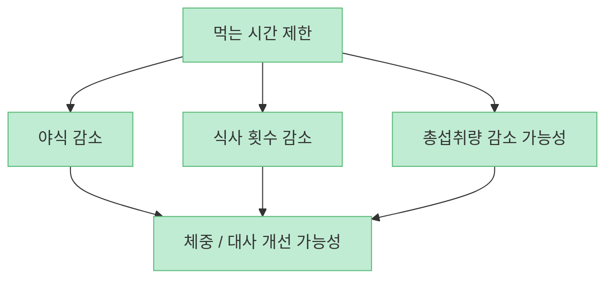
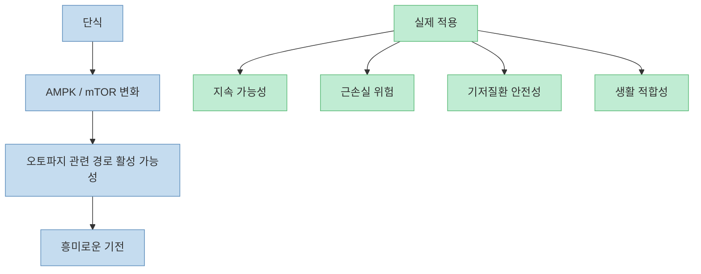
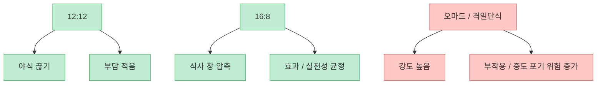
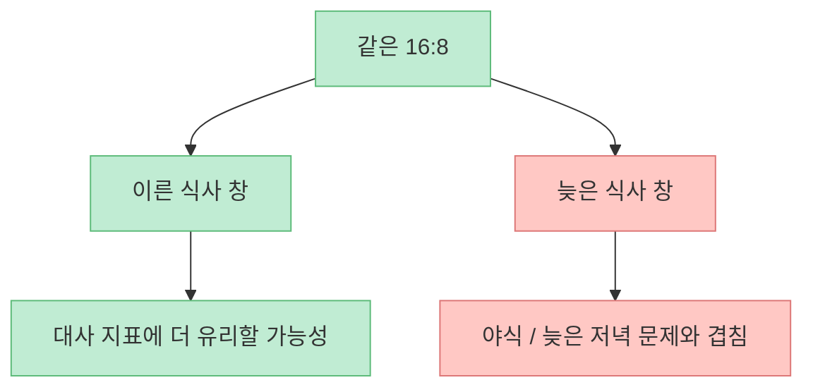
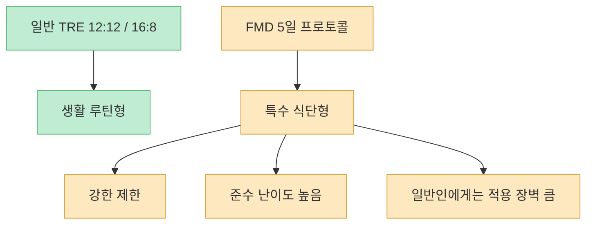
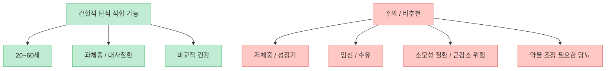
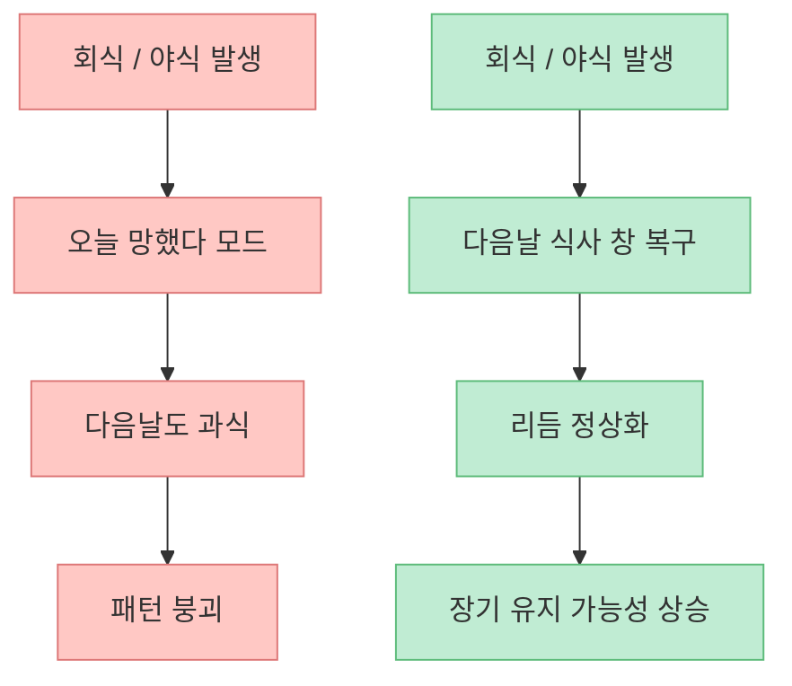
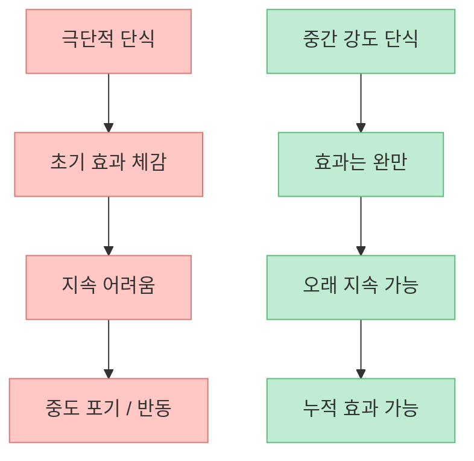

이 영상은 간헐적 단식을 매우 체계적으로 설명하려고 합니다. 12:12, 16:8, 5:2, 격일단식, 오마드, 그리고 FMD까지 한 프레임에서 비교하면서 무엇이 더 쉽고, 무엇이 더 강하고, 무엇이 더 위험한지를 나눠 말합니다. 다만 메시지를 한 줄로 요약하면 이렇습니다. **간헐적 단식은 분명 유용할 수 있지만, 누구에게나 좋은 만능 항노화 전략은 아니고, 실제로는 적용 대상·나이·체중·질환 유무에 따라 판단이 크게 달라진다** 는 것입니다.

<!--more-->

## Sources

- [간헐적단식 올바르게 실행하는 방법ㅣ닥터딩요](https://youtu.be/rUF9FoDBHp0)
- [Health Benefits of Intermittent Fasting - PMC](https://pmc.ncbi.nlm.nih.gov/articles/PMC11262566/)
- [Intermittent fasting and health outcomes: an umbrella review - PMC](https://pmc.ncbi.nlm.nih.gov/articles/PMC10945168/)
- [Time-Restricted Eating, Cardiometabolic Health in Obesity and The Metabolic Syndrome - PMC](https://pmc.ncbi.nlm.nih.gov/articles/PMC12971787/)
- [A periodic diet that mimics fasting promotes multi-system regeneration - PMC](https://pmc.ncbi.nlm.nih.gov/articles/PMC4509734/)
- [Fasting-mimicking diet and markers/risk factors for aging, diabetes, cancer, and cardiovascular disease - PMC](https://pmc.ncbi.nlm.nih.gov/articles/PMC6816332/)
- [Study Examines Intermittent Fasting and Cardiovascular Mortality - JAMA](https://jamanetwork.com/journals/jama/fullarticle/2817556)

## 1. 간헐적 단식의 핵심 가치는 "굶음 자체"보다 먹는 시간을 구조화하는 데 있다

영상은 간헐적 단식의 기원을 원시적 식사 패턴, 케톤 증가, 오토파지 같은 설명으로 시작합니다. [영상 0:27~1:47](https://youtu.be/rUF9FoDBHp0?t=27) 이런 설명은 흥미롭지만, 실제 사람에게서 가장 일관되게 확인되는 장점은 오히려 더 현실적입니다.

간헐적 단식은 보통:

- 먹는 시간을 제한하고  
- 불필요한 야식을 줄이며  
- 총섭취 칼로리를 낮추고  
- 식사 구조를 단순하게 만들어  

체중과 대사 지표를 개선할 가능성이 있습니다.

즉 많은 경우 핵심은 `굶는 행위의 신비한 힘`보다, **먹는 시간을 정해 놓음으로써 과식과 야식을 줄이는 구조 효과** 에 있습니다.

그래서 간헐적 단식이 잘 맞는 사람은 대개 `공복을 잘 견디는 특별한 사람`이라기보다, **시간 규칙이 생기면 오히려 덜 먹게 되는 사람** 입니다.

## 2. 오토파지는 흥미로운 기전이지만, 사람에게서 그것만으로 전략을 고르기엔 아직 과장되기 쉽다

영상은 mTOR, AMPK, 오토파지를 설명하며 어떤 방식이 오토파지를 가장 많이 켜는지 묻습니다. [영상 1:11~1:47](https://youtu.be/rUF9FoDBHp0?t=71) 이 설명은 생물학적 방향성 자체는 맞습니다. 단식 상태가 세포 내 스트레스 반응과 재활용 경로를 촉진할 수 있다는 것은 동물실험과 일부 인체 연구에서 꾸준히 제시됩니다.

하지만 여기서 조심할 점이 있습니다. 오토파지는 **연구실에서 매우 중요한 기전** 이지만, 실제 생활 전략을 고를 때는 그보다:

- 내가 지속 가능한가  
- 근육 손실 위험은 없는가  
- 기존 질환과 충돌하지 않는가  
- 식이장애적 패턴을 만들지 않는가  

를 먼저 봐야 합니다.

즉 오토파지는 단식의 `흥미로운 설명` 일 수는 있어도, **개인에게 최적 전략을 자동으로 결정해 주는 기준** 은 아닙니다.

## 3. 가장 현실적인 입문형은 대개 12:12 또는 16:8이다

영상은 사실상 `지금 당장 시작할 수 있는 것`과 `효과는 크지만 어렵고 빡센 것`을 구분합니다. [영상 8:47~9:18](https://youtu.be/rUF9FoDBHp0?t=527) 그리고 메인 결론을 `16:8`과 `FMD` 두 축으로 좁힙니다. [영상 14:16~14:33](https://youtu.be/rUF9FoDBHp0?t=856)

이 중 일반인에게 가장 현실적인 건 대체로:

- **12:12**: 야식 끊기 중심  
- **16:8**: 하루 두 끼 또는 식사 시간 압축  

입니다.

리뷰 논문들을 봐도 time-restricted eating은 체중, 공복혈당, 인슐린, 중성지방 같은 지표를 완만하게 개선할 가능성이 있습니다. 다만 극적인 차이보다 **지속 가능한 생활 패턴으로 이어질 때** 의미가 커집니다.

즉 대다수 사람에게 간헐적 단식의 시작은 `굶기 기술` 이 아니라, **야식과 늦은 식사를 줄이는 시간 구조화** 입니다.

## 4. 아침을 굶느냐 저녁을 당기느냐에서는 대체로 "늦은 저녁 피하기" 쪽 근거가 더 강하다

영상에서 가장 실용적인 부분 중 하나는 16:8을 할 때 아침을 굶는 방식보다, **저녁을 너무 늦게 먹지 않는 쪽** 이 더 낫다고 설명하는 대목입니다. [영상 16:57~17:36](https://youtu.be/rUF9FoDBHp0?t=1017)

이 지점은 최근 시간제한식 연구들과도 어느 정도 맞닿아 있습니다. 같은 16:8이라도 `먹는 시간 창을 앞당기는 early TRE`가 대사 지표에 더 유리할 수 있다는 보고가 반복됩니다. 반대로 아주 늦은 저녁 식사는 혈당 조절과 심혈관 지표에 불리할 가능성이 있습니다.

그래서 현실적으로는 `"아침을 먹느냐 마느냐"`보다, **밤 늦게까지 먹는 패턴을 끊을 수 있느냐** 가 더 중요할 때가 많습니다.

## 5. FMD는 흥미롭지만, 일반적인 생활 습관 도구라기보다 특수 프로토콜에 가깝다

영상은 FMD를 거의 메인 주제로 다룹니다. [영상 9:00~9:16](https://youtu.be/rUF9FoDBHp0?t=540), [영상 25:03~25:32](https://youtu.be/rUF9FoDBHp0?t=1503) FMD는 물만 마시는 완전 단식이 아니라, 일정 기간 매우 낮은 열량과 특정 영양 비율로 `단식과 비슷한 상태` 를 유도하려는 방식입니다.

Valter Longo 계열 연구는 FMD가 일부 노화·대사 지표에 긍정적 신호를 보일 수 있다고 보고합니다. 하지만 이 방식은:

- 매우 제한적이고  
- 식단 구성이 까다롭고  
- 일반 생활에 바로 얹기 어렵고  
- 장기 안전성과 실제 임상적 의미를 더 봐야 하는 부분이 있습니다  

즉 FMD는 흥미로운 `치료적 / 연구적` 도구일 수 있지만, 대부분의 사람에게는 우선 **야식 끊기와 식사 시간 압축** 이 훨씬 현실적입니다.

## 6. 간헐적 단식을 하면 안 되는 사람은 생각보다 많다

영상은 20~60세, 과체중 또는 대사질환이 있는 비교적 건강한 사람에게 더 맞고, 근감소 위험이 큰 고령자나 특정 질환군은 피해야 한다고 설명합니다. [영상 3:28~4:02](https://youtu.be/rUF9FoDBHp0?t=208), [영상 6:04~6:44](https://youtu.be/rUF9FoDBHp0?t=364)

실제로도 간헐적 단식은 모든 사람에게 보편적으로 권할 수 없습니다. 특히 주의가 필요한 경우는:

- 저체중  
- 성장기 청소년  
- 임신·수유 중  
- 섭식장애 경향  
- 복약 타이밍이 중요한 당뇨 환자  
- 암·간경변 등 소모성 질환자  
- 근감소 위험이 큰 고령자  

입니다.

그래서 간헐적 단식은 `좋다 vs 나쁘다`의 문제가 아니라, **누구에게 맞는가 / 누구에게 위험한가** 의 문제입니다.

## 7. 회식과 야식이 많은 현실에서는 "실패를 되돌리는 규칙"이 더 중요하다

영상 후반의 현실적인 부분은 한국 직장인의 회식 문제를 다루는 대목입니다. [영상 19:37~20:19](https://youtu.be/rUF9FoDBHp0?t=1177) 결국 간헐적 단식의 성패는 완벽한 규칙보다, **깨졌을 때 어떻게 복구하느냐** 에 달려 있습니다.

영상은 회식 전에 단백질과 좋은 지방으로 포만감을 어느 정도 만들고, 실패했더라도 다음날 식사 구조를 다시 정상화하라고 조언합니다. 이 접근은 실용적입니다. 왜냐하면 많은 사람은 단식이 깨진 순간 `오늘 망했다` 모드로 들어가고, 그게 이틀, 사흘 연쇄 과식으로 이어지기 때문입니다.

즉 간헐적 단식은 의지 시험이 아니라, **리듬 복구 기술** 에 더 가깝습니다.

## 8. 간헐적 단식의 진짜 질문은 "얼마나 오래 굶나"가 아니라 "내가 계속 유지할 수 있나"다

영상은 결국 16:8과 FMD 중 내 상황에 맞는 것을 고르라고 말하지만, 대부분의 사람에게 더 중요한 질문은 사실 이겁니다.

- 내가 이 방식으로 3일이 아니라 3개월 갈 수 있나  
- 근육량, 수면, 사회생활을 덜 망치면서 갈 수 있나  
- 체중과 대사 지표가 실제로 좋아지나  

리뷰 논문들을 종합하면, 간헐적 단식은 분명 체중과 대사 지표에 도움이 될 수 있습니다. 그러나 지속 가능한 경우에만 그렇습니다. 극단적인 방식이 더 `강해 보일` 수는 있어도, 실제 건강 결과는 **지속 가능성** 이 결정하는 경우가 많습니다.

그래서 대다수 사람에게 가장 좋은 단식법은 `가장 강한 것`이 아니라, **가장 오래 무리 없이 유지할 수 있는 것** 입니다.

## 핵심 요약

- 간헐적 단식의 가장 현실적인 장점은 오토파지 신비보다 **야식 감소, 식사 구조 단순화, 총섭취량 조절** 에 있습니다.
- 12:12와 16:8은 일반인에게 가장 현실적인 입문형 전략입니다.
- 같은 16:8이라도 대체로 `늦은 저녁을 피하는 쪽`이 더 유리할 가능성이 있습니다.
- FMD는 흥미롭지만, 일반 생활 습관 전략이라기보다 **제한이 큰 특수 프로토콜** 에 가깝습니다.
- 저체중, 성장기, 임신·수유, 소모성 질환, 근감소 위험이 큰 고령자 등은 단식을 조심하거나 피해야 합니다.
- 단식의 진짜 핵심은 완벽함보다 **리듬 복구와 지속 가능성** 입니다.

## 결론

간헐적 단식은 분명 유용한 도구일 수 있습니다. 하지만 그것이 만능 항노화 전략도 아니고, 누구에게나 맞는 표준 정답도 아닙니다. 대부분의 사람에게 필요한 것은 `오토파지를 최대로 켜는 극단적 방식`보다, **늦은 저녁과 야식을 줄이고, 무리 없이 오래 갈 수 있는 식사 시간 구조를 만드는 것** 입니다.
