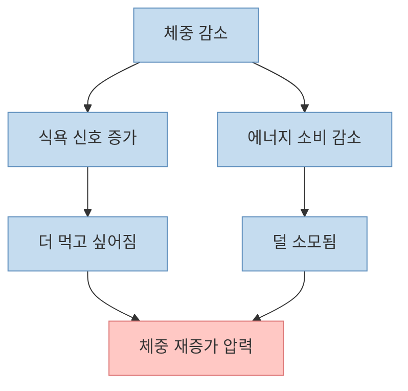
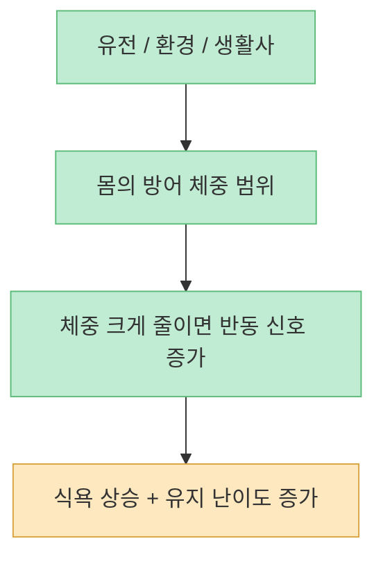
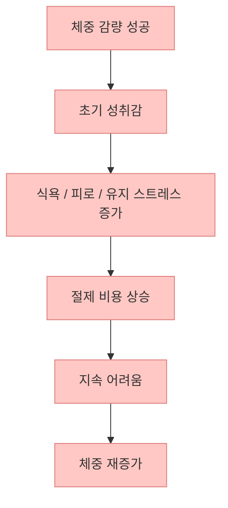
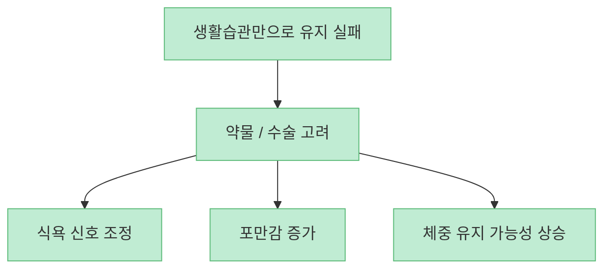
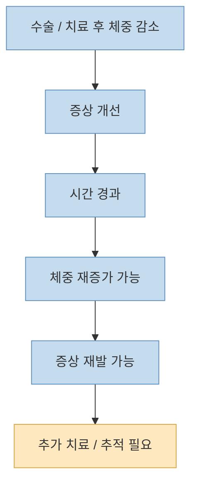
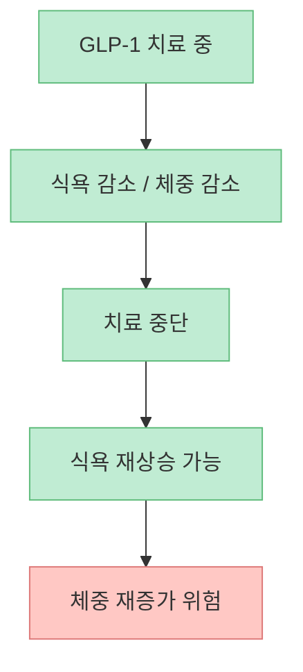
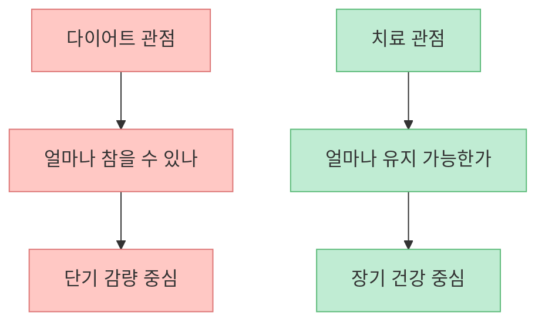

이 영상의 핵심은 아주 선명합니다. 비만은 `조금만 덜 먹고 더 움직이면 해결되는 상태` 가 아니라, **몸이 기존 체중을 되찾으려고 강하게 방어하는 생물학적 조건** 이라는 것입니다. 그래서 단순한 의지나 단기 다이어트만으로는 반복적으로 실패하기 쉽고, 어떤 사람에게는 약물이나 수술까지 포함한 치료가 현실적인 선택지가 될 수 있다는 메시지로 이어집니다.

<!--more-->

## Sources

- [[아구통 주의!] 고도비만으로 위절제를 겪은 서울대 교수가 말하는 비만과 세트포인트ㅣ장형우 교수님 1부ㅣ닥터딩요](https://youtu.be/12YAHfd5Wt4)
- [Obesity and Set-Point Theory - StatPearls - NCBI Bookshelf](https://www.ncbi.nlm.nih.gov/books/NBK592402/)
- [Maintenance of lost weight and long-term management of obesity - PMC](https://pmc.ncbi.nlm.nih.gov/articles/PMC5764193/)
- [2022 ASMBS/IFSO Indications for Metabolic and Bariatric Surgery - PMC](https://pmc.ncbi.nlm.nih.gov/articles/PMC9834364/)
- [Sleeve Gastrectomy - ASMBS](https://asmbs.org/condition_procedures/sleeve-gastrectomy/)
- [Discontinuing glucagon-like peptide-1 receptor agonists and body habitus: A systematic review and meta-analysis - PubMed](https://pubmed.ncbi.nlm.nih.gov/40186344/)

## 1. 이 영상이 강하게 말하는 것은 "비만은 성격 문제가 아니다"라는 점이다

인터뷰에서 가장 인상적인 부분은 비만을 나태함이나 탐욕으로 도덕화하는 시선을 정면으로 반박하는 대목입니다. [영상 17:30~18:24](https://youtu.be/12YAHfd5Wt4?t=750) 여기서 설명하는 핵심은, 폭식이나 반복 섭식 충동이 단순히 `즐기기 위해 먹는 욕구` 가 아니라 **살기 위해 숨을 쉬듯 밀려오는 생물학적 욕구처럼 느껴질 수 있다** 는 점입니다.

이 설명은 세트포인트 이론과도 맞닿아 있습니다. StatPearls와 장기 체중 유지 리뷰들은 몸이 일정 체중 범위를 방어하려는 항상성 기전을 설명합니다. 체중이 크게 줄면 식욕 신호는 올라가고, 에너지 소비는 내려가며, 그 결과 체중을 원래 수준으로 되돌리려는 방향이 강해집니다.

즉 비만 치료가 어려운 이유는 의지가 약해서가 아니라, **몸이 체중 감소를 위협으로 해석하고 되돌리려 하기 때문** 이라는 설명이 더 정확합니다.

## 2. 세트포인트는 "딱 고정된 숫자"라기보다 몸이 방어하는 범위에 가깝다

영상은 세트포인트를 강하게 강조하지만, 과학적으로는 이를 `절대 고정 체중` 으로 이해하면 약간 단순화가 됩니다. [영상 18:15~18:44](https://youtu.be/12YAHfd5Wt4?t=765) 현재 설명되는 세트포인트 또는 그에 가까운 개념은, 몸이 특정 체중 또는 체지방 범위를 유지하려는 **방어 시스템** 에 가깝습니다.

이 범위는 유전, 초기 생애 경험, 환경, 수면, 스트레스, 음식 접근성, 활동량 등에 영향을 받습니다. 그래서 어떤 사람은 체중을 조금 줄이는 건 버틸 수 있어도, 큰 폭으로 줄이는 순간 강한 반동이 옵니다. 영상에서 BMI 36에서 시작한 사람이 BMI 11을 낮춰야 하는 상황을 `의지의 문제`로 볼 수 없다고 말하는 대목은 바로 이 지점을 찌릅니다. [영상 24:46~25:12](https://youtu.be/12YAHfd5Wt4?t=1046)

그래서 세트포인트는 `나는 원래 이 몸무게야` 같은 운명론이 아니라, **왜 체중 유지가 어려운지 설명하는 생리학적 배경** 으로 보는 편이 맞습니다.

## 3. 단기 다이어트가 실패하는 이유는 감량 자체보다 "유지 비용"이 너무 비싸기 때문이다

영상에서 인상적인 흐름은 이렇습니다. 저탄고지로 9kg 정도는 빠졌고, 약물도 써 봤지만, 결국 유지가 안 되면서 다시 116kg으로 돌아갑니다. [영상 6:44~7:18](https://youtu.be/12YAHfd5Wt4?t=284) 이 대목은 많은 비만 환자의 실제 경험과 닮아 있습니다.

장기 체중 유지 리뷰에서도 반복되는 결론은 비슷합니다. 문제는 체중 감량 자체보다, **감량된 체중을 계속 유지하기 위해 평생 지불해야 하는 생리적·행동적 비용** 입니다. 매일 강한 절제를 요구하고, 조금만 방심해도 원래 체중 쪽으로 돌아가려는 압력이 크다면, 그것은 단순한 생활 습관 조언만으로 해결되기 어렵습니다.

이 맥락에서 보면, 비만 치료의 진짜 목표는 `한 번 많이 빼기`가 아니라 **힘들지 않게 어느 정도 체중을 유지할 수 있는 상태를 만드는 것** 입니다.

## 4. 그래서 약물과 수술은 "편법"이 아니라 체중 방어 시스템을 바꾸려는 치료가 된다

인터뷰에서는 결국 수술을 결심하게 된 배경으로 부정맥, 수면무호흡증, 미래 질병 위험에 대한 절박감을 말합니다. [영상 10:35~11:08](https://youtu.be/12YAHfd5Wt4?t=435) 여기서 중요한 건 수술이 단순히 위를 줄여서 덜 먹게 만드는 물리적 처치가 아니라는 점입니다.

ASMBS 자료에 따르면 sleeve gastrectomy 같은 대사·비만수술은:

- 음식 섭취량을 줄이고  
- 포만감과 배고픔을 조절하는 신호를 바꾸며  
- 비만 관련 질환 개선에 도움을 줄 수 있습니다  

즉 이 치료는 `의지를 대신하는 꼼수` 가 아니라, **몸이 체중을 방어하는 생물학적 시스템 자체를 흔드는 방법** 으로 이해하는 편이 맞습니다.

이 프레임으로 보면, 수술이나 약물은 `마지막 수단` 이면서도 동시에 어떤 환자에게는 **가장 논리적인 만성질환 치료 수단** 일 수 있습니다.

## 5. 수술 후에도 끝이 아니다: 체중은 다시 올라갈 수 있고, 그때 치료는 이어진다

영상은 수술 후 80kg대까지 내려갔다가 다시 100kg을 넘고, 부정맥과 수면무호흡이 재발하는 과정도 솔직하게 말합니다. [영상 13:02~14:29](https://youtu.be/12YAHfd5Wt4?t=591) 이 부분이 매우 중요합니다. 많은 사람은 수술을 `영구 해결책` 처럼 생각하지만, 현실은 그렇지 않을 수 있습니다.

체중은 수술 후에도 다시 올라갈 수 있고, 그에 따라 증상도 재발할 수 있습니다. 이 사실은 수술이 실패했다는 뜻이 아니라, **비만이 만성질환이라는 사실을 다시 보여 주는 것** 에 가깝습니다.

그래서 비만 치료를 고혈압이나 당뇨처럼 `계속 관리하는 질환` 으로 보는 시각이 중요합니다.

## 6. GLP-1 약물도 같은 맥락이다: 쓰는 동안만 효과가 있는 게 아니라, 끊으면 다시 올라오기 쉽다

영상 후반은 GLP-1 계열 치료제와 비슷한 맥락의 이야기를 합니다. [영상 19:45~20:18](https://youtu.be/12YAHfd5Wt4?t=1185) 핵심은 단순합니다. 정말 의지만으로 해결되는 질환이라면, 왜 이렇게 많은 사람이 약을 끊고 다시 체중이 오르겠느냐는 것입니다.

최근 메타분석들도 GLP-1 수용체 작용제 중단 후 유의한 체중 재증가가 흔하다고 보고합니다. 즉 약물은 `잠깐 빼는 도구` 가 아니라, 어떤 사람에게는 **장기 유지 치료의 일부** 일 수 있습니다.

이건 약이 나쁘다는 뜻이 아니라, 비만 치료를 감기약처럼 `먹고 끝` 으로 이해하면 안 된다는 뜻입니다.

## 7. 그래서 비만 치료의 질문은 "얼마나 참을 수 있나?"가 아니라 "얼마나 덜 힘들게 유지할 수 있나?"가 된다

영상에서 가장 중요한 문장 중 하나는 `"힘들지 않으면서 정상 체중을 유지할 수 있어야 치료가 된 것"` 이라는 취지의 말입니다. [영상 24:28~24:45](https://youtu.be/12YAHfd5Wt4?t=1028) 이 관점은 비만 치료를 바라보는 기준을 완전히 바꿉니다.

많은 다이어트 담론은 다음 질문을 합니다.

- 얼마나 독하게 할 수 있나  
- 얼마나 오래 참을 수 있나  

하지만 치료 관점에서는 질문이 달라집니다.

- 얼마나 덜 고통스럽게 유지할 수 있나  
- 식욕과 건강 위험을 얼마나 안정적으로 줄일 수 있나  

이 차이를 받아들이는 순간, 비만 치료는 도덕 평가가 아니라 **만성질환 관리 전략** 으로 바뀝니다.

## 핵심 요약

- 이 영상은 비만을 의지 부족이 아니라 **강한 생물학적 체중 방어가 작동하는 상태** 로 설명합니다.
- 세트포인트는 고정된 운명 숫자라기보다, 몸이 체중을 되돌리려는 **방어 범위** 에 가깝습니다.
- 다이어트가 자주 실패하는 이유는 감량 자체보다 **유지 비용이 너무 크기 때문** 입니다.
- 비만대사수술과 GLP-1 치료는 편법이 아니라, **체중 방어 시스템 자체를 조정하려는 치료** 로 이해해야 합니다.
- 수술 후에도, 약물 중단 후에도 체중이 다시 오를 수 있다는 점은 비만이 **만성질환** 이라는 사실을 보여 줍니다.
- 치료의 핵심 질문은 `얼마나 참을 수 있나`가 아니라 **얼마나 덜 힘들게 유지할 수 있나** 입니다.

## 결론

비만을 `의지 문제`로만 보면 실패는 늘 개인 탓이 됩니다. 하지만 세트포인트, 체중 재증가, 약물 중단 후 반등, 수술 후 재상승까지 함께 보면 훨씬 다른 그림이 보입니다. 비만은 단순한 습관 문제가 아니라, **생물학적 방어가 강하게 작동하는 만성질환** 에 가깝고, 그래서 치료도 장기적이고 현실적인 유지 전략으로 접근해야 합니다.
