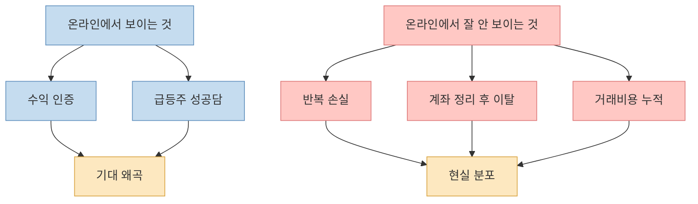
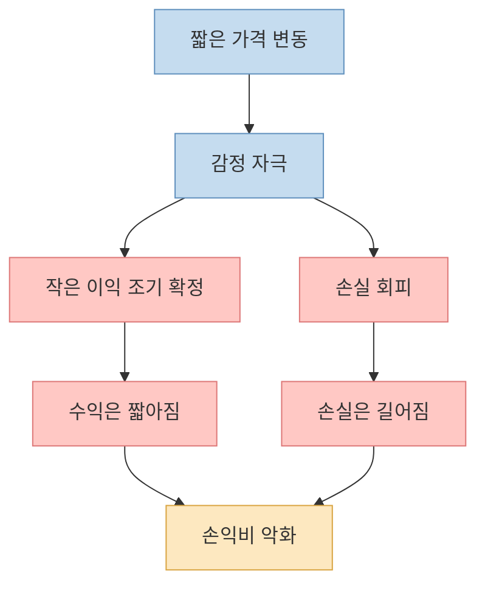
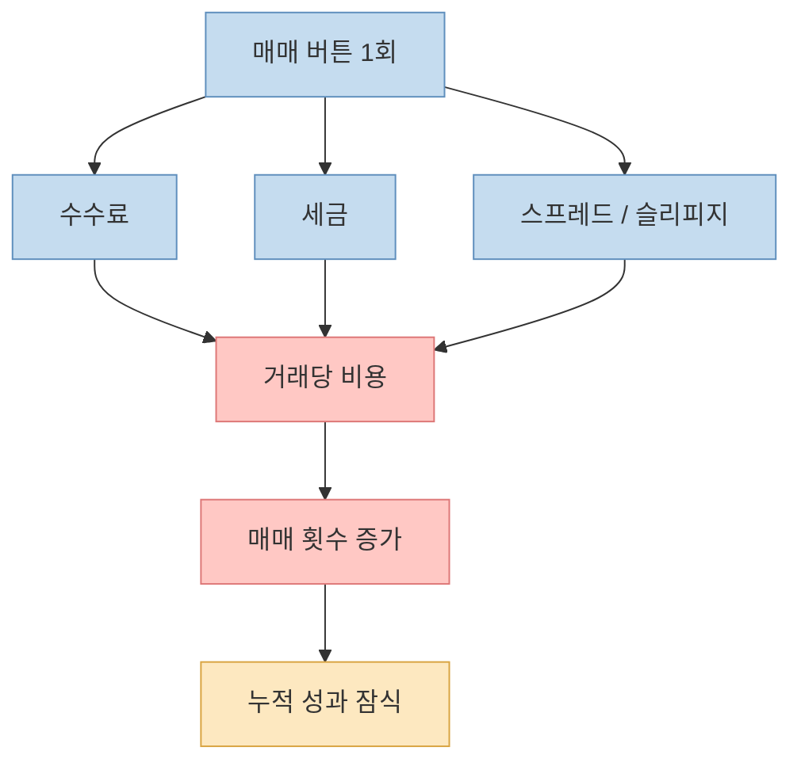
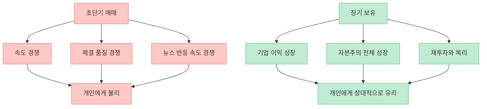
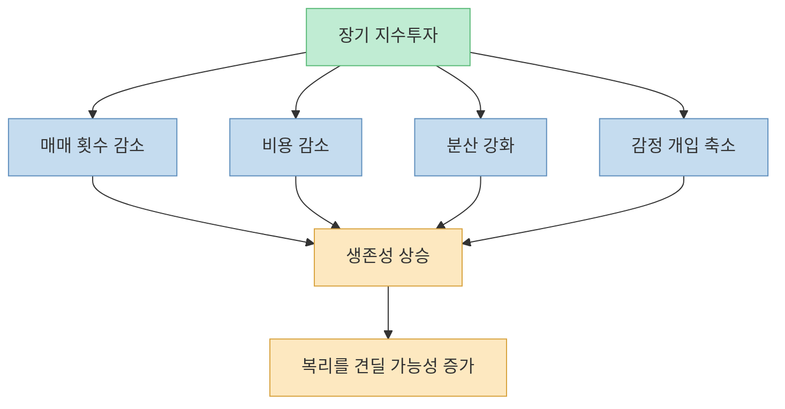
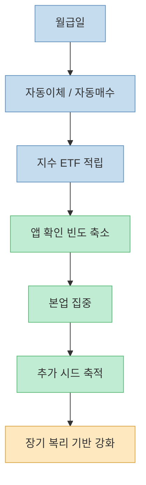

이 영상은 단타가 어려운 이유를 아주 강하게 밀어붙입니다. 메시지의 방향 자체는 맞습니다. 실제로 규제기관과 연구는 **단타가 매우 위험하고, 많은 개인투자자가 비용과 행동 편향 때문에 성과를 해친다** 고 반복해서 경고해 왔습니다. 다만 영상 속 숫자와 표현을 그대로 받아들이기보다는, 무엇이 실제로 구조적 문제이고 무엇이 과장된 수사인지 분리해서 보는 편이 더 유익합니다.

이 글은 영상을 요약하는 데서 멈추지 않고, 왜 단타가 개인에게 불리해지기 쉬운지, 그리고 왜 해결책이 단순히 "`마음 단단히 먹기`"가 아니라 **시간축과 투자 구조를 바꾸는 것** 인지 설명합니다.

<!--more-->

## Sources

- [YouTube - 개미들의 99%가 단타로 절대 돈 못벌고 깡통차는 과정과 그 3가지 이유](https://youtu.be/pc6xj2nJ4C8)
- [SEC - Day Trading: Your Dollars at Risk](https://www.sec.gov/about/reports-publications/investorpubsdaytipshtm)
- [Investor.gov - Day Trading](https://www.investor.gov/introduction-investing/investing-basics/glossary/day-trading)
- [Barber, Lee, Liu, Odean - Just How Much Do Individual Investors Lose By Trading?](https://papers.ssrn.com/sol3/papers.cfm?abstract_id=529062)
- [S&P Dow Jones Indices - S&P U.S. Indices Methodology](https://www.spglobal.com/spdji/en/documents/methodologies/methodology-sp-us-indices.pdf)
- [Nasdaq - NASDAQ-100 Index Methodology](https://indexes.nasdaq.com/docs/Methodology_NDX.pdf)

## 1. 영상의 핵심 주장은 "단타는 실력 게임처럼 보이지만 구조적으로 불리하다"는 것이다

영상은 시작부터 굉장히 자극적입니다. 주변 현실 지인 중에 단타로 크게 부자가 된 사람을 거의 못 봤는데, 온라인에는 수익 인증이 넘쳐난다고 말합니다. 이어서 이것을 [생존자 편향](https://youtu.be/pc6xj2nJ4C8?t=97) 문제로 연결합니다. 살아남은 소수의 사례만 눈에 띄고, 조용히 사라진 실패 사례는 보이지 않기 때문에 시장을 잘못 이해하게 된다는 뜻입니다.

이 지적은 상당히 중요합니다. 투자에서 사람은 전체 분포를 보지 않고 **보여지는 사례** 에 끌립니다. 커뮤니티에는 큰 수익이 난 순간만 올라오고, 반복 손실·거래 중독·기회비용은 잘 기록되지 않습니다. 그래서 개인은 단타의 평균적 결과가 아니라, 극단적으로 눈에 띄는 결과를 기준으로 기대치를 형성합니다.

다만 영상이 말한 "`단타 개인투자자 중 1년 뒤 수익 내는 사람은 1%도 되지 않는다`" 같은 표현은, 글로 옮길 때는 더 신중해야 합니다. 지금 확인한 1차 자료만으로 그 수치를 그대로 일반화하긴 어렵습니다. 대신 더 안전한 표현은 이렇습니다.

- SEC는 단타가 매우 위험하며 많은 개인투자자가 초기 수개월에 큰 손실을 본다고 경고합니다.
- Investor.gov 역시 단타가 짧은 시간 안에 큰 손실로 이어질 수 있다고 설명합니다.
- Barber 등 연구는 개인투자자의 빈번한 거래가 경제적으로 유의미한 손실과 연결된다고 보여 줍니다.

즉, **영상의 방향은 맞지만 숫자는 규제기관 문구 수준으로 낮춰서 이해하는 것이 정확합니다.**

## 2. 개인이 단타에 약한 이유는 의지 부족보다 인간 뇌의 설계에 가깝다

영상은 [손실 회피와 공포 반응](https://youtu.be/pc6xj2nJ4C8?t=320)을 단타 실패의 두 번째 축으로 설명합니다. 수익이 조금만 나도 빨리 확정하고 싶고, 손실이 나면 인정하기 싫어서 버티게 되는 구조 말입니다. 이것은 단순한 성격 문제가 아니라 행동경제학이 오래 다룬 주제와 맞닿아 있습니다.

짧은 시간축에서 의사결정 빈도가 높아질수록 사람은 다음 패턴에 빠지기 쉽습니다.

- 작은 이익은 빨리 실현한다
- 작은 손실은 금방 인정하지 못한다
- 최근 가격 움직임을 과대해석한다
- 몇 번의 성공을 실력으로 착각한다
- 손실 뒤에는 복구 심리로 거래량을 키운다

이 구조가 무서운 이유는, **한두 번 맞히는 것** 과 **오래 살아남는 것** 이 완전히 다른 문제이기 때문입니다. 단타는 순간 판단의 맞고 틀림보다, 감정이 낀 상태에서 같은 실수를 얼마나 자주 반복하느냐가 더 중요합니다.

영상은 자동 손절, 거래 횟수 축소, 1분봉 대신 일봉·주봉 보기 같은 [행동 장치](https://youtu.be/pc6xj2nJ4C8?t=465)를 제안합니다. 이 부분은 과장보다 실용에 가깝습니다. 감정을 완전히 제거할 수 없다면, 애초에 감정이 개입할 여지를 줄이는 쪽이 훨씬 현실적입니다.

## 3. 단타의 진짜 적은 "한 번의 큰 손실"만이 아니라 반복 비용이다

영상이 특히 잘 짚은 부분은 [세금·수수료·슬리피지](https://youtu.be/pc6xj2nJ4C8?t=522)입니다. 많은 사람은 "`한 번 거래할 때 드는 비용이 얼마 안 되니까 괜찮다`"고 생각합니다. 하지만 문제는 비율보다 **반복 횟수** 입니다.

거래가 잦아지면 비용은 세 가지 층위로 쌓입니다.

- 명시적 비용: 수수료, 세금
- 암묵적 비용: 호가 스프레드, 체결 불리함, 슬리피지
- 보이지 않는 비용: 잘못된 재진입, 과잉 반응, 시간 소모

Barber 등의 연구는 개인투자자의 손실을 설명할 때 거래 비용이 결코 작은 문제가 아니라고 보여 줍니다. 논문의 핵심은 단순히 "`일반 개인이 종목을 잘 못 고른다`"에 그치지 않습니다. **잦은 거래 자체가 성과를 갉아먹는 중요한 메커니즘** 이라는 점입니다.

영상 속 "`하루 열 번만 매매해도 하루 2%, 한 달 40% 비용`" 같은 계산은 시장·세율·수수료 조건에 따라 달라지므로 그대로 공식처럼 외우면 안 됩니다. 하지만 메시지의 본질은 맞습니다. **비용은 작아 보여도 회전율이 높아지면 계좌의 기대수익률을 지속적으로 깎아 먹습니다.**

그래서 단타를 계속할수록 필요한 것은 "`조금 더 좋은 종목`"이 아니라, 그 비용층을 상쇄할 만큼의 초과우위입니다. 문제는 대부분의 개인이 그 우위를 안정적으로 갖고 있지 않다는 점입니다.

## 4. 개인은 정보전이 아니라 시간축 선택에서 이겨야 한다

영상은 [초고빈도 매매와 알고리즘](https://youtu.be/pc6xj2nJ4C8?t=657)을 세 번째 이유로 제시합니다. 표현은 다소 극적이지만, 방향성은 이해할 만합니다. 짧은 구간일수록 개인은 정보 속도, 체결 품질, 주문 처리, 데이터 접근성에서 전문 참여자와 경쟁하게 됩니다.

중요한 포인트는 "`알고리즘이 있으니 개인은 절대 투자하면 안 된다`"가 아닙니다. 핵심은 **시간축이 짧을수록 개인의 약점이 커지고, 시간축이 길수록 개인의 약점이 줄어든다** 는 점입니다.

이 지점에서 영상은 [나스닥100과 S&P 500](https://youtu.be/pc6xj2nJ4C8?t=743)을 해법으로 제시합니다. 이 또한 "무조건 이긴다"는 뜻으로 받아들이면 안 되지만, 구조적 논리는 분명합니다.

- S&P 500은 미국 대형주 집합을 추적하는 대표 지수입니다.
- Nasdaq-100은 나스닥 시장의 대형 비금융 기업 중심 지수입니다.
- 두 지수 모두 개별 종목 선별 실패 위험을 줄이고, 시장의 큰 흐름을 더 직접적으로 반영합니다.

특히 방법론 문서를 보면, 이런 지수는 고정된 목록이 아니라 **규칙 기반으로 구성과 비중을 조정** 합니다. 영상이 말한 "`지수가 알아서 약한 기업을 빼고 강한 기업을 넣는다`"는 표현은 완전히 틀린 말은 아니지만, 정확하게는 **정해진 편입·유지·재조정 규칙에 따라 구성 종목이 바뀐다** 고 표현하는 편이 맞습니다.

## 5. 지수투자의 강점은 종목 예언이 아니라 구조적 생존성이다

영상 후반부는 [복리와 정립식 매수](https://youtu.be/pc6xj2nJ4C8?t=833)를 강조합니다. 여기서도 주의할 점이 있습니다. 영상은 과거 수익률을 이용해 매우 강한 장기 복리 그림을 보여 주지만, 미래 수익률은 언제나 변동할 수 있습니다. 따라서 숫자를 복사해 미래의 확정값처럼 믿으면 안 됩니다.

그럼에도 장기 지수투자가 개인에게 유리한 이유는 따로 있습니다.

첫째, 의사결정 횟수를 줄입니다.  
결정이 적을수록 감정 실수가 줄어듭니다.

둘째, 비용을 낮춥니다.  
거래 빈도가 낮아지면 수수료·세금·슬리피지 부담이 줄어듭니다.

셋째, 개별 종목 실패를 분산합니다.  
한 기업의 몰락이 계좌 전체를 파괴할 가능성이 낮아집니다.

넷째, 개인이 잘할 수 있는 유일한 우위를 살립니다.  
개인은 기관보다 느리지만, 기관보다 더 긴 시간축으로 버틸 수 있습니다.

이런 의미에서 지수투자의 핵심은 "`수익률이 항상 더 높다`"가 아니라, **개인이 망가지지 않고 오래 남아 있을 확률을 높인다** 는 데 있습니다. 복리는 높은 재능보다 높은 생존율에서 나옵니다.

## 6. 이 영상에서 가장 실용적인 문장은 "시세와 멀어질수록 부와 가까워질 수 있다"는 말이다

영상은 [주식 앱 삭제, 자동이체, 본업 집중](https://youtu.be/pc6xj2nJ4C8?t=969) 같은 루틴을 제안합니다. 이 부분은 자극적인 앞부분보다 훨씬 실제적입니다. 많은 개인투자자에게 가장 큰 문제는 정보 부족보다 **너무 자주 반응하는 습관** 입니다.

그래서 장기 투자로 옮기려면 종목 선택보다 먼저 루틴을 바꾸는 편이 효과적입니다.

물론 이것도 만능은 아닙니다. 장기 지수투자 역시 하락장을 겪고, 긴 기간 지루할 수 있으며, 매수 시점에 따라 체감 성과가 크게 다를 수 있습니다. 그럼에도 단타와 비교했을 때 더 나은 이유는, 이 전략이 **정교한 판단 능력** 보다 **꾸준한 실행 가능성** 에 더 많이 기대기 때문입니다.

## 핵심 요약

- 영상의 핵심 메시지인 "`단타는 개인에게 구조적으로 불리하다`"는 방향은 타당합니다.
- 가장 중요한 첫 번째 이유는 생존자 편향입니다. 성공담만 보고 평균 결과를 착각하기 쉽습니다.
- 두 번째 이유는 인간의 뇌입니다. 손실 회피와 과잉 반응 때문에 짧은 시간축에서 실수가 커집니다.
- 세 번째 이유는 반복 비용입니다. 수수료, 세금, 스프레드, 슬리피지가 잦은 거래 속에서 누적됩니다.
- 네 번째 이유는 경쟁 구조입니다. 초단기 구간일수록 개인은 속도와 체결 품질에서 약합니다.
- 그래서 개인의 현실적인 우위는 종목 예언보다 긴 시간축 선택에 있습니다.
- 지수투자의 강점은 화려한 한 방이 아니라, 비용과 감정 실수를 줄여 오래 살아남게 한다는 점입니다.

## 결론

이 영상을 가장 정확하게 번역하면 이렇습니다. **단타가 어려운 이유는 개인이 멍청해서가 아니라, 짧은 시간축으로 갈수록 인간의 본능·거래비용·시장 구조가 동시에 불리하게 작동하기 때문** 입니다.

그래서 중요한 질문은 "`내가 더 열심히 공부하면 단타를 이길 수 있을까?`"가 아니라, "`내가 굳이 가장 불리한 전장에서 싸워야 할까?`"입니다. 많은 사람에게 진짜 해법은 더 정교한 매매기법이 아니라, 시간축을 늘리고 비용을 낮추고 자동화된 루틴으로 지수에 남아 있는 것입니다.
