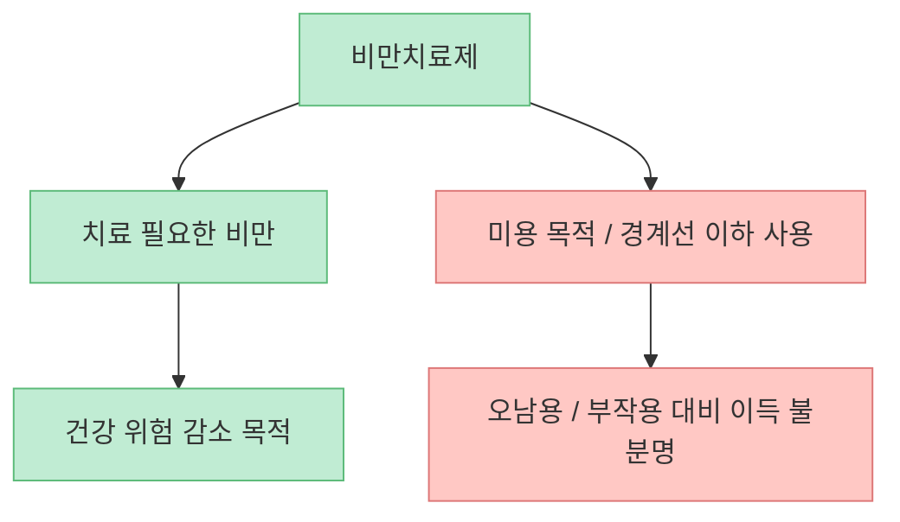
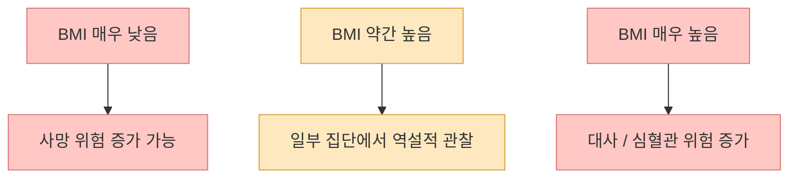
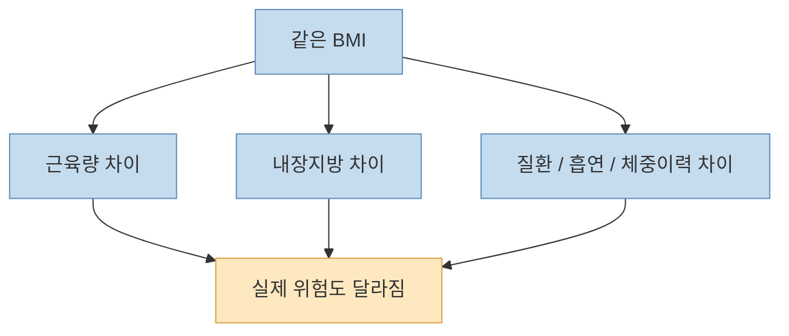
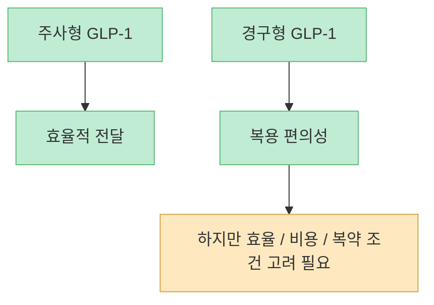
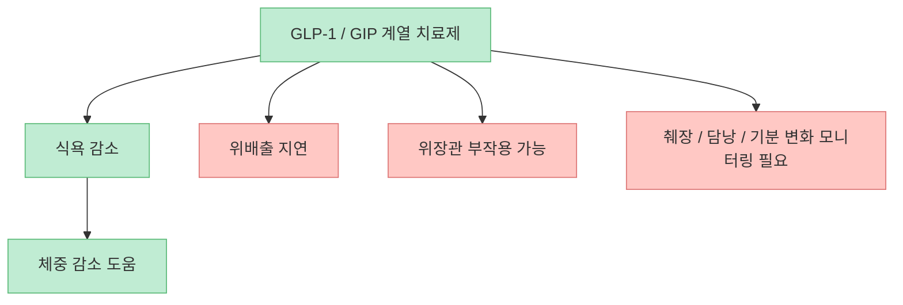
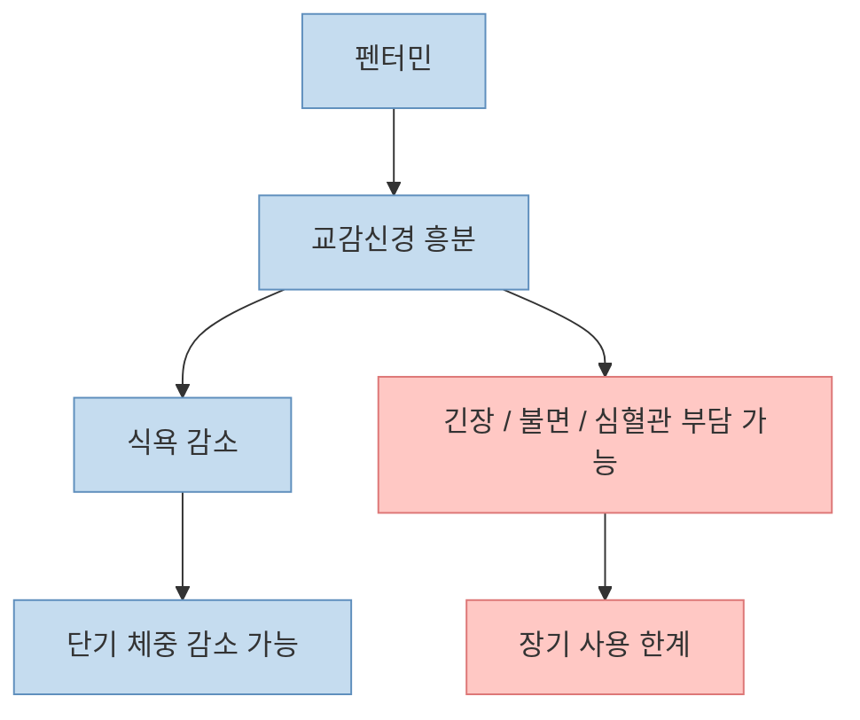
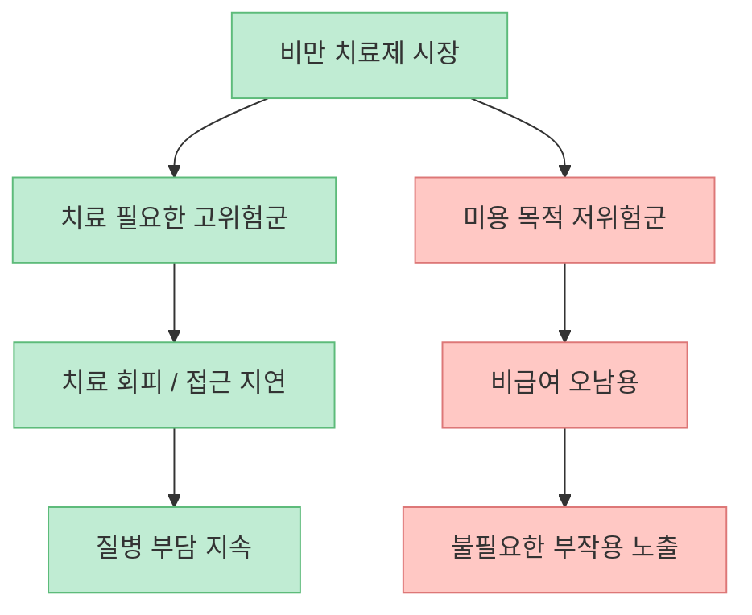

이 영상의 문제의식은 분명합니다. 한국에서 진짜 문제는 고도비만 환자가 치료를 적극적으로 받는 것이 아니라, **치료가 꼭 필요하지 않은 상대적으로 마른 사람이 비급여 비만치료제를 미용 목적으로 과하게 찾는 상황** 이라는 것입니다. 그리고 이 맥락에서 `통통한 사람이 제일 오래 산다`는 표현도 나오는데, 이 문장은 사실 그대로 받아들이면 오해를 부르기 쉽습니다.

<!--more-->

## Sources

- [”통통한 사람이 제일 오래 삽니다“ 위고비·마운자로·나비약의 '진짜 문제' (ft.이승훈 서울대병원 신경과 교수)](https://youtu.be/s1-y9XlmKE4)
- [The Obesity Paradox and Mortality in Older Adults - PMC](https://pmc.ncbi.nlm.nih.gov/articles/PMC10096985/)
- [The skinny on BMI and mortality - PMC](https://pmc.ncbi.nlm.nih.gov/articles/PMC4642906/)
- [Update on FDA's ongoing evaluation of reports of suicidal thoughts or actions in patients taking a certain type of medicines approved for type 2 diabetes and obesity - FDA](https://www.fda.gov/drugs/drug-safety-communications/update-fdas-ongoing-evaluation-reports-suicidal-thoughts-or-actions-patients-taking-certain-type)
- [WEGOVY prescribing information - FDA](https://www.accessdata.fda.gov/drugsatfda_docs/label/2025/215256s024lbl.pdf)
- [ZEPBOUND prescribing information - FDA](https://www.accessdata.fda.gov/drugsatfda_docs/label/2026/217806s002lbl.pdf)

## 1. 이 영상이 진짜로 비판하는 대상은 "치료가 필요한 비만"이 아니라 "필요 없는 약 사용"이다

영상 초반은 핵심을 매우 직접적으로 말합니다. 큰 문제는 고도비만 환자가 아니라, **그렇게 뚱뚱하지 않은 사람이 위고비·마운자로·먹는 GLP-1 약에 과도한 기대를 걸고 사용하는 상황** 이라고요. [영상 0:00~0:28](https://youtu.be/s1-y9XlmKE4?t=0)

여기서 중요한 건 약이 나쁘다는 뜻이 아니라, **치료 대상과 사용 목적이 어긋나는 것** 이 문제라는 점입니다. 교수는 BMI 30 이상이면 적극적으로 고려하라고 말하고, BMI 27 이상이면서 고혈압·당뇨·고지혈증 같은 동반질환이 있으면 감량을 위해 진지하게 생각하라고 설명합니다. [영상 7:08~7:33](https://youtu.be/s1-y9XlmKE4?t=428)

즉 이 영상은 `비만약 반대론` 이 아니라, **누가 진짜 치료 대상인지 선을 다시 긋자는 주장** 에 가깝습니다.

## 2. "통통한 사람이 제일 오래 산다"는 말은 저체중 위험을 강조하는 문맥에서 읽어야 한다

영상에서 가장 강하게 퍼질 수 있는 문장은 바로 이것입니다. `"통통한 사람이 제일 오래 산다"` [영상 9:39~9:46](https://youtu.be/s1-y9XlmKE4?t=579) 하지만 이 말은 문자 그대로 `살을 찌우는 게 건강하다`는 뜻으로 받아들이면 위험합니다.

비만 역설(obesity paradox) 연구들은 특정 질환군이나 고령층에서 BMI가 약간 높은 사람이 더 좋은 생존률을 보이는 것처럼 관찰되는 현상을 설명합니다. 동시에 여러 일반 인구 연구는 **저체중의 사망 위험이 분명히 높다** 는 점도 보여 줍니다. 즉 이 문장의 진짜 의미는 `"마른 게 무조건 건강한 건 아니다"` 쪽에 더 가깝습니다.

따라서 `통통한 사람이 제일 오래 산다`는 메시지는 비만 권장론이 아니라, **저체중 숭배와 극단적 마름 추구가 오히려 위험할 수 있다는 경고** 로 읽는 편이 맞습니다.

## 3. BMI는 쓸모가 없진 않지만, 개인 건강을 다 설명하지도 못한다

영상에서 BMI 26 정도를 언급하는 부분은 흥미롭지만, 여기서도 반드시 보정이 필요합니다. BMI는 인구 전체에서 위험을 나누는 데는 쓸모가 있지만, **개인 단위의 건강 상태를 완전히 설명하지는 못합니다.**

예를 들어 BMI가 같아도:

- 근육량이 많은 사람  
- 복부 내장지방이 많은 사람  
- 만성질환을 이미 가진 사람  
- 흡연, 질병, 체중 감소 이력이 있는 사람  

은 위험도가 다를 수 있습니다.

그래서 BMI는 `치료 기준을 논의하는 출발점` 으로는 유용하지만, `"내 BMI가 몇이니 약을 맞아야지"` 식의 단순 결정 기준으로 쓰면 오해가 커집니다.

## 4. 먹는 GLP-1 약이 편해 보여도, 약효를 과신하면 안 되는 이유가 있다

영상은 먹는 위고비 계열 약이 화제가 되지만, 약효를 너무 과신할 필요는 없다고 설명합니다. [영상 1:12~3:16](https://youtu.be/s1-y9XlmKE4?t=72) 특히 펩타이드 약은 원래 경구 흡수가 쉽지 않아, 주사제와 같은 효과를 내려면 훨씬 많은 양을 넣어야 하고 효율이 떨어질 수 있다는 취지로 설명합니다.

이건 실제 약리학적 상식과도 맞는 부분이 있습니다. 경구형 펩타이드 약물은 제형 기술 덕분에 가능한 것이지, `먹기만 하면 주사와 똑같다`는 단순 구조는 아닙니다. 결국 중요한 건 편의성보다 **효과 대비 비용과 지속 가능성** 입니다.

즉 `"먹는 약이 나오면 다 해결"` 같은 기대는 과장일 수 있고, 실제로는 **누가 왜 쓰는지**가 더 중요합니다.

## 5. 위고비·마운자로의 핵심 부작용은 미용 사용자의 기대와 잘 충돌한다

영상은 GLP-1 계열 약에서 정신신경계 관련 경고, 췌장염, 담낭 문제, 위배출 지연, 무기력감 같은 문제를 언급합니다. [영상 4:58~5:12](https://youtu.be/s1-y9XlmKE4?t=298), [영상 13:43~14:31](https://youtu.be/s1-y9XlmKE4?t=823)

FDA 라벨을 보면 Wegovy와 Zepbound 모두:

- 췌장염  
- 담낭 질환  
- 위배출 지연  
- 기분 변화나 자살사고 모니터링  

같은 경고가 포함되어 있습니다. 다만 FDA는 최근 약물군 전체에 대한 평가에서 **현재까지 자살사고를 직접 유발한다는 명확한 증거는 찾지 못했다** 고도 설명했습니다. 즉 `"위고비가 우울증을 만든다"`고 단정하는 것도 과장이고, `"아무 문제 없다"`고 말하는 것도 과장입니다.

그래서 진짜 비만 환자에게는 `감수할 만한 위험 대비 이득` 이 될 수 있지만, 단지 몇 kg 감량을 원하는 저위험군에서는 **이득-위험 비율이 급격히 나빠질 수 있습니다.**

## 6. 나비약(펜터민)이 여전히 위험한 이유는 "호랑이를 만난 몸"을 만들기 때문이다

영상은 나비약으로 널리 알려진 펜터민을 교감신경 흥분제로 설명합니다. [영상 16:08~16:49](https://youtu.be/s1-y9XlmKE4?t=968) 이 비유는 꽤 직관적입니다. 실제로 이런 계열 약은 몸을 `비상 상황` 처럼 각성시켜 식욕을 떨어뜨리는 방식에 가깝습니다.

문제는 이 방식이 식욕은 줄일 수 있어도:

- 불안  
- 심박수 증가  
- 불면  
- 긴장감  

같은 대가를 동반할 수 있다는 점입니다. 그래서 장기적인 체중 관리 전략으로 보기에는 한계가 명확합니다.

즉 나비약은 `간편한 식욕 억제제`가 아니라, **몸 전체를 긴장 모드로 돌리는 약리학적 개입** 에 더 가깝습니다.

## 7. 진짜 메시지는 "마른 사람이 더 빼는 사회"가 비만 치료를 왜곡하고 있다는 것이다

영상 전체를 관통하는 메시지는 이것입니다. 한국에서는 치료가 꼭 필요한 사람이 약을 회피하고, 반대로 치료 필요성이 낮은 사람이 미용 목적으로 적극적으로 약을 찾는 역전 현상이 크다는 것입니다. [영상 5:14~5:42](https://youtu.be/s1-y9XlmKE4?t=314), [영상 7:33~7:46](https://youtu.be/s1-y9XlmKE4?t=453)

이 구조에서는 두 가지 문제가 동시에 생깁니다.

- 치료가 필요한 비만 환자는 적절한 치료 기회를 놓치고  
- 상대적으로 마른 사람은 불필요한 약물 위험을 감수합니다  

그래서 `통통한 사람이 오래 산다`는 말을 소비할 때도, 그 문장의 중심은 `살을 더 찌우자`가 아니라 **저체중 숭배와 미용 중심 감량 집착을 경계하자** 에 있어야 합니다.

## 핵심 요약

- 이 영상의 핵심 비판 대상은 비만치료제 자체보다 **치료가 꼭 필요하지 않은 사람들의 오남용** 입니다.
- `통통한 사람이 제일 오래 산다`는 말은 비만 권장론이 아니라, **저체중의 위험과 BMI 해석의 한계** 를 강조하는 문맥에서 봐야 합니다.
- BMI는 유용한 출발점이지만, 개인 건강 상태를 완전히 설명하지는 못합니다.
- 위고비·마운자로 같은 GLP-1 계열 약물은 실제 고위험 비만군에게는 도움이 될 수 있지만, 부작용 모니터링이 필요한 치료제입니다.
- 먹는 GLP-1 약도 편의성만 보고 과신하면 안 되며, 효과·비용·복약 조건을 함께 봐야 합니다.
- 나비약(펜터민)은 단순 다이어트 보조제가 아니라 **교감신경을 흥분시키는 강한 약리 개입** 에 가깝습니다.

## 결론

이 영상이 던지는 진짜 질문은 `"무슨 약이 제일 세냐"`가 아닙니다. 더 중요한 질문은 **누가 진짜 치료 대상이고, 누가 사회적 마름 압력 때문에 불필요한 치료를 찾고 있는가** 입니다. 비만 치료제는 분명 강력한 도구지만, 건강을 회복하기 위한 도구여야지 마름 경쟁을 위한 소비재가 되는 순간 문제는 훨씬 커집니다.
