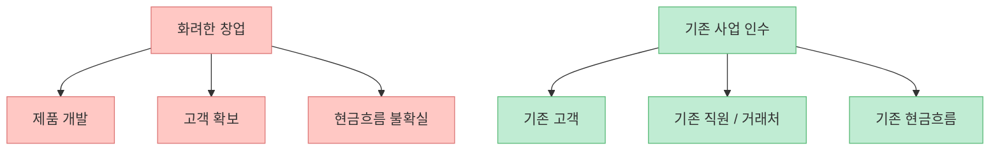
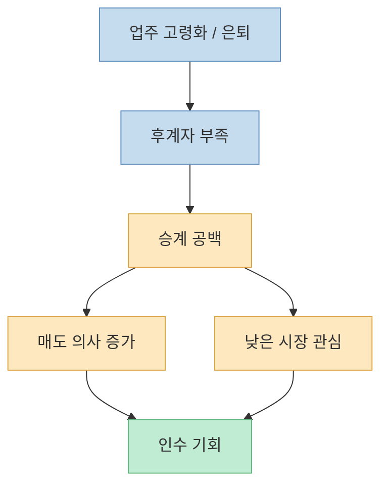
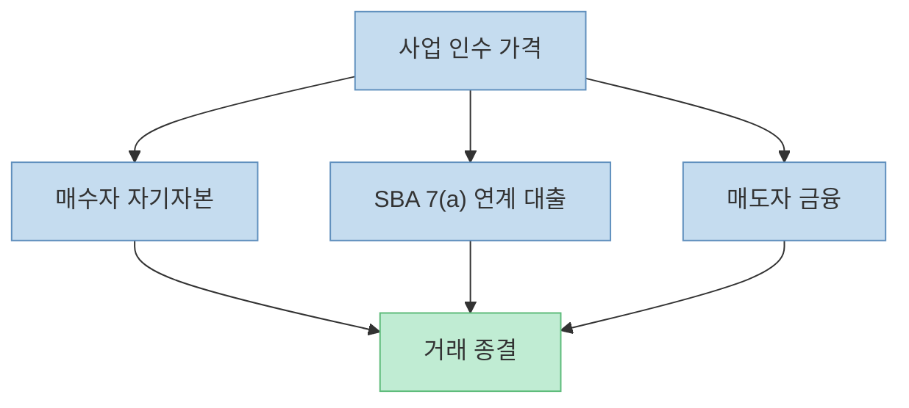
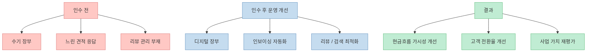
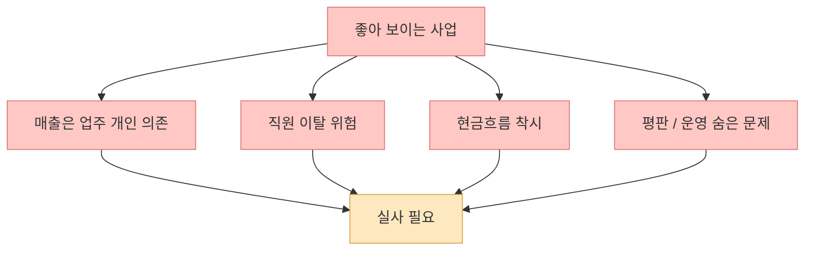
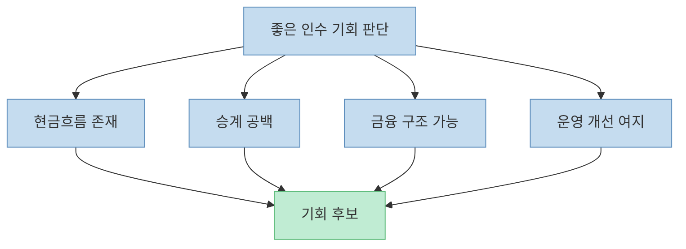

이 쇼츠의 제목은 "`하버드 생들이 부자되는 방법`"이지만, 실제 핵심은 학벌이 아닙니다. 내용은 훨씬 더 구체적입니다. **은퇴를 앞둔 업주가 가진 평범한 현금흐름 사업을 사서, 디지털화와 운영 개선으로 키우는 전략** 이 왜 강력할 수 있는지를 짧게 압축해서 말합니다.

영상 속 화자는 [roofing, plumbing, HVAC 같은 지루하고 못생겨 보이는 업종](https://youtu.be/nk_RVYYvgX0?t=7)을 예로 듭니다. 그리고 판매자 금융(seller-based financing)과 SBA 대출을 섞어 사업을 인수한 뒤, 구글 리뷰·인보이싱·스프레드시트·자동화 같은 기본 도구만 넣어도 사업 가치가 커질 수 있다고 설명합니다. 이 메시지는 단순한 동기부여가 아니라, **작은 사업 승계 시장의 구조** 를 건드리고 있습니다.

<!--more-->

## Sources

- [YouTube Shorts - 하버드 생들이 부자되는 방법](https://youtube.com/shorts/nk_RVYYvgX0)
- [SBA - 7(a) loans](https://www.sba.gov/funding-programs/loans/7a-loans)
- [SBA - Terms, conditions, and eligibility](https://www.sba.gov/partners/lenders/7a-loan-program/terms-conditions-eligibility)
- [SBA - Business Loan Program Improvements](https://www.sba.gov/article/2023/08/10/business-loan-program-improvements)
- [SBA - Close or sell your business](https://www.sba.gov/business-guide/manage-your-business/close-or-sell-your-business)
- [S&P Global - A Navigation Guide to SOP 50 10 8](https://www.sba.gov/document/sop-50-10-lender-development-company-loan-programs)

## 1. 이 쇼츠의 본질은 "사업을 창업하지 말고 사라"가 아니라 "현금흐름이 있는 구조를 인수하라"는 뜻이다

영상은 [처음부터 창업하지 않고, 은퇴하는 사람이 가진 평범한 사업을 사라](https://youtu.be/nk_RVYYvgX0?t=7)고 말합니다. 여기서 중요한 단어는 "`boring, ugly field`"입니다. 멋져 보이지 않는 업종, 다시 말해 배관, 지붕, 냉난방처럼 지역 기반 수요가 꾸준한 사업을 뜻합니다.

왜 이런 업종이 매력적일 수 있을까요? 이유는 간단합니다.

- 유행을 덜 탄다
- 지역 생활과 밀착돼 수요가 쉽게 사라지지 않는다
- 이미 고객, 직원, 거래처, 현금흐름이 있다
- 디지털 전환이 덜 돼 있어 개선 여지가 크다

즉 이 전략은 "`새로운 아이디어`"보다 **이미 돈 버는 구조를 얼마나 싸고 안정적으로 넘겨받을 수 있느냐** 에 가깝습니다.

물론 이것이 "`무조건 더 쉽다`"는 뜻은 아닙니다. 사업을 사는 일은 창업과 다른 종류의 위험을 갖습니다. 하지만 **시작점이 0이 아니라는 점** 은 분명한 구조적 차이입니다.

## 2. 왜 하필 "지루한 사업"인가: 경쟁이 덜한 곳에 승계 공백이 생기기 때문이다

영상은 [60대 업주가 은퇴하는데 아무도 그 사업을 원하지 않는 상황](https://youtu.be/nk_RVYYvgX0?t=31)을 강조합니다. 이 부분은 꽤 중요합니다. 작은 사업의 세계에서는 "`좋은 사업인데도 팔기 어려운 이유`"가 기술 부족이 아니라 **후계자 부족** 인 경우가 많습니다.

SBA도 사업을 닫거나 파는 과정에서 소유권 이전 계획을 세우라고 안내합니다. 즉 미국 정책 문서에서도, 작은 사업 승계는 단순 개인 이벤트가 아니라 실제로 반복되는 경영 과제입니다.

이런 시장에서는 다음 현상이 자주 일어납니다.

- 업주는 은퇴하고 싶다
- 자녀가 사업을 잇지 않으려 한다
- 직원에게 넘기려 해도 자금이 없다
- 외부 인수자는 업종이 촌스럽다고 생각한다

그 결과, 사업의 **현금창출력에 비해 거래 관심이 낮은 틈** 이 생깁니다.

이 쇼츠가 말하는 "`greatest transfers of wealth`"라는 표현은 다소 과장돼 보일 수 있지만, 방향 자체는 이해할 만합니다. 거대한 혁신보다, **세대교체로 인해 생기는 자산 이전** 에 주목하라는 뜻으로 읽는 편이 맞습니다.

## 3. 이 전략의 진짜 핵심은 금융공학이 아니라 인수 구조다

영상은 [seller-based financing과 SBA loan의 조합](https://youtu.be/nk_RVYYvgX0?t=13)을 언급합니다. 이 부분은 단순히 "`돈 없이 사업을 살 수 있다`"는 낭만적인 문장이 아닙니다. 실제로 SBA 7(a) 프로그램은 **complete or partial changes of ownership**, 즉 완전 혹은 부분 소유권 이전에도 활용될 수 있습니다.

SBA 7(a)는 사업 인수, 운전자금, 장비, 부동산 등 다양한 목적에 쓰이는 대표적인 미국 중소기업 대출 프로그램입니다. SBA는 일정 비율의 보증을 제공해 민간 대출기관이 더 쉽게 대출을 실행할 수 있도록 돕습니다. 현재 공식 안내 기준으로 7(a) 최대 대출액은 500만 달러이고, 일반적으로 15만 달러 이하는 최대 85%, 그 초과분은 최대 75%까지 보증됩니다.

여기서 seller financing은 보통 매도자가 일부 대금을 나중에 받는 구조를 뜻합니다. 즉 매수자는 현금 일부, 은행/SBA 대출 일부, 매도자 메모 일부를 조합해 거래를 닫을 수 있습니다. 영상은 이 조합을 매우 간단히 말하지만, 실제론 **다운페이먼트, 상환순위, 실사, 담보, 현금흐름, 인수 후 운영계획** 이 모두 맞아야 합니다.

그래서 영상의 메시지를 현실적으로 번역하면 이렇습니다. "`돈이 하나도 없어도 살 수 있다`"가 아니라, **사업 자체의 현금흐름과 거래 구조를 기반으로 외부 자금을 붙일 수 있는 경우가 있다** 는 것입니다.

## 4. 이 전략이 먹히는 이유는 사업을 '발명'해서가 아니라 '정리'해서다

영상에서 가장 흥미로운 부분은 [스프레드시트, 인보이싱, 자동화, 구글 순위와 리뷰](https://youtu.be/nk_RVYYvgX0?t=17)입니다. 이건 대단한 AI나 첨단 기술 이야기가 아닙니다. 오히려 많은 소규모 사업이 **아직도 기본 운영 관리가 낙후돼 있다** 는 사실을 말해 줍니다.

즉 가치 창출의 원천은 종종 혁신이 아니라 정리입니다.

- 종이 장부를 디지털 장부로 바꾼다
- 청구·입금 추적을 자동화한다
- 리뷰 요청 프로세스를 만든다
- 검색 노출과 평판을 관리한다
- 견적 응답 속도를 높인다
- 반복 업무를 표준화한다

이런 변화는 대기업에선 사소해 보이지만, 작은 지역 사업에선 영업이익률과 회전율을 실제로 바꿉니다.

이 지점에서 쇼츠는 사실상 "`사업가의 알파`"를 설명합니다. 비싼 신사업을 만드는 대신, **저평가된 운영 비효율을 사서 고친다** 는 접근입니다.

## 5. 하지만 이 모델의 위험은 생각보다 운영 쪽에 더 많다

짧은 영상은 당연히 위험을 거의 설명하지 않습니다. 그러나 실제로는 인수 자체보다 인수 후가 더 어렵습니다.

가장 큰 리스크는 다음과 같습니다.

- 업주 개인에게 의존한 매출일 수 있다
- 핵심 직원이 이탈할 수 있다
- 장부상 이익과 실제 현금흐름이 다를 수 있다
- 지역 평판이 실제보다 나쁠 수 있다
- 디지털화가 쉬워 보여도 조직이 안 따라올 수 있다

즉 이 전략은 금융 레버리지보다 **운영 승계 리스크** 를 읽는 능력이 더 중요합니다.

그래서 평범한 사업 인수는 "`쉽게 돈 버는 법`"이 아니라, **실사와 운영을 감당할 수 있는 사람에게만 열리는 기회** 로 보는 편이 안전합니다.

## 6. 결국 이 쇼츠가 던지는 메시지는 "멋진 산업"보다 "좋은 구조"를 보라는 것이다

많은 사람은 부를 기술주, VC, 창업 신화와 연결해서 생각합니다. 하지만 이 쇼츠는 정반대를 말합니다. **남들이 촌스럽다고 무시하는 사업이 오히려 더 선명한 현금흐름과 더 낮은 경쟁을 가질 수 있다** 는 것입니다.

그리고 여기서 중요한 건 하버드가 아닙니다. 정말 중요한 질문은 이것입니다.

- 이 사업은 매년 현금을 만들어 내는가
- 업주 은퇴로 승계 공백이 생기는가
- 인수 구조를 짤 수 있는가
- 운영 디지털화로 가치 상승 여지가 있는가

즉 이 영상의 진짜 교훈은 "`명문대생이니까 가능하다`"가 아니라, **돈은 종종 화려한 미래가 아니라 지루한 현재의 비효율 속에서 만들어진다** 는 데 있습니다.

## 핵심 요약

- 이 쇼츠는 창업보다 기존 사업 인수 전략을 강조합니다.
- 대상은 주로 지붕, 배관, 냉난방처럼 지루하지만 수요가 꾸준한 업종입니다.
- 기회의 원천은 혁신보다 승계 공백입니다.
- 자금 구조는 자기자본, SBA 7(a) 연계 대출, 매도자 금융 조합으로 짤 수 있습니다.
- 인수 후 가치 상승의 핵심은 거창한 기술보다 장부, 청구, 리뷰, 검색, 자동화 같은 기본 운영 개선입니다.
- 가장 큰 리스크는 금융보다 인수 후 운영 승계입니다.

## 결론

이 쇼츠가 말하는 부의 경로는 스타트업 신화와 다릅니다. **새로운 것을 발명하는 대신, 이미 돈을 벌고 있지만 낙후된 구조를 인수해 더 잘 운영하는 것** 이죠.

그래서 이 전략은 누구에게나 쉬운 길은 아니지만, 적어도 한 가지는 분명히 보여 줍니다. 부는 늘 섹시한 산업에서만 생기지 않습니다. 오히려 후계자 없는 평범한 사업, 조용히 돌아가는 지역 서비스, 그리고 아무도 손대지 않은 운영 비효율 속에서 더 선명하게 드러날 때가 많습니다.
