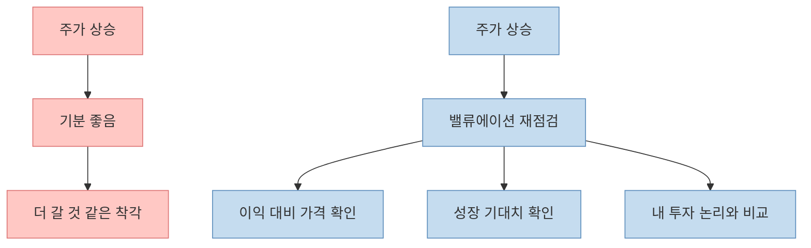
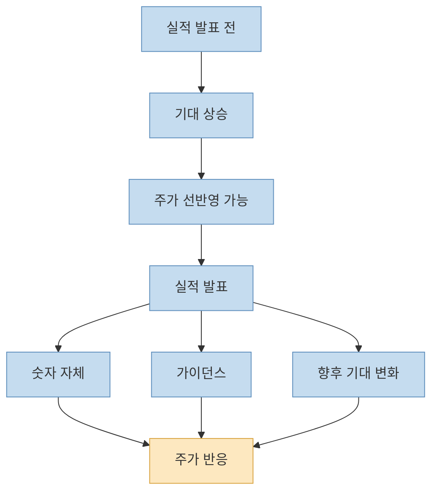
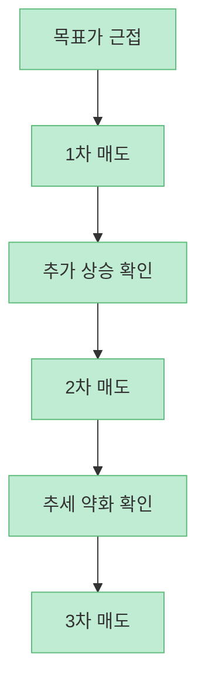
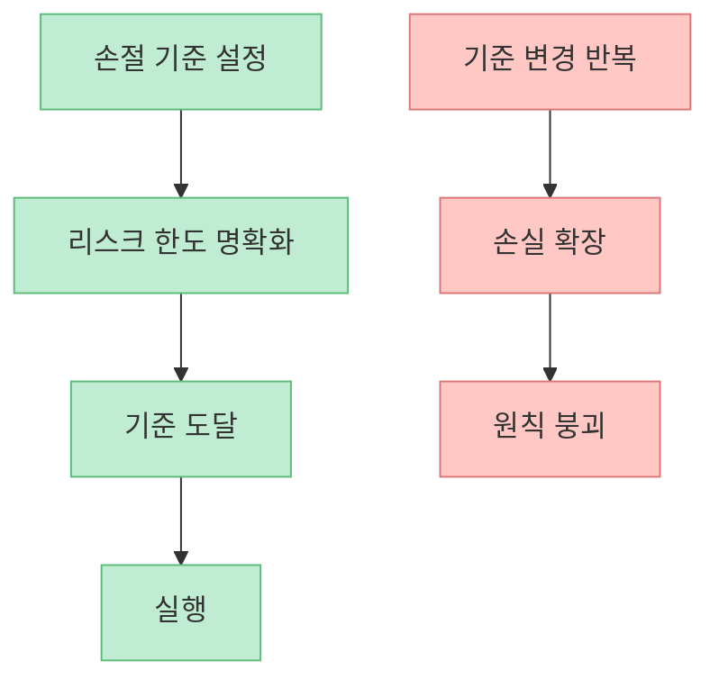
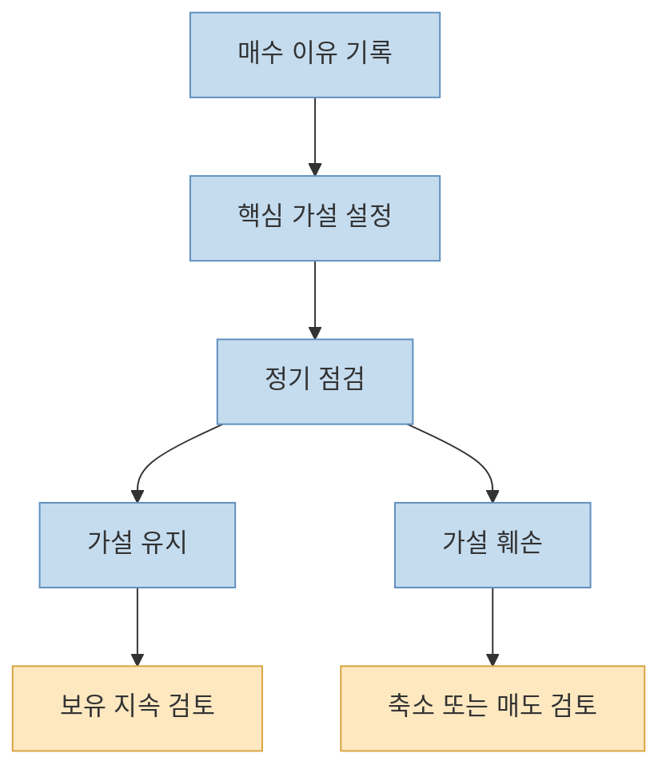
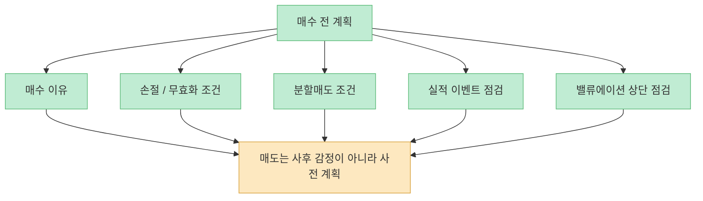

이 쇼츠는 많은 개인투자자가 공감할 만한 문제를 짚습니다. **매수는 공격적으로 하는데, 매도는 유난히 흔들린다** 는 점입니다. 실제로 투자에서 어려운 건 "`무엇을 살까`" 못지않게 "`언제, 왜, 어떻게 팔까`"입니다. 같은 종목을 샀더라도 매도 원칙이 없으면 수익을 너무 빨리 확정하거나, 반대로 손실을 너무 오래 끌고 가기 쉽습니다.

영상은 이를 다섯 가지로 정리합니다. [밸류에이션 기준](https://youtu.be/znv-bcI7iSQ?t=11), [실적 발표 순간의 기대 소멸](https://youtu.be/znv-bcI7iSQ?t=28), [3단계 분할매도](https://youtu.be/znv-bcI7iSQ?t=38), [기계적 손절](https://youtu.be/znv-bcI7iSQ?t=48), [매수 이유 재점검](https://youtu.be/znv-bcI7iSQ?t=54)입니다. 이 글에서는 이 다섯 원칙을 단순 체크리스트가 아니라, 서로 어떻게 연결되는지 중심으로 다시 정리해 보겠습니다.

<!--more-->

## Sources

- [YouTube Shorts - 매수는 천재인데, 매도가 잘 안되는 분들 꼭 보세요](https://youtube.com/shorts/znv-bcI7iSQ)
- [Investor.gov - Glossary: Price-Earnings Ratio (P/E Ratio)](https://www.investor.gov/introduction-investing/investing-basics/glossary/price-earnings-ratio-pe-ratio)
- [FINRA - Order Types](https://www.finra.org/investors/investing/investment-products/stocks/order-types)
- [FINRA - Regulatory Notice 21-12](https://www.finra.org/rules-guidance/notices/21-12)
- [Bernard & Thomas - Post-Earnings-Announcement Drift](https://www.jstor.org/stable/2491062)
- [SEC - Resources for Investors](https://www.sec.gov/resources-investors)

## 1. 감정이 아니라 밸류에이션으로 팔라는 말은 "가격이 아니라 기준을 보라"는 뜻이다

영상의 첫 번째 원칙은 [PER·PBR 밴드 상단 같은 고평가 신호를 보면 매도를 검토하라](https://youtu.be/znv-bcI7iSQ?t=11)는 것입니다. 이 말의 요지는 "`올랐으니 판다`"가 아닙니다. **내가 이 회사를 얼마짜리 사업으로 보고 있었는지 다시 확인하라** 는 뜻에 가깝습니다.

Investor.gov가 설명하듯 P/E는 주가를 주당순이익과 비교하는 대표적인 밸류에이션 지표입니다. 물론 P/E나 P/B 하나만으로 고평가를 확정할 수는 없습니다. 성장률, 금리, 업종 특성, 이익의 질에 따라 같은 숫자의 의미가 달라지기 때문입니다. 그래서 영상의 표현을 더 정확히 다듬으면 이렇습니다.

- 밸류에이션은 매도 신호의 출발점이다
- 하지만 단일 숫자 하나로 기계적으로 결론내리면 안 된다
- 중요한 것은 "`내가 기대했던 성장`"과 "`현재 가격이 반영한 기대`"의 차이다

즉 좋은 매도는 "`정점 맞히기`"가 아니라, **내가 정한 가치 기준에서 얼마나 멀어졌는지 판단하는 일** 입니다.

## 2. "좋은 실적 발표 때 오히려 매도 검토"는 이벤트 전후의 기대 구조를 보라는 말이다

영상의 두 번째 원칙은 [역대급 호실적 발표 순간에 오히려 매도를 검토하라](https://youtu.be/znv-bcI7iSQ?t=28)는 것입니다. 이 문장은 자극적으로 들리지만, 시장 구조를 생각하면 완전히 엉뚱한 말은 아닙니다. 주가는 실적 그 자체보다 **기대 대비 결과** 에 더 민감하게 반응하기 때문입니다.

실적 시즌에는 이미 시장 참가자들이 예상치를 세우고 움직입니다. 그래서 숫자가 좋아도,

- 이미 기대가 지나치게 높았다면
- 가이던스가 애매하다면
- 앞으로의 추가 상승 재료가 약하다면

발표 직후 주가가 약해질 수 있습니다.

Bernard & Thomas의 고전 연구 이후, 시장이 실적 정보를 즉시 완벽하게 반영하지 않는 문제는 오래 논의돼 왔습니다. 다만 그렇다고 "`실적 발표 날은 무조건 팔아라`"가 정답은 아닙니다. 더 정확한 해석은 **실적 발표를 숫자 확인 이벤트가 아니라 기대 재설정 이벤트로 봐야 한다** 는 것입니다.

그래서 실적 시즌의 매도 판단은 "`잘 나왔으니 판다`"보다, **좋은 뉴스가 앞으로 남아 있는지 아니면 이미 대부분 반영됐는지** 를 보는 쪽이 더 맞습니다.

## 3. 분할매도는 수익률 최적화 기법이라기보다 후회 관리 장치에 가깝다

영상은 [1차, 2차, 3차로 나누는 분할매도](https://youtu.be/znv-bcI7iSQ?t=38)를 권합니다. 이 원칙은 매우 실용적입니다. 개인투자자는 종종 두 가지 극단을 오갑니다.

- 너무 빨리 전부 팔고 더 오른 뒤 후회한다
- 끝까지 안 팔다가 수익을 다시 반납한다

분할매도는 이 두 문제를 동시에 약화시키는 절충안입니다. 전량을 한 번에 맞히려는 집착을 버리고, **불확실성 속에서 구간별로 판단을 업데이트** 하게 만듭니다.

물론 분할매도가 항상 정답은 아닙니다. 거래비용, 세금, 포지션 크기, 종목 유동성에 따라 단순화된 분할매도가 비효율적일 수도 있습니다. 하지만 심리적으로는 큰 장점이 있습니다.

- 일부 이익을 확보할 수 있다
- 남은 물량으로 추세를 더 볼 수 있다
- 전량 판단의 스트레스를 줄일 수 있다

즉 분할매도는 **미래를 더 잘 맞히는 기술** 이 아니라, **틀렸을 때도 계좌와 멘탈을 덜 다치게 하는 방식** 입니다.

## 4. 손절은 가격 예측이 아니라 리스크 통제 장치여야 한다

영상의 네 번째 원칙은 [손절선을 내리지 말고 기계적으로 지키라](https://youtu.be/znv-bcI7iSQ?t=48)는 것입니다. 이 부분은 원칙론으로는 맞지만, 실제 실행은 생각보다 섬세해야 합니다.

FINRA는 stop order가 리스크 관리 도구가 될 수 있다고 설명하면서도, 동시에 **급변동 장세에서 원치 않는 가격에 체결될 수 있는 위험** 도 경고합니다. 즉 "`자동 손절을 걸면 안전하다`"가 아니라, **손절도 도구이고 부작용이 있다** 는 뜻입니다.

손절이 유효하려면 세 가지가 필요합니다.

- 왜 그 가격이 무효화 지점인지 설명할 수 있어야 한다
- 포지션 크기와 함께 설계돼야 한다
- 장중 노이즈에 흔들릴 종목인지 고려해야 한다

즉 손절은 "`겁먹고 도망치는 가격`"이 아니라, **내 투자 가설이 틀렸다고 인정하는 가격 또는 조건** 이어야 합니다.

## 5. 가장 중요한 매도 원칙은 사실 "처음 산 이유가 아직 살아 있나"를 묻는 것이다

영상의 다섯 번째 원칙은 [내가 왜 이 종목을 샀는지 떠올리고, 그 이유가 사라졌다면 나오라](https://youtu.be/znv-bcI7iSQ?t=54)는 것입니다. 이 다섯 가지 중 가장 본질적인 원칙은 아마 이것일 가능성이 큽니다.

왜냐하면 밸류에이션, 실적, 손절, 분할매도는 모두 결국 **투자 논리의 변화** 를 관리하기 위한 도구이기 때문입니다. 애초에 산 이유가 다음 중 무엇이었는지 명확해야 합니다.

- 실적 턴어라운드
- 업황 회복
- 신제품 / 신사업
- 밸류에이션 저평가
- 지수 편입 / 수급 변화

그리고 그 논리가 약해졌다면, 수익이든 손실이든 다시 판단해야 합니다.

이 원칙이 중요한 이유는, 많은 개인투자자가 시간이 지나면 **이유 없는 보유** 상태로 들어가기 때문입니다. 처음엔 분명한 논리가 있었는데, 나중에는 "`오를 것 같아서`", "`본전은 와야 해서`", "`남들도 아직 들고 있어서`" 정도만 남게 됩니다. 이 순간 매도는 더 어려워집니다.

## 6. 좋은 매도는 다섯 원칙 중 하나가 아니라, 다섯 원칙을 미리 연결해 두는 것이다

이 쇼츠를 정말 실전적으로 바꾸려면, 다섯 원칙을 따로 외우는 것보다 **매수할 때부터 매도 계획을 함께 적는 것** 이 더 중요합니다.

예를 들면 이런 식입니다.

- 매수 이유: 왜 사는가
- 무효화 조건: 무엇이 틀리면 나오는가
- 1차 매도 조건: 어느 구간에서 일부 줄이는가
- 이벤트 점검: 실적 발표 전후에 무엇을 볼 것인가
- 밸류에이션 점검: 어느 수준부터 과열로 볼 것인가

결국 매도는 매수의 반대 행위가 아니라, **처음부터 같이 설계돼야 하는 절반의 투자 프로세스** 입니다.

## 핵심 요약

- 매도가 어려운 이유는 가격보다 감정이 먼저 움직이기 때문입니다.
- 밸류에이션은 "`얼마까지 볼 것인가`"를 정하는 기준이 됩니다.
- 실적 발표는 숫자보다 기대 재설정 이벤트로 보는 편이 정확합니다.
- 분할매도는 정점을 맞히는 기술이 아니라 후회를 줄이는 장치입니다.
- 손절은 공포 반응이 아니라 가설 무효화 기준이어야 합니다.
- 가장 중요한 질문은 "`내가 이 종목을 산 이유가 아직 살아 있는가`"입니다.

## 결론

이 쇼츠의 핵심은 단순합니다. **좋은 매도는 감정이 흔들릴 때 만드는 것이 아니라, 감정이 들어오기 전에 만들어 둔 원칙에서 나온다** 는 것입니다.

그래서 매도 실력을 키우는 가장 좋은 방법은 차트를 더 오래 보는 것이 아니라, 매수할 때부터 밸류에이션 상단, 이벤트 리스크, 분할매도 구간, 손절 기준, 투자 논리를 함께 적어 두는 것입니다. 매도는 용기의 문제가 아니라, 설계의 문제에 더 가깝습니다.
