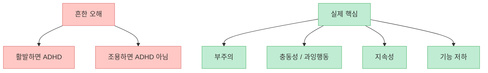
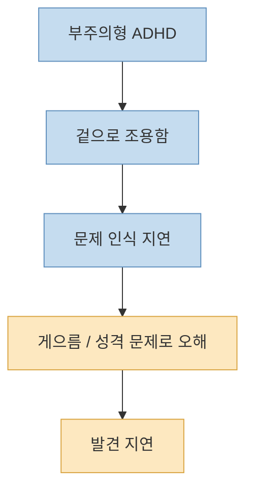
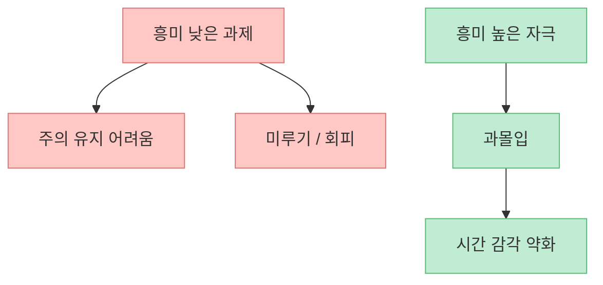
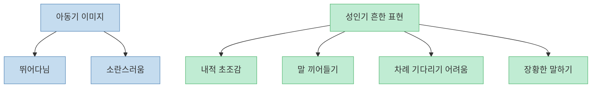
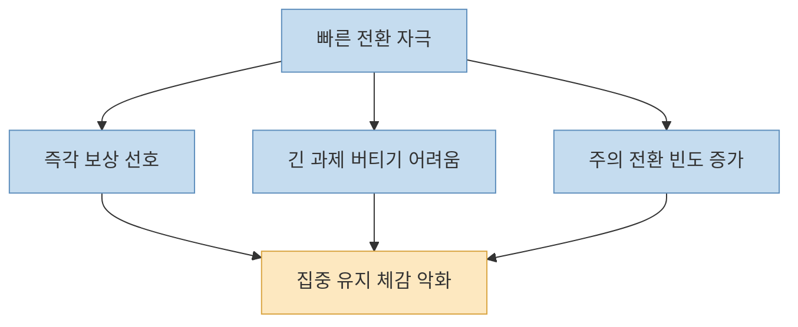
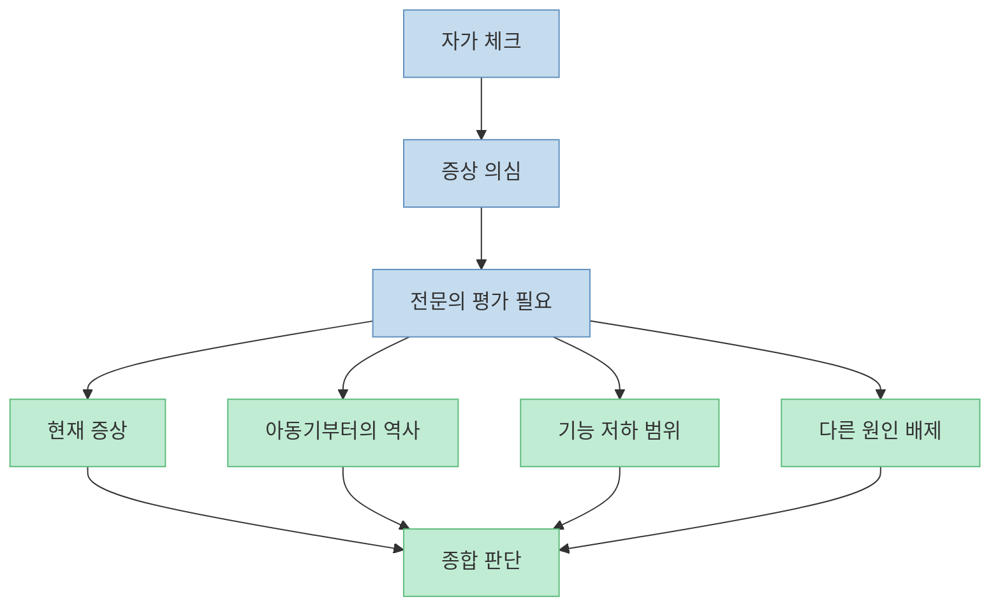

많은 사람이 ADHD를 떠올릴 때 먼저 생각하는 이미지는 비슷합니다. 가만히 못 앉아 있고, 말이 많고, 정신없이 부산스러운 사람 말이죠. 그런데 이 영상은 바로 그 고정관념부터 깨야 한다고 말합니다. [성인 ADHD는 겉으로 조용하고 점잖아 보여도 늦게 발견될 수 있고](https://youtu.be/G6DrTsbE3wk?t=150), 오히려 **부주의, 실행의 붕괴, 정리와 마감 실패, 대화 흐름 이탈, 과몰입** 같은 형태로 더 흔하게 드러날 수 있다는 설명입니다.

이 주제는 특히 조심해서 다뤄야 합니다. 집중이 안 된다고 모두 ADHD는 아니고, 스마트폰을 많이 본다고 모두 ADHD가 되는 것도 아닙니다. 반대로 "`나는 어떤 것엔 몇 시간씩 집중하니까 ADHD가 아닐 거야`"라는 생각도 꼭 맞지 않습니다. 그래서 이 글은 영상 내용을 그대로 요약하는 데서 멈추지 않고, **무엇이 흔한 오해인지, 어떤 신호를 의사가 더 중요하게 보는지, 자가 체크와 진단은 어떻게 다른지** 를 구조적으로 정리해 보겠습니다.

<!--more-->

## Sources

- [YouTube - '이 증상들'이 보이면 의사는 확진합니다. 성인 ADHD 자가진단 방법](https://youtu.be/G6DrTsbE3wk)
- [NIMH - Attention-Deficit/Hyperactivity Disorder (ADHD)](https://www.nimh.nih.gov/health/topics/attention-deficit-hyperactivity-disorder-adhd)
- [CDC - ADHD in Adults](https://www.cdc.gov/adhd/about/adhd-in-adults.html)
- [CDC - Symptoms of ADHD](https://www.cdc.gov/adhd/signs-symptoms/index.html)
- [NICE Guideline NG87 - Attention deficit hyperactivity disorder: diagnosis and management](https://www.nice.org.uk/guidance/ng87)

## 1. 성인 ADHD는 "활발함"보다 "지속적인 기능 저하"로 봐야 한다

영상은 시작부터 [겉으로 티가 잘 안 나는 ADHD가 많다](https://youtu.be/G6DrTsbE3wk?t=0)고 말합니다. 이 포인트가 아주 중요합니다. ADHD를 단순히 "`에너지가 넘치는 성격`"이나 "`활발한 기질`"로 이해하면, 조용한 형태의 사람들은 오랫동안 놓치기 쉽습니다.

실제로 공식 자료들도 ADHD를 단순 성격이 아니라 **부주의, 과잉행동, 충동성이 지속적으로 나타나 일상 기능을 해치는 패턴** 으로 설명합니다. 다시 말해 핵심은 "`산만해 보이느냐`"가 아니라, 아래 질문에 더 가깝습니다.

- 일을 끝까지 유지하기 어려운가
- 마감, 정리, 순서화가 반복적으로 무너지는가
- 대화나 강의에서 주의가 자주 이탈하는가
- 이 문제가 일·관계·학습에 실제 손실을 만드는가

즉 성인 ADHD를 볼 때는 기질의 크기보다 **실행 기능이 반복적으로 무너지는 패턴** 을 봐야 합니다.

## 2. 조용한 부주의형은 왜 늦게 발견되기 쉬운가

영상은 [조용하고 점잖아서 티가 안 나는 부주의형](https://youtu.be/G6DrTsbE3wk?t=150)을 따로 설명합니다. 예를 들어,

- 문제에서 "`틀린 것`"을 못 보고 지나친다
- 10~20분 지나면 강의 흐름에서 이탈한다
- 남들이 30분 걸릴 일을 2시간씩 붙잡고 있다
- 여러 일을 시작하지만 원래 하던 일은 끝내지 못한다
- 마감, 정리, 소지품 관리가 반복적으로 흔들린다

이런 모습은 겉으로는 "`조용한데 좀 느린 사람`", "`게으른 사람`", "`정리가 약한 사람`"처럼 보일 수 있습니다. 그래서 주변도, 본인도 ADHD를 먼저 떠올리지 못하는 경우가 많습니다.

영상 속 예시 중 특히 중요한 부분은 [하던 일에서 다른 일로 계속 새어 나가는 흐름](https://youtu.be/G6DrTsbE3wk?t=313)입니다. 보고서를 쓰다가 전화 확인, 검색, 흥미 주제 탐색, 쓰레기 버리기, 청소, 빨래로 이어지면서 원래 과제가 사라지는 패턴 말이죠. 이것은 단순히 "`의지가 약하다`"기보다 **주의 전환과 유지가 동시에 흔들리는 실행 기능 문제** 에 더 가깝습니다.

## 3. "몇 시간씩 집중한다"는 말이 ADHD를 배제하지는 않는다

많은 사람이 "`나는 게임이나 관심 있는 일엔 몇 시간씩 집중하는데 무슨 ADHD냐`"라고 생각합니다. 그런데 영상은 [너무 깊은 과몰입도 ADHD 특징일 수 있다](https://youtu.be/G6DrTsbE3wk?t=219)고 짚습니다.

이 지점은 오해가 많습니다. ADHD는 "`모든 것에 항상 집중을 못 한다`"는 질환이 아닙니다. 오히려 **흥미가 강한 자극에는 과하게 붙고, 중요하지만 덜 자극적인 일에는 유지가 무너지는 불균형** 으로 느껴지는 경우가 많습니다.

그래서 "`집중이 되느냐 안 되느냐`"보다 더 정확한 질문은 이것입니다.

- **집중의 ON/OFF를 내가 조절할 수 있는가**
- **중요도에 맞게 집중을 배분할 수 있는가**
- **관심 없는 과제에서도 기능을 유지할 수 있는가**

과몰입은 생산성처럼 보일 수 있지만, 통제되지 않으면 전체 일정과 마감 구조를 더 망가뜨릴 수도 있습니다.

## 4. 과잉행동·충동형은 "시끄러움"만이 아니라 안절부절과 끼어들기로 나타난다

영상은 [손가락 꼼지락, 다리 떨기, 가만히 못 있기, 말이 길어지기, 질문 끝나기 전에 답하기](https://youtu.be/G6DrTsbE3wk?t=425) 같은 특징을 과잉행동·충동형의 예로 설명합니다. 성인으로 오면 아동기처럼 책상 위에 올라가거나 뛰어다니는 형태보다, **내적 안절부절, 참기 어려움, 대기와 순서의 곤란** 으로 보이는 경우가 더 많습니다.

이 부분도 중요한 이유가 있습니다. 많은 성인은 "`나는 가만히 앉아 있으니 과잉행동형은 아닐 거야`"라고 생각하지만, 실제로는 겉으로 멀쩡히 앉아 있어도 **속으로는 계속 초조하고 머릿속이 쉬지 않으며, 순서와 대기에서 유난히 힘들어하는** 패턴이 나타날 수 있습니다.

## 5. 스마트폰과 짧은 영상은 ADHD를 만들었다기보다, 비슷한 어려움을 더 심하게 느끼게 할 수 있다

영상은 [짧고 빠르게 바뀌는 화면에 익숙해진 뇌, 이른바 "팝콘 브레인"](https://youtu.be/G6DrTsbE3wk?t=63)을 언급합니다. 이 설명은 직관적이지만, 여기서는 표현을 조금 조심해서 받아들일 필요가 있습니다.

스마트폰과 쇼츠, 빠른 영상 소비가 **ADHD 자체를 만들어낸다** 고 단정할 수는 없습니다. 다만 이런 환경은 많은 사람에게 다음 문제를 악화시킬 수 있습니다.

- 긴 글과 긴 과제 유지 시간 감소
- 즉각적 보상에 대한 선호 증가
- 심심함과 지연을 견디는 힘 약화
- 주의 전환 빈도 증가

즉 짧은 영상 소비가 성인 ADHD의 원인이라고 단순화하면 안 되지만, **원래 취약한 주의 조절 문제를 더 드러내거나 체감 악화시키는 환경 요인** 으로는 이해할 수 있습니다.

## 6. 자가 체크와 진단은 다르다: 의사는 "개수"보다 "역사와 기능"을 함께 본다

영상 후반부는 아주 중요한 선을 긋습니다. [증상이 몇 개 보인다고 바로 ADHD는 아니고](https://youtu.be/G6DrTsbE3wk?t=592), [전문의 진료를 받아야 한다](https://youtu.be/G6DrTsbE3wk?t=629)는 점입니다. 실제 공식 가이드라인도 성인 ADHD 평가에서 다음을 중요하게 봅니다.

- 증상이 현재만이 아니라 **오래 지속됐는지**
- **12세 이전에도** 유사한 패턴이 있었는지
- 학교, 일, 관계 같은 **둘 이상의 영역** 에서 기능 저하가 있는지
- 불안, 우울, 수면 문제, 물질 사용, 다른 정신건강 문제로 더 잘 설명되지는 않는지

CDC는 성인 ADHD 진단이 단순 체크리스트 한 장으로 끝나지 않고, **증상 평가 + 과거력 + 다른 원인 배제** 를 함께 본다고 설명합니다. NICE도 성인 진단에서 장기적 정보와 기능 저하 평가를 강조합니다.

영상 속 의사도 [본인은 아니라고 생각했는데 실제로는 ADHD인 경우, 반대로 스스로 의심했지만 아닌 경우가 모두 있다](https://youtu.be/G6DrTsbE3wk?t=636)고 설명합니다. 그래서 자가 체크의 목적은 "`나 확진이네`"가 아니라, **평가가 필요한지 판단하는 신호등** 정도로 보는 편이 맞습니다.

## 7. 치료는 "완치 선언"보다 일상 기능을 회복하는 방향에 가깝다

영상 끝부분에서 의사는 [근시에 안경을 쓰는 비유](https://youtu.be/G6DrTsbE3wk?t=726)를 듭니다. 표현은 단순하지만 핵심은 분명합니다. 치료는 "`원래 없던 사람이 되는 것`"보다, **현재 겪는 불편과 기능 저하를 줄여서 일상생활이 더 잘 돌아가게 만드는 것** 에 가깝습니다.

NIMH와 CDC도 ADHD 치료에 대해 약물, 행동 전략, 심리사회적 개입, 환경 조정 같은 접근을 함께 설명합니다. 따라서 중요한 건 병명 자체보다,

- 지금 어떤 기능이 가장 무너지는지
- 어떤 환경에서 더 악화되는지
- 어떤 도구와 치료가 실제 생활을 개선하는지

를 보는 것입니다.

## 핵심 요약

- 성인 ADHD는 꼭 시끄럽고 부산스러운 모습으로만 나타나지 않습니다.
- 조용한 부주의형은 멍함, 마감 실패, 정리 곤란, 대화 흐름 이탈, 시작만 많고 끝맺음이 약한 형태로 늦게 발견될 수 있습니다.
- 어떤 일에 과하게 몰입하는 것만으로 ADHD가 배제되지는 않습니다.
- 충동형은 성인에서 내적 초조감, 끼어들기, 기다리기 어려움처럼 보일 수 있습니다.
- 스마트폰과 짧은 영상은 ADHD의 원인이라고 단정할 수는 없지만, 주의 조절 문제를 더 악화시킬 수는 있습니다.
- 자가 체크는 참고 신호일 뿐이며, 실제 진단은 과거력, 기능 저하, 다른 원인 배제를 함께 보는 전문 평가가 필요합니다.

## 결론

이 영상이 가장 잘 짚은 핵심은 이것입니다. **성인 ADHD는 "산만해 보이느냐"보다 "삶의 여러 영역에서 주의와 실행이 반복적으로 무너지고 있느냐"로 봐야 한다** 는 점입니다.

그래서 "`나도 집중이 잘 안 되는데 ADHD인가?`"라는 질문의 답은 혼자 체크리스트를 세는 데 있지 않습니다. 어릴 때부터의 패턴, 현재의 기능 저하, 다른 원인 가능성까지 함께 보는 진료가 필요합니다. 반대로 말하면, 오래된 게으름이나 성격 문제로만 여겼던 패턴이 실제로는 평가와 도움을 받을 수 있는 문제였을 가능성도 있다는 뜻입니다.
