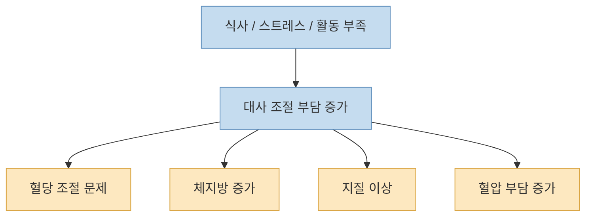
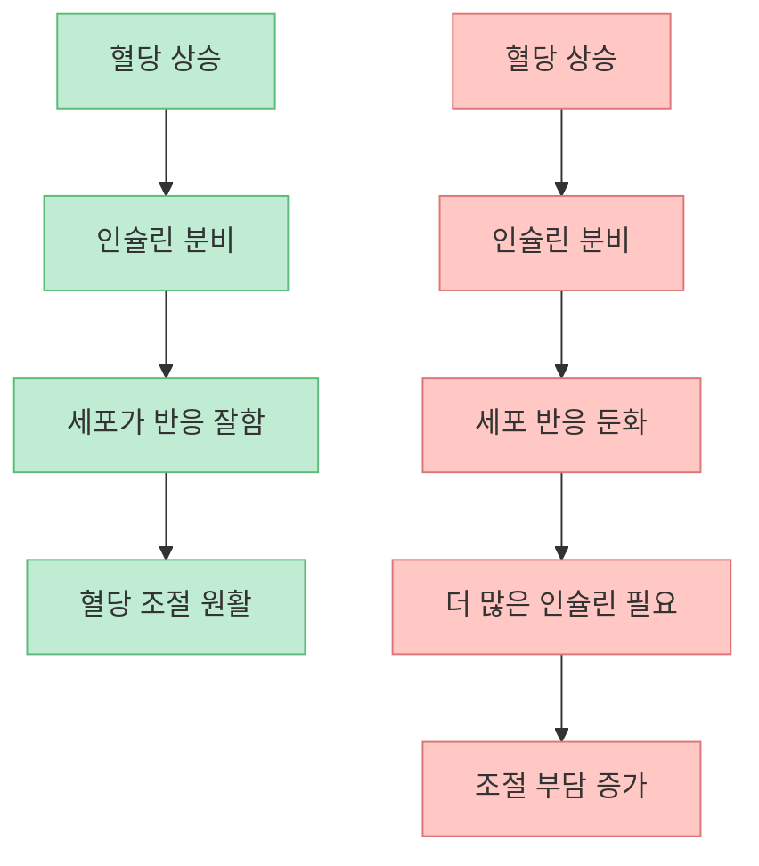
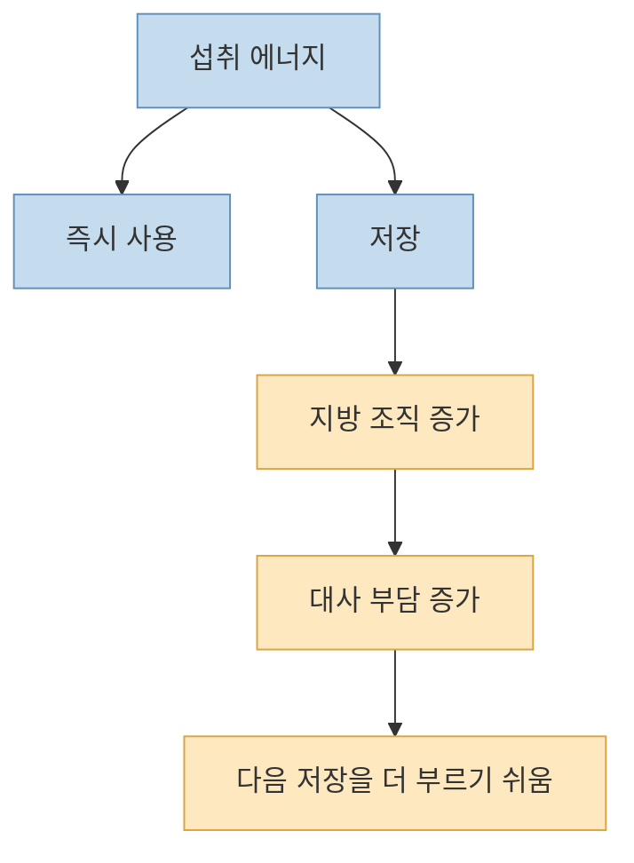
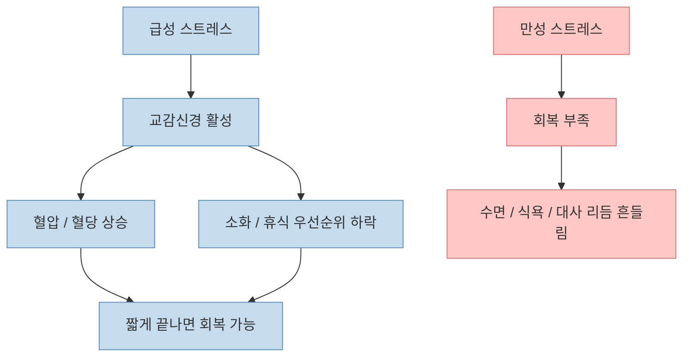
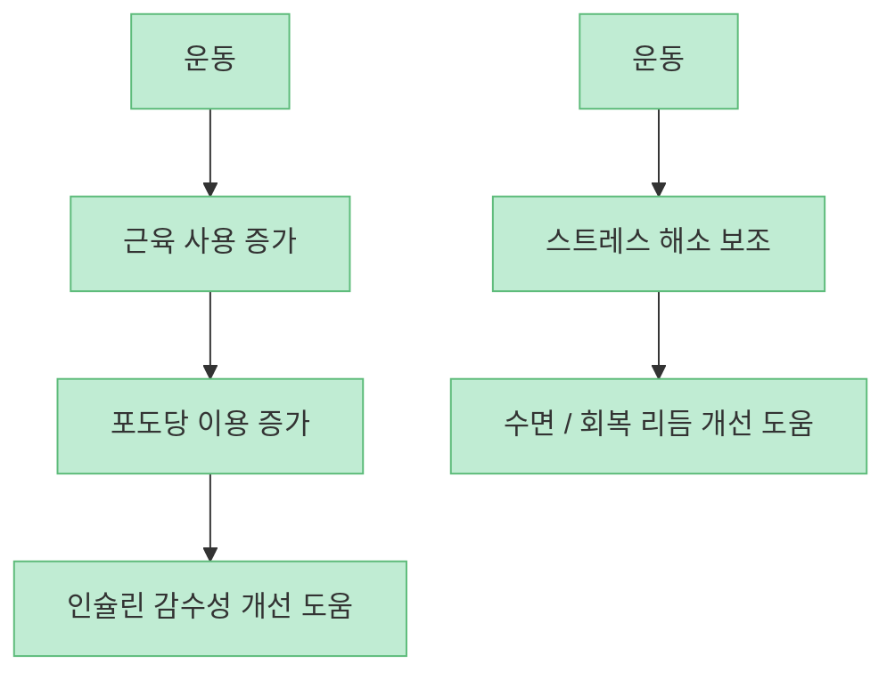
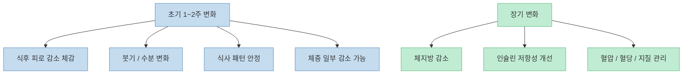
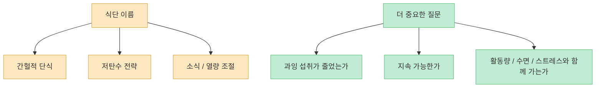

이 영상은 비만을 단순히 "`먹어서 찐 살`" 정도로 보지 않습니다. [고지혈증, 고혈압, 당뇨, 비만을 결국 하나의 혈관·대사 문제로 연결해서 보자](https://youtu.be/7OkwcMrV0bY?t=0)는 메시지가 중심입니다. 그리고 그 가운데에 **인슐린 저항성**, **지속적인 스트레스**, **움직이지 않는 생활 방식** 이 놓여 있다고 설명합니다.

이런 설명은 직관적이어서 설득력이 있지만, 그대로 받아들이기보다 무엇이 근거 있는 핵심인지, 무엇은 조금 단순화된 표현인지 구분해서 보는 편이 좋습니다. 지방은 단순히 "독을 대신 받아 주는 창고"로만 설명할 수 없고, 스트레스가 곧바로 모든 질환의 직접 원인이라고 말하는 것도 과합니다. 다만 큰 방향은 분명합니다. **살이 찌고 대사 건강이 무너지는 과정은 식사, 활동량, 스트레스, 수면, 체중 변화가 얽혀 있는 흐름** 이라는 점입니다.

<!--more-->

## Sources

- [YouTube - "딱 2주만 이렇게 해보세요" 몸에 쌓인 지방 없애는 가장 확실한 방법](https://youtu.be/7OkwcMrV0bY)
- [NIDDK - Insulin Resistance & Prediabetes](https://www.niddk.nih.gov/health-information/diabetes/overview/what-is-diabetes/prediabetes-insulin-resistance)
- [CDC - About Insulin Resistance and Type 2 Diabetes](https://www.cdc.gov/diabetes/about/insulin-resistance-type-2-diabetes.html)
- [CDC - Physical Activity and Diabetes](https://www.cdc.gov/diabetes/living-with/physical-activity.html)
- [Mayo Clinic - Chronic stress puts your health at risk](https://www.mayoclinic.org/healthy-lifestyle/stress-management/in-depth/stress/art-20046037)
- [NIDDK - Diabetes](https://www.niddk.nih.gov/health-information/diabetes)

## 1. 이 영상의 핵심은 "비만은 독립된 사건이 아니라 대사 흐름의 결과"라는 주장이다

영상은 [고지혈증, 고혈압, 당뇨, 비만을 따로 보지 말고 결국 혈관 문제로 이어지는 한 흐름](https://youtu.be/7OkwcMrV0bY?t=82)으로 봐야 한다고 말합니다. 표현은 조금 넓지만, 방향 자체는 이해할 만합니다. 실제로 대사 건강이 나빠질 때는 혈당 조절, 혈압, 체지방, 혈중 지질 이상이 겹쳐 나타나는 경우가 흔합니다.

중요한 건 이것입니다. 몸은 살을 찌우기 위해서만 움직이지 않습니다. 오히려 **에너지를 처리하고 저장하고 배분하는 과정이 반복적으로 어긋나면서** 체지방이 늘고, 그와 함께 다른 대사 지표도 흔들리기 시작합니다.

즉 비만을 "`의지가 약해서 생긴 일`"로 보면 해결책이 늘 좁아집니다. 반대로 **몸의 처리 시스템이 어떤 환경에 반복 노출되고 있는가** 를 보면 개입 지점이 훨씬 선명해집니다.

## 2. 인슐린 저항성은 "당이 많다"가 아니라 "몸이 당을 다루는 효율이 떨어진 상태"에 가깝다

영상은 [당은 에너지지만 혈관 입장에서는 빨리 처리해야 할 숙제이고, 그때 인슐린이 세포로 넣는 역할을 한다](https://youtu.be/7OkwcMrV0bY?t=110)고 설명합니다. 표현을 조금 다듬으면, 인슐린은 혈당을 세포가 사용할 수 있도록 돕는 호르몬이고, **인슐린 저항성은 그 신호에 몸이 덜 민감해진 상태** 입니다.

NIDDK와 CDC도 인슐린 저항성을 당뇨병 전단계와 대사질환의 중요한 배경으로 설명합니다. 간단히 말하면,

- 같은 양의 인슐린이 있어도
- 근육, 간, 지방 조직이
- 예전만큼 효율적으로 반응하지 않는 상태

가 인슐린 저항성입니다.

영상은 [너무 많이, 너무 자주 포도당이 들어오고 움직임이 적으니 세포가 필요 없어서 거부한다](https://youtu.be/7OkwcMrV0bY?t=163)고 표현하는데, 엄밀히 말하면 세포가 의식적으로 거부하는 것은 아닙니다. 다만 결과적으로는 **과잉 열량, 활동 부족, 체지방 증가, 수면과 스트레스 문제** 가 겹치면서 인슐린 반응 효율이 나빠질 수 있다는 점은 핵심적으로 맞습니다.

## 3. 지방은 단순한 적이 아니라 과잉 에너지를 저장하는 완충 장치이기도 하다

영상은 [혈관에 남은 당을 지방세포가 받아서 저장하고, 그것이 결국 살이 찌는 구조](https://youtu.be/7OkwcMrV0bY?t=176)라고 설명합니다. 이 부분은 다소 단순화돼 있지만, 중요한 메시지가 있습니다. **지방 조직은 단순히 보기 싫은 살이 아니라, 남는 에너지를 저장하는 생리적 창고** 이기도 하다는 점입니다.

몸은 당장 처리하지 못한 에너지를 그냥 혈관에 오래 떠다니게 둘 수 없습니다. 그래서 일부는 저장 형태로 돌립니다. 문제는 저장 자체보다,

- 저장이 계속 일어나고
- 다시 꺼내 쓸 기회가 적고
- 체지방이 과도하게 늘어나며
- 그 자체가 대사 조절을 더 불리하게 만들 때

악순환이 만들어진다는 점입니다.

즉 지방은 무조건 악이 아니라, 처음엔 완충 장치로 작동할 수 있습니다. 하지만 **과도해지면 오히려 대사 건강을 더 흔드는 참여자** 가 됩니다.

## 4. 스트레스는 식욕 문제만이 아니라 혈당, 혈압, 회복 리듬 전체에 영향을 준다

영상은 [현대인의 스트레스가 혈압과 혈당을 올리고 소화 기능을 떨어뜨린다](https://youtu.be/7OkwcMrV0bY?t=229)고 설명합니다. 이 부분은 과장처럼 들릴 수 있지만, 큰 틀에서는 맞습니다. Mayo Clinic 같은 기관도 스트레스 반응에서 코르티솔과 아드레날린이 혈당, 혈압, 각성 수준에 영향을 준다고 설명합니다.

스트레스가 문제인 이유는 스트레스 자체보다 **회복 없이 계속 이어지는 만성화** 입니다.

영상의 중요한 포인트는 [옛날에는 스트레스가 도망가거나 싸우는 상황이라 움직임으로 해소됐지만, 지금은 스트레스는 쌓이고 몸은 가만히 있다는 점](https://youtu.be/7OkwcMrV0bY?t=247)입니다. 이것은 정확히 "`운동이 칼로리 소모`만의 문제가 아니다"라는 이야기와 연결됩니다.

## 5. 운동은 살을 태우는 기술이기 전에 인슐린 감수성을 높이는 도구다

영상은 [스트레스 반응이 올라왔을 때 해소해 주는 건 결국 운동](https://youtu.be/7OkwcMrV0bY?t=342)이라고 말합니다. 표현은 강하지만, 실제로 규칙적인 신체활동이 혈당 관리와 인슐린 감수성 개선에 도움이 된다는 점은 CDC와 당뇨 관련 공식 자료들에서도 반복해서 강조됩니다.

특히 운동의 장점은 두 가지입니다.

- 근육이 포도당을 더 잘 쓰게 돕는다
- 체중 변화와 별개로 대사 효율을 개선하는 데 기여할 수 있다

즉 운동은 단순히 "`먹은 것을 빼는 벌칙`"이 아니라, **몸이 당과 에너지를 처리하는 시스템 자체를 다시 쓰게 만드는 개입** 에 가깝습니다.

## 6. "2주 만에 효과"는 가능하지만, 그 의미는 체중계보다 대사 리듬 회복에 가깝다

영상은 [1~2주 만에 몸의 쉐입이 잡히고 변화를 느낄 수 있다](https://youtu.be/7OkwcMrV0bY?t=28)고 말합니다. 이 문장은 자극적이지만 완전히 틀렸다고만 하긴 어렵습니다. 실제로 식사 구조를 정리하고, 과잉 섭취를 줄이고, 활동량을 늘리고, 수면과 스트레스 관리를 시작하면 **짧은 기간에도 붓기, 식후 피로, 공복감 패턴, 컨디션, 체중의 일부 변화** 는 체감할 수 있습니다.

다만 여기서 주의할 점이 있습니다.

- 2주 변화가 곧 지방만 대량으로 사라졌다는 뜻은 아니다
- 초기 변화에는 수분, 글리코겐, 식사량 감소 효과도 크다
- 지속 가능한 변화는 결국 몇 주가 아니라 몇 달, 몇 년의 구조에 달려 있다

그러므로 "`딱 2주`"는 마법의 기간이라기보다, **몸의 반응이 바뀌기 시작하는 출발선** 으로 이해하는 편이 더 정확합니다.

## 7. 핵심은 특정 식단 이름보다 "과잉을 줄이고, 움직임을 늘리고, 회복을 만들 수 있느냐"다

영상은 마지막 부분에서 [간헐적 단식, 저탄고지, 소식 같은 방법](https://youtu.be/7OkwcMrV0bY?t=360)을 언급합니다. 여기서 중요한 건 특정 방식 이름 자체보다, **그 방식이 실제로 과잉 섭취를 줄이고, 혈당 변동을 완화하고, 지속 가능하게 움직임과 회복을 만들 수 있느냐** 입니다.

이 점은 여러 공식·학술 자료와도 잘 맞습니다. 한 가지 식단이 모두에게 절대적으로 우월하다고 말하기보다는, **개인이 오래 유지할 수 있고 대사 부담을 줄이는 구조** 가 중요합니다.

결국 몸은 유행하는 이름보다 **실제 생활 패턴의 총합** 에 반응합니다.

## 핵심 요약

- 이 영상은 비만, 당뇨, 고혈압, 고지혈증을 하나의 대사 흐름으로 보자고 말합니다.
- 핵심 원인 축으로 인슐린 저항성, 활동 부족, 스트레스를 강조합니다.
- 인슐린 저항성은 단순히 당이 많다는 뜻이 아니라 몸이 인슐린 신호에 덜 민감해진 상태입니다.
- 지방은 처음엔 에너지 저장 창고로 작동하지만, 과도해지면 대사 건강을 더 불리하게 만들 수 있습니다.
- 스트레스는 혈당, 혈압, 소화, 회복 리듬에 영향을 주며, 회복 없이 지속될 때 문제가 됩니다.
- 운동은 칼로리 소모뿐 아니라 인슐린 감수성과 대사 효율을 개선하는 중요한 도구입니다.
- 2주 안에도 컨디션과 붓기, 식후 피로 같은 변화는 체감할 수 있지만, 장기적인 지방 감소는 구조 변화가 더 중요합니다.

## 결론

이 영상의 핵심을 한 문장으로 줄이면 이렇습니다. **지방을 줄이는 가장 확실한 방법은 특정 음식 하나를 찾는 것이 아니라, 몸이 당과 에너지를 처리하는 환경 자체를 바꾸는 것** 입니다.

그래서 정말 중요한 것은 "`무슨 식단이 최고인가`"보다, **덜 자주 과식하고, 더 자주 움직이고, 스트레스를 해소하고, 회복 시간을 확보하는 생활 패턴을 만들 수 있느냐** 입니다. 2주는 기적의 기간이 아니라, 몸이 다시 반응하기 시작하는 출발선에 더 가깝습니다.
