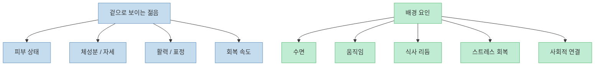
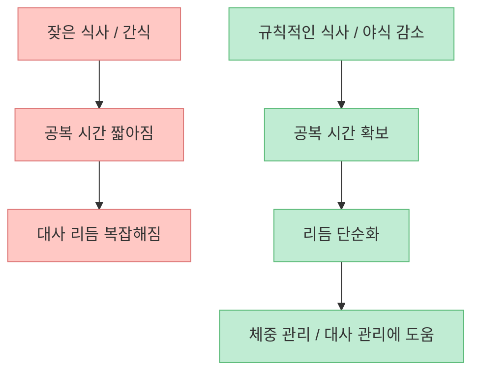
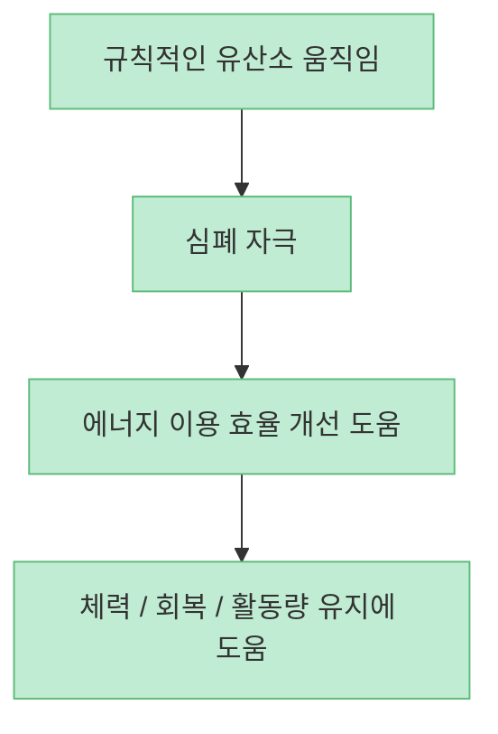
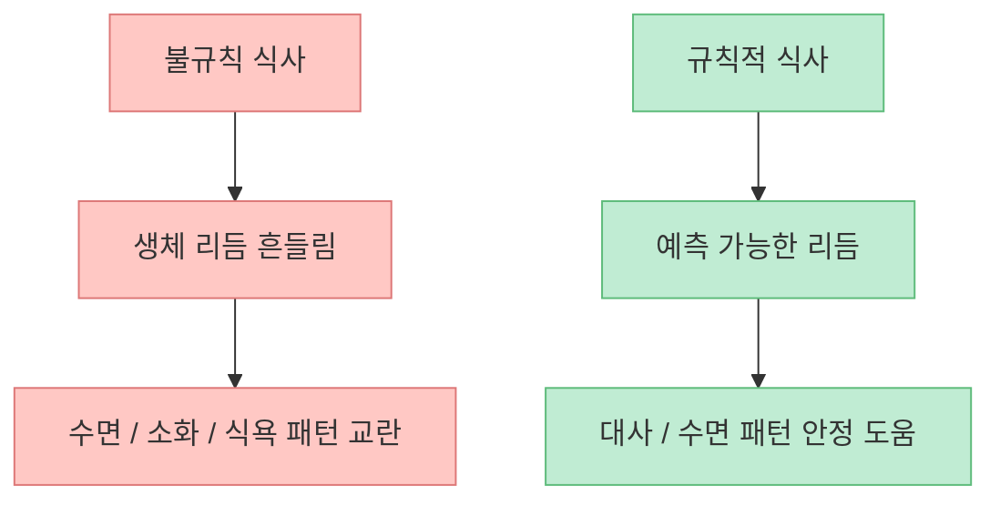
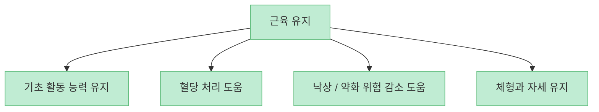
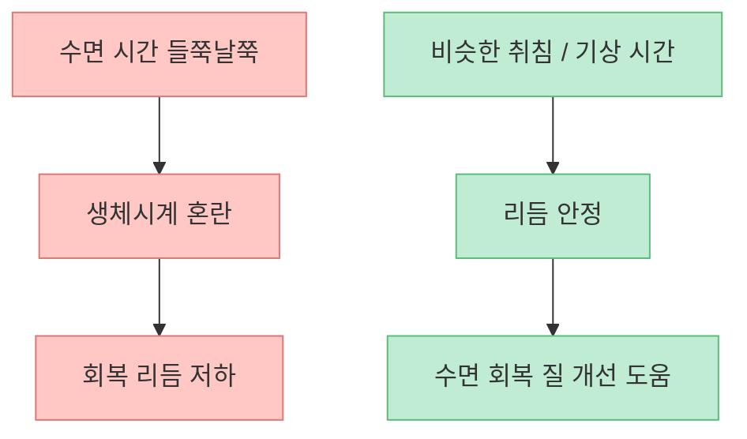
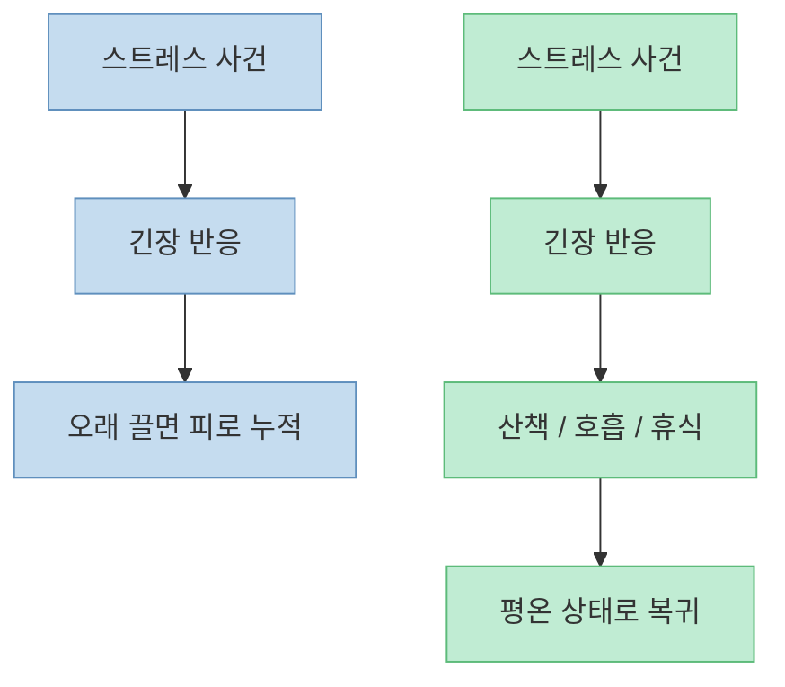
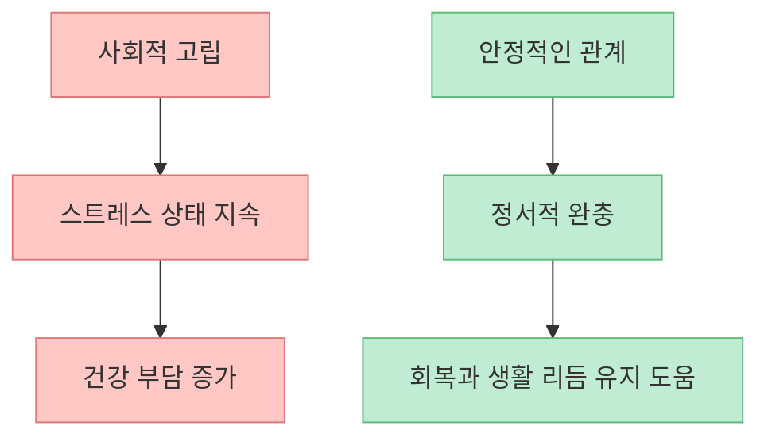

같은 나이인데도 유난히 더 젊어 보이는 사람이 있습니다. 피부만의 문제가 아니라, 몸이 가볍고 표정이 덜 지쳐 보이고 회복도 빠른 사람들 말이죠. 이 영상은 그런 차이를 [유전보다 생활 습관에서 더 많이 찾을 수 있다](https://youtu.be/DXDj4nrONs4?t=41)고 말합니다. 그리고 그 차이를 만드는 요소로 **세포 청소 주기, 움직임, 식사 리듬, 근육, 수면, 스트레스 탄력성, 사회적 연결** 이라는 일곱 가지를 제시합니다.

이런 주장은 대체로 방향은 맞지만, 표현은 조금 정리할 필요가 있습니다. "`오토파지를 켜면 젊어진다`"거나 "`찬물 샤워만 하면 항노화가 된다`" 같은 식으로 받아들이면 과장에 가깝습니다. 반대로 식사 시간, 움직임, 근육, 수면 규칙성, 스트레스 회복, 인간관계가 건강 노화와 관련 있다는 점은 연구와 공공기관 자료에서도 꾸준히 확인됩니다. 그래서 이 글은 영상을 단순 요약하기보다, **무엇이 실제로 중요하고 무엇을 현실적으로 적용할 수 있는지** 중심으로 다시 정리해 보겠습니다.

<!--more-->

## Sources

- [YouTube - 같은 나이인데 젊어보이는 사람. 7가지 방법](https://youtu.be/DXDj4nrONs4)
- [NIA - What Do We Know About Healthy Aging?](https://www.nia.nih.gov/health/healthy-aging/what-do-we-know-about-healthy-aging)
- [NIA - Health Benefits of Exercise and Physical Activity](https://www.nia.nih.gov/health/exercise-and-physical-activity/health-benefits-exercise-and-physical-activity)
- [CDC - About Sleep and Your Heart Health](https://www.cdc.gov/heart-disease/about/sleep-and-heart-health.html)
- [NIA - Loneliness and Social Isolation — Tips for Staying Connected](https://www.nia.nih.gov/health/loneliness-and-social-isolation/loneliness-and-social-isolation-tips-staying-connected)
- [PMC - The effect of fasting or calorie restriction on autophagy induction](https://pubmed.ncbi.nlm.nih.gov/30172870/)

## 1. 젊어 보이는 인상은 피부 관리보다 "몸의 리듬이 덜 망가진 상태"와 더 가깝다

영상은 [노화 속도의 차이 중 상당 부분이 유전이 아니라 생활 방식으로 결정된다고 설명](https://youtu.be/DXDj4nrONs4?t=41)합니다. 수치를 60~80%로 단정하는 표현은 맥락에 따라 달라질 수 있어 조심해야 하지만, 큰 방향은 맞습니다. NIA도 건강한 노화에서 신체활동, 수면, 스트레스, 관계, 만성질환 관리 같은 요소가 중요하다고 설명합니다.

즉 더 젊어 보인다는 것은 단순히 주름 하나가 적다는 뜻보다,

- 체중과 체성분이 덜 무너지고
- 수면과 회복 리듬이 안정적이고
- 표정과 자세가 덜 지쳐 보이며
- 염증과 피로 누적이 상대적으로 적은 상태

에 더 가깝습니다.

그래서 항노화를 "`무엇을 바를까`"만의 문제로 보면 절반만 보는 셈입니다.

## 2. 오토파지는 흥미로운 개념이지만, 현실 적용은 "공복과 과식 줄이기" 정도로 이해하는 편이 낫다

영상 첫 번째 포인트는 [세포 대청소, 즉 오토파지](https://youtu.be/DXDj4nrONs4?t=156)입니다. 설명 자체는 직관적입니다. 손상된 세포 구성 요소를 분해하고 재활용하는 과정이라는 뜻이죠. 실제로 오토파지 연구는 활발하고, 금식 또는 열량 제한이 관련 경로를 자극할 수 있다는 연구들도 있습니다.

다만 여기서 중요한 건 **사람 몸에서 정확히 몇 시간 공복이면 오토파지가 크게 켜진다** 를 단순 공식처럼 말하기 어렵다는 점입니다. 영상은 [12~16시간 공복, 걷기, 찬물 샤워, 어두운 방에서의 수면](https://youtu.be/DXDj4nrONs4?t=187) 같은 요소를 묶어 설명하지만, 실제 생활에서는 이것을 "`항노화 스위치`"보다 **야식과 잦은 간식을 줄여 몸의 대사 리듬을 단순화하는 도구** 로 보는 편이 더 현실적입니다.

즉 핵심은 "`오토파지 몇 시간`"을 집착하기보다, **수시로 먹는 패턴을 줄이고 공복과 식사 시간을 구분하는 것** 입니다.

## 3. 약간 숨이 차는 움직임은 체중 감량뿐 아니라 에너지 공장 유지에 중요하다

영상은 [숨이 살짝 찰 정도의 걷기, 자전거, 계단 같은 존2 근처 움직임](https://youtu.be/DXDj4nrONs4?t=247)을 강조합니다. 표현은 대중적이지만 방향은 괜찮습니다. NIA와 CDC 자료를 보면 규칙적인 유산소 활동은 심혈관 건강, 체력, 혈당 관리, 체중 관리, 기분, 기능 유지에 실제로 도움이 됩니다.

영상은 이를 [미토콘드리아 성장](https://youtu.be/DXDj4nrONs4?t=283)과 연결하는데, 생물학적으로 완전히 틀린 말은 아닙니다. 다만 현실적인 번역은 이렇습니다.

- 조금 숨찬 유산소 운동을 꾸준히 하면
- 몸이 에너지를 쓰는 능력이 좋아지고
- 피로 회복과 체력 유지에 도움이 된다

그래서 헬스장에 못 가도, **계단·빠른 걷기·꾸준한 자전거 같은 생활형 유산소** 가 꽤 중요합니다.

## 4. 식사 리듬은 "무엇을 먹느냐" 못지않게 "언제 먹느냐"의 문제이기도 하다

영상 세 번째 포인트는 [생체 시계에 맞춘 규칙적 식사](https://youtu.be/DXDj4nrONs4?t=327)입니다. 이 부분은 꽤 타당합니다. 우리 몸은 식사 시각, 빛, 수면, 활동량에 따라 하루 리듬을 조정합니다. 그래서 같은 음식이라도 밤늦게 반복적으로 먹는 패턴은 회복 리듬을 방해할 수 있습니다.

여기서 핵심은 극단적 식사법보다,

- 아침부터 밤까지 계속 주워 먹는 패턴 줄이기
- 늦은 밤 음식 섭취 줄이기
- 일정한 시간대에 식사를 마무리하기

같은 기본기입니다.

즉 노화 속도를 줄이는 식사 전략은 고급 비법보다 **리듬을 흐트러뜨리지 않는 식사 패턴** 에 더 가깝습니다.

## 5. 40대 이후엔 근육이 "모양"보다 대사 기관이라는 점이 더 중요해진다

영상 네 번째 포인트는 [근육을 지키는 것](https://youtu.be/DXDj4nrONs4?t=405)입니다. 이 부분은 매우 중요합니다. NIA도 나이가 들수록 근력과 근육량 유지가 건강한 노화의 핵심이라고 설명합니다. 근육은 단순히 예쁜 라인을 만드는 조직이 아니라, **움직임, 균형, 혈당 처리, 독립성, 에너지 소비** 에 관여하는 큰 조직입니다.

영상처럼 [계단 오르기, 종아리 운동, 장바구니 들기](https://youtu.be/DXDj4nrONs4?t=443) 같은 생활 속 저항 자극도 분명 도움이 됩니다. 이상적인 건 여기에 **주 2회 이상 근력 자극** 을 더하는 것입니다.

## 6. 수면은 시간도 중요하지만 "규칙성"이 특히 중요하다

영상 다섯 번째 포인트는 [몇 시간을 자느냐뿐 아니라 언제 자고 언제 깨는지가 중요하다](https://youtu.be/DXDj4nrONs4?t=459)는 것입니다. 이건 CDC 권고와도 잘 맞습니다. CDC는 규칙적인 수면 스케줄, 특히 주말 포함한 일관성을 강조합니다.

수면 규칙성이 중요한 이유는,

- 생체시계를 덜 흔들고
- 깊은 잠의 구조를 안정시키고
- 낮 시간 각성과 밤 회복 리듬을 덜 깨기 때문입니다.

그래서 수면 관리의 첫 걸음은 "`몇 시에 잘까`" 못지않게 **매일 비슷한 시간에 눕고 비슷한 시간에 일어나려는 시도** 입니다.

## 7. 스트레스를 안 받는 사람이 아니라, 빨리 회복하는 사람이 더 오래 버틴다

영상 여섯 번째 포인트는 [스트레스 탄력성, 즉 같은 자극을 받아도 평온 상태로 빨리 돌아오는 힘](https://youtu.be/DXDj4nrONs4?t=526)입니다. 이 설명도 꽤 핵심을 잘 짚습니다. 스트레스가 없는 삶은 현실적으로 불가능합니다. 더 중요한 건 **반응이 길게 끌리느냐, 짧게 끝나느냐** 입니다.

영상은 [저녁 산책 같은 단순 습관](https://youtu.be/DXDj4nrONs4?t=579)을 추천하는데, 이런 방식은 실제로도 부담이 적고 지속 가능성이 높습니다.

즉 젊어 보이는 사람은 스트레스가 없는 사람이 아니라, **긴장을 회복으로 되돌리는 루틴이 있는 사람** 일 가능성이 큽니다.

## 8. 사회적 연결은 감정 문제가 아니라 건강 자산이다

영상의 마지막 포인트는 [건강한 사회적 관계](https://youtu.be/DXDj4nrONs4?t=588)입니다. 이것도 의외로 중요합니다. NIA는 외로움과 사회적 고립이 우울, 심혈관 문제, 인지 저하 같은 건강 문제와 관련 있다고 설명합니다.

여기서 중요한 것은 사람 수가 아니라 **질 좋은 연결** 입니다. 영상이 말하듯 [마음 터놓을 수 있는 소수 관계](https://youtu.be/DXDj4nrONs4?t=597)가 더 중요할 수 있습니다.

그래서 건강 관리는 식단표와 운동표만의 문제가 아니라, **누구와 연결되어 있는가** 까지 포함합니다.

## 핵심 요약

- 더 젊어 보이는 인상은 피부 하나보다 수면, 근육, 체성분, 스트레스 회복 같은 생활 패턴의 결과에 가깝습니다.
- 오토파지는 흥미로운 개념이지만, 현실에선 야식·간식 줄이기와 규칙적 공복 정도로 이해하는 편이 낫습니다.
- 적당히 숨찬 유산소 운동은 체력과 대사 건강, 회복에 도움이 됩니다.
- 식사는 내용뿐 아니라 시간 리듬도 중요합니다.
- 40대 이후엔 근육 유지가 곧 대사와 기능 유지입니다.
- 수면 시간도 중요하지만 규칙성이 특히 중요합니다.
- 스트레스를 안 받는 것보다 빨리 회복하는 능력이 중요합니다.
- 건강한 사회적 연결은 실제 건강 자산입니다.

## 결론

이 영상의 핵심은 꽤 현실적입니다. **젊어 보이는 사람은 특별한 비밀이 있는 사람이라기보다, 몸의 리듬을 덜 망가뜨리는 습관을 오래 유지한 사람** 일 가능성이 큽니다.

그래서 가장 좋은 시작은 일곱 가지를 한 번에 바꾸는 것이 아니라, 영상이 제안한 것처럼 야식 줄이기, 약간 숨찬 걷기, 수면 시간 규칙성처럼 **작지만 반복 가능한 습관 하나를 먼저 고정하는 것** 입니다. 항노화는 대단한 비법보다 리듬의 문제에 더 가깝습니다.
