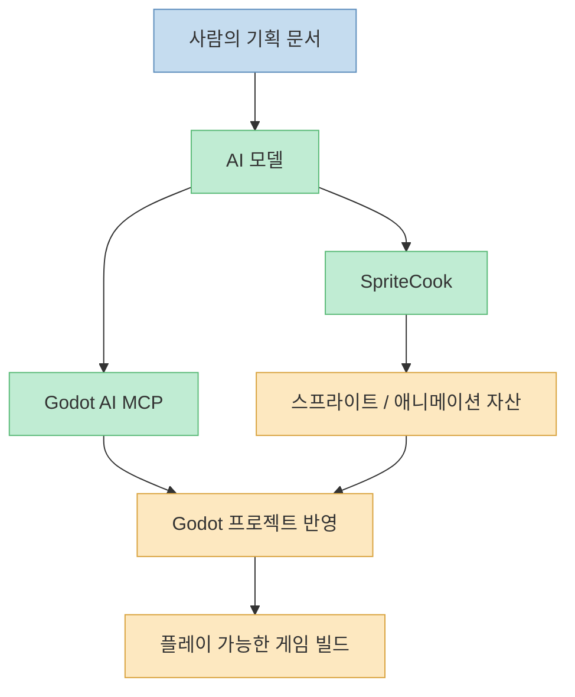
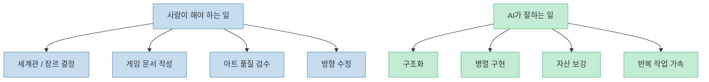
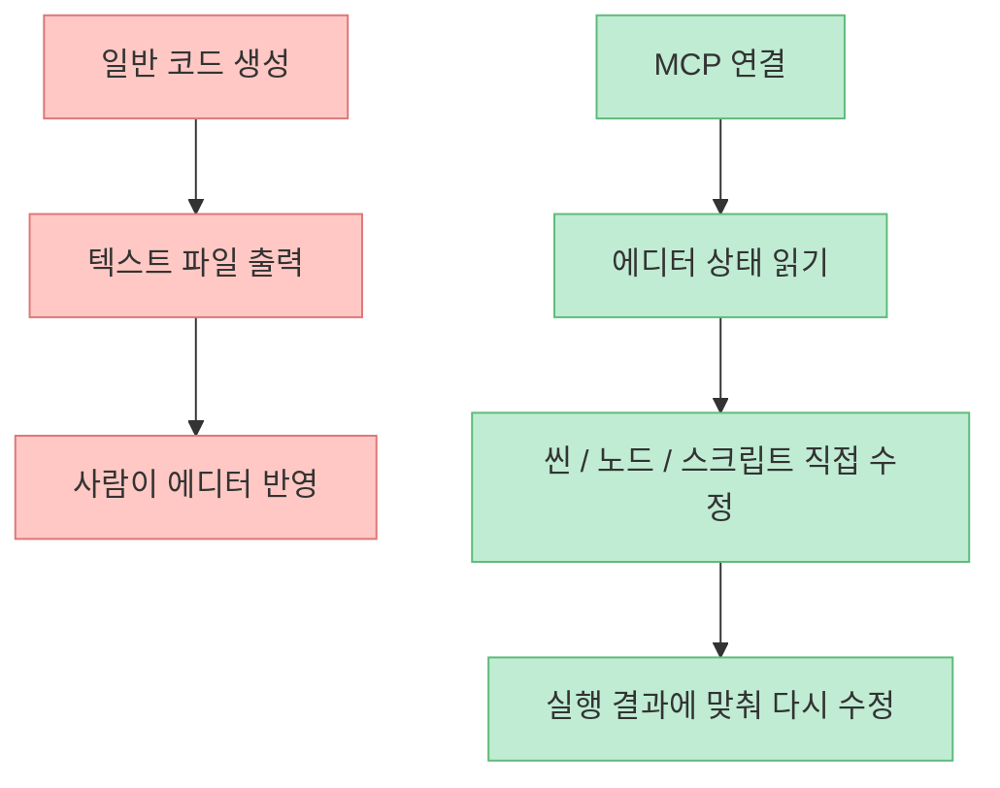
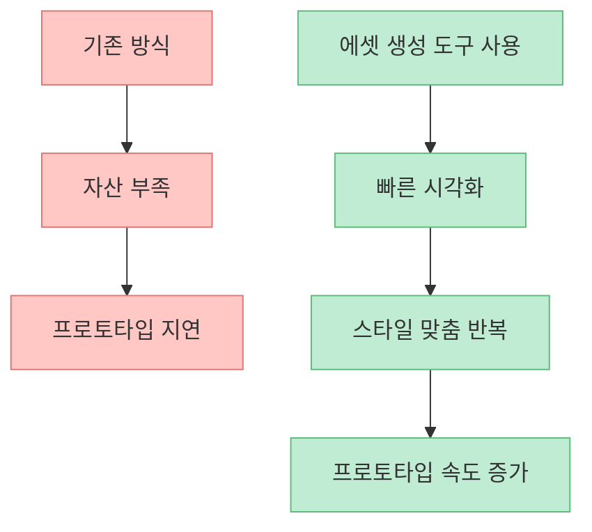
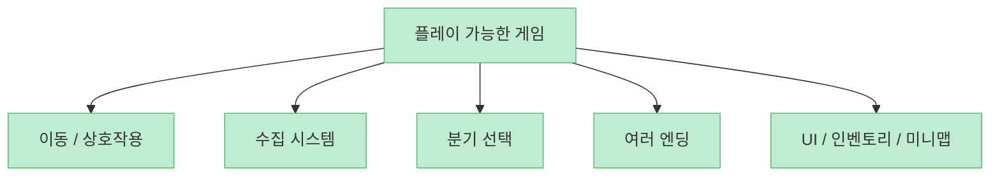
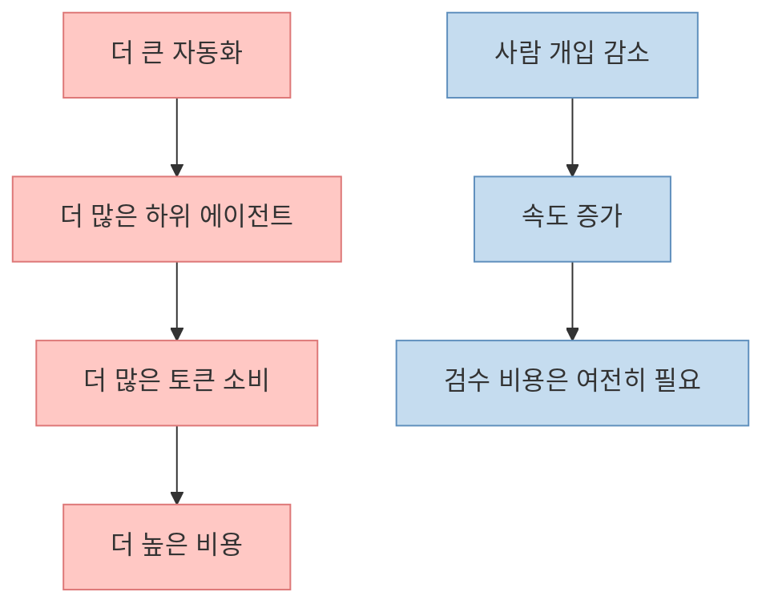
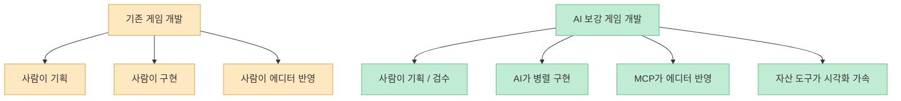

이 영상은 제목만 보면 "`최신 AI 모델 하나로 Godot 게임을 통째로 만들었다`"는 이야기처럼 보입니다. 실제로도 [기존 Godot 프로젝트와 스프라이트 자산을 준비해 두고, AI가 플레이 가능한 어드벤처 게임을 조립하는 과정](https://youtu.be/RgJeJ8-gE2Q?t=15)을 보여 줍니다. 하지만 영상을 끝까지 보면 핵심은 조금 다릅니다. **AI가 혼자 게임을 만든다** 가 아니라, **사람이 비전과 기준을 쥐고 AI에게 병렬 실행을 맡기는 워크플로가 어디까지 가능한가** 를 실험한 사례에 가깝습니다.

특히 이 영상이 흥미로운 이유는 세 가지입니다. 첫째, 게임 엔진 바깥에서 코드를 생성하는 것이 아니라 **MCP를 통해 Godot 에디터와 직접 상호작용** 하게 했다는 점. 둘째, SpriteCook 같은 도구로 **부족한 2D 자산을 보완** 했다는 점. 셋째, 최종 결과가 단순 프로토타입이 아니라 [분기, 수집, 퍼즐, 여러 엔딩이 있는 실제 플레이 구조](https://youtu.be/RgJeJ8-gE2Q?t=23)를 지향했다는 점입니다.

<!--more-->

## Sources

- [YouTube - Claude Fable 5 Is Back! And I Built an AMAZING Godot Game With It…](https://youtu.be/RgJeJ8-gE2Q)
- [Anthropic Pricing](https://www.anthropic.com/pricing)
- [Claude Help Center - Choose a Claude plan](https://support.anthropic.com/en/articles/11049762-choosing-a-claude-ai-plan)
- [Claude Help Center - Use Claude Code with your Pro or Max plan](https://support.anthropic.com/en/articles/11145838-using-claude-code-with-your-pro-or-max-plan)
- [Godot AI - Godot Asset Library](https://godotengine.org/asset-library/asset/5050)
- [hi-godot/godot-ai - GitHub](https://github.com/hi-godot/godot-ai)
- [SpriteCook](https://www.spritecook.ai/)

## 1. 이 영상의 진짜 주인공은 모델 하나가 아니라 "조합된 파이프라인"이다

영상은 [모델, Godot AI MCP, SpriteCook을 동시에 엮는 워크플로](https://youtu.be/RgJeJ8-gE2Q?t=43)를 보여 줍니다. 즉 결과물은 단일 AI의 마법이 아니라, 각 도구가 다른 역할을 맡는 **도구 체인** 의 산물입니다.

대략 구조는 이렇게 정리할 수 있습니다.

- 사람: 게임 콘셉트, 문서, 기준, 검수
- AI 모델: 설계, 코드 작성, 하위 작업 분할
- Godot AI MCP: 에디터 조작과 프로젝트 반영
- SpriteCook: 스프라이트와 애니메이션 자산 보강

이 구조를 이해하면 왜 이런 실험이 단순 "`프롬프트 잘 치면 끝`"이 아닌지 보입니다. 핵심은 모델의 지능보다도 **어떤 도구가 어떤 레이어를 담당하느냐** 입니다.

## 2. 사람은 여전히 "무엇을 만들지"를 결정해야 한다

영상에서 가장 중요한 문장은 사실 [AI에게 그냥 '던전에서 벌어지는 내러티브 게임 만들어'라고 말하고 손을 놓으면 표준적인 결과만 나온다](https://youtu.be/RgJeJ8-gE2Q?t=177)는 부분입니다. 창작 워크플로에서 이건 아주 중요한 포인트입니다.

영상 속 제작자는 실제로 다음 일을 사람이 해야 한다고 설명합니다.

- 게임 비전 정리
- 자산 스타일 선택
- 생성된 아트 검수
- 게임 문서 작성
- 필요한 에셋 프롬프트 정의

즉 AI가 대체하는 것은 창의성 자체보다, **사람이 정한 창의적 방향을 구현하는 데 드는 마찰과 반복** 에 가깝습니다.

## 3. MCP의 핵심은 "코드 생성"이 아니라 "에디터 접속"이다

Godot AI Asset Library 설명을 보면, 이 도구는 MCP 호환 AI 어시스턴트를 **실행 중인 Godot 에디터와 연결** 해 씬 구성, 스크립트 작성, UI, 테스트, 에디터 데이터 읽기 같은 작업을 하게 만듭니다. 이게 왜 중요할까요?

일반적인 LLM 코딩은 보통 텍스트 파일을 쓰는 데서 끝납니다. 하지만 게임 개발은 파일만 맞는다고 끝나지 않습니다. 에디터 안에서 씬 트리, 노드 연결, 리소스 경로, 애니메이션, 상호작용 상태가 맞아야 합니다. MCP는 바로 이 간극을 줄여 줍니다.

즉 MCP의 가치는 더 똑똑한 답변이 아니라, **도구 사용 가능 범위를 넓혀 실제 작업 루프 안으로 AI를 집어넣는 것** 에 있습니다.

## 4. 에셋 생성 도구는 게임을 완성해 주지 않지만, 자산 병목을 크게 줄여 준다

영상은 SpriteCook으로 [캐릭터, 애니메이션, 타일셋, 소품까지 대량 자산을 만들고](https://youtu.be/RgJeJ8-gE2Q?t=90), 필요하면 수정 프롬프트로 다시 손보는 방식을 보여 줍니다. SpriteCook 공식 사이트도 일관된 스타일의 캐릭터, 아이템, 애니메이션 스프라이트 시트를 생성해 엔진에 쓸 수 있다고 설명합니다.

여기서 중요한 건, 에셋 도구가 게임을 대신 설계하는 것은 아니라는 점입니다. 하지만 다음 병목은 확실히 줄여 줍니다.

- 임시 자산 수급
- 스타일 맞춘 반복 생성
- 애니메이션 초안 제작
- 아이디어 시각화 속도

그래서 AI 에셋 도구의 진짜 가치는 완성품보다도 **아이디어를 버릴지 밀어붙일지 판단할 만큼 빨리 눈앞에 보여 준다** 는 데 있습니다.

## 5. 이 영상이 인상적인 이유는 "풀 게임 구조"까지 갔기 때문이다

영상 속 게임은 [메모리 샤드 수집, 키와 상자, NPC 선택, 강아지 구출, 여러 엔딩, 미니맵, 인벤토리](https://youtu.be/RgJeJ8-gE2Q?t=434) 같은 구조를 이미 갖추고 있습니다. 이건 단순한 플레이어 이동 데모보다 훨씬 높은 단계입니다.

즉 여기서 보여 준 것은 "AI가 코드 한두 파일 썼다"가 아니라, **게임을 게임답게 느끼게 하는 시스템 묶음** 입니다.

이 지점이 중요한 이유는, AI 툴의 진짜 생산성은 파일 수가 아니라 **사용자 경험의 단위까지 묶어 낼 수 있느냐** 로 봐야 하기 때문입니다.

## 6. 하지만 이 워크플로는 공짜 자동화가 아니라, 비용을 많이 태우는 고속 자동화다

영상에서 제작자는 [모델 사용량이 빠르게 늘고, 최종 비용이 400달러 가까이 갔다](https://youtu.be/RgJeJ8-gE2Q?t=421)고 보여 줍니다. 이 수치는 영상 제작자의 실제 세션 관찰값이지 제가 별도로 검증한 청구 내역은 아닙니다. 다만 **비용이 크다** 는 메시지 자체는 충분히 현실적입니다.

공식 Anthropic 요금 페이지와 도움말을 보면, Max 20x 플랜은 월 200달러 수준이며 사용 한도 구조도 있습니다. 즉 이런 워크플로는 무료 해킹이 아니라, **고비용 모델 + 병렬 작업 + 장시간 세션** 의 조합입니다.

즉 이 워크플로는 싸고 가벼운 자동화라기보다, **돈을 써서 반복 구현 시간을 압축하는 방식** 에 더 가깝습니다.

## 7. 이 사례가 보여 주는 현실은 "AI가 게임 개발자를 대체한다"보다 "게임 개발 인터페이스가 바뀐다"에 가깝다

이 영상만 보면 AI가 곧 게임 디자이너, 프로그래머, 아티스트를 모두 대체할 것처럼 느껴질 수 있습니다. 하지만 실제론 더 정확한 해석이 있습니다.

- 사람은 비전, 취향, 우선순위, 검수를 담당한다
- AI는 구현 속도, 탐색 속도, 반복 속도를 끌어올린다
- MCP는 AI를 에디터 안으로 넣는다
- 에셋 생성기는 시각적 병목을 줄인다

이건 개발자의 소멸보다, **개발자가 다루는 인터페이스와 작업 단위가 바뀌는 쪽** 에 더 가깝습니다.

## 핵심 요약

- 이 영상의 핵심은 AI 단독 창작이 아니라 모델, MCP, 에셋 생성기를 결합한 파이프라인입니다.
- 사람은 여전히 게임의 비전, 문서, 검수, 방향 결정을 맡아야 합니다.
- MCP의 가치는 텍스트 코드 생성이 아니라 Godot 에디터와 직접 연결된 실행 루프에 있습니다.
- SpriteCook 같은 도구는 자산 병목을 크게 줄여 프로토타입 속도를 높입니다.
- 이 사례가 인상적인 이유는 프로토타입이 아니라 실제 플레이 구조에 가까운 시스템 묶음을 보여 줬기 때문입니다.
- 대신 이런 자동화는 비용이 높고 토큰 소모가 매우 큽니다.

## 결론

이 영상이 보여 주는 미래는 "`프롬프트 한 줄로 게임 완성`"이 아닙니다. 더 정확히는 **사람이 방향을 정하고, AI가 여러 구현 레이어를 병렬로 밀어 주는 제작 환경** 입니다.

그래서 중요한 질문도 바뀝니다. 이제는 "`AI가 코드를 잘 쓰나`"보다, **어떻게 문서를 준비하고, 어떤 MCP를 붙이고, 어디까지를 사람 검수 영역으로 남길지** 가 더 중요한 생산성 문제가 됩니다. AI 게임 개발의 핵심은 모델 자체보다 워크플로 설계에 있습니다.
