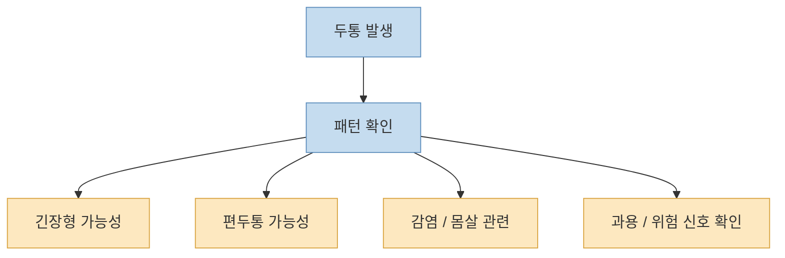
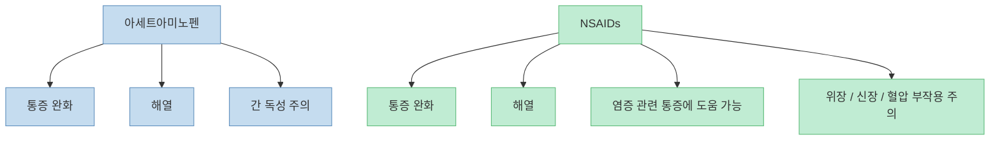
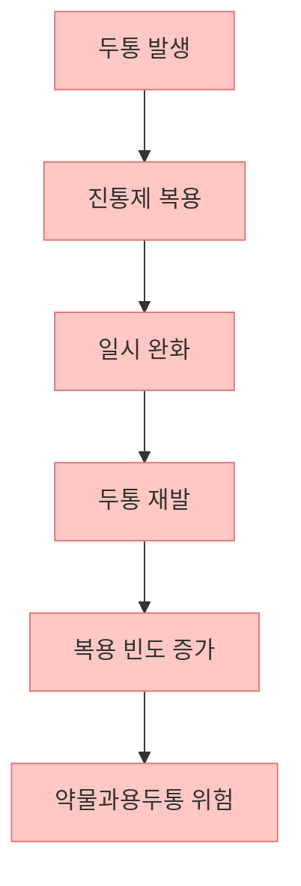
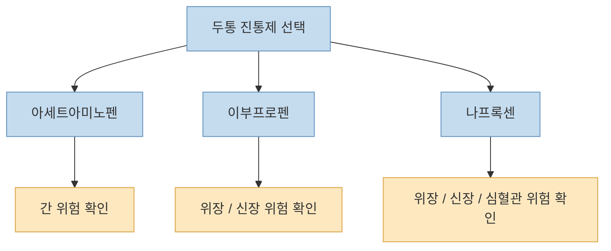
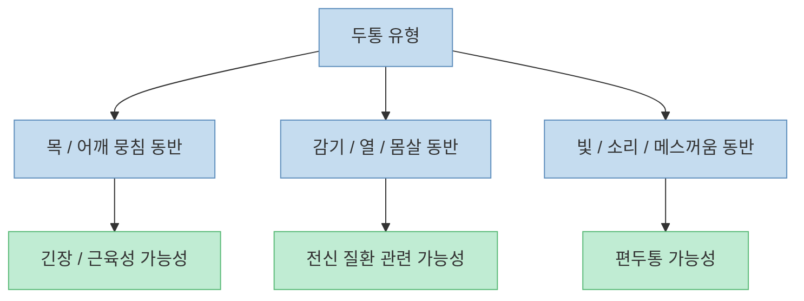
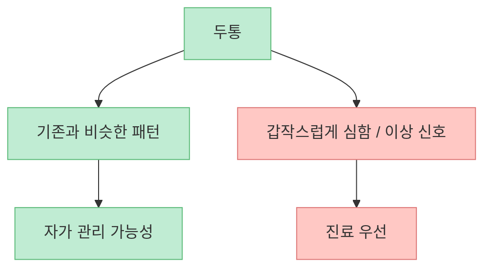
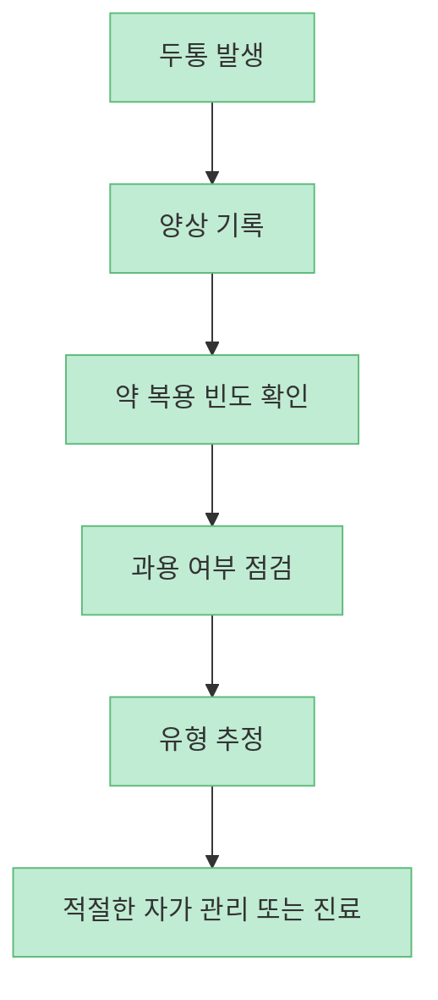

이 쇼츠는 [타이레놀은 열엔 좋지만 두통의 뿌리인 염증을 잘 못 잡고, 나프록센이나 이부프로펜 같은 소염진통제로 바꿔야 한다](https://youtu.be/cB0QfK7JYmI?t=13)는 식으로 말합니다. 짧은 영상답게 아주 단호한 표현을 쓰지만, 실제 두통은 그렇게 단순하지 않습니다. 어떤 사람에겐 아세트아미노펜이 충분히 도움이 되고, 어떤 사람에겐 NSAIDs가 더 맞을 수 있습니다. 또 어떤 두통은 약을 바꾸는 문제가 아니라 **진단을 먼저 받아야 하는 신호** 일 수 있습니다.

그래서 핵심은 "`타이레놀 말고 뭐가 더 세냐`"가 아닙니다. **내 두통이 어떤 패턴인지, 진통제를 얼마나 자주 먹는지, 위험 신호가 있는지** 를 먼저 보는 것이 더 중요합니다. 이 글은 쇼츠의 약 추천을 그대로 따라가기보다, 실제로 도움이 되는 안전한 원칙으로 다시 정리해 보겠습니다.

<!--more-->

## Sources

- [YouTube Shorts - 지긋지긋한 두통! 타이레놀 말고 이 것!](https://youtube.com/shorts/cB0QfK7JYmI)
- [FDA - Acetaminophen](https://www.fda.gov/drugs/safe-use-over-counter-pain-relievers-and-fever-reducers/acetaminophen)
- [MedlinePlus - Acetaminophen Drug Information](https://medlineplus.gov/druginfo/meds/a681004.html)
- [MedlinePlus - Ibuprofen Drug Information](https://medlineplus.gov/druginfo/meds/a682159.html)
- [NICE - Headaches in over 12s: diagnosis and management](https://www.nice.org.uk/guidance/cg150/chapter/recommendations)
- [American Migraine Foundation - Medication Overuse Headache](https://americanmigrainefoundation.org/resource-library/medication-overuse-headache-3/)

## 1. 두통은 "약발이 센가"보다 먼저 종류를 구분해야 한다

쇼츠는 [지독한 두통에 증상별로 약을 골라야 한다](https://youtu.be/cB0QfK7JYmI?t=24)고 말하지만, 실제로는 약 이름보다 **두통의 종류** 가 더 중요합니다. 왜냐하면 두통은 모두 같은 통증이 아니기 때문입니다.

대표적으로는 다음처럼 나눠 생각할 수 있습니다.

- 긴장형 두통: 조이는 듯, 띠를 두른 듯한 통증
- 편두통: 욱신거리고 활동하면 더 심해지며 빛·소리·메스꺼움이 동반될 수 있음
- 감기·열·몸살 관련 두통: 전신 증상과 함께 나타나는 통증
- 약물과용두통: 진통제를 자주 먹을수록 오히려 반복되는 두통
- 위험 신호가 있는 2차성 두통: 갑작스럽고 매우 심하거나 신경학적 이상을 동반하는 경우

즉 "`무슨 약이 더 세냐`"보다 먼저 "`이 두통이 어떤 얼굴을 하고 있나`"를 봐야 합니다.

## 2. 타이레놀과 소염진통제는 누가 더 우월하다기보다 강점이 다르다

쇼츠는 [타이레놀은 염증을 못 잡으니 소용없고, 염증까지 잡는 소염진통제로 바꿔야 한다](https://youtu.be/cB0QfK7JYmI?t=15)는 식으로 말합니다. 하지만 이건 지나치게 단순화된 표현입니다.

아세트아미노펜(타이레놀 계열)은 **통증과 열을 줄이는 데 흔히 쓰이는 약** 이고, NSAIDs(이부프로펜, 나프록센 등)는 **통증·열과 함께 염증성 기전에도 작용** 합니다. 둘은 경쟁 관계라기보다 상황에 따라 선택이 달라지는 도구에 가깝습니다.

따라서 "`타이레놀보다 무조건 더 좋다`"는 식으로 말하면 정확하지 않습니다. 예를 들어 위장 질환, 신장 질환, 혈액응고 문제, 특정 약물 복용 여부에 따라 NSAIDs는 오히려 더 조심해야 할 수 있습니다.

## 3. 반복 두통에서 가장 흔한 함정은 "더 센 약 찾기"보다 "더 자주 먹기"다

짧은 영상은 약 선택만 강조하지만, 실제 만성 반복 두통에서는 **약물과용두통** 이 매우 중요합니다. American Migraine Foundation은 아세트아미노펜과 NSAIDs도 너무 자주 쓰면 오히려 두통을 악화시키거나 만성화할 수 있다고 설명합니다.

즉 약이 안 듣는다고 해서 계속 바꿔 가며 더 자주 먹는 패턴이 생기면, 문제는 진통제 강도가 아니라 **두통 시스템 자체가 약에 끌려가는 상태** 가 될 수 있습니다.

그래서 "`약이 안 듣는다`"는 말이 나오면, 약을 바꾸기 전에 먼저 다음을 점검해야 합니다.

- 두통이 한 달에 며칠이나 오는지
- 진통제를 한 달에 며칠 먹는지
- 점점 더 자주 먹게 되는지
- 두통 양상이 처음과 달라졌는지

## 4. 나프록센, 이부프로펜, 아세트아미노펜은 모두 장단점이 있다

쇼츠는 특정 브랜드를 상황별로 고르라고 권하지만, 실질적으로 중요한 것은 **성분 수준에서 이해하는 것** 입니다.

- 아세트아미노펜: 위장 부담이 상대적으로 적을 수 있지만, 과다 복용 시 간 손상 위험이 중요
- 이부프로펜: 흔한 NSAID로 두통, 근육통, 생리통 등에 사용되지만 위장·신장·혈압 부작용 주의
- 나프록센: NSAID이며 작용 시간이 비교적 길 수 있지만 역시 위장관·심혈관·신장 위험을 함께 봐야 함

즉 핵심은 브랜드 기억보다, **내 몸 상태와 동반 질환, 복용 중인 약에 따라 어떤 계열이 더 안전한지** 를 보는 것입니다.

## 5. 근육 뭉침 두통, 감기 몸살 두통, 편두통은 접근이 다르다

쇼츠는 [근육 뭉침에는 특정 복합제, 몸살 기운엔 다른 복합제](https://youtu.be/cB0QfK7JYmI?t=42)를 권합니다. 방향 자체는 이해할 수 있습니다. 하지만 소비자 입장에선 제품명이 아니라 **통증 패턴** 으로 접근하는 편이 더 낫습니다.

이렇게 보면 왜 "`무조건 이 약`"이 위험한지 이해하기 쉽습니다. 같은 두통처럼 보여도 원인이 다르면 반응도 달라집니다.

## 6. 이런 두통은 약을 바꾸기보다 진료를 먼저 받아야 한다

가장 중요한 건 이것입니다. 아래 같은 경우는 "`어떤 OTC 진통제가 좋냐`"보다 **진료가 우선** 입니다.

- 평소와 다르게 갑자기 매우 심한 두통이 생겼다
- 신경학적 이상, 말 어눌함, 마비, 시야 변화가 있다
- 발열, 목 경직, 의식 변화가 있다
- 머리 외상 뒤에 두통이 생겼다
- 나이가 들고 처음 생긴 새로운 두통이다
- 진통제를 먹어도 반복적으로 점점 잦아진다

쇼츠처럼 "`약만 바꾸면 해결`"처럼 말하면, 이런 경고 신호를 놓치기 쉽습니다.

## 7. 두통 관리에서 가장 현실적인 원칙은 "패턴 기록 + 과용 방지 + 진단 구분"이다

NICE 가이드라인도 반복 두통에서는 두통일기 같은 기록을 권합니다. 생각보다 단순한 기록만 해도 도움이 됩니다.

- 언제 아픈지
- 얼마나 오래 가는지
- 어떤 증상이 같이 오는지
- 어떤 약을 얼마나 자주 먹는지
- 수면, 스트레스, 생리주기, 카페인과 관련이 있는지

결국 좋은 두통 관리는 "`더 센 약 찾기`"가 아니라, **내 두통의 구조를 읽는 것** 에서 시작합니다.

## 핵심 요약

- 두통은 모두 같은 통증이 아니므로 먼저 패턴을 구분해야 합니다.
- 아세트아미노펜과 NSAIDs는 서로 완전히 대체 관계가 아니라 장단점이 다른 약입니다.
- 반복 두통에서 가장 흔한 함정은 약을 더 자주 먹게 되는 약물과용두통입니다.
- 약 이름보다 성분과 내 몸 상태, 동반 질환을 먼저 봐야 합니다.
- 근육성 두통, 감기 몸살 두통, 편두통은 접근이 다를 수 있습니다.
- 갑작스럽고 심한 두통, 신경학적 증상, 점점 잦아지는 두통은 진료가 우선입니다.

## 결론

이 쇼츠가 말하는 핵심은 "`증상에 맞는 약을 고르라`"는 것이지만, 실제로는 그보다 한 단계 앞선 질문이 필요합니다. **내 두통이 어떤 두통인지, 진통제를 얼마나 자주 먹고 있는지, 위험 신호가 있는지** 를 먼저 봐야 한다는 점입니다.

그래서 타이레놀보다 강한 약을 찾기 전에, 두통의 패턴을 기록하고 과용을 피하고 경고 신호를 구분하는 것이 더 중요합니다. 진통제는 도구이지, 진단을 대신해 주는 답은 아닙니다.
