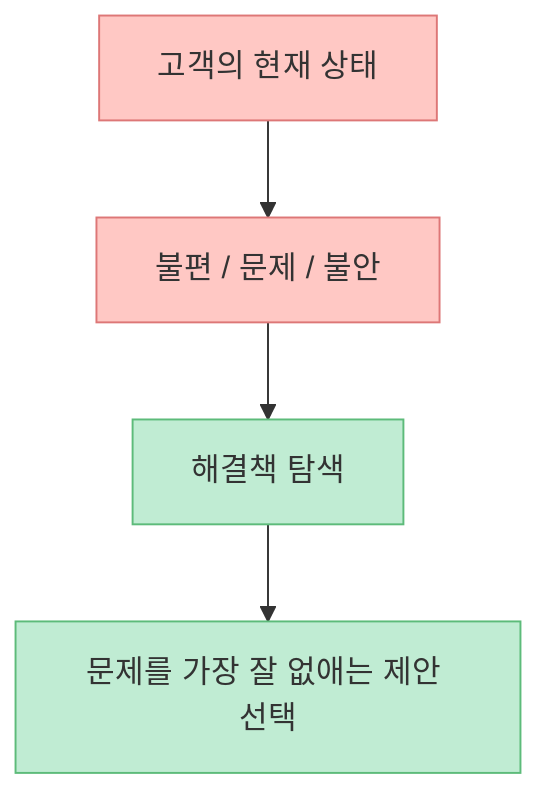
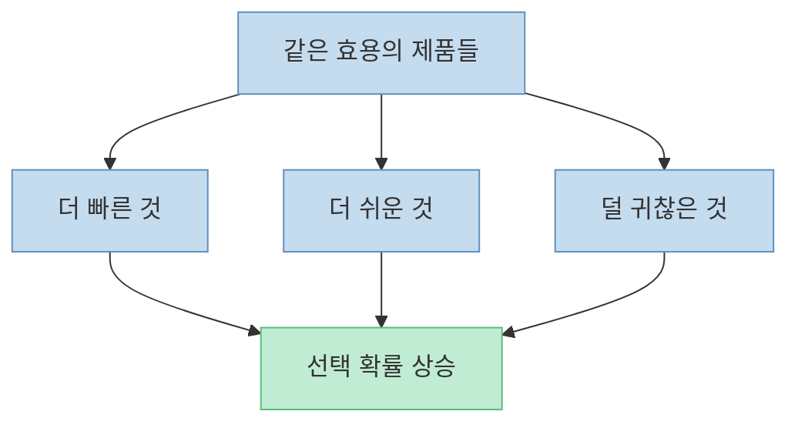
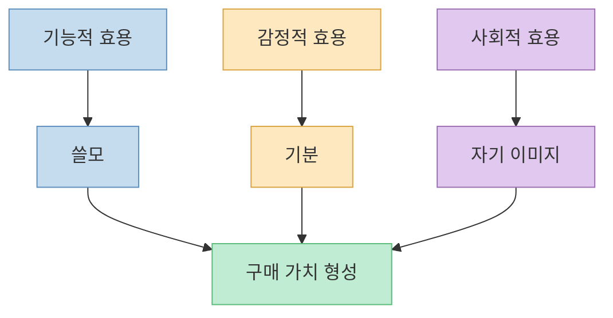
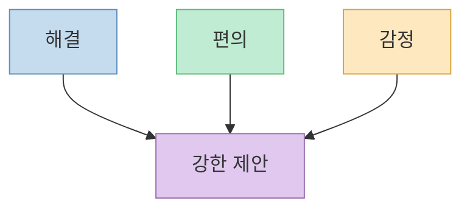
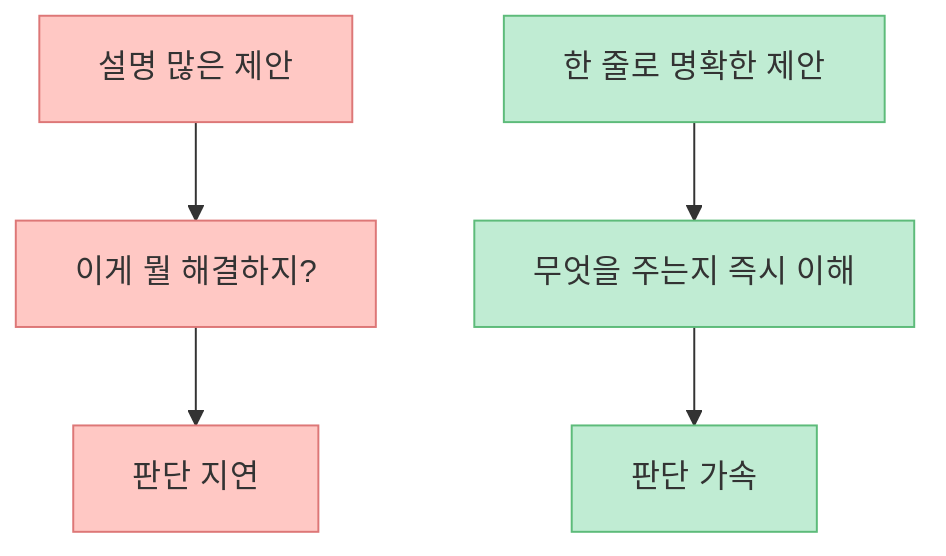
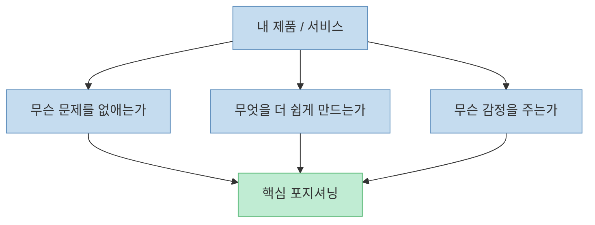
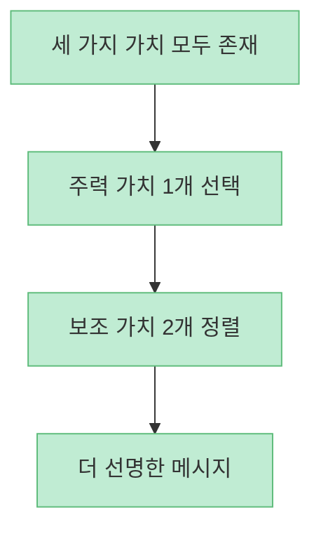

이 쇼츠의 주장은 아주 단순합니다. [사람은 결국 세 가지에만 돈을 쓴다](https://youtu.be/jOXwK_R2Xoc?t=0)는 것입니다. 첫째는 **문제를 해결하는 것**, 둘째는 **더 빠르고 더 편하게 만드는 것**, 셋째는 **다른 데서 얻을 수 없는 감정을 주는 것** 입니다. 짧은 영상치고는 꽤 날카로운 요약입니다. 실제로 많은 상품과 서비스는 기능 설명보다, 이 세 축 중 어디에 걸리는지가 더 분명할 때 팔리기 쉽습니다.

물론 현실은 세 단어만큼 단순하지 않습니다. 사람은 습관, 가격 신호, 신뢰, 사회적 비교, 타이밍, 브랜드, 대안 비용 같은 여러 요소에도 반응합니다. 그럼에도 이 프레임이 유용한 이유는, **내가 파는 것이 정확히 어떤 가치를 주는지 한 문장으로 말하게 강제한다** 는 데 있습니다. 이 글은 쇼츠의 주장을 고객 심리와 JTBD 관점으로 조금 더 구조화해서 풀어보겠습니다.

<!--more-->

## Sources

- [YouTube Shorts - 비싸도 결국 사는 3가지 이유](https://youtube.com/shorts/jOXwK_R2Xoc)
- [Christensen Institute - Jobs to Be Done Theory](https://www.christenseninstitute.org/theory/jobs-to-be-done/)
- [Harvard Business School Online - The Jobs to Be Done Framework Explained](https://online.hbs.edu/blog/post/jobs-to-be-done-examples)
- [HBR - Know Your Customers' “Jobs to Be Done”](https://hbr.org/2016/09/know-your-customers-jobs-to-be-done)
- [Nir and Far - Hooked](https://www.nirandfar.com/hooked/)
- [Farnam Street - Rory Sutherland on the Psychology of Pricing](https://fs.blog/knowledge-project-podcast/rory-sutherland-2/)

## 1. 사람들이 사는 것은 제품 그 자체보다 "무언가를 끝내 주는 기능"이다

쇼츠의 첫 번째 포인트는 [사람들은 문제를 없애 주는 해결책에 돈을 쓴다](https://youtu.be/jOXwK_R2Xoc?t=4)는 것입니다. 통증, 혼란, 빚, 체중, 스트레스, 외로움 같은 문제를 줄여 준다면 비싸도 산다는 말이죠.

이건 JTBD 이론과 잘 맞습니다. Christensen Institute와 HBS 자료는 사람들이 제품을 단지 "소유"하려고 사는 것이 아니라, **어떤 일을 해결하기 위해 제품을 '고용'한다** 고 설명합니다. 즉 고객은 기능 목록보다 "`이걸 쓰면 내 문제가 끝나는가`"를 먼저 묻습니다.

그래서 좋은 제품 설명은 "`우리는 이런 기능이 있습니다`"보다 "`우리는 이 문제를 이렇게 끝냅니다`"에 더 가깝습니다.

## 2. 편의는 사소한 보너스가 아니라, 거대한 시장을 만드는 핵심 가치다

쇼츠의 두 번째 포인트는 [가장 큰 사업은 가장 혁신적인 곳이 아니라 가장 편리한 곳](https://youtu.be/jOXwK_R2Xoc?t=18)이라는 말입니다. 이건 다소 과감한 표현이지만, 핵심은 살아 있습니다. 많은 시장에서 승자는 꼭 기술적으로 가장 놀라운 제품이 아니라, **고객이 가장 덜 힘들게 쓰게 만든 제품** 인 경우가 많습니다.

Nir Eyal의 프레임도 이 지점을 강조합니다. 행동을 유도하려면 복잡성보다 **행동 마찰을 줄이는 것** 이 중요하다는 점이죠. 결국 편의는 사치가 아니라 전환율을 바꾸는 힘입니다.

즉 고객은 항상 "최고 품질"을 사는 것이 아니라, 자주 **가장 덜 마찰적인 선택** 을 합니다.

## 3. 감정은 프리미엄의 원천이다

쇼츠의 세 번째 포인트는 [사람은 다른 곳에서 얻을 수 없는 감정을 주는 경험에 큰돈을 쓴다](https://youtu.be/jOXwK_R2Xoc?t=30)는 것입니다. 이 부분이 특히 중요합니다. 많은 판매자는 자기 상품이 기능만 좋으면 팔릴 것이라 생각하지만, 실제로는 감정적 의미가 가격을 더 밀어 올리는 경우가 많습니다.

HBR의 JTBD 글도 "일(job)은 단순히 기능만이 아니라 사회적·감정적 차원을 가진다"고 설명합니다. Rory Sutherland 역시 가격은 숫자이기 전에 **느낌과 신호** 라고 말합니다. 즉 고객은 물건을 사는 동시에, 그 물건이 주는 기분과 자기 이미지를 함께 삽니다.

그래서 같은 카페, 같은 옷, 같은 앱이라도 어떤 곳은 더 비싸게 팔 수 있습니다. 기능이 아니라 **느낌의 독점성** 을 만들기 때문입니다.

## 4. 해결, 편의, 감정은 따로가 아니라 겹쳐질수록 더 강해진다

쇼츠는 셋 중 어느 것을 팔고 있는지 묻지만, 실제로 가장 강한 제안은 종종 세 가지를 함께 만듭니다.

- 문제를 해결해 주고
- 쓰기 쉽고
- 감정적으로도 기분이 좋다

이렇게 되면 대체재가 훨씬 줄어듭니다.

예를 들어 단순한 생산성 앱이라도,

- 일정 혼란을 줄여 주고
- 입력이 매우 쉽고
- 사용자가 유능해진 느낌을 준다면

훨씬 강한 제품이 됩니다.

## 5. 고객은 상품 설명보다 "한 줄 이유"를 먼저 이해한다

쇼츠의 마지막 문장은 아주 실용적입니다. [내 제안이 좋은가보다, 내가 셋 중 무엇을 팔고 있는지 한 문장으로 말할 수 있느냐가 중요하다](https://youtu.be/jOXwK_R2Xoc?t=42)는 말이죠. 이건 실제 마케팅, 세일즈, 콘텐츠 모두에 통합니다.

설명이 길어질수록 고객은 이해하는 게 아니라 피로해집니다. 반대로 한 줄로 정리되면 구매 판단이 빨라집니다.

즉 고객은 상품 설명서를 읽고 결심하는 게 아니라, **이게 내게 어떤 변화를 주는지 빠르게 납득** 할 때 움직입니다.

## 6. 제품을 만들 때보다, 설명할 때 이 프레임이 더 빛난다

이 3분류 프레임은 신제품 기획에도 유용하지만, 특히 **메시지 정리** 에 강합니다. 기능이 많고 대상도 넓은 제품일수록 정체성이 흐려지기 쉽습니다. 이때 "`우리는 해결을 판다`", "`우리는 편의를 판다`", "`우리는 감정을 판다`" 중 어느 쪽인지 먼저 잡으면 문장이 정리됩니다.

이 질문을 통과하지 못하면, 고객도 결국 "`좋은 건 알겠는데 그래서 왜 사야 하죠?`"라는 상태에 머무르게 됩니다.

## 7. 실제로는 세 가지 중 하나만 고르는 게 아니라, 주력을 정하는 것이 중요하다

현실의 좋은 비즈니스는 종종 세 가지를 다 조금씩 갖고 있습니다. 하지만 모든 것을 다 잘한다고 말하면 아무것도 안 들립니다. 그래서 중요한 건 **무엇을 가장 앞줄에 세울지** 입니다.

- 해결이 주력인가
- 편의가 주력인가
- 감정이 주력인가

그리고 나머지는 그 주력을 보조해야 합니다.

즉 "`우리는 다 합니다`"가 아니라, **"`우리는 이것을 제일 잘합니다`"가 더 비싸게 팔리는 문장** 이 됩니다.

## 핵심 요약

- 사람은 제품 자체보다 문제 해결, 편의, 감정이라는 가치에 돈을 씁니다.
- JTBD 관점에서 고객은 제품을 소유하려는 것이 아니라 어떤 일을 해결하려고 제품을 고용합니다.
- 편의는 사소한 장점이 아니라 전환율과 선택을 바꾸는 핵심 가치입니다.
- 감정과 자기 이미지는 프리미엄 가격을 가능하게 하는 중요한 요소입니다.
- 가장 강한 제안은 해결, 편의, 감정이 겹칠 때 나옵니다.
- 고객은 긴 설명보다 "`그래서 이게 내게 뭘 해주지?`"를 한 문장으로 이해하고 싶어 합니다.

## 결론

이 쇼츠가 던지는 질문은 아주 실용적입니다. **내 제안은 결국 무엇을 팔고 있는가? 문제 해결인가, 편의인가, 감정인가?** 이 질문에 한 문장으로 답할 수 없다면, 고객도 같은 이유로 망설입니다.

그래서 비싸도 팔리는 제안은 기능이 많은 것이 아니라, **가치가 선명한 제안** 입니다. 제품을 더 만들기 전에, 내가 실제로 팔고 있는 변화를 먼저 한 줄로 정의하는 것이 출발점입니다.
