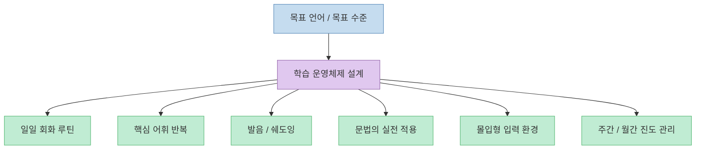
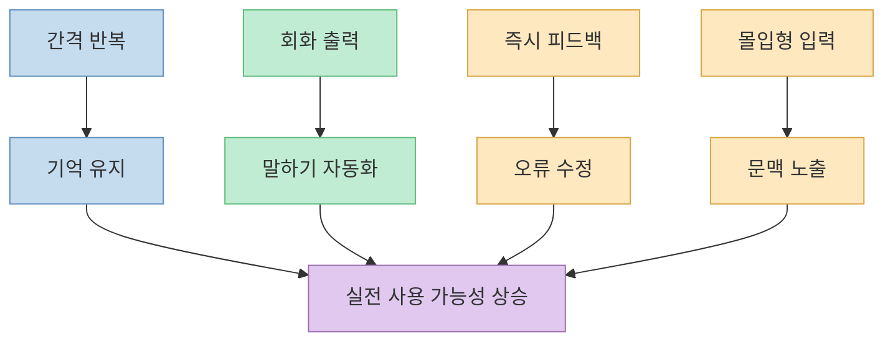
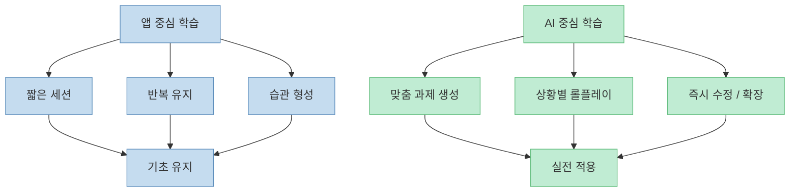
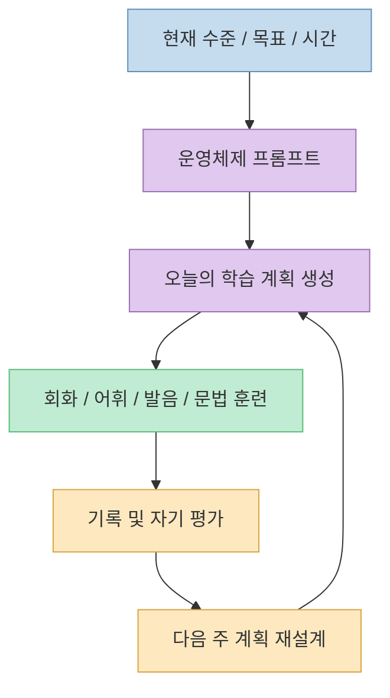

이 Threads 포스트는 꽤 강한 문장으로 시작합니다. 요지는 "`언어 앱을 오래 써도 말은 잘 안 늘 수 있는데, Claude를 잘 쓰면 훨씬 빠르게 회화 중심 훈련 시스템을 만들 수 있다`"는 주장입니다. 공개 상태에서 확인된 본문을 따라가 보면, 자극적인 선언보다 더 중요한 것은 **AI를 교재로 쓰는 것이 아니라 학습 운영체제로 쓰려는 발상** 입니다.

실제로 포스트에 노출된 프롬프트들은 단순 번역 요청이 아닙니다. 학습 계획 설계, 회화 루틴, 핵심 어휘, 발음 훈련, 몰입 환경, 실전 문법, 진도 추적처럼 서로 다른 기능을 하나의 흐름으로 엮으려 합니다. 즉 "`앱 하나 더 추가`"가 아니라 "`학습 단위를 문제집에서 코칭 시스템으로 바꾸자`"는 쪽에 가깝습니다.

다만 이 포스트의 가장 큰 주장, 즉 "`듀오링고가 몇 년 동안 못 고친 걸 Claude가 몇 주 만에 해결했다`"는 부분은 공개된 본문만으로는 검증되지 않습니다. 그래서 이 글은 그 문장을 그대로 받아들이기보다, **확인 가능한 프롬프트 구조와 공식 학습 원리 사이의 접점** 을 중심으로 정리하겠습니다.

<!--more-->

## Sources

- [Threads - easygpt2526 포스트](https://www.threads.com/@easygpt2526/post/DaeaG0fE-uh)
- [Duolingo Research - A Trainable Spaced Repetition Model for Language Learning](https://research.duolingo.com/papers/settles.acl16.pdf)
- [Duolingo Blog - Are Some People Better at Learning Languages Than Others?](https://blog.duolingo.com/are-some-people-better-at-learning-languages/)

## 1. 이 스레드가 실제로 파는 것은 "앱 대체"가 아니라 "학습 운영체제"다

공개 추출 기준으로 이 스레드에서 확인된 작성자 프롬프트는 7개였습니다. 원문은 "`10가지 프롬프트`"라고 소개하지만, 로그인 없이 접근 가능한 본문에서는 아래 7개만 명확히 확인됐습니다.

- 3개월 언어 마스터 운영체제
- 매일 회화 집중 훈련
- 핵심 어휘 초고속 습득
- 말하기·발음 향상
- 몰입형 언어 환경 구축
- 실전 문법 마스터
- 언어 학습 진도 관리

이 목록만 봐도 초점이 분명합니다. 학습을 "`문제 풀이`"로 보지 않고, 다음 네 층으로 나누고 있습니다.

1. **설계**: 현재 수준, 시간, 목표를 반영한 전체 계획 수립
2. **실행**: 회화, 쉐도잉, 어휘, 발음, 문법 훈련의 일일 루틴화
3. **환경**: 유튜브, 팟캐스트, SNS, 책 등으로 입력량 확대
4. **관리**: 주간·월간 점검, 취약점 분석, 다음 단계 제안

이 구조의 핵심은 AI가 답만 주는 도구가 아니라, **학습 순서를 설계하고 매일 다른 훈련을 생성하는 코치** 가 된다는 점입니다. 전통적인 앱은 보통 "`정해진 커리큘럼 + 반복 노출`"에 강하지만, 이 스레드의 프롬프트들은 "`개인 조건에 맞춘 맞춤형 과제 생성 + 즉석 피드백`" 쪽을 강조합니다.

그래서 이 포스트를 "`듀오링고 대 클로드`"의 단순 대결로 읽으면 핵심을 놓칩니다. 더 정확한 해석은, **AI가 언어 학습의 단위를 레슨에서 운영체제로 바꾸려 한다** 는 것입니다.

## 2. 왜 이런 프롬프트 구성이 설득력을 가지는가: 반복, 출력, 피드백, 몰입이 한 흐름으로 묶이기 때문이다

이 스레드가 내세운 7개 프롬프트는 제각각 흩어진 팁처럼 보이지만, 실제로는 언어 학습의 중요한 축을 거의 다 건드립니다.

- 반복: 간격 반복 학습, 복습 테스트
- 출력: 회화, 문장 만들기, 롤플레이
- 피드백: 발음 교정, 진행 분석, 취약점 제안
- 몰입: 영상, 음악, SNS, 실제 대화

이 가운데 **간격 반복** 은 새 주장이라기보다 이미 잘 알려진 학습 원리입니다. Duolingo 연구 논문은 spaced repetition practice가 장기 기억 유지에 효과적이라는 기존 연구를 전제로, 실제 학습 로그를 이용해 복습 타이밍을 예측하는 모델을 설명합니다. 즉 "`반복 자체`"는 앱의 약점이 아니라 오히려 앱이 잘하는 영역입니다.

반면 이 스레드가 상대적으로 더 강하게 가져가는 지점은 **출력과 피드백의 즉시성** 입니다. 회화 계획을 60~120분 단위로 쪼개고, 발음·쉐도잉·실전 대화·문장 생성까지 한 번에 묶으려는 방식은 "`오늘 무엇을 어떻게 연습할지`"를 즉석에서 만들어 줄 수 있다는 AI의 장점을 잘 활용합니다.

Duolingo 공식 블로그 역시 학습 성과를 좌우하는 요소로 **얼마나 자주 공부하는지**, **어떻게 시간을 쓰는지**, 그리고 **실제 말하기와 듣기처럼 어려운 일을 계속 밀어보는지** 를 꼽습니다. 이 점에서 보면, 이 Threads 포스트는 완전히 새로운 학습 과학을 말하는 것이 아니라, 이미 알려진 원리를 **프롬프트 인터페이스로 재조합** 하고 있다고 보는 편이 맞습니다.

즉 설득력의 원천은 "`AI라서 마법처럼 잘된다`"가 아니라, **반복·출력·몰입·피드백을 하나의 워크플로우로 연결했다** 는 데 있습니다.

## 3. 그렇다고 "클로드가 듀오링고를 끝냈다"는 뜻은 아니다

이 스레드에는 반응도 꽤 갈립니다. 댓글 중에는 "`듀오링고 자체가 나쁜 것이 아니라, 그것만 하는 게 문제`"라는 반론도 보입니다. 이 반론은 꽤 중요합니다. 왜냐하면 AI 프롬프트 시스템과 언어 앱은 완전히 같은 일을 하는 도구가 아니기 때문입니다.

Duolingo가 상대적으로 강한 부분은 다음과 같습니다.

- 진입 장벽이 낮다
- 매일 접속하게 만드는 습관 구조가 있다
- 반복 노출과 짧은 세션에 최적화돼 있다

반대로 AI 프롬프트 기반 학습이 강한 부분은 다음과 같습니다.

- 현재 수준과 목표에 맞는 맞춤형 과제를 즉석 생성한다
- 같은 주제를 다양한 방식으로 다시 연습시킬 수 있다
- 교정, 롤플레이, 확장 질문을 한 세션 안에서 이어갈 수 있다

그래서 "`앱을 버리고 AI로 갈아타라`"는 문장은 설명은 쉽지만 현실은 더 복합적입니다. 반복과 습관이 약한 사람에게는 앱이 여전히 강력하고, 이미 기초는 있는데 말하기 전환이 안 되는 사람에게는 AI가 훨씬 체감이 클 수 있습니다.

중요한 것은 **무엇이 더 우월한가가 아니라, 현재 병목이 어디인가** 입니다.

- 단어를 자꾸 잊는가? → 반복 설계가 우선
- 문장을 못 꺼내는가? → 출력 훈련이 우선
- 듣기 노출이 부족한가? → 몰입 환경이 우선
- 무엇을 해야 할지 모르겠는가? → AI 기반 계획 수립이 우선

즉 이 스레드의 도발적인 제목은 마케팅 문장으로는 강하지만, 학습 전략으로 번역하면 "`병목별로 도구를 재배치하라`"에 더 가깝습니다.

## 4. 이 포스트에서 가장 실용적인 부분은 "프롬프트 묶음"이라는 형식이다

이 스레드의 진짜 장점은 개별 프롬프트 문장보다도, **프롬프트를 역할별로 패키징했다** 는 데 있습니다. 많은 사람이 AI를 언어 학습에 쓸 때 실패하는 이유는 "`오늘은 번역, 내일은 작문, 그 다음은 잡담`"처럼 매번 다른 요청을 즉흥적으로 던지기 때문입니다.

반대로 이 포스트는 최소한 다음 구조를 만듭니다.

1. 목표와 수준을 먼저 입력한다
2. AI가 일일 루틴을 설계한다
3. 그 루틴에 따라 회화·어휘·발음·문법을 각각 훈련한다
4. 주간 단위로 결과를 기록하고 다음 루틴을 재조정한다

이 방식의 장점은 "`좋은 프롬프트 하나`"를 찾는 데 있지 않습니다. 더 중요한 것은, **프롬프트 간 순서와 역할을 고정해 습관을 만들 수 있다는 점** 입니다. 언어 학습은 결국 누적 시간이 성과를 만들기 때문에, 그날그날 새로운 질문을 던지는 것보다 반복 가능한 구조가 훨씬 중요합니다.

## 실전 적용 포인트

이 Threads 포스트를 실제 학습에 가져오려면, 자극적인 선언보다 아래 세 가지를 먼저 적용하는 편이 낫습니다.

- **앱을 버릴지 말지부터 결정하지 말 것**  
  먼저 자신의 병목을 고르세요. 기억 유지, 말하기, 듣기, 발음, 루틴 중 어디가 가장 약한지부터 정해야 합니다.

- **AI를 정답 기계가 아니라 코치로 사용할 것**  
  "`이 문장 번역해줘`"보다 "`내 수준에 맞는 40분 회화 루틴을 만들고, 끝나면 약점을 분석해줘`"가 더 효과적입니다.

- **주간 반복 구조를 먼저 고정할 것**  
  예를 들어 월·수·금은 회화와 발음, 화·목은 어휘와 문법, 주말은 몰입과 복습처럼 구조를 먼저 정하면 AI 활용이 훨씬 안정됩니다.

- **원문 주장 중 확인 가능한 범위만 믿을 것**  
  공개 추출 기준으로는 10개 전부가 아니라 7개 프롬프트만 확인됐고, "`몇 주 만에 해결`" 같은 성과 주장은 별도 학습 기록이 없으면 검증할 수 없습니다.

간단히 시작하려면 아래처럼 한 번에 운영체제형 요청을 던지는 편이 좋습니다.

> 당신은 언어 코치이자 학습 설계자입니다. 현재 내 수준, 하루 가능한 시간, 3개월 목표를 먼저 질문한 뒤, 회화·어휘·발음·문법·몰입·복습을 포함한 주간 학습 시스템을 설계해 주세요. 각 세션은 30~60분으로 나누고, 오늘 바로 실행할 첫날 계획까지 제시해 주세요.

## 결론

이 Threads 포스트는 "`AI가 듀오링고를 끝냈다`"는 선언으로 주목을 끌지만, 실제로 더 배울 만한 부분은 그보다 덜 자극적입니다. **AI는 언어 학습을 자동화하는 것이 아니라, 학습 계획과 출력 훈련을 더 세밀하게 조정하는 도구** 라는 점입니다.

그래서 중요한 질문은 "`듀오링고를 지울까?`"가 아니라 "`내 학습 병목을 줄이기 위해 AI에게 어떤 역할을 맡길까?`"입니다. 반복은 앱이, 맞춤 코칭은 AI가, 실제 사용은 현실 대화가 맡는 식으로 나누면, 이 스레드의 과장된 문장보다 훨씬 실용적인 전략이 나옵니다.
