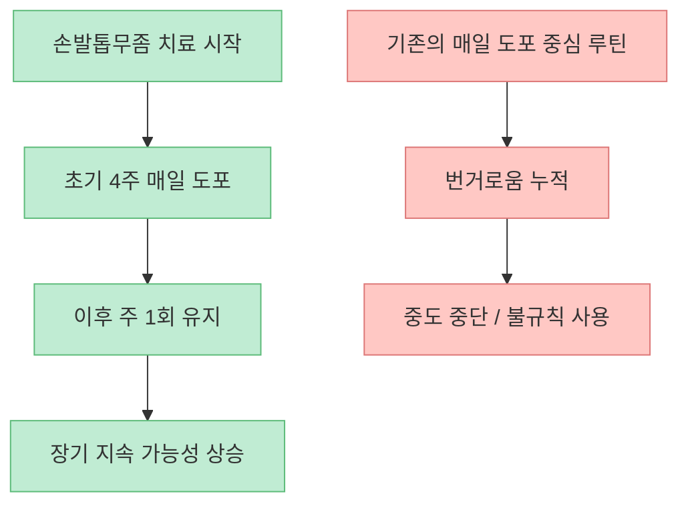
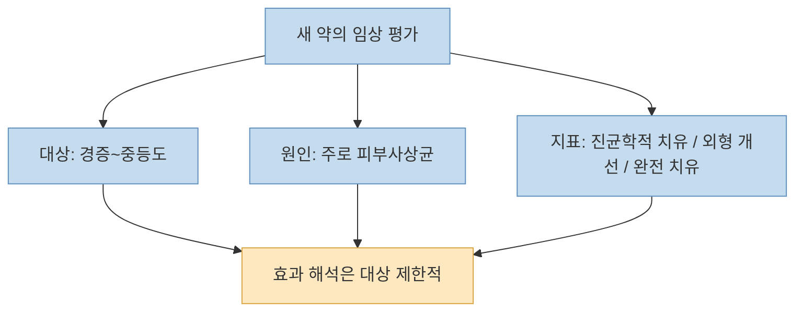
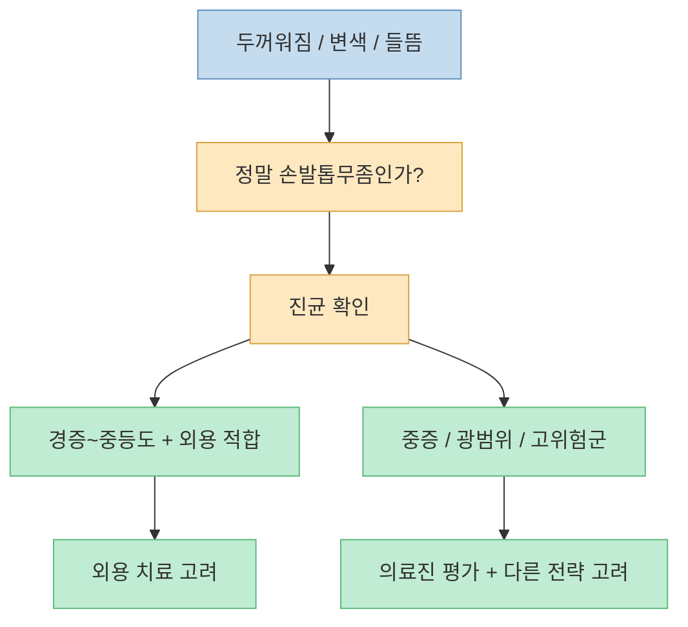

이 쇼츠의 핵심 메시지는 분명합니다. [기존 발톱무좀 바르는 약은 비싸거나 번거롭고](https://youtu.be/ehsKZMEgEyI?t=2), 새로 나온 테르비나핀 네일라카는 [처음 4주만 매일 바른 뒤 이후에는 주 1회로 유지할 수 있어서](https://youtu.be/ehsKZMEgEyI?t=20) 훨씬 편하다는 것입니다. 짧은 영상치고는 꽤 강한 포인트를 잘 짚습니다. 손발톱무좀은 치료 기간이 길고, 바르는 약은 꾸준히 쓰기가 어렵다는 문제가 늘 따라다니기 때문입니다.

다만 의료 정보는 "`신약이 나왔다`"는 말만으로 이해하면 곤란합니다. 실제로 중요한 것은 **무엇이 새 성분인지**, **정말 사용 편의성이 좋아졌는지**, **모든 발톱무좀 환자에게 똑같이 좋은지**, **언제는 병원 진료가 더 중요한지** 입니다. 그래서 이 글은 쇼츠의 주장과 함께 공식 출시 자료, 임상 연구, 진단 가이드를 붙여서 차분하게 정리해 보겠습니다.

<!--more-->

## Sources

- [YouTube Shorts - 지긋지긋한 발톱무좀, 9년만에 대박 신약이 나왔습니다.](https://youtube.com/shorts/ehsKZMEgEyI)
- [한미약품 공식 보도자료 - 무조날맥스외용액 출시](https://www.hanmi.co.kr/about/news-media/press/detail-2062.hm)
- [Mycoses - Terbinafine 10% nail lacquer 임상 논문](https://onlinelibrary.wiley.com/doi/full/10.1111/myc.13392)
- [AAFP - Onychomycosis: Rapid Evidence Review](https://www.aafp.org/afp/2021/1000/p359)
- [Merck Manual Professional - Onychomycosis](https://www.merckmanuals.com/professional/dermatologic-disorders/nail-disorders/onychomycosis)

## 1. 이 영상이 말하는 "새로움"의 핵심은 성분보다도 사용 방식에 있다

영상은 먼저 기존 치료의 불편을 짚습니다. [기존약은 매일 발라야 해서 번거로움이 컸다](https://youtu.be/ehsKZMEgEyI?t=8)는 것이고, 새 약은 [테르비나핀 성분을 담은 네일라카로, 4주 뒤에는 주 1회만 발라도 된다고](https://youtu.be/ehsKZMEgEyI?t=13) 설명합니다.

공식 자료를 보면 이 포인트는 대체로 맞습니다. 한미약품은 2025년 5월 27일 무조날맥스외용액 출시를 발표하면서, **테르비나핀염산염 성분의 외용 손·발톱진균증 치료제** 라고 소개했고, 사용법도 **초기 4주간 1일 1회, 이후 주 1회 유지** 라고 안내했습니다. 즉 영상의 가장 중요한 메시지인 "`초기 집중 후 유지 간격을 크게 줄였다`"는 부분은 공식 출시 정보와 맞아떨어집니다.

이게 왜 중요하냐면, 손발톱무좀 치료는 대개 짧게 끝나지 않기 때문입니다. 하루 한 번씩 몇 달 이상 꾸준히 바르는 치료는, 효과 자체보다 **지속성** 에서 무너지는 경우가 많습니다. 영상도 [매일 못 발라서 치료에 실패했던 사람에게 단비 같은 소식](https://youtu.be/ehsKZMEgEyI?t=30)이라고 말하는데, 이건 과장만은 아닙니다. 장기 치료에서 복약 순응도는 실제 성과를 크게 바꾸는 요소이기 때문입니다.

그래서 이 약의 진짜 차별점은 "`새 약`"이라는 말 자체보다, **긴 치료를 버티기 쉬운 도포 구조를 만든 것** 에 있다고 보는 편이 정확합니다.

## 2. 그렇다면 효과도 좋은가: 영상의 설명은 방향은 맞지만, 표현은 조금 정리해서 이해해야 한다

영상은 새 약이 [발톱 투과가 잘 되고](https://youtu.be/ehsKZMEgEyI?t=18), [매일 바른 기존 제품만큼 임상 효과가 좋게 나타났다](https://youtu.be/ehsKZMEgEyI?t=26)고 설명합니다. 이 부분은 완전히 틀렸다고 보긴 어렵지만, 그대로 받아 적기보다는 임상 근거의 맥락을 같이 봐야 합니다.

Mycoses에 실린 무작위배정 이중눈가림 임상 연구는 **terbinafine 10% nail lacquer** 를 첫 4주간 매일, 그 이후 44주 동안 주 1회 사용하는 방식으로 평가했습니다. 이 연구는 **경증에서 중등도 dermatophyte toenail onychomycosis** 에서 효과와 안전성을 확인하려는 설계였습니다. 즉 영상의 용법 설명은 임상 설계와 일치합니다.

다만 여기서 주의할 점이 있습니다. "`효과가 좋다`"는 말은 **어떤 환자군에서**, **무엇과 비교해**, **어떤 지표로** 봤는지에 따라 뜻이 달라집니다. 이 연구가 다루는 핵심은 대개 다음과 같습니다.

- 모든 손발톱무좀이 아니라 **주로 피부사상균성 발톱무좀**
- 중증 광범위 병변보다 **경증~중등도 환자군**
- 완전 치유, 진균학적 치유, 외형 개선처럼 **지표가 서로 다를 수 있음**

즉 이 약을 "`발톱무좀이면 누구에게나 잘 듣는 대박 신약`"으로 읽으면 과합니다. 더 정확한 표현은, **특정 환자군에서 장기 도포 편의성과 함께 의미 있는 대안이 될 수 있는 새로운 테르비나핀 외용 네일라카** 정도입니다.

영상에서 말한 [라미실에 쓰이던 테르비나핀 성분](https://youtu.be/ehsKZMEgEyI?t=13)이라는 설명은 방향상 맞습니다. 다만 "`라미실 성분을 10배 농도로 담았다`" 같은 식의 표현은 소비자에게 강한 인상을 주지만, 실제 해석은 제형과 전달 방식까지 포함해서 봐야 합니다. 같은 테르비나핀이라도 **먹는 약과 바르는 네일라카는 치료 전략도, 기대 효과도, 적용 대상도 다릅니다**.

## 3. 이 약이 특히 의미 있는 사람은 누구인가: "효과가 센 사람"보다 "매일 못 바르던 사람"에 가깝다

쇼츠에서 가장 설득력 있는 부분은 [매일 못 발라서 치료 실패했던 사람들에게 단비 같은 소식](https://youtu.be/ehsKZMEgEyI?t=30)이라는 대목입니다. 실제 현장감이 있는 포인트입니다. 손발톱무좀은 아프지 않다고 방치하기 쉽고, 발라도 금방 좋아지지 않아서 중간에 포기하기 쉬운 질환입니다.

그래서 새 약의 장점은 "`가장 강하다`"는 데 있다기보다, **순응도에서 탈락하던 사람을 붙잡을 여지** 가 있다는 데 있습니다.

- 매일 도포 루틴을 오래 유지하기 어려운 사람
- 약 바르는 번거로움 때문에 중간에 자꾸 빼먹는 사람
- 기존 외용제 사용 경험은 있으나 지속하지 못한 사람

반대로 아래 경우에는 "`편한 새 약`"만 보고 접근하면 부족할 수 있습니다.

- 발톱이 매우 두껍고 넓게 침범된 경우
- 통증, 변형, 반복 재발이 심한 경우
- 당뇨, 말초혈관질환, 면역저하처럼 평가가 더 중요한 경우
- 진균이 아닌 다른 손발톱질환 가능성이 있는 경우

AAFP와 Merck Manual은 공통적으로 **손발톱 변형의 절반가량은 진균이 아닌 원인일 수 있어, 치료 전 확인이 중요하다** 는 취지로 설명합니다. 즉 누렇게 보이고 두꺼워졌다고 해서 모두 무좀은 아닙니다. 따라서 치료가 길고 비용도 드는 만큼, 특히 오래 갔거나 애매한 경우에는 KOH 검사, 배양, 현미경 검사, PCR 같은 확인 과정이 의미가 있습니다.

이런 맥락에서 보면, 이 약은 "`최강 치료제 등장`"이라기보다 **외용 치료를 끝까지 지속하기 어려웠던 사람에게 더 현실적인 옵션 하나가 추가됐다** 는 쪽이 더 의료적으로 안전한 해석입니다.

## 4. 영상이 짚은 단점도 완전히 무시할 수는 없지만, 더 중요한 것은 균 종류와 환자 상태다

영상은 단점도 함께 말합니다. [기존약보다 내성률이 조금 높고](https://youtu.be/ehsKZMEgEyI?t=34), [효모균에는 잘 듣지 않는다](https://youtu.be/ehsKZMEgEyI?t=38)고 설명합니다. 이어서 [일반인에서 효모균이 원인인 경우는 10% 수준으로 낮다](https://youtu.be/ehsKZMEgEyI?t=49)고 덧붙입니다.

이 부분은 소비자 입장에서는 꽤 어려운 주제입니다. 핵심만 정리하면 이렇습니다.

- 손발톱무좀의 원인균은 하나가 아니다
- 피부사상균 중심인지, 효모균이나 비피부사상균 곰팡이인지에 따라 반응이 달라질 수 있다
- 그래서 "`무좀처럼 보여서 약부터 산다`"보다 **원인균과 병변 범위를 확인하는 접근** 이 더 중요해질 수 있다

영상의 수치 표현은 짧은 콘텐츠 특성상 단정적으로 들릴 수 있으므로, 블로그 글에서는 조심해서 받아들이는 편이 좋습니다. 이 글이 확인한 공식 자료들만으로는 "`내성률이 어느 정도 더 높다`"를 정량적으로 결론내리기 어렵습니다. 따라서 이 부분은 **영상의 주장으로 소개하되, 환자별 균종과 진단이 더 중요하다** 는 정도로 이해하는 것이 안전합니다.

또 한 가지 중요한 점은, 손발톱무좀은 약을 바르기 시작했다고 바로 외형이 좋아지는 질환이 아니라는 것입니다. 손발톱은 자라나는 속도 자체가 느리기 때문에, 치료 반응은 몇 주가 아니라 **몇 달 단위**로 보는 경우가 많습니다. 따라서 새 약이 편해졌다고 해서 "`금방 낫는다`"는 뜻은 아닙니다.

## 핵심 요약

- 이 쇼츠가 소개한 새 옵션의 핵심은 **테르비나핀 외용 네일라카** 와 **초기 4주 매일, 이후 주 1회 유지** 라는 사용 구조입니다.
- 공식 출시 자료와 임상 연구를 보면, 영상의 큰 줄기는 대체로 맞지만 **적용 대상과 해석 범위는 제한적** 입니다.
- 이 약의 강점은 "`무조건 더 센 약`"보다 **오래 지속해야 하는 외용 치료의 순응도를 높일 가능성** 에 있습니다.
- 모든 두꺼운 발톱이 무좀은 아니므로, 특히 오래가거나 심한 경우에는 **진균 확인과 진료 판단** 이 중요합니다.
- 효모균, 중증 병변, 당뇨나 면역질환 같은 맥락에서는 "`편한 외용제`"만으로 판단하지 않는 것이 안전합니다.

## 실전 적용 포인트

- 발톱이 두꺼워지고 누래졌다고 바로 "`새 약 사야지`"로 가지 말고, **정말 무좀인지** 먼저 생각하세요.
- 예전에 바르는 약을 샀다가 **매일 바르는 루틴을 지키지 못했던 사람** 이라면, 이번 제형 변화는 분명 의미가 있을 수 있습니다.
- 반대로 병변이 심하거나 오래됐거나, 당뇨·면역질환이 있거나, 통증과 변형이 크다면 **약국 선택만으로 끝내지 말고 진료 우선** 으로 보는 편이 좋습니다.
- 쇼츠의 짧은 표현은 방향을 잡는 데는 좋지만, 실제 치료는 **원인균, 범위, 지속 기간** 을 함께 봐야 합니다.

## 결론

이 영상은 "`9년 만의 대박 신약`"이라는 문장으로 시선을 끌지만, 정말 중요한 변화는 더 현실적인 곳에 있습니다. **손발톱무좀처럼 길고 지치는 치료에서, 매일 바르던 부담을 줄인 유지 구조가 생겼다** 는 점입니다.

그래서 이 소식을 가장 잘 활용하는 방법은 "`새 약이니까 무조건 최고`"라고 받아들이는 것이 아니라, **내가 왜 기존 치료를 끝까지 못 갔는지** 를 먼저 보는 것입니다. 만약 병목이 효과 부족보다 번거로움이었다면, 이번 테르비나핀 네일라카는 꽤 의미 있는 선택지가 될 수 있습니다. 다만 의료적으로는 언제나 그렇듯, **진단이 먼저이고 약은 그다음** 입니다.
