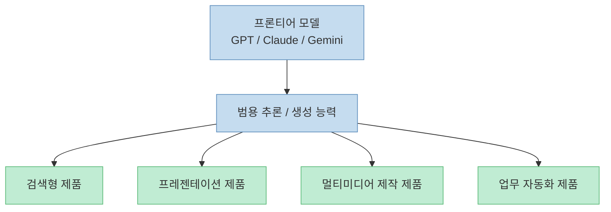
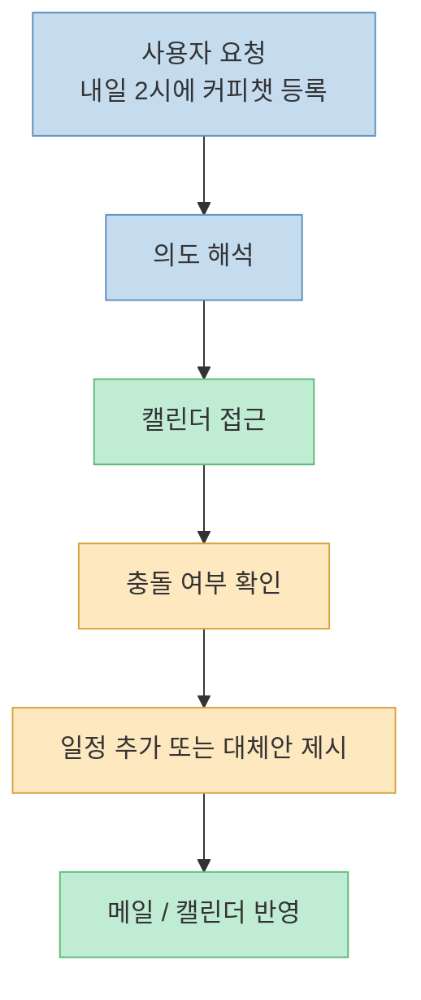
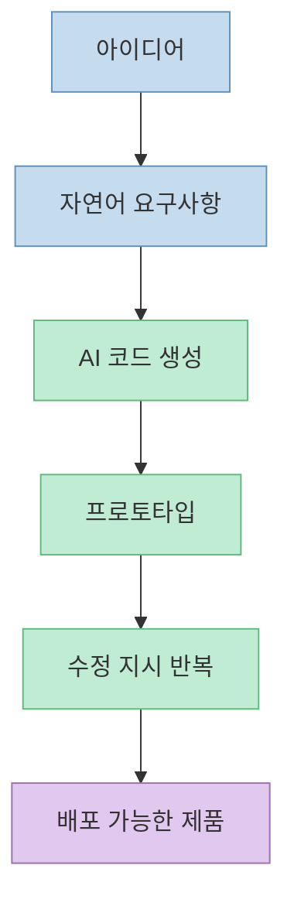
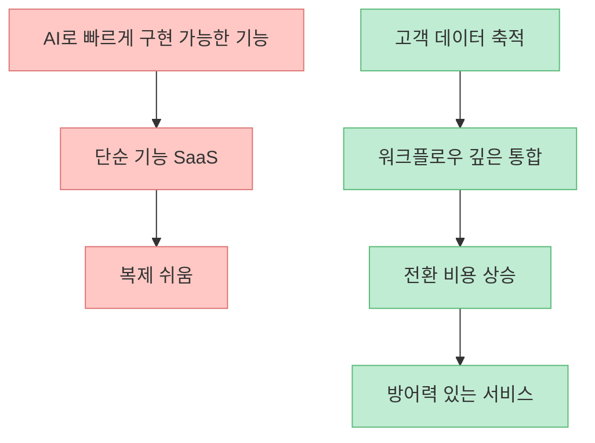

이 영상은 제목만 보면 "`바이브 코딩으로 만든 앱이 6개월 만에 50억 매출을 냈다`"는 자극적인 성공 사례를 다루는 것처럼 보이지만, 실제 본문은 그보다 넓습니다. 인터뷰는 먼저 [퍼플렉시티, 그록, 감마, 멀티미디어 통합 툴](https://youtu.be/5GqQsqtG_2k?t=62)처럼 **용도별로 특화된 AI 툴 지형** 을 짚고, 이어서 [에이전트가 캘린더에 직접 일정을 넣는 시연](https://youtu.be/5GqQsqtG_2k?t=199), 그리고 [코드를 거의 읽지 않고도 자연어로 제품을 만드는 바이브 코딩](https://youtu.be/5GqQsqtG_2k?t=611)으로 넘어갑니다.

이 흐름이 중요한 이유는, 지금의 AI 활용이 더 이상 "`질문하고 답받는 챗봇`" 단계에만 머물지 않기 때문입니다. 영상 속 주장은 간단히 말하면 이렇습니다. **기본 모델은 점점 범용화되고, 특화 도구는 여전히 강점을 가지며, 에이전트는 실제 작업을 대신 수행하고, 바이브 코딩은 아이디어를 제품으로 바꾸는 비용을 급격히 낮춘다** 는 것입니다.

다만 영상 속 몇몇 사업 수치와 성공 사례는 인터뷰 화법상 압축돼 있습니다. 그래서 이 글은 과장된 캐치프레이즈를 그대로 반복하기보다, **영상에서 확인 가능한 내용과 외부 공개 근거가 있는 사례를 분리해서** 정리하겠습니다.

<!--more-->

## Sources

- [YouTube - 바이브 코딩으로 만든 앱, 6개월 만에 50억 매출 찍었다 | AI툴, 이거 뭐 돼? EP14](https://youtu.be/5GqQsqtG_2k)
- [Pieter Levels - fly.pieter.com reached $1M ARR in 17 days](https://levels.io/fly-pieter-com-vibecoded-flight-simulator)
- [Calcalist Tech - Base44 acquired by Wix for $80 million](https://www.calcalistech.com/ctechnews/article/s1iflnlelx)

## 1. 지금 AI 툴 지형의 핵심은 "모든 걸 잘하는 모델"과 "특정 업무에 강한 제품"의 공존이다

인터뷰 초반부에서 조코딩은 [GPT, Claude, Gemini 같은 프론티어 모델이 여러 영역을 계속 침범하고 있지만](https://youtu.be/5GqQsqtG_2k?t=43), 여전히 [검색에는 퍼플렉시티, 실시간 반응에는 그록, 프레젠테이션에는 감마처럼 특화된 툴이 더 나은 결과를 주는 구간이 있다](https://youtu.be/5GqQsqtG_2k?t=62)고 설명합니다.

이건 현재 AI 제품 시장을 꽤 정확하게 요약한 말입니다. 기본 모델이 강해질수록 "`모든 것이 결국 챗봇으로 수렴한다`"는 인상이 생기지만, 실제 사용자 경험은 아직 그렇게 단순하지 않습니다. 사람들은 여전히 다음 두 층을 번갈아 씁니다.

- **범용 모델 층**: 질문, 글쓰기, 요약, 코딩, 브레인스토밍
- **워크플로우 제품 층**: 검색 UX, 발표자료 제작 UX, 이미지·영상 생성 관리 UX, 업무 자동화 UX

즉 모델 성능이 좋아지는 것과, 사용자가 실제로 편한 제품이 되는 것은 같은 문제가 아닙니다. 범용 모델은 점점 많은 일을 "할 수 있게" 만들지만, 특화 서비스는 그 일을 **바로 쓰기 좋은 작업 흐름** 으로 감쌉니다.

그래서 앞으로의 경쟁은 "`누가 모델을 더 잘 만드나`"만이 아니라, **누가 사용자의 반복 업무를 더 잘 감싸는가** 로 이동합니다. 영상이 퍼플렉시티, 그록, 감마를 예시로 드는 이유도 여기에 있습니다. 기술 우위보다 **과업 단위 최적화** 가 계속 의미 있다는 뜻입니다.

## 2. 에이전트형 AI의 차이는 답변 품질이 아니라 "도구를 붙잡고 끝까지 실행하느냐"에 있다

영상에서 가장 인상적인 장면은 에이전트 시연입니다. 조코딩은 [내일 오후 2시에 커피챗 일정을 잡아 달라고 요청하면](https://youtu.be/5GqQsqtG_2k?t=206), AI가 캘린더에 접속해 일정을 추가하는 식으로 **계획 수립 + 도구 실행** 을 한다고 설명합니다. 이후에는 [이메일을 읽고, 기존 일정과 충돌하는지 확인하고, 대체 시간을 제안하는 답장을 보내는 흐름](https://youtu.be/5GqQsqtG_2k?t=322)도 보여 줍니다.

이 장면의 핵심은 "`말을 잘한다`"가 아닙니다. 중요한 것은 다음 단계입니다.

1. 명령 해석
2. 필요한 외부 도구 식별
3. 캘린더/메일 같은 시스템 접근
4. 충돌 여부 판단
5. 결과를 실제로 반영

즉 에이전트는 텍스트 생성기가 아니라, **작업 그래프를 따라 움직이는 실행기** 에 가까워집니다.

이 차이는 업무 생산성에서 매우 큽니다. 기존 챗봇은 "`어떻게 할지 알려주는 도구`"에 가깝다면, 에이전트는 "`직접 처리하는 도구`"에 가깝습니다. 영상에서 [원하는 페르소나와 가이드를 주면 거의 직원처럼 활용할 수 있다](https://youtu.be/5GqQsqtG_2k?t=460)는 표현이 나오는 이유도 이 때문입니다.

물론 여기에는 전제가 있습니다. 로그인 연결, 권한 위임, 작업 실패 처리, 검토 기준이 필요합니다. 따라서 실제 현업에서 중요한 질문은 "`AI가 할 수 있나?`"가 아니라, **어떤 권한까지 주고 어디서 인간 검토를 끼울 것인가** 입니다.

## 3. 바이브 코딩은 "코드를 안 봐도 된다"는 말보다 "제품화 진입비용이 급락했다"는 뜻에 가깝다

조코딩은 바이브 코딩을 [자연어로 "`이런 느낌의 프로그램 만들어줘`"라고 말하면 AI가 코드를 쫙 짜 주는 방식](https://youtu.be/5GqQsqtG_2k?t=617)으로 설명합니다. 그리고 이 용어가 [안드레이 카파시의 트윗 맥락에서 퍼졌다](https://youtu.be/5GqQsqtG_2k?t=631)고 짚습니다.

이 설명에서 많은 사람이 "`이제 코드를 전혀 몰라도 된다`"는 부분만 받아들이는데, 더 본질적인 변화는 다른 데 있습니다. 바이브 코딩이 만드는 변화는 **아이디어 → 프로토타입 → 배포 가능한 제품** 으로 가는 거리가 극단적으로 짧아졌다는 점입니다.

이전에는 무언가를 만들려면 보통 아래 단계를 오래 거쳐야 했습니다.

- 문제 정의
- 화면 설계
- 기술 스택 선택
- 기본 코드 작성
- 디버깅
- 배포

이제는 그중 큰 부분을 AI가 한 번에 당겨 옵니다. 그래서 사용자 입장에서는 "`내가 개발자냐 아니냐`"보다, **내가 무엇을 만들고 싶은지 설명할 수 있느냐** 가 더 중요해집니다.

하지만 여기서 흔히 빠지는 오해도 있습니다. 코드를 덜 본다고 해서 품질 문제가 사라지는 것은 아닙니다. 오히려 바이브 코딩이 널리 퍼질수록, 차별점은 코드 작성 자체보다 **문제 정의, 테스트, UX 완성도, 배포 이후 운영** 에서 갈리기 쉽습니다.

즉 바이브 코딩은 개발을 없애는 기술이 아니라, **개발의 병목을 하위 구현에서 상위 판단으로 올리는 기술** 이라고 보는 편이 더 정확합니다.

## 4. "1인 개발자의 폭발적 수익" 사례는 가능성을 보여주지만, 모든 사람이 그대로 재현할 수 있다는 뜻은 아니다

영상은 바이브 코딩의 대표 사례로 몇 가지를 제시합니다. [Pieter Levels가 혼자 만든 서비스들로 연 30억가량을 번다](https://youtu.be/5GqQsqtG_2k?t=699)거나, [3시간 만에 만든 비행기 시뮬레이터가 17일 만에 약 1.35억 원 수익을 냈다](https://youtu.be/5GqQsqtG_2k?t=717)거나, [Base44가 거의 1인 수준으로 만들어져 약 1100억 원 규모로 인수됐다](https://youtu.be/5GqQsqtG_2k?t=729)거나, [한국에서는 공무원 출신 창업자가 사주 AI 서비스로 6개월 만에 50억 매출을 냈다](https://youtu.be/5GqQsqtG_2k?t=755)는 식입니다.

이 가운데 일부는 공개 자료로 일정 부분 확인됩니다.

- Pieter Levels는 본인 사이트에서 **fly.pieter.com이 17일 만에 100만 달러 ARR에 도달했다** 고 공개했습니다.
- Base44의 경우 외부 보도에서 **Wix가 약 8천만 달러에 인수했다** 는 보도가 확인됩니다.

반면 한국의 사주 AI 50억 매출 사례는 이번 글 작성 시점에 **영상 외부의 신뢰할 만한 공개 근거를 바로 확인하지 못했습니다**. 따라서 이 사례는 "`인터뷰에서 소개된 사례`"로만 다루는 것이 안전합니다.

이 차이는 중요합니다. 왜냐하면 성공 사례를 읽을 때는 **가능성의 신호** 와 **재현 가능한 규칙** 을 분리해야 하기 때문입니다. 성공 사례가 말해 주는 것은 "`나도 당장 50억을 벌 수 있다`"가 아니라, **제품을 만드는 비용이 급감했기 때문에 이전보다 훨씬 작은 팀도 시장에 진입할 수 있다** 는 변화입니다.

## 5. AI 시대의 SaaS는 왜 어떤 것은 쉽게 복제되고, 어떤 것은 잘 무너지지 않을까

영상 후반부에서 조코딩은 중요한 선을 긋습니다. AI가 강해질수록 [기능적으로 복제하기 쉬운 서비스는 대체될 수 있지만](https://youtu.be/5GqQsqtG_2k?t=920), [고객 데이터, 노하우, UX 최적화, 락인이 강한 서비스는 쉽게 대체되지 않을 수 있다](https://youtu.be/5GqQsqtG_2k?t=907)고 말합니다.

이 부분은 AI 사업을 바라볼 때 가장 실무적인 통찰에 가깝습니다. 지금은 "`AI로 만들 수 있느냐`"보다 "`남들도 빠르게 비슷하게 만들 수 있느냐`"가 더 중요해졌습니다.

복제되기 쉬운 서비스의 특징은 대체로 이렇습니다.

- 핵심 가치가 단일 기능에 몰려 있다
- 데이터 축적 효과가 약하다
- 사용자 전환 비용이 낮다
- 결과물 품질 차이가 크지 않다

반대로 방어력이 있는 서비스는 보통 아래 요소를 갖습니다.

- 고객별 데이터가 계속 쌓인다
- 워크플로우 전체에 깊게 들어간다
- 팀 협업과 승인 구조에 묶여 있다
- 브랜드 신뢰나 운영 노하우가 붙어 있다

그래서 AI 시대의 창업 질문도 바뀝니다. "`무엇을 만들까?`" 다음에는 바로 "`이게 얼마나 빨리 복제될까?`"가 따라와야 합니다. 영상이 말하는 "`대체되는 기업도 있고 아닌 기업도 있다`"는 문장은 바로 이 구조를 가리킵니다.

## 6. 일자리는 없어지는가, 재편되는가: 영상의 답은 "둘 다"에 가깝다

마지막으로 인터뷰는 AI가 일자리를 없앨지, 새로운 일을 만들지를 묻습니다. 조코딩의 답은 [과도기에는 분명히 힘든 사람들이 생길 것이고](https://youtu.be/5GqQsqtG_2k?t=861), 특히 [AI가 이미 너무 잘하는 일만 전문적으로 하던 사람은 취약할 수 있다](https://youtu.be/5GqQsqtG_2k?t=829)는 쪽에 가깝습니다. 동시에 장기적으로는 [과거에 유튜버라는 직업을 상상하지 못했던 것처럼 새로운 일도 생길 것](https://youtu.be/5GqQsqtG_2k?t=850)이라고 봅니다.

이 관점은 중간 지대에 있습니다. 완전한 낙관도 완전한 비관도 아닙니다. 핵심은 "`없어지느냐 아니냐`"보다, **어떤 업무 단위가 먼저 자동화되고 어떤 역할이 새로 생기느냐** 입니다.

예를 들면 아래처럼 나뉩니다.

- 반복 입력, 정리, 검색, 초안 작성은 자동화 압력이 강해짐
- 기획, 판단, 검수, 조율, 책임은 여전히 인간 쪽 비중이 큼
- 다만 인간의 역할도 "`직접 수행`"보다 "`AI를 감독하고 조정`"하는 쪽으로 이동 가능

결국 중요한 경쟁력은 "`AI를 쓸 줄 아느냐`" 하나가 아니라, **AI가 잘하는 부분과 내가 책임져야 할 부분을 분리할 줄 아느냐** 입니다.

## 핵심 요약

- 이 영상은 AI 툴 시장을 **범용 모델 + 특화 제품 + 에이전트 + 바이브 코딩**의 흐름으로 정리합니다.
- 에이전트형 AI의 본질은 답변 품질보다 **외부 도구를 연결해 실제 작업을 수행하는 능력** 에 있습니다.
- 바이브 코딩은 코드를 없애는 기술이라기보다, **제품화 진입비용을 낮추고 병목을 상위 판단으로 올리는 기술** 에 가깝습니다.
- 1인 개발자의 고수익 사례는 분명 존재하지만, 모두가 같은 규모를 바로 재현할 수 있다는 뜻은 아닙니다.
- AI 시대의 SaaS 경쟁력은 기능 자체보다 **데이터, 워크플로우 통합, 전환 비용, 운영 노하우** 에서 갈립니다.
- 일자리는 단순히 사라지기만 하는 것이 아니라, **과도기적 충격과 역할 재편** 이 동시에 진행될 가능성이 큽니다.

## 실전 적용 포인트

- AI 툴을 고를 때 "`가장 똑똑한 모델`"만 보지 말고, **내 업무 흐름에 바로 맞는 제품인지** 먼저 보세요.
- 에이전트를 쓸 때는 "`무엇을 시킬까`"보다 **어디까지 권한을 줄지, 어디서 검토할지** 를 먼저 정해야 합니다.
- 바이브 코딩을 시작할 때는 "`앱 하나 만들어 줘`"보다 **문제 정의, 사용자, 핵심 기능, 검수 기준** 을 먼저 적는 편이 훨씬 낫습니다.
- AI 창업 아이디어를 볼 때는 "`이걸 만들 수 있나`" 다음에 바로 **"`다른 사람도 2주 안에 비슷하게 만들 수 있나`"** 를 물어야 합니다.
- 자신의 역할을 지키고 싶다면, 반복 실행만 파는 사람이 아니라 **기획·판단·운영·검수 능력으로 묶이는 사람** 이 되는 쪽이 유리합니다.

## 결론

이 영상이 정말 말하고 있는 것은 "`AI로 돈 버는 사람이 나왔다`"는 단순한 화제가 아닙니다. 더 큰 변화는, **아이디어를 제품으로 바꾸는 비용이 내려가고, 실행 자체를 맡기는 에이전트가 등장하면서, 개인과 작은 팀의 생산성 한계가 다시 정의되고 있다** 는 점입니다.

그래서 앞으로 중요한 것은 AI를 쓰느냐 마느냐가 아니라, **어떤 업무를 도구화하고, 어떤 판단을 인간이 붙잡고, 어떤 사업은 복제되기 전에 방어력을 만들 수 있느냐** 입니다. 바이브 코딩은 그 변화의 상징일 뿐이고, 진짜 경쟁은 그 다음 단계인 **문제 선택과 운영 설계** 에서 벌어집니다.
