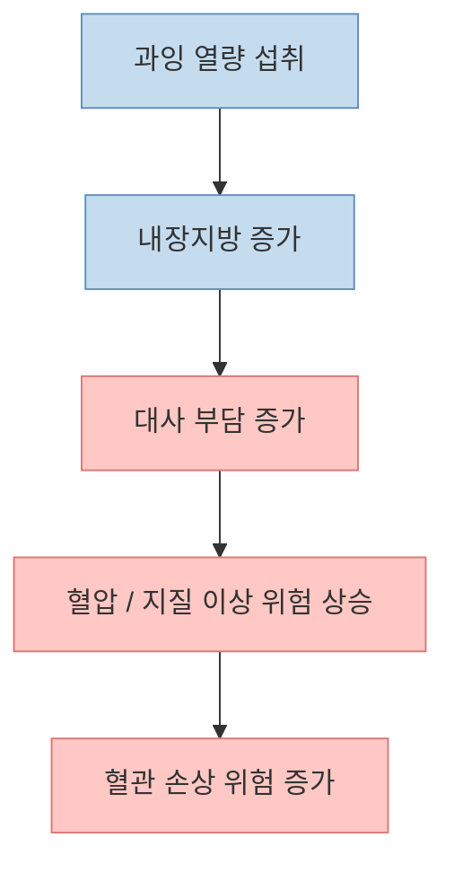
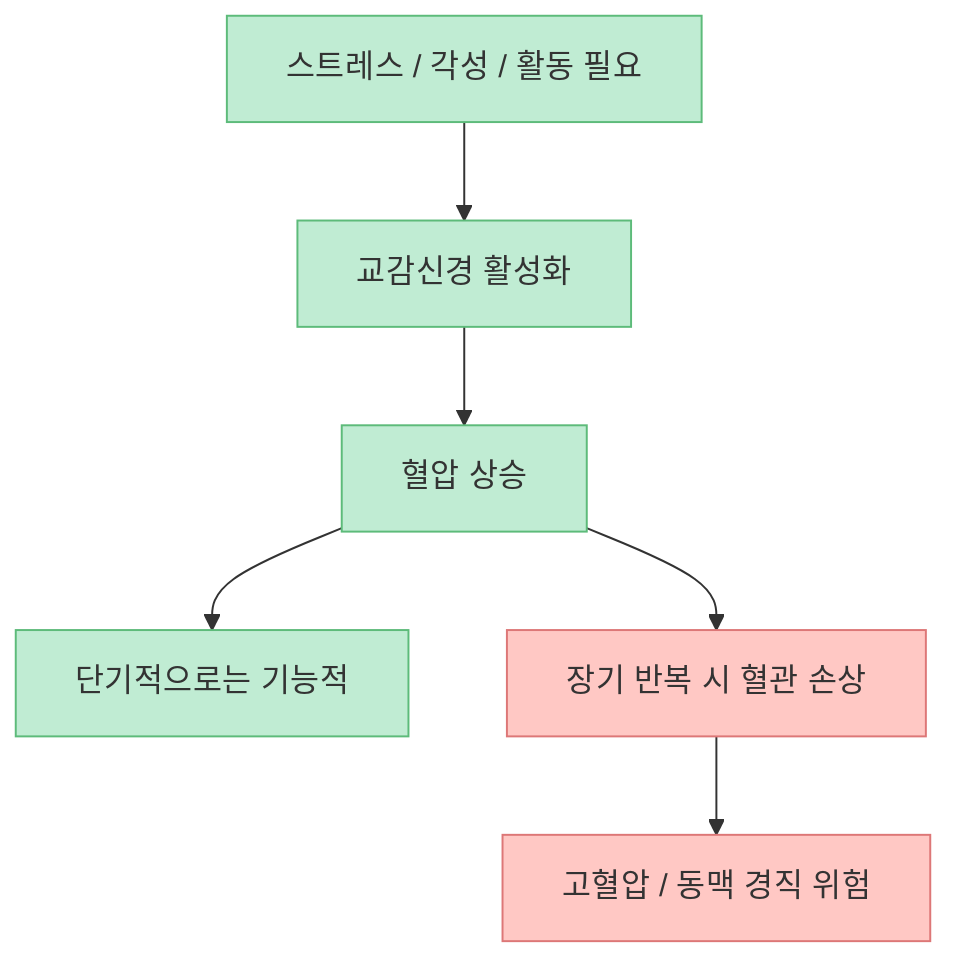
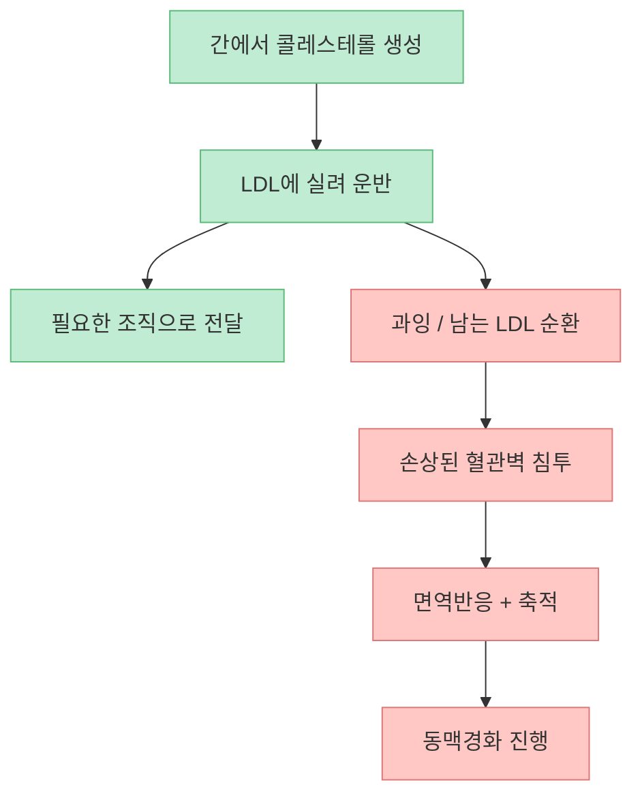

이 영상이 던지는 가장 중요한 메시지는 제목 그대로입니다. 혈관 건강은 "`채식하면 끝`", "`운동만 열심히 하면 해결`"처럼 한 줄짜리 상식으로 정리되지 않습니다. 인터뷰는 [뱃살과 내장지방](https://youtu.be/8xPsV7l-XT4?t=156), [고혈압이 생기는 기능적 배경](https://youtu.be/8xPsV7l-XT4?t=273), [저혈압에 대한 오해](https://youtu.be/8xPsV7l-XT4?t=441), [LDL과 동맥경화의 관계](https://youtu.be/8xPsV7l-XT4?t=642), 그리고 [사우나·목욕 습관의 위험](https://youtu.be/8xPsV7l-XT4?t=0)까지 한 번에 묶어 설명합니다.

좋은 점은, 혈관 질환을 단순히 "`기름진 음식의 벌`"처럼 말하지 않는다는 것입니다. 영상 속 설명을 따라가 보면 혈관 문제는 대체로 **과잉 열량, 내장지방, 반복되는 혈압 상승, 손상된 혈관벽, 그리고 LDL 운반 구조** 가 겹치면서 만들어집니다. 즉 음식 한 종류의 선악이 아니라, **몸이 장기간 어떤 상태에 놓여 있느냐** 가 더 중요합니다.

이 글은 영상의 흐름을 따라가면서 혈관 건강을 둘러싼 흔한 오해를 몇 가지 축으로 정리해 보겠습니다.

<!--more-->

## Sources

- [YouTube - "채식, 운동 전혀 아닙니다" 서울대 명의가 말하는 혈관의 모든 것 l 은밀한 건강수첩 ep.3](https://youtu.be/8xPsV7l-XT4)
- [American Heart Association - Blood Pressure Categories](https://www.heart.org/-/media/files/health-topics/high-blood-pressure/hbp-rainbow-chart-english.pdf)
- [CDC - About High Blood Pressure](https://www.cdc.gov/high-blood-pressure/about/index.html)
- [AAFP - Orthostatic Hypotension: A Practical Approach](https://www.aafp.org/afp/2022/0100/p39)
- [American Heart Association - What Your Cholesterol Levels Mean](https://www.heart.org/en/health-topics/cholesterol/about-cholesterol/what-your-cholesterol-levels-mean)
- [PMC - Relationship between Bath-related Deaths and Low Air Temperature](https://pmc.ncbi.nlm.nih.gov/articles/PMC5742388/)
- [PMC - Characteristics of sauna deaths in Korea in relation to different blood alcohol concentrations](https://pmc.ncbi.nlm.nih.gov/articles/PMC6097023/)

## 1. 혈관 건강의 출발점은 "무엇을 먹었나"보다 "과잉 열량이 어디로 쌓였나"에 더 가깝다

영상에서 교수는 [40대 이후부터 내장지방이 과잉 열량의 저장 창고가 되기 쉽다](https://youtu.be/8xPsV7l-XT4?t=156)고 설명합니다. 이어서 [현대 사회에서는 몸이 필요한 것보다 많은 열량을 먹기 때문에 저장할 수밖에 없고](https://youtu.be/8xPsV7l-XT4?t=194), 그 결과 뱃살과 내장지방이 늘어난다고 말합니다.

이 설명의 핵심은 혈관 건강을 음식의 도덕성으로 보지 않는다는 데 있습니다. 즉 "`고기는 나쁘고 채소는 좋다`"처럼 단순하게 나누기보다, **총 에너지 과잉이 장기적으로 어떤 대사 환경을 만드는가** 를 먼저 보자는 것입니다.

그래서 혈관 건강을 위해 채식을 하든, 고기를 줄이든, 운동을 하든 핵심 질문은 결국 같습니다. **지금 내 몸이 에너지 과잉 상태에 오래 놓여 있는가?** 이 질문을 빼고 식단 종류만 바꾸면 큰 그림을 놓치기 쉽습니다.

## 2. 고혈압은 단지 숫자가 높은 병이 아니라, "필요해서 올리던 시스템이 과도하게 반복된 결과"로 볼 수 있다

영상에서 가장 이해하기 쉬운 부분 중 하나는 고혈압 설명입니다. 교수는 [혈압이 오르는 것 자체는 원래 몸이 일을 하기 위해 필요한 기능적 반응](https://youtu.be/8xPsV7l-XT4?t=273)이라고 말합니다. 뇌에 혈액을 더 보내야 하거나, 운동을 해야 하거나, 스트레스 상황에서 각성해야 할 때 심장과 혈관은 혈압을 올립니다.

문제는 [이 상태가 매일같이 반복되면 혈관이 결국 망가지고 딱딱해지는 방향으로 간다](https://youtu.be/8xPsV7l-XT4?t=327)는 점입니다. 즉 혈압 상승은 본래 생존에 유리한 반응이지만, 현대 사회에서는 그것이 **장기화되고 만성화되기 쉬운 환경** 이 됐다는 뜻입니다.

이 설명은 공식 가이드와도 크게 어긋나지 않습니다. 미국심장협회와 CDC는 고혈압을 일반적으로 **지속적으로 130/80 mm Hg 이상** 인 상태로 설명합니다. 영상에서 [미국은 130/80, 한국은 140/90 기준을 쓴다](https://youtu.be/8xPsV7l-XT4?t=414)는 언급이 나오는데, 미국 쪽 최신 기준과 맞닿아 있는 설명입니다. 다만 실제 진단과 치료 시작 기준은 국가 가이드, 동반질환, 반복 측정 여부에 따라 달라질 수 있습니다.

## 3. "저혈압 체질"이라는 말은 자주 쓰이지만, 의학적으로는 다른 이야기가 섞여 있다

영상은 흔한 오해 하나를 강하게 짚습니다. 교수는 [평상시 혈압이 낮은 편인 사람을 의학적으로 모두 '저혈압'이라고 부르지 않는다](https://youtu.be/8xPsV7l-XT4?t=467)고 설명합니다. 그리고 실제 문제로 다루는 저혈압은 [쇼크처럼 급격히 떨어지는 경우](https://youtu.be/8xPsV7l-XT4?t=477)나 [일어설 때 혈압을 제대로 못 올리는 기립성 저혈압](https://youtu.be/8xPsV7l-XT4?t=492) 같은 상황이라고 말합니다.

이 부분은 1차 진료 가이드와도 잘 맞습니다. AAFP는 기립성 저혈압을 **누웠다가 일어선 뒤 3분 이내에 수축기 혈압이 20 mmHg 이상 또는 이완기 혈압이 10 mmHg 이상 떨어지는 상태** 로 설명합니다. 즉 "`평소에 100/60이라 저혈압 체질이야`"라는 일상 표현과, **실제로 증상과 위험을 동반하는 저혈압 상태** 는 구분해서 봐야 합니다.

이 말은 곧 "`혈압이 낮으면 무조건 안 좋다`"는 상식도 수정해야 한다는 뜻입니다. 증상이 없고 일상 기능이 괜찮다면, 단순히 수치가 낮은 편이라는 이유만으로 병처럼 다루지 않는 경우가 많습니다.

## 4. LDL은 원래 필요한 운반 체계지만, 혈관 손상과 겹치면 동맥경화의 재료가 된다

영상의 후반부 설명은 LDL을 아주 직관적으로 풀어 줍니다. 교수는 [콜레스테롤은 세포막, 성호르몬, 스테로이드 호르몬 생성에 필요한 필수 물질](https://youtu.be/8xPsV7l-XT4?t=553)이라고 설명합니다. 즉 콜레스테롤 자체가 원래부터 "`나쁜 물질`"인 것은 아닙니다.

문제는 콜레스테롤이 물에 잘 섞이지 않기 때문에 [간에서 만든 콜레스테롤을 LDL 같은 운반 상자에 담아 보내는데](https://youtu.be/8xPsV7l-XT4?t=642), 너무 많아지면 [남는 입자들이 떠돌다가 손상된 혈관벽 안으로 들어간다](https://youtu.be/8xPsV7l-XT4?t=685)는 점입니다. 그 후 [면역세포가 이를 처리하려다 만성적으로 쌓이고 결국 동맥경화로 이어진다](https://youtu.be/8xPsV7l-XT4?t=718)는 흐름을 제시합니다.

미국심장협회도 LDL을 흔히 "`나쁜 콜레스테롤`"이라고 부르는 이유를, **동맥 안에 쌓여 혈관을 좁히고 심근경색·뇌졸중 위험을 높일 수 있기 때문** 이라고 설명합니다. 즉 영상의 비유는 단순화돼 있지만, "`콜레스테롤은 원래 필요한데 과잉 LDL이 혈관 손상과 만나면 문제가 된다`"는 큰 구조는 이해에 도움이 됩니다.

## 5. 혈관 건강은 음식의 선악보다 "혈관을 반복적으로 상처내는 조건"을 줄이는 쪽으로 봐야 한다

영상은 [채식만 하거나 고기를 무조건 끊는다고 해결되는 문제는 아니다](https://youtu.be/8xPsV7l-XT4?t=27)라는 방향을 암시합니다. 식품 하나를 악당으로 만드는 방식보다 더 중요한 것은, 혈관을 반복적으로 상하게 만드는 조건을 줄이는 것입니다.

대표적으로는 다음이 겹칩니다.

- 내장지방 증가
- 반복적인 혈압 상승
- 흡연
- LDL이 높은 상태가 오래 지속됨
- 활동량 저하와 수면·스트레스 문제

따라서 혈관 건강을 지키는 전략도 "`무조건 채식`" 또는 "`운동 하나로 해결`"이 아니라, **체중·허리둘레·혈압·지질검사·흡연 여부 같은 지표를 함께 보는 다층 관리** 에 가깝습니다.

## 6. 사우나는 무조건 건강법이 아니라, 특히 고위험군에서는 위험한 환경이 될 수 있다

영상의 도입부는 꽤 강합니다. [사우나와 냉탕을 반복하는 습관이 건강하다고 믿지만, 실제로는 매우 위험할 수 있다](https://youtu.be/8xPsV7l-XT4?t=0)고 말하고, [목욕탕 안 사망이 적지 않다](https://youtu.be/8xPsV7l-XT4?t=9)는 취지로 경고합니다.

이 부분은 "사우나는 무조건 나쁘다"로 읽기보다, **목욕 환경 관련 급성 위험은 분명 존재한다** 로 이해하는 편이 안전합니다. 일본과 한국 자료에서는 고령층을 중심으로 겨울철 목욕 관련 급사, 열 환경 노출, 음주, 심혈관 질환이 연관되는 보고가 있습니다. 특히 한국 부검 연구와 일본 목욕 관련 사망 연구는 **고령, 기저질환, 뜨거운 물, 계절 요인** 이 겹칠 때 위험이 커질 수 있음을 보여 줍니다.

즉 사우나를 일률적으로 건강법/위험행위로 단정하기보다, 아래처럼 보는 편이 현실적입니다.

- 젊고 건강한 사람의 짧은 이용과
- 고령자, 음주 상태, 혈압 변동이 큰 사람의 과격한 이용은
- 같은 행동처럼 보여도 위험도가 다릅니다.

## 핵심 요약

- 혈관 건강은 단순히 채식 여부보다 **과잉 열량, 내장지방, 혈압, LDL, 흡연 같은 누적 조건** 에 더 크게 좌우됩니다.
- 고혈압은 원래 기능적인 혈압 상승 시스템이 **만성적으로 반복되면서 혈관을 손상시키는 상태** 로 이해할 수 있습니다.
- 평소 혈압이 낮은 편이라는 것과, 의학적으로 문제가 되는 **기립성 저혈압·쇼크성 저혈압** 은 구분해야 합니다.
- 콜레스테롤은 원래 필수 물질이지만, 과잉 LDL이 손상된 혈관벽과 만나면 **동맥경화** 의 재료가 됩니다.
- 사우나·냉탕 습관도 무조건 건강법으로 볼 수 없고, 특히 **고위험군에서는 급성 위험** 을 고려해야 합니다.

## 실전 적용 포인트

- 혈관 건강을 위해 식단을 바꿀 때는 "`무슨 음식이 죄인가`"보다 **총 과잉 열량과 허리둘레가 줄고 있는지** 부터 보세요.
- 집에서 혈압을 재는데 낮게 나온다고 무조건 걱정하기보다, **어지럼·실신·기립 시 증상** 이 있는지 먼저 확인하는 편이 더 중요합니다.
- LDL 수치가 높거나 가족력이 있거나 흡연을 한다면, "`나는 채식하니까 괜찮다`"는 식의 안심은 위험할 수 있습니다.
- 목욕·사우나 후 어지럼, 두근거림, 흉통이 있거나 고령·기저질환이 있다면, 뜨거운 탕과 급격한 온도 변화는 특히 조심해야 합니다.
- 실제 위험 평가는 혈압, 공복혈당, 지질검사, 체중·허리둘레, 흡연 여부를 **함께** 보는 것이 좋습니다.

## 결론

이 영상이 잘 짚는 것은 혈관 건강이 한 가지 습관으로 결정되지 않는다는 사실입니다. **뱃살은 단순한 외모 문제가 아니라 대사와 혈압에 연결되고, 혈압은 단순한 숫자가 아니라 반복된 생리 반응의 누적이며, LDL은 원래 필요한 물질이지만 혈관 손상과 만나면 위험해진다** 는 식으로, 서로 다른 요소가 연결되어 있습니다.

그래서 혈관 건강의 핵심은 "`채식할까 말까`" 같은 단일 선택보다, **내장지방을 줄이고, 혈압을 오래 높게 두지 않고, LDL과 흡연 같은 혈관 손상 요인을 장기적으로 관리하는 것** 에 더 가깝습니다. 결국 혈관은 하루의 의지가 아니라, 오래 반복된 생활 패턴의 결과를 보여주는 장기라고 보는 편이 맞습니다.
