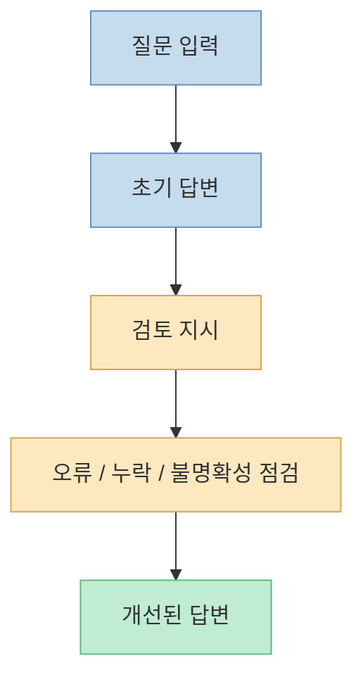
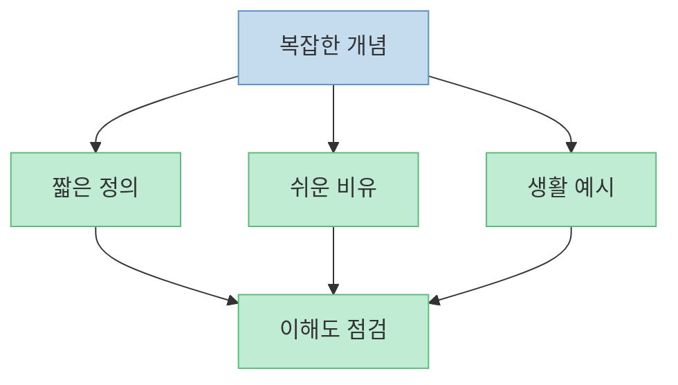
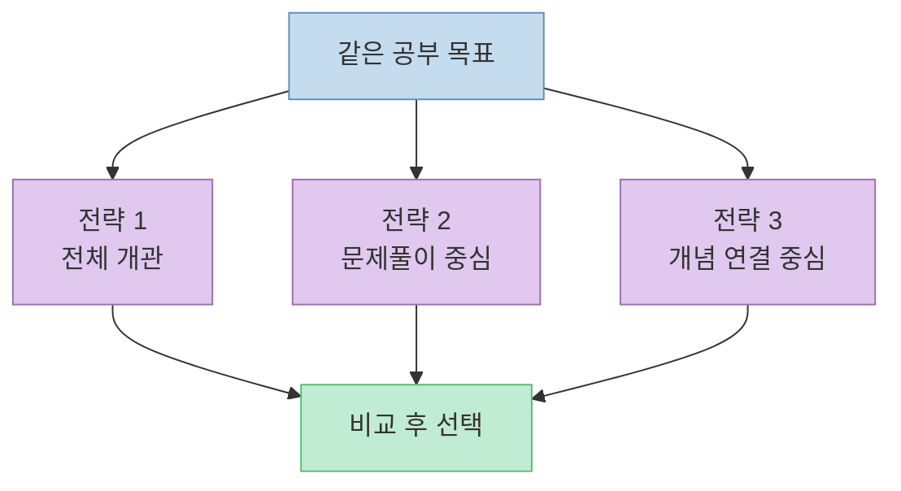

이 쇼츠의 메시지는 단순합니다. GPT를 공부에 쓸 때 성능 차이를 만드는 것은 모델 이름보다도, **어떻게 지시하느냐** 라는 것입니다. 영상은 [GPT가 잘못된 정보를 줄 때가 많지만](https://youtu.be/7Lq7DE5kpv8?t=11), 몇 가지 명령 패턴만 붙여도 답변 품질이 크게 달라질 수 있다고 말합니다.

쇼츠에서 제시한 방법은 다섯 가지입니다. [자기 답변을 다시 점검하게 하는 셀프 리파인](https://youtu.be/7Lq7DE5kpv8?t=22), [초등학생 수준으로 쉽게 설명하게 하는 이해 모드](https://youtu.be/7Lq7DE5kpv8?t=25), [반론과 허점을 찾게 하는 레드팀](https://youtu.be/7Lq7DE5kpv8?t=29), [대충 쓴 요청을 더 좋은 프롬프트로 바꿔주는 오토프롬프트](https://youtu.be/7Lq7DE5kpv8?t=32), 그리고 [서로 다른 전략의 답을 세 개 받는 방식](https://youtu.be/7Lq7DE5kpv8?t=36)입니다.

이 글은 이 다섯 가지를 단순 꿀팁 모음으로 보지 않고, **공부 과정의 서로 다른 병목을 해결하는 명령 패턴** 으로 정리해 보겠습니다.

<!--more-->

## Sources

- [YouTube Shorts - 전교 1등 찍어버린 GPT 명령어 개꿀팁](https://youtube.com/shorts/7Lq7DE5kpv8)

## 1. 이 쇼츠의 핵심은 "좋은 질문"보다 "좋은 검토 루프"에 있다

사람들은 보통 GPT를 쓸 때 질문 문장 자체만 신경 씁니다. 하지만 이 쇼츠가 더 잘 짚는 부분은, **답을 받은 뒤 무엇을 다시 시킬 것인가** 입니다. 영상은 [GPT가 잘못된 정보를 밥 먹듯이 준다](https://youtu.be/7Lq7DE5kpv8?t=11)고 표현하는데, 과장은 있어도 방향은 맞습니다. 공부용으로 GPT를 쓸 때 가장 큰 위험은 "그럴듯하게 틀린 답"을 그대로 받아들이는 것입니다.

그래서 중요한 것은 "`정답을 한 번에 받는다`"가 아니라, 다음처럼 **답변 생성 → 검토 → 재구성** 의 루프를 만드는 것입니다.

이 관점에서 보면 영상의 다섯 가지 패턴은 전부 같은 목적을 가집니다. GPT를 더 똑똑하게 만드는 것이 아니라, **내가 원하는 검토 방식을 더 강하게 걸어 두는 것** 입니다.

## 2. 셀프 리파인은 "답을 다시 쓰게 하는 것"이 아니라 "자기 오류를 찾아내게 하는 것"이다

쇼츠는 첫 번째 기술로 [셀프 리파인을 제시하면서, 자기 답변을 스스로 점검하게 해서 잘못된 정보를 차단할 수 있다고](https://youtu.be/7Lq7DE5kpv8?t=22) 말합니다. 이 패턴은 공부에서 특히 유용합니다. 왜냐하면 학생이 GPT를 쓸 때 가장 자주 하는 실수는 **첫 번째 답을 최종본처럼 받아들이는 것** 이기 때문입니다.

셀프 리파인의 핵심은 단순한 "`다시 써줘`"가 아닙니다. 더 좋은 방식은 아래처럼 기준을 주는 것입니다.

- 틀릴 가능성이 있는 부분을 표시해라
- 근거가 약한 문장을 따로 뽑아라
- 핵심 개념 정의가 모호한 부분을 고쳐라
- 누락된 반례나 예외를 보완해라

즉 셀프 리파인은 "예쁘게 다시 써라"가 아니라, **어디가 위험한 답인지 먼저 찾게 하는 명령** 입니다.

예를 들면 공부할 때 이렇게 쓸 수 있습니다.

> 아래 설명을 다시 읽고, 사실 오류 가능성이 있는 문장, 정의가 모호한 문장, 시험 답안으로 쓰기엔 위험한 문장을 먼저 표시한 뒤 더 정확한 버전으로 다시 작성해 줘.

이렇게 하면 GPT는 단순 요약기가 아니라, **초안 검수자** 처럼 움직이기 시작합니다.

## 3. 쉬운 설명 모드는 "쉽게 말하기"가 아니라 "정말 이해했는지 확인하기"에 가깝다

쇼츠의 두 번째 패턴은 [아무리 어려운 개념이어도 초등학생 수준으로 쉽게 설명하게 하는 것](https://youtu.be/7Lq7DE5kpv8?t=25)입니다. 이건 단지 친절한 설명을 받기 위한 기능이 아닙니다. 공부에서는 오히려 **복잡한 말을 쉬운 말로 바꿀 수 있느냐** 가 이해 여부를 판별하는 좋은 기준이 됩니다.

어려운 개념이 정말 이해된 상태라면 보통 다음 세 가지가 가능합니다.

- 짧은 문장으로 다시 설명할 수 있다
- 비유를 붙일 수 있다
- 예시를 바꿔도 개념이 유지된다

그래서 "`초등학생에게 설명하듯 말해줘`" 같은 요청은 단순히 쉬운 말 바꾸기가 아닙니다. 시험 공부 관점에서는 **개념을 한 단계 낮은 언어로 재구성하게 해서 이해 구멍을 드러내는 방법** 입니다.

특히 암기만 하고 이해가 얕을 때 이 패턴이 잘 먹힙니다. 교과서 문장을 그대로 따라 쓰는 대신, GPT에게 "`이걸 중학생도 이해하게 다시 설명하고, 마지막에 한 문장 요약까지 붙여줘`"라고 시키면 개념 구조가 훨씬 또렷해집니다.

## 4. 레드팀은 GPT를 부정적으로 만들려는 게 아니라, 허점을 먼저 치게 하는 장치다

쇼츠는 세 번째 패턴으로 [레드팀을 넣으면 GPT를 팩트 머신처럼 만들 수 있다고](https://youtu.be/7Lq7DE5kpv8?t=29) 표현합니다. 이 말은 다소 과장됐지만, 실제 공부용으로는 꽤 쓸모가 있습니다. 레드팀의 목적은 "`반박해 봐`"가 아니라, **내가 방금 얻은 설명의 약한 부분을 먼저 드러내는 것** 입니다.

레드팀은 특히 아래 같은 상황에서 강합니다.

- 역사·사회·경제처럼 관점이 갈릴 수 있는 주제
- 서술형 답안을 써야 하는 주제
- 내가 정리한 요약문이 너무 자신만만하게 들릴 때
- 발표 자료나 보고서의 허점을 미리 찾고 싶을 때

예를 들면 이렇게 쓸 수 있습니다.

> 방금 네가 설명한 내용을 레드팀 관점에서 검토해 줘. 과장된 문장, 반례가 있는 주장, 단정적으로 말했지만 예외가 많은 부분을 따로 표시해 줘.

이렇게 하면 GPT는 "`설명하는 모델`"에서 "`반대편 검토자`"로 역할이 바뀝니다. 공부에서 이 차이는 큽니다. 왜냐하면 시험에서 높은 점수를 받는 답은 보통 많이 아는 답이 아니라, **위험한 단정을 줄인 답** 이기 때문입니다.

## 5. 오토프롬프트는 질문을 대신 써주는 기능이 아니라, 내 사고를 더 구조화하는 기능이다

쇼츠의 네 번째 패턴은 [대충 쓴 프롬프트나 계획을 더 고퀄리티로 바꿔준다는 오토프롬프트](https://youtu.be/7Lq7DE5kpv8?t=32)입니다. 이건 공부뿐 아니라 거의 모든 작업에서 유용합니다. 많은 사람이 GPT를 못 쓰는 이유는 모델이 나빠서가 아니라, **자기 요청을 구조적으로 못 쓰기 때문** 입니다.

오토프롬프트는 특히 이런 경우에 좋습니다.

- 뭘 물어봐야 할지 애매할 때
- 과제 범위가 넓어서 질문이 흐릴 때
- 요약, 문제 출제, 오답 분석, 암기 카드 생성 등 여러 단계를 한 번에 설계하고 싶을 때

예를 들면 사용자가 이렇게 대충 쓴다고 해 보겠습니다.

> 근현대사 시험 범위 정리해 줘.

이걸 오토프롬프트로 바꾸면 보통 아래처럼 바뀝니다.

- 범위를 묻고
- 학년 수준을 묻고
- 시험 유형을 묻고
- 요약/개념정리/문제출제 중 목적을 정하고
- 출력 형식을 정합니다

즉 오토프롬프트의 본질은 "`더 멋진 문장을 만들어 준다`"가 아니라, **내 요청에 빠져 있는 조건을 복구해 주는 것** 입니다.

## 6. 세 개의 다른 답을 받는 방식은 "많이 받기"가 아니라 "전략을 비교하기"에 의미가 있다

쇼츠의 마지막 패턴은 [비슷한 답이 아니라 각각 전략이 다른 세 개의 답을 받는 방식](https://youtu.be/7Lq7DE5kpv8?t=36)입니다. 이건 생각보다 강력합니다. 사람들은 보통 GPT에게 "`제일 좋은 답 하나`"를 원하지만, 실제로 공부에서는 답 하나보다 **접근법 여러 개의 차이** 를 보는 것이 훨씬 유익할 때가 많습니다.

예를 들어 같은 공부 목표라도 전략은 다를 수 있습니다.

- 빠르게 전체 흐름을 보는 전략
- 시험 문제를 많이 푸는 전략
- 개념 간 연결을 깊게 이해하는 전략

이렇게 여러 전략을 받아 보면 "`무조건 정답 하나`"에 매달리지 않게 됩니다. 특히 자기 공부 스타일을 아직 잘 모를 때, 또는 시간이 적은 시험 기간에 어떤 방식이 더 효율적인지 결정할 때 유용합니다.

다만 중요한 것은 "`세 개 다 주세요`"가 아니라, **어떤 기준으로 다르게 만들지 지정하는 것** 입니다. 예를 들어 "`암기형 / 이해형 / 문제풀이형 세 가지 전략으로 나눠 줘`"처럼 지시해야 답이 진짜 달라집니다.

## 핵심 요약

- 이 쇼츠의 다섯 가지 패턴은 모두 GPT를 더 똑똑하게 만든다기보다, **검토와 재구성 루프를 더 강하게 거는 방법** 입니다.
- 셀프 리파인은 다시 쓰기보다 **오류 가능성과 모호함을 먼저 찾게 하는 방식** 으로 써야 효과가 큽니다.
- 쉬운 설명 모드는 친절함보다 **이해도를 확인하는 도구** 에 가깝습니다.
- 레드팀은 부정적인 답을 받기 위한 것이 아니라, **답안의 허점과 단정의 위험을 먼저 발견하는 장치** 입니다.
- 오토프롬프트는 내 질문의 빠진 조건을 복원해 주는 데 강합니다.
- 다중 해답 방식은 답을 많이 받는 것이 아니라, **전략 차이를 비교하는 데** 의미가 있습니다.

## 실전 적용 포인트

- 공부용 GPT 대화에서는 한 번에 정답만 받으려 하지 말고, **초안 → 점검 → 쉬운 설명 → 반론 검토** 순서로 이어 보세요.
- 시험 답안용이라면 "`다시 써줘`"보다 **"`틀릴 수 있는 문장을 먼저 표시해 줘`"** 가 더 좋습니다.
- 이해가 약한 개념은 "`초등학생에게 설명하듯 말해줘`", 암기만 된 개념은 "`비유와 예시를 붙여줘`"가 더 잘 먹힙니다.
- 여러 답을 받을 때는 무조건 3개가 아니라, **무엇이 서로 달라야 하는지 기준** 을 먼저 지정하세요.
- 자주 쓰는 패턴은 쇼츠가 말한 것처럼 [맞춤형 지침에 넣어 자동화하는 방식](https://youtu.be/7Lq7DE5kpv8?t=41)도 생각해 볼 수 있습니다. 다만 항상 같은 스타일이 필요한 경우에만 고정하는 편이 좋습니다.

## 결론

이 쇼츠는 자극적인 제목과 달리, 실제로는 꽤 실용적인 포인트를 던집니다. 공부할 때 GPT의 차이는 "`모델이 최고냐`"보다, **검토를 어떻게 시키고 설명 수준을 어떻게 바꾸며 반론을 어떻게 붙이느냐** 에서 크게 벌어집니다.

결국 중요한 것은 GPT를 만능 정답기로 쓰는 것이 아니라, **검토자, 교사, 반대 토론자, 프롬프트 편집자, 전략 비교 도구로 번갈아 쓰는 것** 입니다. 이 다섯 가지 패턴을 익히면 GPT는 단순한 검색 대체제가 아니라, 공부 과정을 더 정교하게 만드는 보조 도구로 바뀝니다.
