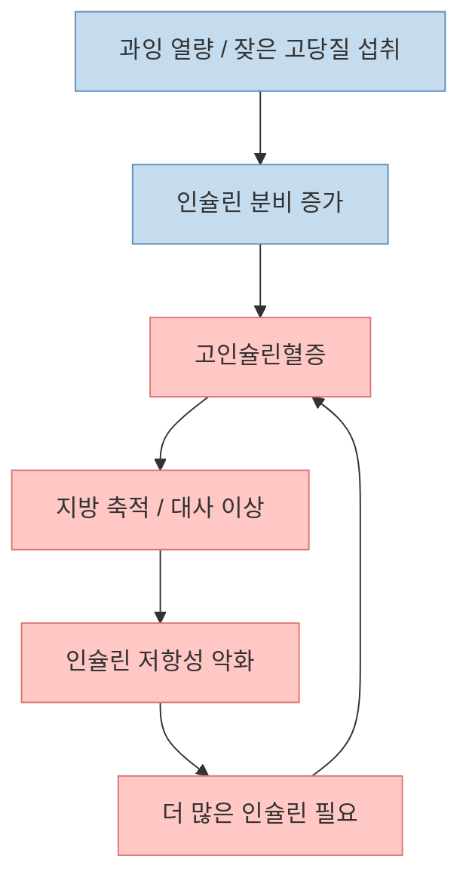
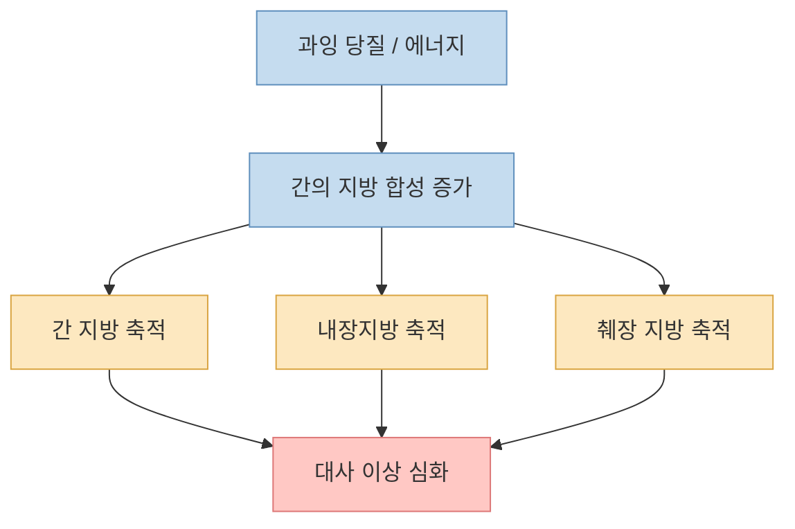
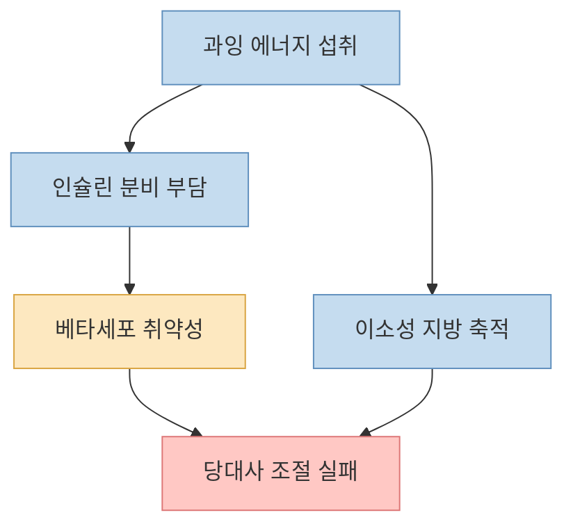

이 영상의 핵심 주장은 꽤 도발적입니다. 당뇨는 단순히 "`혈당이 높은 병`"으로 시작하는 것이 아니라, [먼저 인슐린이 과하게 분비되고](https://youtu.be/4VqL87YlXtQ?t=89), 그 다음에 지방 축적과 저항성 문제가 뒤따른다는 것입니다. 여기에 더해 영상은 [과당과 특정 포화지방, 특히 팔미트산을 강한 원인 후보로 지목](https://youtu.be/4VqL87YlXtQ?t=26)하고, [간이 당을 지방으로 바꾸는 과정](https://youtu.be/4VqL87YlXtQ?t=192)과 [내장지방·췌장지방 같은 이소성 지방](https://youtu.be/4VqL87YlXtQ?t=296)을 연결합니다.

좋은 점은, 이 설명이 "`밥만 많이 먹어서 생긴다`"처럼 너무 단순한 상식에서 한 걸음 더 나간다는 것입니다. 실제로 최신 리뷰들을 보면 2형 당뇨는 한 가지 원인으로 설명되지 않고, **과잉 에너지 섭취, 인슐린 분비 증가, 인슐린 저항성, 간·췌장 지방 축적, 그리고 개인별 베타세포 취약성** 이 겹치면서 진행되는 것으로 이해됩니다.

다만 영상의 일부 표현은 상당히 단정적입니다. 그래서 이 글은 쇼츠의 핵심 골격을 살리되, **어디까지는 근거가 있는 설명이고 어디부터는 아직 논쟁적이거나 단순화된 해석인지** 를 함께 구분해 보겠습니다.

<!--more-->

## Sources

- [YouTube - 최신 과학이 밝혀낸 당뇨가 걸리는 진짜 이유ㅣ닥터딩요](https://youtu.be/4VqL87YlXtQ)
- [NCBI Bookshelf - Insulin Resistance (StatPearls)](https://www.ncbi.nlm.nih.gov/books/NBK507839/)
- [Frontiers - Hyperinsulinemia: an early biomarker of metabolic dysfunction](https://www.frontiersin.org/journals/clinical-diabetes-and-healthcare/articles/10.3389/fcdhc.2023.1159664/full)
- [BMC Medicine - Type 2 diabetes as a disease of ectopic fat?](https://bmcmedicine.biomedcentral.com/articles/10.1186/s12916-014-0123-4)
- [PMC - β Cell Dysfunction Versus Insulin Resistance in the Pathogenesis of Type 2 Diabetes in East Asians](https://pmc.ncbi.nlm.nih.gov/articles/PMC4420838/)
- [Trends in Endocrinology & Metabolism - Palmitic and oleic acids in type 2 diabetes mellitus](https://www.cell.com/trends/endocrinology-metabolism/fulltext/S1043-2760%2826%2900003-2)

## 1. 이 영상이 말하는 가장 큰 변화: "인슐린 저항성 먼저"보다 "인슐린 과분비 먼저"에 무게를 둔다

영상은 [예전에는 살이 찌고 인슐린 저항성이 먼저 생기고, 그 결과 췌장이 쥐어짜인다고 이해했지만](https://youtu.be/4VqL87YlXtQ?t=96), 지금은 [많이 먹는 환경이 먼저 인슐린 과분비를 만들고 그것이 시작점일 수 있다](https://youtu.be/4VqL87YlXtQ?t=103)고 설명합니다.

이건 완전히 근거 없는 말은 아닙니다. 최근 리뷰들은 **고인슐린혈증이 인슐린 저항성보다 앞서거나, 적어도 매우 초기부터 함께 진행될 수 있다** 는 관점을 소개합니다. StatPearls와 Frontiers 리뷰도 과잉 열량과 반복적인 인슐린 요구가 고인슐린혈증을 만들고, 이 상태가 다시 저항성을 악화시키는 악순환을 설명합니다.

다만 여기서 중요한 점은, 이것이 "`이제 인슐린 저항성은 틀렸다`"는 뜻은 아니라는 것입니다. 더 정확한 표현은 이렇습니다.

- 과거에는 인슐린 저항성 중심 설명이 강했다
- 최근에는 고인슐린혈증 자체도 더 초기의 중요한 사건으로 본다
- 실제 환자에서는 두 현상이 서로 얽혀 악순환을 만든다

즉 영상의 메시지를 가장 안전하게 번역하면, **당뇨의 시작을 고혈당만으로 보지 말고, 그 전에 이미 벌어지는 인슐린 과분비 단계까지 보자** 는 것입니다.

## 2. 과당과 팔미트산은 왜 자주 지목될까: 모든 탄수화물·모든 지방이 똑같이 작동하지 않기 때문이다

영상은 [탄수화물 중에서는 과당, 지방 중에서는 팔미트산이 특히 문제적일 수 있다](https://youtu.be/4VqL87YlXtQ?t=26)고 말합니다. 그리고 [빵, 과자, 아이스크림, 초콜릿, 라면, 음료수](https://youtu.be/4VqL87YlXtQ?t=44) 같은 가공식품을 예로 듭니다.

이 설명은 "음식 전체를 한 성분으로 환원한다"는 점에서 다소 단순화돼 있지만, 연구 방향과 아주 동떨어져 있지는 않습니다. 최근 리뷰들은 팔미트산 같은 포화지방산이 인슐린 민감성 저하, 염증 반응, 지질독성과 연관될 수 있다고 정리합니다. 과당 역시 특히 **액상당 형태, 과잉 섭취, 에너지 초과 상황** 에서 간 지방 축적과 대사 이상에 더 직접 연결될 수 있다는 점이 자주 논의됩니다.

하지만 주의할 점이 있습니다.

- 과당 자체가 항상 독이라는 뜻은 아니다
- 팔미트산도 특정 음식 하나의 죄라기보다 **전체 식이 패턴과 총에너지 과잉** 속에서 봐야 한다
- 실제 위험은 단일 분자보다 **가공식품, 액상당, 과식, 낮은 활동량** 과 함께 커진다

즉 영상의 표현을 일상어로 바꾸면 "`요즘 많이 먹는 가공식품 조합이 당뇨를 더 세게 밀 수 있다`" 정도로 이해하는 편이 더 정확합니다.

## 3. 이 영상에서 가장 설득력 있는 부분: 간이 당을 지방으로 바꾸고, 그 지방이 '원래 있으면 안 되는 곳'에 쌓인다는 설명

영상은 [간이 당에서 지방을 만들고](https://youtu.be/4VqL87YlXtQ?t=203), 그것이 [내장지방, 지방간, 췌장지방 같은 형태로 쌓일 수 있다](https://youtu.be/4VqL87YlXtQ?t=326)고 설명합니다. 이 부분은 당뇨 병태생리 설명에서 꽤 중요한 축입니다.

이른바 **이소성 지방(ectopic fat)** 이라는 개념인데, 이는 지방이 피하지방 바깥의 장기, 특히 간과 췌장 같은 곳에 과도하게 축적되는 상태를 말합니다. BMC Medicine 리뷰도 2형 당뇨를 이해할 때 **간 지방과 췌장 지방** 을 중요한 퍼즐 조각으로 봅니다.

영상은 [피하지방은 그나마 '정상 지방' 쪽에 가깝고, 장기 쪽으로 들어가는 지방이 더 문제적](https://youtu.be/4VqL87YlXtQ?t=309)이라고 설명하는데, 표현은 다소 거칠지만 방향은 이해할 만합니다. 실제로 대사질환 위험은 단순 체중보다 **지방이 어디에 쌓이느냐** 와 더 관련이 깊은 경우가 많습니다.

## 4. "당뇨는 혈당이 높은 병이 아니다"라는 말은 절반은 맞고 절반은 위험할 수 있다

영상에서 가장 인상적인 문장 중 하나는 [당뇨는 혈당이 높은 병이 아니라 인슐린이 넘치는 것이 시작](https://youtu.be/4VqL87YlXtQ?t=127)이라는 표현입니다. 이 말은 초기에 대사 이상이 이미 혈당 상승 전에 진행될 수 있다는 뜻으로 읽으면 유용합니다.

하지만 이 문장을 문자 그대로 받아들이면 곤란합니다. 왜냐하면 실제 진단과 합병증 위험 평가는 여전히 **혈당, 당화혈색소, 식후 혈당, 공복 혈당** 을 매우 중요하게 보기 때문입니다.

따라서 이 문장은 이렇게 바꿔 이해하는 것이 좋습니다.

- 발병의 초기 메커니즘을 설명할 때는 고인슐린혈증이 중요하다
- 그러나 임상적으로 당뇨를 진단하고 추적할 때는 고혈당이 핵심 지표다
- 두 관점은 서로 반대가 아니라, **시간축이 다른 설명** 이다

즉 "`왜 생기기 시작했는가`"와 "`지금 진단과 합병증 위험을 어떻게 볼 것인가`"는 같은 질문이 아닙니다.

## 5. 동양인, 특히 한국인이 왜 불리하다는 말이 나올까: 베타세포와 저장 여력의 차이로 설명되는 경우가 많다

영상은 [동양인, 특히 한국인은 췌장도 작고 근육도 작고 피하지방도 작아서 불리할 수 있다](https://youtu.be/4VqL87YlXtQ?t=344)고 설명합니다. 표현은 단순화돼 있지만, 아시아인에서 2형 당뇨가 **더 낮은 BMI에서도 생기기 쉽고, 베타세포 기능 취약성이 더 두드러질 수 있다** 는 논의는 오래전부터 있었습니다.

East Asian 당뇨 리뷰들은 공통적으로 다음 점을 강조합니다.

- 같은 BMI라도 아시아인은 대사적으로 더 불리할 수 있다
- 인슐린 저항성뿐 아니라 **베타세포 분비능의 취약성** 이 더 중요한 축일 수 있다
- 식후 고혈당과 상대적으로 낮은 저장 여력 문제가 잘 드러난다

다만 이 역시 모든 개인에게 똑같이 적용되는 운명론은 아닙니다. "`동양인은 원래 당뇨 체질`"처럼 받아들이기보다, **상대적으로 낮은 체중 증가나 작은 대사 변화에도 취약할 수 있으니 더 일찍 관리해야 한다** 는 경고에 가깝습니다.

## 6. 이 영상을 어떻게 실용적으로 받아들이면 좋을까: 음식 악마화보다 '반복되는 인슐린 과부하'를 줄이는 쪽으로

이 영상은 팜유, 초콜릿, 라면, 과자 같은 예시를 강하게 듭니다. [특히 가공식품과 단 간식 조합이 반복될수록 문제](https://youtu.be/4VqL87YlXtQ?t=251)라는 메시지죠. 이걸 실용적으로 번역하면, 특정 음식 한 개를 악마화하기보다 **자주 반복되는 고당질·고가공 간식 패턴** 을 먼저 끊으라는 뜻에 가깝습니다.

실제로 당뇨 예방 관점에서 더 중요한 질문은 다음과 같습니다.

- 단 음료나 가공 간식을 자주 먹는가
- 배고프지 않은데도 반복적으로 간식을 먹는가
- 식후 졸림, 식후 반응성 저혈당 같은 신호가 반복되는가
- 허리둘레와 체중이 서서히 늘고 있는가

즉 문제는 "`밥 한 공기`" 하나보다, **하루 전체의 섭취 패턴이 계속 인슐린을 자극하는 구조인가** 에 더 가깝습니다.

## 핵심 요약

- 이 영상은 당뇨의 시작을 단순한 고혈당이 아니라 **고인슐린혈증과 과분비** 쪽에서 다시 보자고 제안합니다.
- 최근 리뷰들도 고인슐린혈증이 매우 초기 단계부터 중요한 역할을 할 수 있다는 점을 인정합니다.
- 과당과 팔미트산은 대사적으로 문제가 될 수 있는 성분이지만, 실제 위험은 **가공식품, 액상당, 과잉 열량, 반복 섭취 패턴** 과 함께 봐야 합니다.
- 간이 당을 지방으로 바꾸고, 그 지방이 간·췌장·내장 쪽에 쌓이는 **이소성 지방** 개념은 2형 당뇨 설명에서 매우 중요합니다.
- 동양인에서는 더 낮은 BMI에서도 당뇨가 잘 생길 수 있고, **베타세포 취약성** 이 더 큰 역할을 할 수 있습니다.

## 실전 적용 포인트

- 당뇨를 무조건 "`혈당 수치`"만의 문제로 보지 말고, **식후 과도한 인슐린 반응과 허리둘레 변화** 도 같이 보세요.
- 특정 음식 하나만 끊는 방식보다, **자주 반복되는 단 음료·과자·빵·아이스크림 패턴** 을 먼저 줄이는 편이 더 현실적입니다.
- 가족력이 있거나 동양인 체형 특성상 마른 편인데도 복부비만이 늘고 있다면, **정기적인 공복혈당·당화혈색소 검사** 가 더 중요할 수 있습니다.
- 영상처럼 강한 표현은 이해를 돕지만, 당뇨 원인을 한 분자 하나로 설명하는 방식은 과도할 수 있으니 **전체 식습관과 활동량** 을 함께 봐야 합니다.

## 결론

이 영상이 유용한 이유는 당뇨를 "`당을 많이 먹어서 생기는 병`"이라는 평면적 설명에서 끌어내기 때문입니다. 더 정확한 그림은, **과잉 섭취가 반복되고, 인슐린이 먼저 과하게 분비되며, 간이 이를 지방으로 바꾸고, 그 지방이 원래 있으면 안 되는 곳에 쌓이면서 대사 시스템이 무너지는 과정** 에 가깝습니다.

다만 현실의 당뇨는 여전히 하나의 원인으로 환원되지 않습니다. 그래서 가장 실용적인 태도는 "`과당이 주범이다`" 같은 단일 문장에 머무르지 않고, **반복되는 고인슐린 자극, 허리둘레 증가, 활동량 저하, 가공식품 패턴** 을 함께 관리하는 것입니다. 결국 당뇨는 한 끼의 실수가 아니라, 오래 반복된 대사 환경의 결과로 보는 편이 맞습니다.
