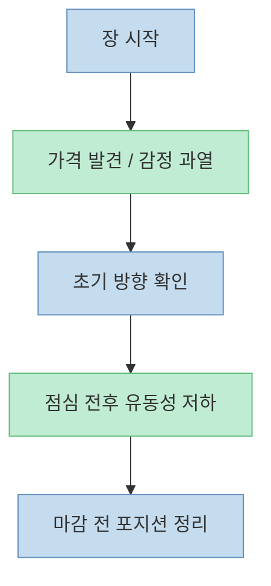
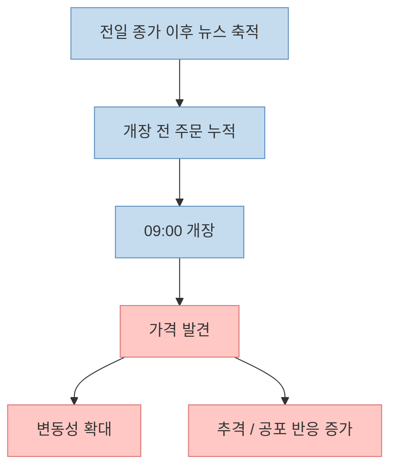
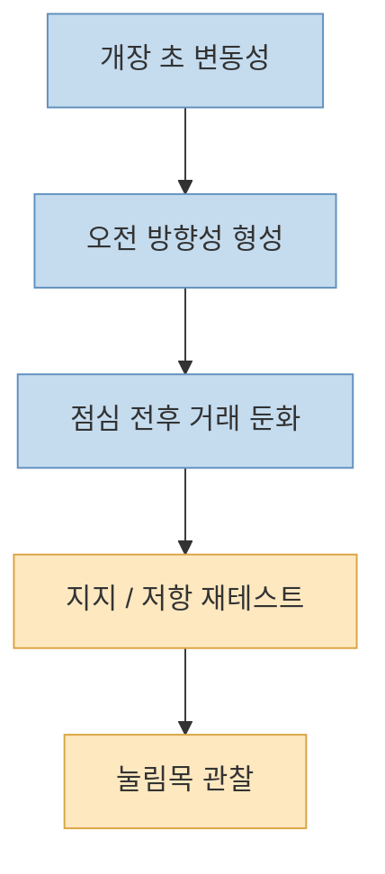

이 Threads 포스트는 아주 실전적인 문장으로 시작합니다. [주식을 오래 할 거라면 특정 시간대를 뼈에 새겨야 한다](https://www.threads.com/@lovelyswimmer0296/post/DbIWkzJk01-)는 것이고, 그 구간을 **09:00~09:15, 09:15~10:00, 12:30~13:00, 14:30~15:20** 으로 나눠 각각 매수 금지, 관망, 눌림목 대기, 저가 매수 기회 같은 행동 원칙을 제시합니다.

이런 시간대 규칙은 초보 투자자에게 꽤 매력적으로 들립니다. 복잡한 시장을 "`몇 시에 무엇을 할지`"로 바꿔 주기 때문입니다. 하지만 그대로 외우기만 하면 위험합니다. 실제 시장은 매일 반복되는 패턴이 있긴 하지만, 그것이 **항상 같은 방향의 수익 규칙** 으로 작동하는 것은 아니기 때문입니다.

그래서 이 글은 포스트의 시간대별 조언을 단순 복붙하지 않고, **왜 이런 시간 감각이 생기는지** 를 시장 미시구조와 KRX 거래 시간 기준으로 풀어보겠습니다.

<!--more-->

## Sources

- [Threads - lovelyswimmer0296 포스트](https://www.threads.com/@lovelyswimmer0296/post/DbIWkzJk01-)
- [KRX Guide to Trading in the Korean Stock Market](https://global.krx.co.kr/contents/GLB/01/0109/0109000000/guide_to_trading_in_the_korean_stock_market.pdf)
- [Financial Services Commission - KRX opening and closing auctions](https://www.fsc.go.kr/eng/pr010101/83967)
- [Intra-day Trading Volume Patterns Of Equity Markets](https://www.researchgate.net/publication/242770982_Intra-day_Trading_Volume_Patterns_Of_Equity_Markets_A_Study_Of_US_And_European_Stock_Markets)
- [Revisiting the U-shaped Patterns in Volatility and Price Impacts](https://digitalcommons.chapman.edu/business_articles/176/)

## 1. 이 포스트가 말하는 핵심은 종목 추천이 아니라 "시간대별 행동 기준"이다

원문 포스트는 가격 예측 모델을 제시하지 않습니다. 대신 다음처럼 **시간대를 행동 규칙으로 바꾸는 방식** 을 택합니다.

- [09:00~09:15: 매수 금지, 매도 우선](https://www.threads.com/@lovelyswimmer0296/post/DbIWkzJk01-)
- [09:15~10:00: 관망 구간](https://www.threads.com/@lovelyswimmer0296/post/DbIWkzJk01-)
- [12:30~13:00: 눌림목 대기](https://www.threads.com/@lovelyswimmer0296/post/DbIWkzJk01-)
- [14:30~15:20: 추격 금지 속 저가 매수 기회](https://www.threads.com/@lovelyswimmer0296/post/DbIWkzJk01-)

이런 규칙은 본질적으로 "`이 시간에는 시장 참가자들의 성격이 달라진다`"는 믿음 위에 서 있습니다. 즉 차트 그 자체보다, **누가 어떤 목적과 감정으로 거래하는 시간인가** 를 먼저 보겠다는 접근입니다.

이 관점 자체는 나쁘지 않습니다. 실제 시장 미시구조 연구에서도 거래량과 변동성은 하루 내내 균일하지 않고, **개장과 마감에 상대적으로 높고 중간 구간에서 완화되는 패턴** 이 자주 관찰됩니다. 다만 이걸 곧바로 "`몇 시에 사면 무조건 유리하다`"로 바꾸는 순간, 설명이 과해질 수 있습니다.

## 2. 왜 개장 직후는 위험하게 느껴질까: 시초가는 정보와 감정이 한꺼번에 몰리는 시간이다

포스트는 [09:00~09:15를 매수 금지, 매도 우선 구간](https://www.threads.com/@lovelyswimmer0296/post/DbIWkzJk01-)으로 제시합니다. 이유는 "`개미들 감정이 가장 뜨거울 때`"라는 식의 표현입니다. 이 말은 정교한 용어는 아니지만, 시장 구조 관점에서는 충분히 해석할 수 있습니다.

KRX 가이드를 보면 한국 주식시장 정규장은 **09:00~15:30** 입니다. 장 시작 직전까지 주문이 쌓이고, 개장 시점에는 전일 종가 이후 축적된 뉴스, 해외 시장 반응, 선물 움직임, 개인·기관의 대기 주문이 한꺼번에 가격에 반영됩니다. 그래서 개장 직후는 본질적으로 **가격 발견(price discovery)** 의 시간입니다.

이때 특징은 보통 다음과 같습니다.

- 밤사이 쌓인 정보가 한 번에 반영된다
- 시장가·조건부 주문이 한꺼번에 부딪친다
- 갭상승·갭하락처럼 전일과 다른 출발이 자주 나온다
- 심리적으로는 추격 매수·공포 매도가 가장 쉽게 나온다

그래서 "`개장 직후 매수 금지`"는 보편 법칙이라기보다, **초보 투자자가 가격 발견 구간의 소음에 휘말리지 않기 위한 방어 규칙** 으로는 의미가 있습니다. 특히 시초가에 감정적으로 반응해 추격하는 습관이 있는 사람에게는 유효할 수 있습니다.

## 3. 09:15~10:00 관망론이 나오는 이유: 초기 방향이 진짜인지 확인하는 시간

포스트는 [09:15~10:00을 진짜 상승인지, 개미 털기인지 드러나는 시간](https://www.threads.com/@lovelyswimmer0296/post/DbIWkzJk01-)이라고 설명합니다. 이 표현 역시 엄밀한 지표는 아니지만, 초반 가격 움직임의 **지속 가능성 확인 구간** 으로 이해할 수 있습니다.

개장 직후 급등락은 종종 정보 반영과 과잉반응이 섞여 있습니다. 그래서 첫 10~30분을 지나면 다음이 조금씩 보이기 시작합니다.

- 시초가를 지키는지
- 거래량이 계속 붙는지
- 호가 공백이 줄어드는지
- 뉴스 재료가 일회성인지 확산되는지

연구에서 자주 말하는 U자형 거래량·변동성 패턴도 이런 감각과 연결됩니다. 개장 직후는 원래 시끄럽고, 그 시끄러움 속에서 **첫 움직임이 진짜 추세인지 단기 소음인지** 를 구분하려는 시장 참여가 이 시간대에 집중됩니다.

따라서 이 구간을 "`매매해야 하는 시간`"이라기보다, **하루의 성격을 읽는 시간** 으로 보는 편이 더 적절합니다.

## 4. 점심 직후 눌림목을 기다리라는 말은 유동성 저하와 재정렬을 이용하겠다는 뜻이다

포스트는 [12:30~13:00을 눌림목 대기 구간](https://www.threads.com/@lovelyswimmer0296/post/DbIWkzJk01-)으로 잡고, 추격 대신 지지선 근처를 기다리라고 말합니다. 이 역시 특정 매매법을 강요하는 문장이라기보다, **한낮 시장의 느슨함** 을 활용하자는 취지로 읽을 수 있습니다.

많은 시장에서 장중 중반은 개장·마감보다 상대적으로 거래량과 긴장도가 낮아지는 경향이 있습니다. 모든 날이 그런 것은 아니지만, 적어도 개장 초의 정보 충돌이 한 차례 지나간 뒤에는 주문 흐름이 정리되고 호가가 얇아지거나, 반대로 작은 물량에도 가격이 덜 자연스럽게 흔들리는 경우가 있습니다.

다만 여기서도 중요한 것은 "`12시 30분이면 눌림목이 온다`"가 아니라, **오전의 급한 거래가 지나간 뒤 가격이 어디에서 다시 받아지는지** 를 본다는 점입니다. 결국 포스트의 조언은 시간 자체보다, 그 시간대에 나타나는 유동성 상태를 말하고 있는 셈입니다.

## 5. 마감 전 구간은 왜 기회이면서도 함정일까: 포지션 정리와 종가 의미가 겹치는 시간

포스트는 [14:30~15:20을 줍줍 찬스라고 하면서도, 추격은 금지하고 마지막 동시호가는 기관 싸움이니 관망](https://www.threads.com/@lovelyswimmer0296/post/DbIWkzJk01-)이라고 말합니다. 이 구간은 직관적으로도 이해가 됩니다. 하루를 마무리하려는 거래가 몰리는 시간대이기 때문입니다.

금융위원회 자료도 KRX의 **개장·종가 형성 구간** 을 중요하게 다룹니다. 종가는 단순한 마지막 숫자가 아니라, 펀드 기준가, 기관 평가, 프로그램 매매, 다음 날 심리의 기준이 되는 값입니다. 그래서 마감 전에는 다음이 동시에 일어날 수 있습니다.

- 데이트레이더의 손절·익절 정리
- 기관·펀드의 종가 관리
- 종가 기준 체결을 노리는 주문 유입
- 장 마감 전에 포지션을 축소하려는 움직임

이 때문에 마감 전은 "**싸게 주울 기회**"처럼 보일 수도 있지만, 반대로 **거짓 유동성** 과 **막판 왜곡** 도 생기기 쉽습니다. 그래서 포스트가 같은 문장 안에서 "`기회`"와 "`추격 금지`"를 함께 말하는 것입니다.

## 6. 이 포스트를 가장 건강하게 쓰는 방법: 수익 공식이 아니라 자기 통제 규칙으로 쓰기

원문 마지막 문장은 강합니다. [시장은 똑똑한 사람이 아니라 기준 있는 사람이 먹는다](https://www.threads.com/@lovelyswimmer0296/post/DbIWkzJk01-)는 말이죠. 이 문장은 과학적 주장이라기보다 행동 원칙에 가깝습니다. 하지만 바로 그 점 때문에 오히려 쓸모가 있습니다.

시간대 규칙의 진짜 장점은 "`예측력`"보다 "`충동 억제력`"입니다. 예를 들어

- 개장 직후는 추격 매수 금지
- 오전 초반은 방향 확인 전까지 관망
- 점심 이후는 급등 추격 대신 지지 확인
- 마감 전은 종가 왜곡을 의식하고 무리하지 않기

이런 식으로 쓰면, 시간대 규칙은 마법 공식이 아니라 **자기 통제 체크리스트** 가 됩니다.

## 핵심 요약

- 이 Threads 포스트는 장중 네 시간대를 나눠 행동 기준을 제시하지만, 핵심은 종목 예측이 아니라 **시간대별 심리와 유동성 차이** 에 있습니다.
- 개장 직후는 뉴스와 주문이 한꺼번에 반영되는 **가격 발견 구간** 이라 변동성이 커지기 쉽습니다.
- 오전 9시 15분 이후는 첫 움직임이 진짜 방향인지 확인하는 **해석 구간** 으로 볼 수 있습니다.
- 점심 전후는 상대적으로 느슨한 흐름 속에서 **지지·저항 재확인** 이 나타날 수 있습니다.
- 마감 전은 포지션 정리와 종가 의미가 겹쳐 **기회와 왜곡이 동시에 존재하는 구간** 입니다.
- 따라서 이 포스트의 규칙은 수익 보장 공식보다 **충동 매매를 줄이는 행동 기준** 으로 쓰는 편이 낫습니다.

## 실전 적용 포인트

- 이 시간대 규칙을 그대로 믿기보다, **내가 어느 시간대에 가장 자주 실수하는지** 를 먼저 기록해 보세요.
- 개장 직후 추격 매수, 점심 이후 심심해서 매매, 마감 전 조급한 진입 같은 패턴이 있다면 이 규칙은 꽤 유용한 브레이크가 됩니다.
- 다만 시간대만 보고 진입하지 말고, **거래량·시초가 유지 여부·뉴스 지속성·종가 전 주문 왜곡** 을 함께 봐야 합니다.
- 원문 포스트의 DM 유도 문구처럼 외부 강의/자료 유입 장치는 따로 떨어뜨려 보고, 실제로 가져갈 것은 **행동 기준의 뼈대만** 남기는 편이 좋습니다.

## 결론

이 Threads 포스트가 주는 통찰은 "`몇 시에 사면 돈 번다`"가 아닙니다. 더 본질적인 메시지는, **시장은 하루 동안 같은 얼굴로 움직이지 않으며, 개장·중반·마감마다 참가자의 목적과 심리가 달라진다** 는 점입니다.

그래서 좋은 시간대 규칙은 미래를 맞히는 예언이 아니라, **내가 가장 흔들리기 쉬운 구간에서 매매를 늦추거나 줄이게 만드는 장치** 여야 합니다. 결국 장중 시간대는 수익의 비밀 코드라기보다, 스스로의 기준을 세우기 위한 프레임으로 쓰는 편이 가장 건강합니다.
