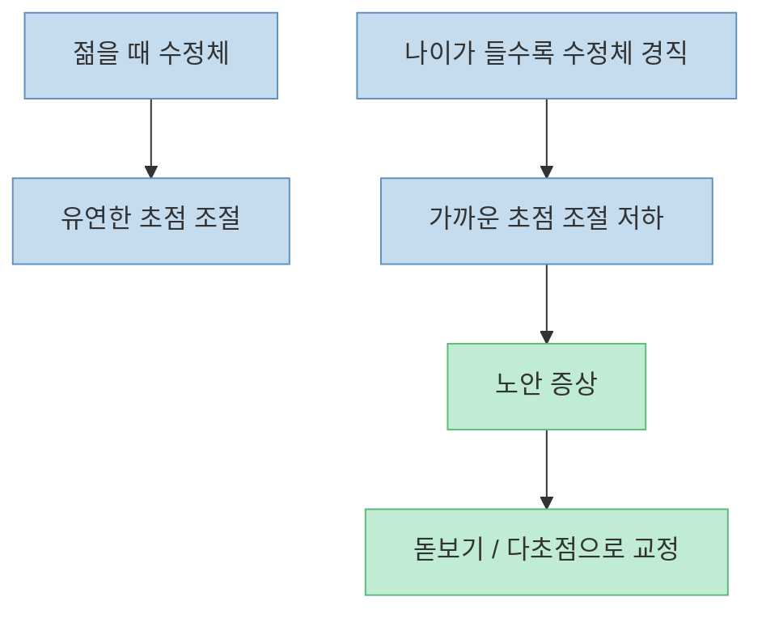
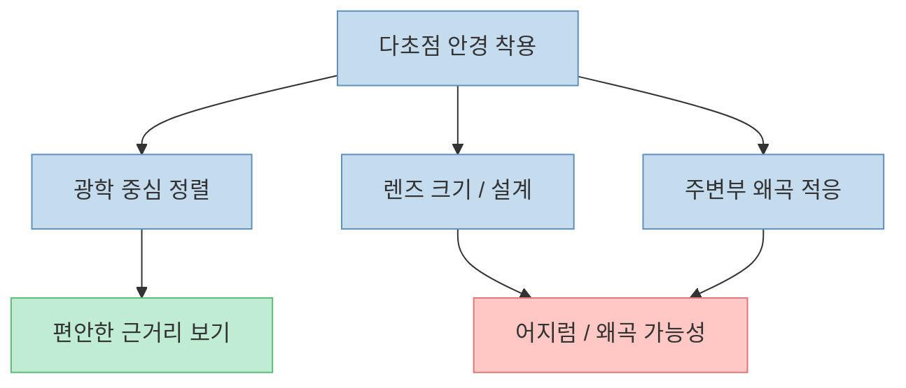
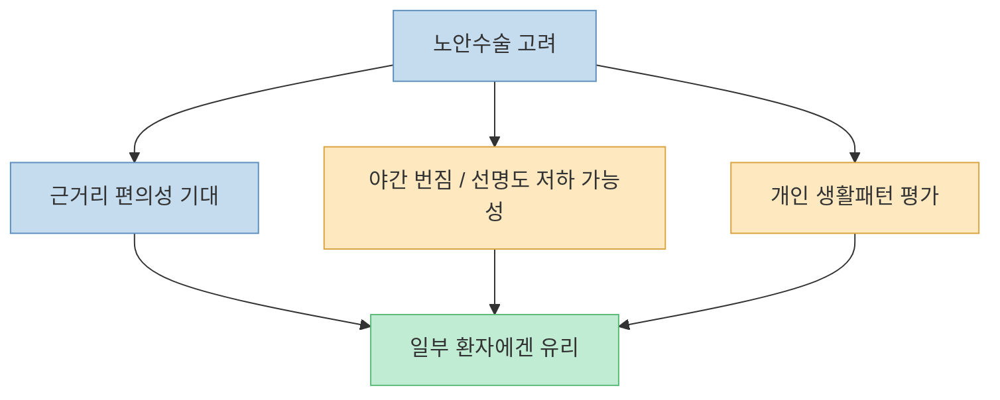

이 영상이 가장 먼저 바로잡는 오해는 단순합니다. 많은 사람이 가까운 글씨가 안 보이기 시작하면 "`눈이 망가졌다`", "`병이 왔다`"고 느끼지만, 인터뷰에 나온 안과 전문의는 [노안은 질병이 아니라 나이에 따라 수정체 탄력과 조절 기능이 떨어지는 과정](https://youtu.be/Mjlm6_JpKOA?t=216)이라고 설명합니다. 이 한 문장이 영상의 핵심입니다.

물론 그렇다고 해서 불편이 가볍다는 뜻은 아닙니다. 참가자는 [독서를 오래 못 하고, 스마트폰을 조금만 봐도 어지럽고 울렁거린다](https://youtu.be/Mjlm6_JpKOA?t=83)고 호소합니다. 여기에 [심한 안구건조증](https://youtu.be/Mjlm6_JpKOA?t=120), [다초점 안경 적응 문제](https://youtu.be/Mjlm6_JpKOA?t=297), [영양제에 대한 기대와 혼란](https://youtu.be/Mjlm6_JpKOA?t=352), [노안수술과 백내장에 대한 오해](https://youtu.be/Mjlm6_JpKOA?t=398)가 한꺼번에 얽혀 있습니다.

그래서 이 글은 "`눈이 침침하다`"는 막연한 불안을 **노안, 안구건조증, 다초점 안경 적응, 백내장, 수술 기대치** 로 나눠서 정리해 보겠습니다.

<!--more-->

## Sources

- [YouTube - "시력 좋아질 수 있다고!?" 여러 참가자들을 모아 안구 건조증과 시력을 개선한 뚜렷한 사례│귀하신 몸│#EBS건강](https://youtu.be/Mjlm6_JpKOA)
- [Mayo Clinic - Presbyopia](https://www.mayoclinic.org/diseases-conditions/presbyopia/symptoms-causes/syc-20363328)
- [Cleveland Clinic - Presbyopia](https://my.clevelandclinic.org/health/diseases/8577-presbyopia)
- [NIH News in Health - Recognizing Cataracts](https://newsinhealth.nih.gov/2013/08/recognizing-cataracts)
- [PMC - Omega-3 supplements for dry eye](https://pmc.ncbi.nlm.nih.gov/articles/PMC6234923/)
- [American Academy of Ophthalmology - Can Fish Oil Relieve Dry Eye?](https://www.aao.org/eye-health/tips-prevention/does-fish-oil-help-dry-eye)

## 1. 노안은 "눈이 병들었다"기보다, 초점 조절 장치가 나이 들면서 덜 유연해지는 과정에 가깝다

영상에서 전문의는 [멀리는 보이는데 가까이는 잘 안 보이는 것은 수정체의 탄력성과 조절 기능이 떨어지는 노안](https://youtu.be/Mjlm6_JpKOA?t=218)이라고 설명합니다. 그리고 [돋보기나 다초점 안경을 쓰면 가까운 것이 잘 보인다면 아주 건강한 눈이라고 생각해도 된다](https://youtu.be/Mjlm6_JpKOA?t=256)고 말합니다.

이건 주요 의학 자료들과도 잘 맞습니다. Mayo Clinic과 Cleveland Clinic 모두 presbyopia를 **40대 이후 거의 누구에게나 찾아오는 정상적인 노화 과정** 으로 설명합니다. 즉 노안은 "`드문 안질환`"이 아니라, 눈의 초점 조절 시스템이 시간이 지나며 바뀌는 매우 흔한 변화입니다.

그래서 노안을 처음 느꼈을 때 중요한 질문은 "`큰 병인가?`"보다 "`정상적인 노화 범위 안의 변화인지, 아니면 다른 안질환이 같이 있는지`"를 구분하는 것입니다.

## 2. 다초점 안경이 불편한 이유는 눈이 약해서가 아니라, 광학 구조와 적응 문제일 수 있다

영상의 사례자는 [30초 이상 가까운 것을 보면 잘 안 보이기 시작하고 어지럽다](https://youtu.be/Mjlm6_JpKOA?t=268)고 말합니다. 이에 전문의는 [안경 중심과 눈 중심이 맞아야 하고](https://youtu.be/Mjlm6_JpKOA?t=285), [얼굴에 비해 지나치게 큰 다초점 렌즈는 돋보기 영역이 넓어져 어지러움을 만들 수 있다](https://youtu.be/Mjlm6_JpKOA?t=307)고 설명합니다.

이건 실제 생활에서 매우 중요한 포인트입니다. 많은 사람이 다초점 안경이 불편하면 "`내 눈이 너무 나빠서 그렇다`"고 생각하지만, 실제로는 다음이 더 문제일 수 있습니다.

- 프레임 크기와 얼굴 비율이 맞지 않음
- 중심점과 시축 정렬이 좋지 않음
- 주변부 왜곡에 아직 적응하지 못함
- 안경을 올바른 높이로 쓰지 않음

즉 다초점 안경이 불편하다고 해서 바로 "`다초점이 체질에 안 맞는다`"고 결론내리기보다, **렌즈 크기, 착용 위치, 적응 시간** 을 먼저 점검하는 편이 더 합리적입니다.

## 3. 영양제는 만능 해결사가 아니다: 루테인과 오메가3는 '누구에게나'가 아니라 '맥락에 따라' 봐야 한다

영상에서 참가자는 [루테인을 챙겨 먹고 있다](https://youtu.be/Mjlm6_JpKOA?t=344)고 말합니다. 이에 전문의는 [황반변성이나 황반 기능 저하가 있는 경우에는 도움이 될 여지가 있지만](https://youtu.be/Mjlm6_JpKOA?t=364), [건강한 경우 루테인의 효과는 확실치 않다](https://youtu.be/Mjlm6_JpKOA?t=373)고 설명합니다. 또 [오메가3는 눈꺼풀 염증, 마이봄샘 기능 이상, 안구건조증 일부에 어느 정도 도움이 될 수 있다](https://youtu.be/Mjlm6_JpKOA?t=376)고 말합니다.

이 부분은 아주 현실적입니다. 눈 영양제 시장은 크지만, 실제 근거는 질환별로 다릅니다. 안구건조증에 대한 오메가3는 연구 결과가 일관되지 않습니다. Cochrane 리뷰와 AAO 자료 모두 **일부 연구는 긍정적이지만, 가장 강한 임상시험에서는 명확한 증상 개선이 없었다** 는 점을 함께 보여 줍니다.

즉 영양제에 대한 가장 안전한 태도는 다음과 같습니다.

- 특정 진단이 있을 때는 도움이 될 수 있다
- 하지만 모든 눈 피로와 모든 노안에 보편 해답은 아니다
- 증상 원인을 구분하지 않으면 기대만 커지고 실망도 커진다

그래서 "`눈에 좋다더라`"보다 **내가 황반 문제인지, 건조증인지, 눈꺼풀 염증인지, 단순 노안인지** 를 먼저 구분하는 것이 중요합니다.

## 4. 노안수술은 '노안을 지운다'기보다 교정 전략을 바꾸는 것이고, 선명도와 부작용의 타협이 따른다

영상에서 전문의는 [노안수술을 노안을 고치는 수술로 생각하면 안 되고 완치는 안 된다](https://youtu.be/Mjlm6_JpKOA?t=398)고 설명합니다. 또 [백내장 수술 때 특수 인공수정체를 넣는 방식이 흔하지만](https://youtu.be/Mjlm6_JpKOA?t=407), [아직까지 멀리와 가까이를 모두 아주 선명하게 만들어 주는 완벽한 수술은 없다](https://youtu.be/Mjlm6_JpKOA?t=419)고 말합니다.

이 설명이 중요한 이유는, 노안수술이 종종 광고 문구로는 "`안경 없이 다 보이는 수술`"처럼 들리기 때문입니다. 실제로는 보통 다음 같은 트레이드오프가 있습니다.

- 근거리 편의성 증가
- 대신 야간 번짐 가능성 증가
- 선명도 약간 저하 가능성
- 개인의 동공, 직업, 야간 운전 여부에 따라 만족도 차이

즉 노안수술은 "`노안을 없애는 마법`"이 아니라, **안경 의존도와 시야 선명도 사이에서 어떤 타협이 나에게 맞는지 선택하는 문제** 에 더 가깝습니다.

## 5. 빛 번짐과 뿌연 시야는 노안보다 백내장과 더 직접 연결될 수 있다

영상에서 전문의는 [빛에 약한 것은 백내장과 관련이 있을 수 있다](https://youtu.be/Mjlm6_JpKOA?t=452)고 설명하고, [50대 이후 백내장이 없는 쪽이 오히려 더 이상하지 않을 수 있다](https://youtu.be/Mjlm6_JpKOA?t=488)고 말합니다. 이어서 [수정체 단백질이 노화로 혼탁해져 빛을 제대로 통과시키지 못하면 백내장](https://youtu.be/Mjlm6_JpKOA?t=504)이라고 정리합니다.

이 역시 큰 틀에서 맞는 설명입니다. NIH 자료도 백내장을 **나이가 들면서 수정체가 혼탁해지는 매우 흔한 변화** 로 설명합니다. 다만 "`50 넘으면 누구나 백내장`"이라는 문장은 이해를 돕기 위한 다소 강한 표현으로 받아들이는 편이 좋습니다. 실제로는 나이와 함께 흔해지지만, **수술이 필요한 정도인지 아닌지, 시생활에 영향을 주는지** 가 더 중요합니다.

즉 가까운 글씨가 안 보인다고 다 노안만의 문제는 아닙니다. 특히 다음이 있다면 백내장이나 다른 안질환 평가가 더 중요해질 수 있습니다.

- 빛 번짐이 심하다
- 야간 시야가 갑자기 불편해진다
- 뿌옇고 흐린 느낌이 커진다
- 안경을 바꿔도 선명도가 잘 안 올라간다

## 핵심 요약

- 노안은 흔한 노화 과정이지, 그 자체를 곧바로 질병으로 보지는 않습니다.
- 다초점 안경 불편은 눈이 약해서라기보다 **렌즈 중심 정렬, 크기, 적응 문제** 일 수 있습니다.
- 루테인과 오메가3는 일부 상황에서 도움이 될 수 있지만, **모든 노안·모든 눈 피로의 만능 해답은 아닙니다**.
- 노안수술은 완치 개념보다 **교정 전략의 선택** 에 가깝고, 선명도와 부작용 사이의 타협이 따릅니다.
- 빛 번짐과 뿌연 시야는 노안만이 아니라 **백내장 같은 노인성 안질환** 도 함께 봐야 합니다.

## 실전 적용 포인트

- 가까운 것이 안 보인다고 바로 큰 병을 의심하기보다, **정상적인 노안 변화인지 먼저 확인** 하세요.
- 다초점 안경이 어지럽다면 포기부터 하지 말고, **프레임 크기·렌즈 중심·착용 높이** 를 다시 점검해 보세요.
- 눈 영양제는 "`눈에 좋다`"는 이유만으로 고르기보다, **내가 건조증인지, 황반 문제인지, 단순 노안인지** 를 먼저 확인하는 편이 낫습니다.
- 야간 빛 번짐, 뿌연 시야, 선명도 저하는 노안만으로 설명되지 않을 수 있으니, **백내장 여부 확인** 도 중요합니다.

## 결론

이 영상이 잘 짚는 것은 눈의 불편을 전부 같은 문제로 뭉뚱그리지 않는다는 점입니다. 가까운 글씨가 안 보이는 것, 스마트폰을 오래 보면 어지러운 것, 다초점 안경이 불편한 것, 빛 번짐이 심한 것은 겉으로는 비슷해 보여도 **노안, 건조증, 안경 적응, 백내장** 이 서로 다르게 얽힌 결과일 수 있습니다.

그래서 눈 건강에서 가장 중요한 태도는 "`좋다는 걸 다 해보는 것`"이 아니라, **지금의 불편이 무엇 때문에 생기는지 정확히 나누어 보는 것** 입니다. 노안은 흔한 과정이지만, 그 위에 다른 문제가 겹치면 삶의 불편은 커질 수 있습니다. 결국 눈도 막연한 불안보다 **정확한 구분과 맞춤 교정** 이 훨씬 중요합니다.
