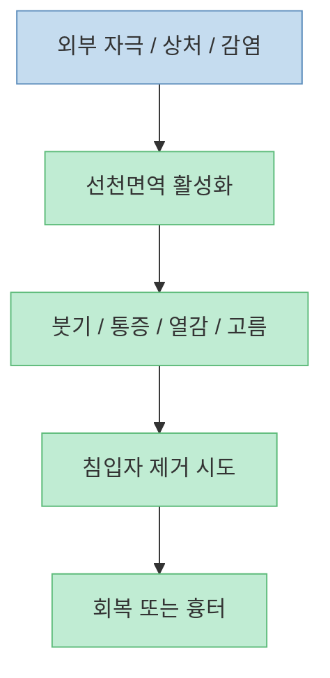
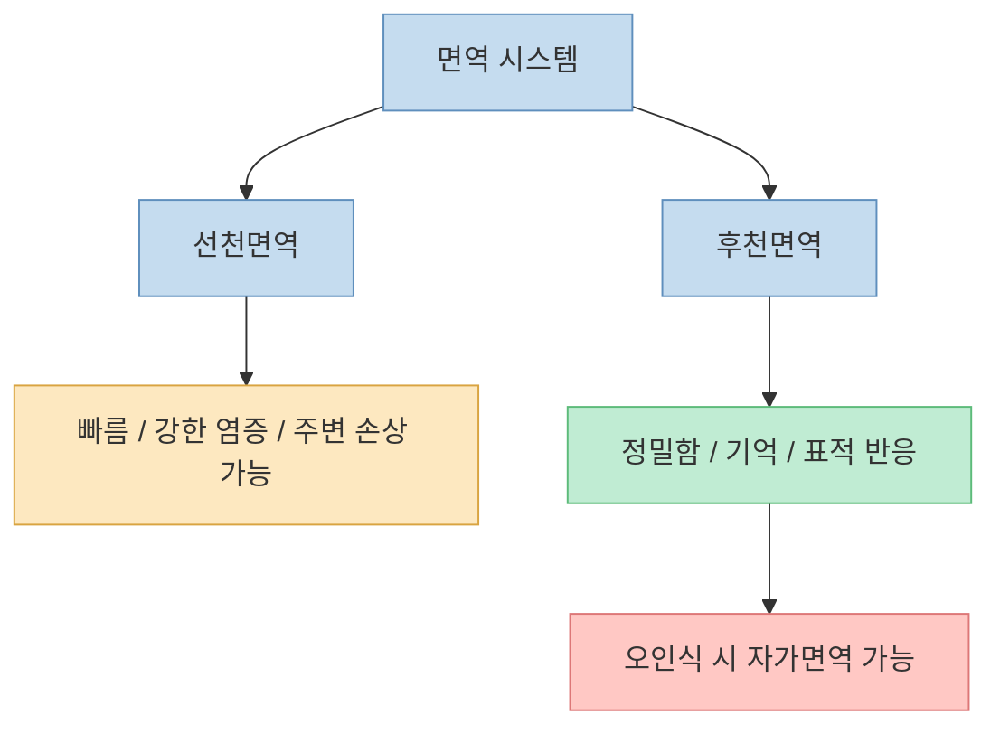
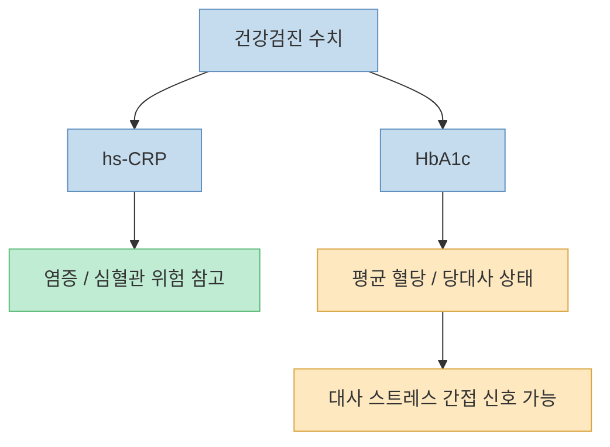

이 영상이 가장 강하게 던지는 메시지는 단순합니다. [염증을 100% 싹 없애면 사람은 당장 죽는다](https://youtu.be/WSDHaj9VaZ0?t=414)는 것입니다. 자극적인 표현 같지만, 전달하려는 핵심은 분명합니다. 염증은 본래 나쁜 것만이 아니라, **몸을 지키기 위해 작동하는 면역 시스템의 결과물** 이라는 점입니다.

그래서 영상은 우리가 흔히 믿는 몇 가지 건강 상식을 정면으로 뒤집습니다. [면역은 무조건 올려야 하고 염증은 무조건 없애야 한다는 생각은 말이 안 된다](https://youtu.be/WSDHaj9VaZ0?t=537)고 하고, [디톡스는 의학적으로는 없는 개념](https://youtu.be/WSDHaj9VaZ0?t=336)이라고도 말합니다. 또 후반부에서는 [건강검진에서 염증 상태를 읽을 때 hs-CRP나 당화혈색소를 볼 수 있다](https://youtu.be/WSDHaj9VaZ0?t=1992)고 설명하고, [잠이 뇌 청소와 면역 균형에 중요하다](https://youtu.be/WSDHaj9VaZ0?t=2344)는 결론으로 이어집니다.

이 글은 이 메시지들을 무조건 받아 적기보다, **어디까지는 의학적으로 타당하고 어디부터는 비유와 단순화가 섞여 있는지** 를 함께 정리해 보겠습니다.

<!--more-->

## Sources

- [YouTube - "환자들이 후회해요" 20만명 진료 끝 알아낸 건강검진의 함정 ㅣ 은밀한 건강수첩 Ep. 5](https://youtu.be/WSDHaj9VaZ0)
- [American Heart Association - hsCRP Insights for Healthcare Professionals](https://professional.heart.org/en/education/hscrp-insights-for-healthcare-professionals)
- [CDC - A1C Test for Diabetes and Prediabetes](https://www.cdc.gov/diabetes/diabetes-testing/prediabetes-a1c-test.html)
- [MedlinePlus - Hemoglobin A1C (HbA1c) Test](https://medlineplus.gov/lab-tests/hemoglobin-a1c-hba1c-test/)
- [PMC - Innate Immunity and its Regulation by Mast Cells](https://pmc.ncbi.nlm.nih.gov/articles/PMC3645001/)
- [Cleveland Clinic - Glymphatic System](https://my.clevelandclinic.org/health/body/glymphatic-system)
- [PMC - The Sleeping Brain: Harnessing the Power of the Glymphatic System](https://pmc.ncbi.nlm.nih.gov/articles/PMC7698404/)

## 1. 염증은 원래 적을 막아낸 흔적이다: "없애야 할 독"이 아니라 "방어 시스템의 결과"에 가깝다

영상에서 교수는 [염증은 당신의 몸을 지키는 시스템에 의한 결과물](https://youtu.be/WSDHaj9VaZ0?t=428)이라고 설명합니다. 상처가 나거나 세균이 들어왔을 때 붓고 아프고 고름이 생기는 과정도 결국은 **몸이 전쟁을 치른 흔적** 이라는 비유를 씁니다.

이 설명은 기본 면역학과 잘 맞습니다. 선천면역은 외부 침입자를 빠르게 감지하고 즉각 반응하는 체계이고, 그 과정에서 통증, 붓기, 발적, 열감 같은 우리가 흔히 "염증"이라고 부르는 현상이 나타납니다. 영상이 [고름을 죽고 난 면역세포의 흔적](https://youtu.be/WSDHaj9VaZ0?t=500)으로 설명하는 부분도 큰 틀에서는 이해 가능한 비유입니다.

즉 염증은 그 자체로 죄가 아니라, **무언가에 맞서고 있다는 신호** 에 더 가깝습니다. 문제는 이 반응이 너무 크거나, 너무 오래가거나, 엉뚱한 대상을 향할 때입니다.

## 2. "면역은 올리고 염증은 없앤다"는 문장이 왜 이상한가: 둘은 완전히 분리된 버튼이 아니기 때문이다

영상은 [면역은 올려야 하고 염증은 없애야 한다는 말은 완전히 말이 안 된다](https://youtu.be/WSDHaj9VaZ0?t=539)고 강하게 말합니다. 표현은 거칠지만, 핵심은 **면역과 염증이 분리된 독립 시스템이 아니라는 점** 입니다.

선천면역은 빠르고 강하게 반응하는 대신 주변 조직 손상을 동반하기 쉽습니다. 영상이 이를 [불난 건물을 끄는 소방관처럼, 주변 정리보다 일단 번지지 않게 막는 반응](https://youtu.be/WSDHaj9VaZ0?t=600)으로 설명하는데, 꽤 이해하기 쉬운 비유입니다. 반면 후천면역은 더 표적화된 방식으로 작동하지만, 때로는 [자가면역처럼 자기 몸을 잘못 공격하는 실수](https://youtu.be/WSDHaj9VaZ0?t=836)를 할 수도 있습니다.

그래서 "`면역 강화`" 같은 문구는 현실에서 지나치게 뭉뚱그린 표현일 때가 많습니다. 실제 의학에서는 **어떤 면역 축이 과도한지, 어떤 반응이 부족한지, 염증이 급성인지 만성인지** 를 구분하는 것이 더 중요합니다.

## 3. 디톡스는 왜 애매한가: 몸이 좋아진 느낌과 의학적 독소 제거는 같은 말이 아니다

영상은 [디톡스는 의학적으로 없는 개념](https://youtu.be/WSDHaj9VaZ0?t=354)이라고 말합니다. 이 말은 아주 정확하게 번역하면 "`디톡스`라는 단어가 의학적 진단명이나 표준 치료 개념으로 쓰이지는 않는다"는 뜻에 가깝습니다.

실제로 의료 현장에서 "독소를 씻어낸다"는 식의 표현은 매우 불명확합니다. 무엇이 독소인지, 어디에 쌓였는지, 어떤 방법으로 제거되는지 명확하지 않은 경우가 대부분이기 때문입니다. 다만 영상도 인정하듯, 어떤 사람이 디톡스를 한다고 하면서 **식습관을 정리하고, 술을 줄이고, 수면을 늘리고, 가공식품을 줄이면** 실제로 몸 상태가 좋아질 수는 있습니다.

즉 여기서 구분해야 할 것은 두 가지입니다.

- 디톡스라는 **설명 프레임** 은 과학적으로 흐릿하다
- 하지만 디톡스 하겠다고 하며 실제로 하는 **건강 행동 자체** 는 도움이 될 수 있다

문제는 극단적 단식, 불균형한 해독요법, 고가 보충제 남용처럼 개념은 흐린데 실제 행동은 위험해질 때입니다.

## 4. 만성 염증은 "의도는 착한데 결과가 나빠진 상태"라는 설명이 꽤 유용하다

영상 후반부에서 교수는 만성 염증을 [잘 먹고, LDL이 많고, 혈관벽이 손상된 상태에서 대식세포가 계속 반응하다가 결국 동맥경화로 이어지는 과정](https://youtu.be/WSDHaj9VaZ0?t=889)으로 설명합니다. 이건 앞선 혈관 건강 영상과도 이어지는 구조입니다.

즉 선천면역의 의도는 원래 보호인데, 환경이 계속 같은 자극을 공급하면 결과가 나빠질 수 있습니다. 이 설명은 "염증은 무조건 나쁘다"보다 더 정확합니다. **같은 방어 시스템이라도 단기적으로는 유익하고, 장기적으로는 손상이 될 수 있다** 는 뜻이기 때문입니다.

이 관점은 만성 염증을 생각할 때 꽤 중요합니다. 비염, 피부 가려움, 죽상동맥경화, 일부 대사질환은 모두 서로 다른 모습처럼 보이지만, 결국은 **과하거나 오래 지속된 염증성 반응** 과 연결되는 경우가 많습니다.

## 5. 건강검진에서 염증을 뭘로 봐야 할까: hs-CRP는 직접 표지자이고, HbA1c는 대사 경고등에 더 가깝다

영상에서 교수는 [건강검진에서 염증을 볼 때 hs-CRP를 권하고](https://youtu.be/WSDHaj9VaZ0?t=2002), 이어서 [당화혈색소도 몸의 염증 상태가 많아지면 변하기 시작하므로 중요하게 본다](https://youtu.be/WSDHaj9VaZ0?t=2009)고 설명합니다. 이 부분은 **절반은 정확하고 절반은 조심해서 들어야** 합니다.

우선 hs-CRP는 비교적 직접적으로 **염증과 심혈관 위험을 반영하는 표지자** 로 널리 쓰입니다. AHA 자료도 elevated hs-CRP를 염증 표지자이자 심혈관 위험 평가에 도움이 되는 값으로 설명합니다.

반면 HbA1c는 본래 **지난 2~3개월 평균 혈당을 반영하는 지표** 입니다. CDC와 MedlinePlus도 HbA1c를 당뇨·당뇨 전단계 진단과 혈당 관리 지표로 설명합니다. 영상처럼 만성 염증이나 대사 스트레스가 심해질수록 HbA1c가 나빠질 수는 있지만, **HbA1c 자체를 염증 직접 지표로 쓰는 것은 표준 해석은 아닙니다**.

따라서 검진을 볼 때는 이렇게 정리하는 편이 좋습니다.

- **hs-CRP**: 염증 위험 참고용으로 해석 가능
- **HbA1c**: 혈당과 대사 건강의 핵심 지표
- 둘을 같은 의미로 보면 안 되지만, **만성 대사 스트레스** 라는 큰 그림에서는 연결될 수 있다

영상에서 말한 [6.0% 이상이면 건강이 좋지 않은 적신호로 보라](https://youtu.be/WSDHaj9VaZ0?t=2060)는 조언은, 의학적 진단보다는 **조기 경고로 활용하라** 는 취지로 이해하는 편이 안전합니다. 표준 분류상으로는 5.7~6.4%가 prediabetes 범주입니다.

## 6. 수면은 왜 염증 이야기의 마지막에 등장할까: 면역은 쉬는 동안 정비될 여지가 커지기 때문이다

영상의 마지막 메시지는 [잠을 잘 자야 한다](https://youtu.be/WSDHaj9VaZ0?t=2344)는 것입니다. 특히 [깊은 수면에서 글림프 시스템이 뇌를 청소한다](https://youtu.be/WSDHaj9VaZ0?t=2421)는 비유를 길게 씁니다. 이 부분은 최근 대중 건강 콘텐츠에서 자주 등장하는 내용이기도 합니다.

Cleveland Clinic과 관련 리뷰들은 glymphatic system이 **뇌의 노폐물 제거와 관련된 과정이며, 깊은 수면 중 더 활발할 수 있다** 고 설명합니다. 다만 이 분야는 여전히 연구가 진행 중인 영역이므로, "`깊게 자면 모든 염증이 정리된다`"처럼 확대해서 받아들이는 것은 조심해야 합니다.

그래도 영상이 수면을 강조하는 이유는 분명합니다. 우리가 아플 때 열이 나고 눕고 싶어지는 것처럼, 몸은 감염과 염증 상황에서 **활동보다 회복과 재배치** 를 우선시하려는 방향으로 움직입니다. 그래서 수면 부족은 직접적인 감염 방어뿐 아니라 전반적인 면역 균형과 회복에도 불리할 수 있습니다.

## 핵심 요약

- 염증은 본래 몸을 지키는 면역 시스템의 결과물이지, 무조건 제거해야 할 독소가 아닙니다.
- "면역은 올리고 염증은 없앤다"는 식의 표현은 지나치게 단순합니다. 둘은 밀접하게 연결된 반응입니다.
- 디톡스는 의학적 표준 개념은 아니지만, 그 과정에서 하는 건강 행동 자체는 도움이 될 수 있습니다.
- 만성 염증은 의도는 방어였지만 자극이 오래 지속되면서 결과가 나빠진 상태로 이해하는 것이 유용합니다.
- 건강검진에서 hs-CRP는 염증 표지자이고, HbA1c는 기본적으로 혈당 지표입니다. HbA1c를 염증 직접 수치처럼 해석하면 과합니다.
- 수면, 특히 깊은 수면은 뇌 청소와 회복 과정과 연결될 가능성이 높아 면역 균형을 위해 중요합니다.

## 실전 적용 포인트

- 염증을 무조건 없애겠다는 생각보다, **왜 반복적으로 자극이 생기는지** 를 먼저 보는 편이 낫습니다.
- 디톡스 제품이나 상술에 끌리기보다, **수면, 식습관, 흡연, 체중, 활동량** 같은 기본 변수를 먼저 손보세요.
- 건강검진에서는 hs-CRP와 HbA1c를 같은 의미로 보지 말고, **염증 위험과 대사 상태를 나눠서** 해석하세요.
- HbA1c가 5.7% 이상이거나 상승 추세라면, 아직 당뇨가 아니더라도 생활습관 점검 신호로 받아들이는 것이 좋습니다.
- 만성 피로, 수면 부족, 반복되는 비염·가려움·대사 문제는 따로 노는 문제가 아니라 **몸의 과민한 반응성** 과 연결될 수 있습니다.

## 결론

이 영상이 좋은 이유는 염증을 단순히 "나쁜 것"으로 몰아가지 않는다는 점입니다. 염증은 원래 몸을 지키는 시스템의 일부이고, 문제는 그 시스템이 **과하게 오래 켜져 있거나 잘못된 대상을 겨눌 때** 생깁니다.

그래서 만성 염증을 다룰 때 가장 중요한 것은 극단적인 제거 전략이 아니라, **몸이 왜 계속 경보 상태에 들어가는지 줄여 주는 것** 입니다. 수면, 대사 건강, 혈관 상태, 반복 자극, 검진 수치 해석을 함께 봐야 하는 이유도 여기에 있습니다. 결국 건강검진의 함정은 수치 하나를 맹신하는 데 있고, 해법은 **몸 전체의 맥락을 연결해서 보는 것** 에 더 가깝습니다.
