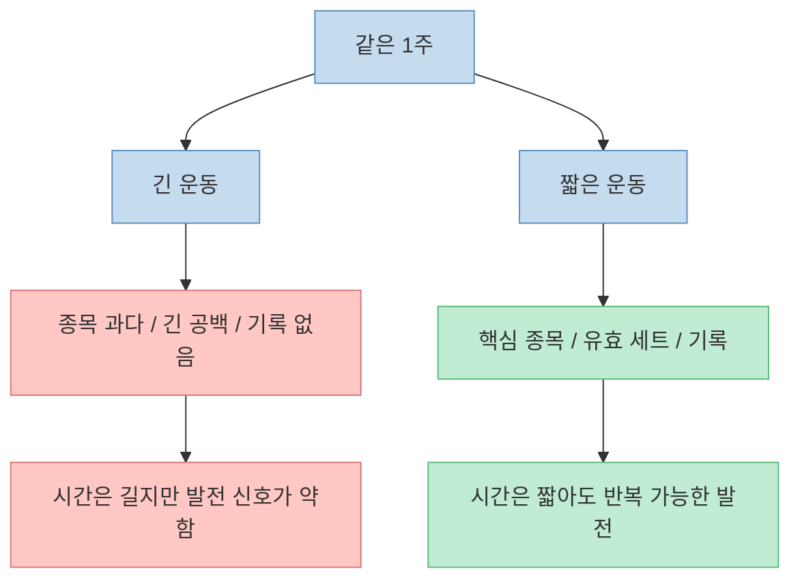
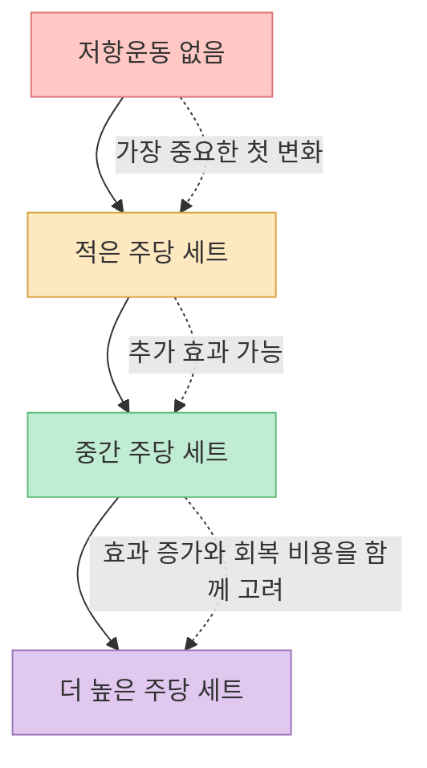
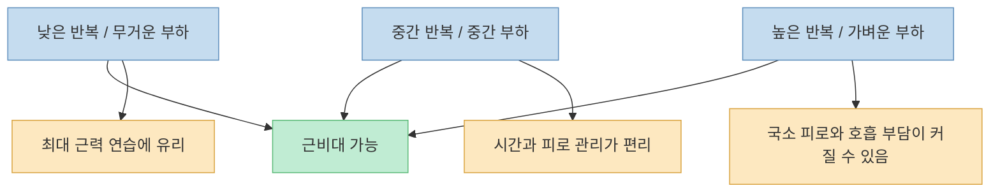
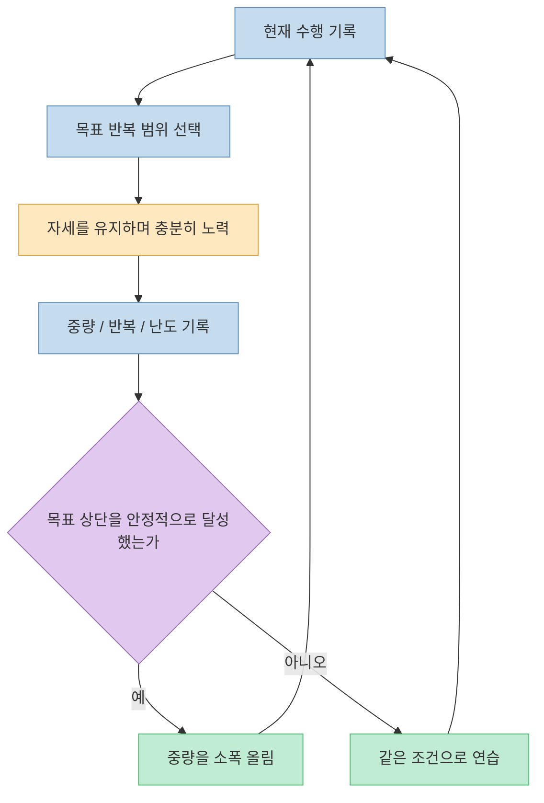
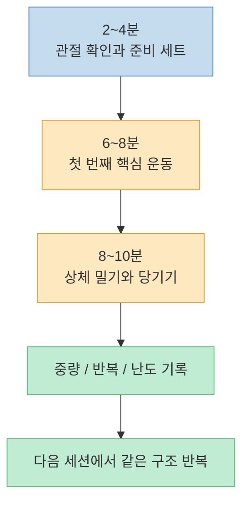
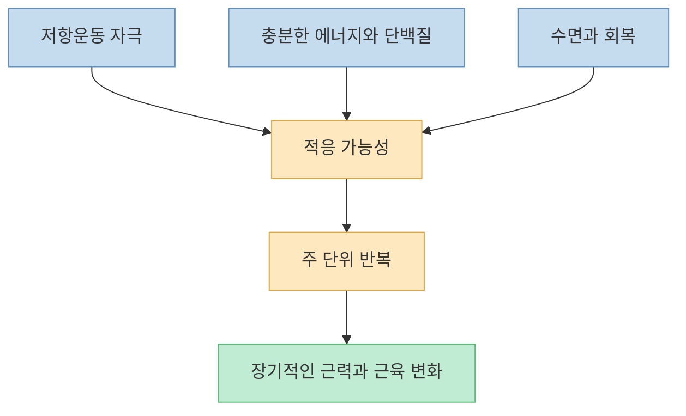

[이 Threads 포스트](https://www.threads.com/share/BAMlrbjfRK/)는 "`1시간 운동이 20분한테 지는 이유`"라는 강한 문장으로 시작합니다. 헬스장에서 여러 종목을 오래 수행하더라도 세트 사이에 집중력이 흩어지고 기록이 발전하지 않으면 몸이 바뀌지 않을 수 있는 반면, 소수의 운동을 짧고 강도 있게 반복하며 점진적으로 발전시키면 더 효율적일 수 있다는 주장입니다.

이 메시지의 방향은 꽤 타당합니다. 운동 시간은 결과를 만드는 직접 변수라기보다, **충분히 노력한 세트, 주당 누적 운동량, 회복, 그리고 장기간의 반복** 을 담는 그릇에 가깝기 때문입니다. 다만 "`주 5~9세트면 10세트의 정확히 80%`", "`6~12회가 정답`", "`나머지 80%는 영양과 수면`"처럼 숫자로 단정한 부분은 연구가 말하는 범위보다 강합니다.

그래서 이 글은 20분 운동을 만능 해법으로 소개하지 않습니다. 대신 **시간이 부족한 사람이 무엇을 남기고 무엇을 버려야 하는지** 를 최신 저항운동 근거에 맞춰 정리해 보겠습니다.

<!--more-->

## Sources

- [Threads - gentleman.kr의 "1시간 운동이 20분한테 지는 이유"](https://www.threads.com/share/BAMlrbjfRK/)
- [ACSM - 2026 Resistance Training Guidelines](https://acsm.org/resistance-training-guidelines-update-2026/)
- [Schoenfeld et al. - Weekly resistance training volume and muscle hypertrophy](https://pubmed.ncbi.nlm.nih.gov/27433992/)
- [Iversen et al. - Designing Time-Efficient Training Programs for Strength and Hypertrophy](https://pubmed.ncbi.nlm.nih.gov/34125411/)
- [Fyfe et al. - Minimal-Dose Resistance Training](https://pubmed.ncbi.nlm.nih.gov/34822137/)
- [Lopez et al. - Resistance Training Load Effects on Hypertrophy and Strength](https://pubmed.ncbi.nlm.nih.gov/33433148/)
- [Grgic et al. - Training to Repetition Failure or Non-Failure](https://pubmed.ncbi.nlm.nih.gov/33497853/)
- [Robinson et al. - Proximity to Failure, Strength, and Hypertrophy](https://pubmed.ncbi.nlm.nih.gov/38970765/)
- [Morton et al. - Protein Supplementation and Resistance Training Adaptation](https://pubmed.ncbi.nlm.nih.gov/28698222/)
- [Saner et al. - Sleep Restriction and Myofibrillar Protein Synthesis](https://pubmed.ncbi.nlm.nih.gov/32078168/)
- [ACSM - Physical Activity Guidelines](https://acsm.org/education-resources/trending-topics-resources/physical-activity-guidelines/)

## 1. 원문의 핵심은 "20분"이 아니라 낭비되는 시간을 줄이라는 것이다

원문은 오래 운동하는 사람의 전형을 "`많은 종목을 돌고 세트 사이에 휴대전화를 보지만, 몇 달 뒤에도 변화가 없는 사람`"으로 묘사합니다. 반대로 짧은 운동은 **부위당 한 종목, 3~4세트, 주 2회, 6~12회 반복, 점진적 과부하** 로 요약합니다.

여기서 1시간과 20분은 엄밀한 실험 조건이 아닙니다. 실제 비교 대상은 다음 두 방식에 더 가깝습니다.

따라서 "`20분이 1시간을 이긴다`"는 문장은 **짧아서 더 좋다** 는 뜻으로 읽으면 곤란합니다. 같은 품질이라면 충분한 운동량을 감당할 수 있는 긴 세션이 더 많은 자극을 제공할 수도 있습니다. 더 정확한 해석은 "`집중하지 못하는 1시간보다, 목적과 기록이 분명한 20분이 낫다`"입니다.

## 2. 운동 시간보다 중요한 것은 유효한 자극과 다시 할 수 있는 계획이다

저항운동의 결과를 세션 길이 하나로 설명하기 어려운 이유는 근력과 근비대가 여러 변수의 결합으로 만들어지기 때문입니다.

- 목표 근육에 충분한 저항이 걸리는가
- 세트 후반부에 의미 있는 노력이 들어가는가
- 주당 세트 수가 너무 적거나 회복할 수 없을 만큼 많지 않은가
- 동작 범위와 자세를 통제할 수 있는가
- 기록을 바탕으로 장기간 조금씩 발전하는가
- 다음 세션까지 회복하고 같은 계획을 반복할 수 있는가

[최소 용량 저항운동에 관한 2022년 리뷰](https://pubmed.ncbi.nlm.nih.gov/34822137/)는 전통적인 권장량보다 세션당 운동량이 적은 방식도 근력과 기능을 개선할 수 있다고 정리합니다. [시간 효율적인 근력·근비대 프로그램 리뷰](https://pubmed.ncbi.nlm.nih.gov/34125411/)는 짧은 시간에는 양측성 다관절 운동을 우선하고, 최소한 **하체 밀기, 상체 당기기, 상체 밀기** 패턴을 포함하라고 제안합니다.

즉 시간이 부족할수록 운동을 많이 끼워 넣는 것이 아니라, 여러 근육을 동시에 쓰는 핵심 동작을 먼저 배치해야 합니다. 20분이라는 제한은 운동 효과를 자동으로 높이지 않지만, **선택과 집중을 강제하는 좋은 설계 조건** 이 될 수 있습니다.

## 3. 주당 10세트는 목표점이지 모든 사람에게 적용되는 절대선이 아니다

원문은 2017년 메타분석을 근거로 부위당 주 10세트를 제시하고, 주 5~9세트만으로도 그 효과의 80%를 얻을 수 있다고 설명합니다. 실제 [Schoenfeld 연구팀의 메타분석](https://pubmed.ncbi.nlm.nih.gov/27433992/)은 주당 세트 수가 늘수록 근비대가 커지는 **용량-반응 관계** 를 보고했습니다. 분석은 주당 세트를 5세트 미만, 5~9세트, 10세트 이상으로 나누기도 했습니다.

그러나 이 결과를 "`5~9세트는 누구에게나 10세트의 정확히 80%`"라고 번역할 수는 없습니다. 연구마다 참가자의 훈련 경력, 운동 종목, 세트 강도, 측정 부위, 프로그램 기간이 달랐고, 세 구간을 비교한 결과에는 통계적 불확실성도 있었습니다. 이 수치는 개인에게 보장되는 환산표가 아니라 **적은 양에서도 상당한 효과가 시작되고, 더 많은 양에는 추가 효과가 있을 수 있다** 는 방향으로 이해해야 합니다.

[2026년 ACSM 저항운동 지침](https://acsm.org/resistance-training-guidelines-update-2026/)도 근비대가 주목적이라면 근육군당 주당 약 10세트의 비교적 높은 운동량을 목표로 제시합니다. 동시에 가장 큰 변화는 복잡한 최적화보다 **저항운동을 전혀 하지 않던 상태에서 꾸준히 하는 상태로 이동할 때** 생긴다고 강조합니다.

실전에서는 주당 6~8세트를 **시간이 부족한 사람의 시작점** 으로 삼을 수 있습니다. 몇 주 동안 반복하면서 근력, 반복 횟수, 근육통, 관절 불편, 수면, 다음 세션의 수행력을 기록한 뒤 운동량을 조절하는 편이 "`10세트 미만은 부족하다`"고 단정하는 것보다 합리적입니다.

## 4. 6~12회는 마법의 근비대 구간이 아니라 다루기 편한 선택지다

전통적으로 1~5회는 근력, 6~12회는 근비대, 15회 이상은 근지구력이라는 "`반복 횟수 연속체`"가 널리 알려져 있습니다. 이 구분에는 실용적인 의미가 있지만, 각 구간 사이에 생리학적 벽이 있는 것은 아닙니다.

[2021년 네트워크 메타분석](https://pubmed.ncbi.nlm.nih.gov/33433148/)은 자발적 실패까지 수행한 저부하, 중간 부하, 고부하 저항운동을 비교했습니다. 큰 틀에서 다양한 부하가 근비대를 만들 수 있었고, 더 무거운 부하는 최대 근력 향상에 더 유리했습니다. 즉 가벼운 무게로 많은 횟수를 하거나 무거운 무게로 적은 횟수를 해도 근육은 성장할 수 있지만, 목표와 피로의 성격이 달라집니다.

6~12회가 시간 제한 루틴에서 편리한 이유는 따로 있습니다. 지나치게 무거운 중량보다 준비 세트와 관절 부담을 관리하기 쉽고, 아주 가벼운 중량으로 20~30회 반복할 때보다 한 세트가 빨리 끝납니다. 따라서 **효율적인 기본 범위** 로 쓸 수는 있지만, "`이 범위 밖에서는 근육이 자라지 않는다`"는 규칙은 아닙니다.

## 5. 실패 훈련과 점진적 과부하는 같은 말이 아니다

원문에서 가장 중요한 부분은 세트 수보다 **점진적 과부하** 입니다. 지난주에 40kg으로 6회 했다면 다음에는 같은 무게로 7회를 하거나, 42.5kg으로 6회를 하는 식으로 발전하라는 설명입니다. 운동을 감각만으로 끝내지 않고 기록 가능한 변화로 바꾼다는 점에서 좋은 원칙입니다.

다만 매주 중량이나 반복 횟수가 반드시 올라야 성공인 것은 아닙니다. 훈련 경력이 쌓일수록 발전 속도는 느려지고, 수면·스트레스·질병·식사에 따라 하루 수행력도 달라집니다. 점진적 과부하는 다음 요소 중 하나 이상이 **몇 주에서 몇 달의 추세로 개선되는 과정** 에 가깝습니다.

- 같은 자세와 동작 범위에서 중량 증가
- 같은 중량에서 반복 횟수 증가
- 같은 일을 더 안정적인 기술로 수행
- 적절한 범위에서 세트 수 증가
- 같은 운동량을 더 낮은 주관적 난도로 수행

또한 점진적 과부하는 매 세트를 완전한 실패까지 밀어붙이라는 뜻이 아닙니다. [2021년 메타분석](https://pubmed.ncbi.nlm.nih.gov/33497853/)은 실패 훈련과 비실패 훈련 사이에서 근력과 근비대의 유의한 차이를 찾지 못했습니다. [2024년 실패 근접도 메타회귀](https://pubmed.ncbi.nlm.nih.gov/38970765/)는 근비대와 실패 근접도 사이의 관계를 탐색했지만, 개인과 프로그램에 맞는 정확한 지점을 단정할 때는 주의가 필요하다고 설명합니다.

시간이 부족한 사람에게는 매 세트를 실패까지 수행해 회복 비용을 키우는 방식보다, **자세가 무너지기 전 충분히 어려운 지점에서 멈추고 다음 운동에서도 성과를 낼 수 있게 관리하는 방식** 이 더 지속 가능할 수 있습니다.

## 6. 현실적인 20분 루틴은 전신의 기본 움직임을 번갈아 담아야 한다

원문은 벤치프레스 4세트와 풀업 4세트처럼 하루 두 종목을 예로 듭니다. 상체 밀기와 당기기를 짧게 훈련하는 예로는 이해하기 쉽지만, 이것만 반복하면 하체와 엉덩이의 큰 근육군이 빠집니다. 시간 효율을 높이려면 한 번에 모든 것을 억지로 넣기보다 **A와 B 두 세션을 번갈아 수행** 하는 편이 낫습니다.

### 세션 A

- 스쿼트 또는 레그프레스: 2~3 작업 세트
- 벤치프레스 또는 푸시업: 2~3 작업 세트
- 로우: 2~3 작업 세트

### 세션 B

- 루마니안 데드리프트 또는 다른 힙힌지: 2~3 작업 세트
- 오버헤드프레스: 2~3 작업 세트
- 풀업 또는 랫풀다운: 2~3 작업 세트

주 2회만 가능하다면 A와 B를 한 번씩 수행하고, 주 4회가 가능하다면 A-B-휴식-A-B처럼 배치할 수 있습니다. 이 예시는 개인 처방이 아니라 **밀기, 당기기, 무릎 중심 하체, 엉덩이 중심 하체** 를 빠뜨리지 않기 위한 설계 예시입니다.

20분 안에 들어가려면 다음과 같은 운영이 필요합니다.

상체 밀기와 당기기처럼 서로 직접 경쟁하지 않는 운동은 번갈아 수행해 시간을 줄일 수 있습니다. 그러나 고중량 스쿼트와 데드리프트처럼 기술과 회복이 중요한 운동의 휴식 시간을 무리하게 줄이면 수행 품질이 떨어질 수 있습니다. 준비 운동이 많이 필요한 초보자, 고중량을 다루는 숙련자, 기구 대기 시간이 긴 헬스장에서는 20분을 넘는 것이 자연스럽습니다.

## 7. 영양과 수면은 중요하지만 "나머지 80%"라는 계산은 아니다

원문은 운동을 건물의 도면, 음식과 수면을 철근과 콘크리트에 비유하면서 "`나머지 80%는 영양과 수면`"이라고 말합니다. 비유의 방향은 좋지만, 운동·영양·수면의 기여도를 고정된 백분율로 나눌 근거는 없습니다. 세 요소는 서로 대체하는 조각이 아니라 **모두 필요한 조건** 에 가깝습니다.

단백질은 저항운동 적응에 도움을 줍니다. [49개 연구를 종합한 메타분석과 메타회귀](https://pubmed.ncbi.nlm.nih.gov/28698222/)에서는 하루 총단백질 섭취량이 체중 1kg당 약 1.6g을 넘은 뒤 제지방량 증가에 대한 추가 이득이 뚜렷하게 커지지 않았습니다. 하지만 이는 건강한 성인의 평균적 연구 결과이지, 모든 사람에게 같은 목표를 처방하는 숫자는 아닙니다. 총섭취 열량, 기존 식단, 체중 감량 여부, 나이, 신장질환 같은 건강 상태에 따라 적절한 섭취량은 달라질 수 있습니다.

수면도 회복 과정과 연결됩니다. [젊은 남성을 대상으로 한 연구](https://pubmed.ncbi.nlm.nih.gov/32078168/)에서는 닷새 동안 매일 침대에 머문 시간을 4시간으로 제한했을 때 정상 수면군보다 근원섬유 단백질 합성률이 낮았습니다. 다만 이런 단기 생리 연구를 "`잠이 장기 근성장의 몇 퍼센트를 결정한다`"는 공식으로 바꾸면 안 됩니다.

원문 작성자가 "`5년 동안 하루 20분, 주 4회로 근육 11.8kg을 늘렸다`"고 말한 부분은 개인의 자기보고 사례입니다. 출발 체성분, 측정 방법, 식단, 훈련 경력 등 검증할 정보가 없으므로 **가능성을 보여 주는 경험담** 으로는 읽을 수 있지만, 같은 루틴을 따르면 누구나 재현할 수 있는 결과로 받아들여서는 안 됩니다.

## 8. 누구에게나 같은 20분이 적용되는 것은 아니다

20분 루틴은 시간이 부족해서 운동을 계속 미루는 건강한 성인에게 좋은 진입점이 될 수 있습니다. 하지만 다음 상황에서는 세션 길이보다 평가와 지도가 먼저입니다.

- 운동 중 날카로운 통증, 흉통, 심한 어지럼, 비정상적인 호흡곤란이 생기는 경우
- 최근 수술이나 근골격계 부상이 있는 경우
- 심혈관·대사·신장 질환 등으로 운동 또는 단백질 섭취 조절이 필요한 경우
- 임신 중이거나 고령에 처음 고강도 저항운동을 시작하는 경우
- 스쿼트, 힙힌지, 프레스 같은 기본 동작을 안전하게 수행하는 법이 불확실한 경우

또한 20분 저항운동은 심폐 체력을 위한 유산소 활동을 자동으로 대체하지 않습니다. [ACSM의 신체활동 지침](https://acsm.org/education-resources/trending-topics-resources/physical-activity-guidelines/)은 근력 강화 활동과 별도로 중강도 또는 고강도 유산소 활동을 권장합니다. "`근력운동을 짧게 끝냈으니 건강에 필요한 운동을 모두 했다`"고 해석하면 안 됩니다.

## 9. 실전 적용 포인트

처음부터 완벽한 20분 프로그램을 만들려고 하기보다 다음 순서로 시작하는 편이 좋습니다.

1. **주간 일정부터 고정합니다.** 주 2회로 시작하고, 수행과 회복이 안정되면 횟수나 세트를 늘립니다.
2. **한 세션에 핵심 동작 2~3개만 둡니다.** 전신의 밀기, 당기기, 무릎 중심 하체, 엉덩이 중심 하체가 한 주 안에 모두 들어가는지 확인합니다.
3. **작업 세트를 기록합니다.** 운동명, 중량, 반복 횟수, 세트 수, 마지막에 몇 회쯤 더 할 수 있었는지를 남깁니다.
4. **한 번에 하나만 올립니다.** 목표 반복 범위의 상단을 안정적으로 달성하면 중량을 소폭 늘리고, 자세가 흔들리면 그대로 유지합니다.
5. **20분을 절대 기준으로 만들지 않습니다.** 준비 운동이나 안전한 휴식에 시간이 더 필요하면 25~30분을 쓰는 편이 낫습니다.
6. **4~8주 추세로 판단합니다.** 하루의 느낌보다 반복 횟수, 중량, 동작 품질, 회복 상태가 장기적으로 좋아지는지 봅니다.

## 핵심 요약

- 20분이 1시간보다 본질적으로 우월한 것은 아닙니다. **집중된 유효 세트와 꾸준한 기록** 이 산만한 긴 운동보다 나을 수 있다는 뜻입니다.
- 주당 약 10세트는 근비대를 위한 유용한 목표점이지만, 개인에게 보장되는 절대선은 아닙니다. 적은 세트로 시작해 회복과 발전을 보며 조절할 수 있습니다.
- 6~12회는 시간과 피로를 관리하기 좋은 범위이지 유일한 근비대 범위가 아닙니다.
- 점진적 과부하는 매주 무조건 중량을 올리는 일이 아니라, 중량·반복·기술·난도가 장기적으로 발전하는 과정입니다.
- 완전한 실패까지 매 세트를 수행할 필요는 없습니다. 충분한 노력과 회복 가능성을 함께 관리해야 합니다.
- 단백질과 수면은 중요하지만 운동 결과를 고정된 백분율로 나눌 수는 없습니다.
- 20분 저항운동은 좋은 시작점일 수 있지만, 유산소 활동과 개인별 안전 평가를 대체하지 않습니다.

## 결론

운동에서 가장 비싼 자원은 장비나 프로그램이 아니라 **계속 쓸 수 있는 시간과 주의력** 입니다. 한 시간짜리 완벽한 계획을 자주 건너뛰는 것보다, 20분짜리 단순한 계획을 기록하며 반복하는 편이 실제 삶에서는 더 강할 수 있습니다.

다만 시간을 줄일수록 더 정교하게 선택해야 합니다. 전신의 기본 움직임을 남기고, 의미 있는 세트를 수행하고, 무리한 실패 훈련 대신 발전 추세를 기록해야 합니다. 결국 20분 운동의 진짜 장점은 "`최소 시간으로 최대 고통을 견디는 것`"이 아니라, **작지만 충분한 훈련을 다음 주에도 다시 할 수 있게 만드는 것** 입니다.
