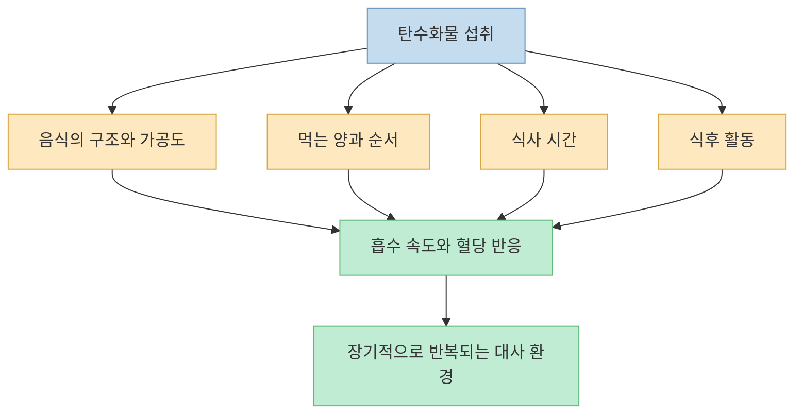
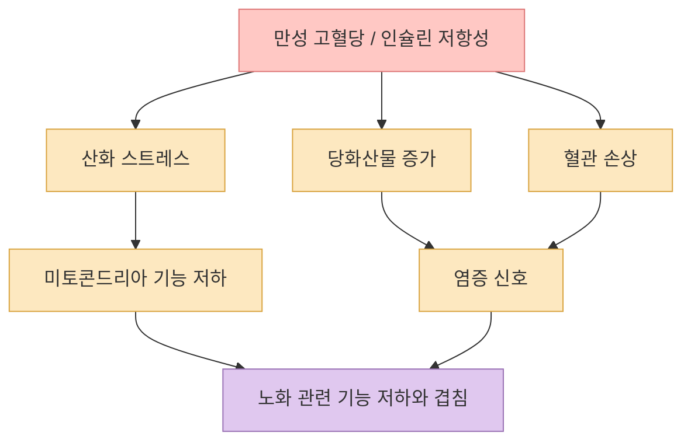
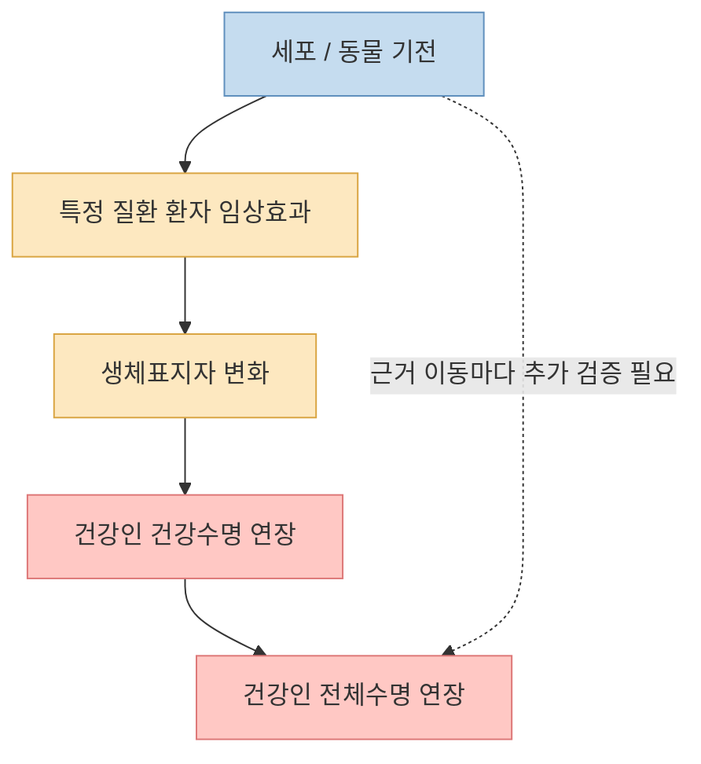
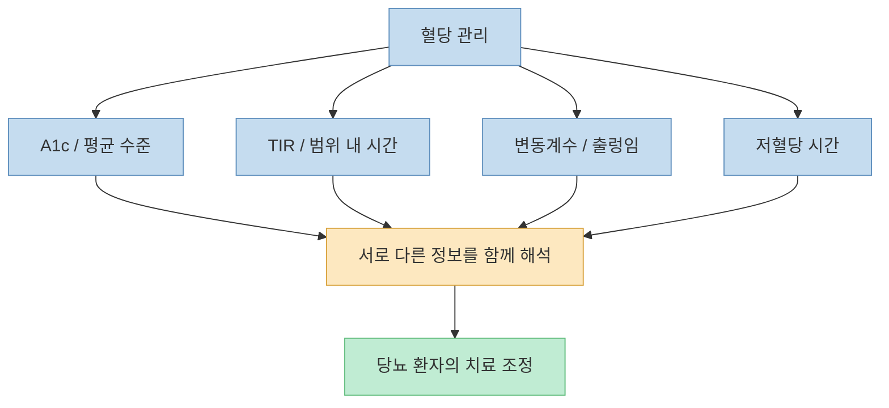
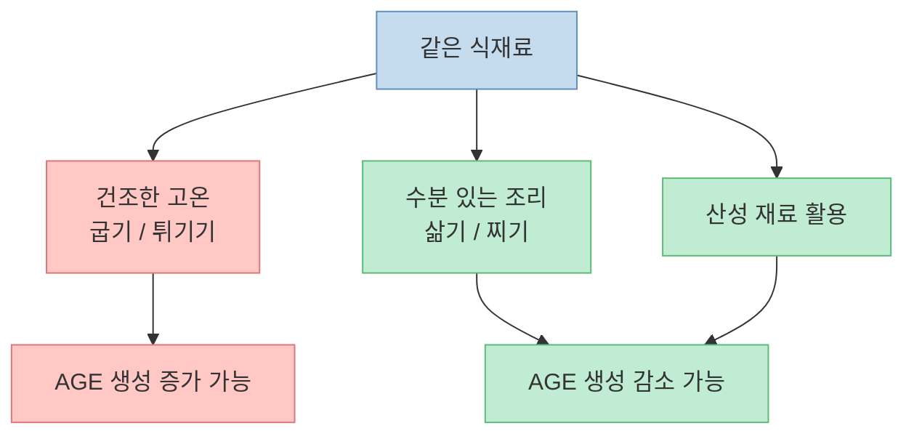
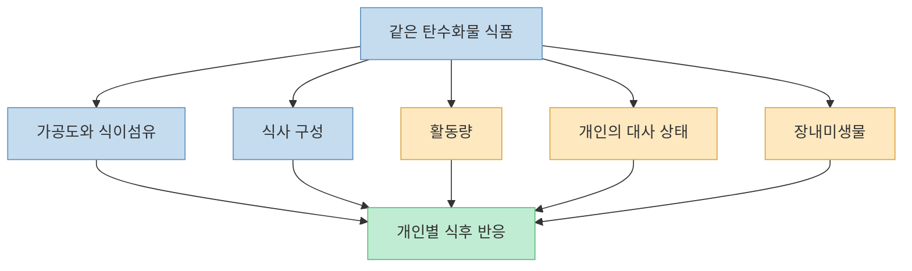
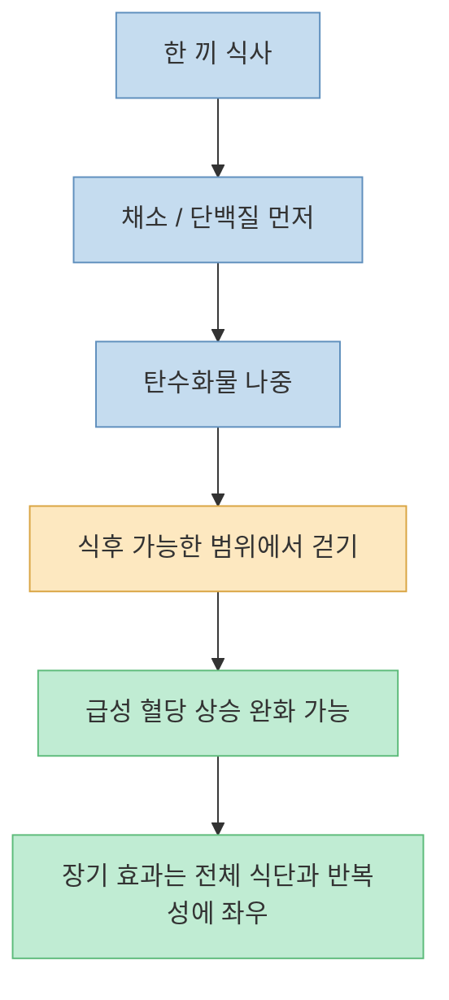
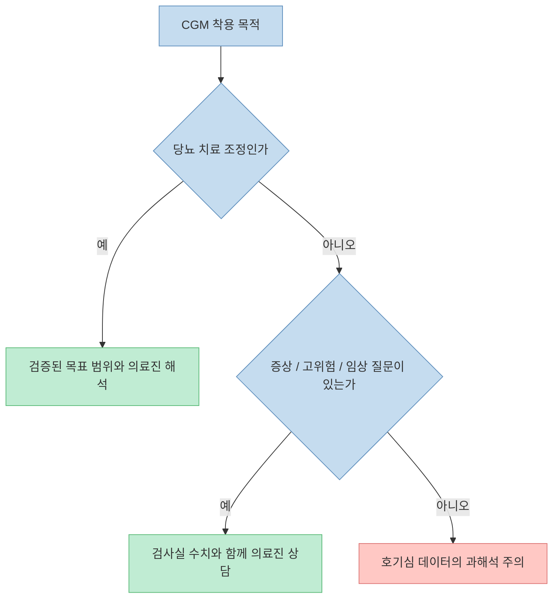
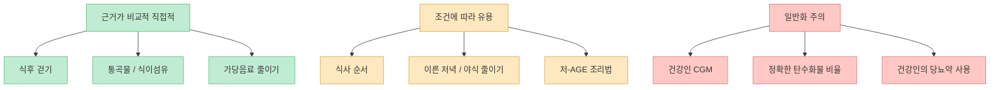

[닥터딩요의 이 영상](https://youtu.be/5DAdY7iLI4o?t=0)은 탄수화물을 먹어야 하는 이유를 다룬 전편에 이어, 이번에는 "`먹으라고 했지 많이 먹으라고 한 것은 아니다`"라는 경고로 시작합니다. 탄수화물 자체를 악마화하거나 완전히 끊는 대신, **혈당이 오르는 속도와 변동 폭, 음식의 구조, 먹는 시간, 식후 활동량** 을 함께 보자는 것이 영상의 핵심입니다.

영상은 약 34분 동안 당뇨를 가속 노화로 해석하고, 인슐린·mTOR·자가포식·당화산물을 연결한 뒤, 식후 걷기부터 통곡물과 식이섬유까지 일곱 가지 실천 원칙을 제시합니다. 큰 방향은 유용하지만 "`당뇨=노화`", "`치매=뇌 당뇨`", "`모든 국민이 CGM을 한 번은 달아야 한다`", "`밤 8시 이후에는 절대 먹지 말아야 한다`"처럼 근거보다 강한 표현도 섞여 있습니다.

그래서 이 글은 영상의 메시지를 그대로 옮기기보다, **무엇은 바로 실천해도 좋고 무엇은 조건을 붙여 이해해야 하는지** 를 연구 결과와 함께 구분해 보겠습니다.

<!--more-->

## Sources

- [YouTube - 탄수화물을 먹으면서 항노화하는 법ㅣ닥터딩요](https://youtu.be/5DAdY7iLI4o?si=4OrJxWTeCKc9siiO)
- [PubMed - Type 2 Diabetes Mellitus: A Metabolic Model of Accelerated Aging](https://pubmed.ncbi.nlm.nih.gov/40423634/)
- [PubMed - Glycemic Variability and Mortality in Type 2 Diabetes](https://pubmed.ncbi.nlm.nih.gov/35662611/)
- [ADA - Glycemic Goals and Hypoglycemia: Standards of Care in Diabetes](https://diabetesjournals.org/care/article-pdf/48/Supplement_1/S128/791506/dc25s006.pdf)
- [PubMed - Cooking Methods Affect Advanced Glycation End Products](https://pubmed.ncbi.nlm.nih.gov/40280130/)
- [PubMed - Personalized Nutrition by Prediction of Glycemic Responses](https://pubmed.ncbi.nlm.nih.gov/26590418/)
- [PubMed - Postprandial Walking and Glycemic Response](https://pubmed.ncbi.nlm.nih.gov/36715875/)
- [PubMed - Carbohydrate-Last Meal Pattern in Type 2 Diabetes](https://pubmed.ncbi.nlm.nih.gov/28989726/)
- [PubMed - CGM Reports in Individuals Without Diabetes](https://pubmed.ncbi.nlm.nih.gov/39936548/)
- [WHO - Carbohydrate Intake Guidance](https://www.who.int/news/item/17-07-2023-who-updates-guidelines-on-fats-and-carbohydrates)
- [WHO - Healthy Diet](https://www.who.int/news-room/fact-sheets/detail/healthy-diet)
- [PubMed - Dietary Carbohydrate Intake and Mortality](https://pubmed.ncbi.nlm.nih.gov/30122560/)

## 1. 영상의 핵심은 탄수화물의 존재보다 "처리 환경"이 중요하다는 것이다

영상은 탄수화물을 단순히 칼로리로만 보던 설명에서 벗어나, [혈당 변동성·당화산물·음식 구조·장내미생물·식사 시간·인슐린 분비](https://youtu.be/5DAdY7iLI4o?t=807)를 함께 보자고 제안합니다. 같은 탄수화물이라도 단 음료로 빠르게 마시는 경우와 통곡물·콩류를 천천히 먹는 경우, 식후에 계속 앉아 있는 경우와 걷는 경우의 대사 반응은 같지 않다는 뜻입니다.

이 관점은 탄수화물을 "`좋다`" 또는 "`나쁘다`"로 나누는 것보다 실용적입니다. 우리가 바꿀 수 있는 것은 탄수화물 유무 하나가 아니라 **원재료, 가공도, 식이섬유, 양, 식사 순서, 시간, 운동** 의 조합이기 때문입니다.

결국 질문은 "`탄수화물을 먹어도 되는가`"가 아니라 "`어떤 탄수화물을 어떤 조건에서 반복해서 먹고 있는가`"에 가깝습니다.

## 2. 당뇨를 가속 노화로 볼 수 있지만 "당뇨=노화"는 임상 정의가 아니다

영상은 [후성유전학적 생체시계, 텔로미어, 백세인 연구를 근거로 당뇨를 가속 노화라고 설명](https://youtu.be/5DAdY7iLI4o?t=45)합니다. 실제로 2형 당뇨는 산화 스트레스, 만성 염증, 미토콘드리아 기능 저하, 단백질 당화, 혈관 손상처럼 여러 노화 관련 과정과 겹칩니다. [2025년 리뷰](https://pubmed.ncbi.nlm.nih.gov/40423634/)도 2형 당뇨를 다기관의 노화 과정을 가속하는 대사 모델로 정리합니다.

하지만 "`당뇨가 곧 노화 그 자체`"라는 문장은 의학적 진단이 아니라 **기전을 이해하기 위한 비유** 입니다. 당뇨 환자에게 생물학적 노화 표지가 더 빠른 경향이 있어도, 당뇨 한 가지가 노화를 모두 설명하거나 혈당만 낮추면 노화가 역전된다는 뜻은 아닙니다. 작은 백세인 집단의 낮은 혈당 역시 장수의 원인인지, 장수한 사람에게 남은 특징인지 구분하기 어렵습니다.

따라서 가장 정확한 번역은 "`당뇨는 노화와 무관한 혈당 숫자 문제가 아니라, 노화 관련 손상 경로를 여러 개 함께 자극하는 질환`"입니다.

## 3. 인슐린·mTOR·자가포식·당화산물의 연결은 방향은 맞지만 스위치처럼 단순하지 않다

영상은 [탄수화물 섭취 뒤 인슐린이 증가하면 mTOR 신호가 활성화되어 성장 쪽으로 기울고, 자가포식이 억제될 수 있다](https://youtu.be/5DAdY7iLI4o?t=185)고 설명합니다. 또 과도한 포도당이 미토콘드리아의 활성산소 생성을 늘리고, 손상된 단백질과 미토콘드리아를 치우는 과정이 원활하지 않으면 세포 스트레스가 쌓인다고 말합니다.

이 설명은 복잡한 생물학을 이해하기 쉽게 만든 모델이지만, mTOR가 "`노화 버튼`", AMPK와 자가포식이 "`항노화 버튼`"처럼 항상 반대로만 움직이는 것은 아닙니다. mTOR는 근육 합성, 면역 반응, 상처 회복에 필요하고, 인슐린도 정상적인 에너지 저장과 혈당 조절에 필수입니다. 문제는 식사 후 일시적인 활성 자체가 아니라 **만성적인 에너지 과잉과 대사 이상이 지속되는 상황** 입니다.

영상이 이어서 설명하는 [최종당화산물(AGEs)과 RAGE 염증 신호](https://youtu.be/5DAdY7iLI4o?t=312)는 당뇨 합병증을 이해하는 중요한 축입니다. 혈중 포도당이 오래 높게 유지되면 단백질과 지질의 비효소적 당화가 늘고, 그 결과물이 조직 기능과 염증 경로에 영향을 줄 수 있습니다. 다만 "`혈당이 썩어서 독소가 된다`"는 표현은 직관적인 비유이지 실제 화학 과정을 그대로 묘사한 것은 아닙니다.

## 4. 당뇨약의 항노화 가능성: 치료 효과와 건강인 수명 연장은 완전히 다른 질문이다

영상은 [메트포르민, SGLT2 억제제, 아카보스, GLP-1 수용체 작용제](https://youtu.be/5DAdY7iLI4o?t=405)를 항노화 후보로 소개합니다. 동시에 [완전히 건강한 비당뇨인에게 수명 연장이 입증된 약은 아직 없다고 선을 긋습니다](https://youtu.be/5DAdY7iLI4o?t=744). 이 구분이 이 부분에서 가장 중요합니다.

SGLT2 억제제 다파글리플로진은 [당뇨 유무와 관계없이 만성콩팥병 환자의 신장·심혈관 복합 위험을 낮춘 임상시험](https://pubmed.ncbi.nlm.nih.gov/32970396/)이 있습니다. 그러나 이는 질병이 있는 사람의 치료 효과이지, 건강한 사람이 약을 먹으면 더 오래 산다는 결과가 아닙니다.

아카보스는 [유전적으로 다양한 수컷 생쥐의 중앙수명을 22% 늘린 연구](https://pubmed.ncbi.nlm.nih.gov/24245565/)가 있지만, 동물의 수명 결과를 사람에게 그대로 옮길 수 없습니다. 세마글루타이드는 [HIV 관련 지방비대증이 있는 성인을 대상으로 한 32주 연구의 사후분석에서 일부 후성유전학적 시계가 낮아진 결과](https://pubmed.ncbi.nlm.nih.gov/42156721/)가 나왔지만, 연구진도 작은 표본, 특정 환자군, 짧은 기간, 사후분석이라는 한계를 명시했습니다.

따라서 당뇨약을 "`항노화 보충제`"처럼 해석해서는 안 됩니다. 당뇨·비만·심부전·콩팥병 치료에 필요한 사람에게는 큰 이득이 있을 수 있지만, 처방 대상과 용량은 질환별 근거와 부작용을 함께 보는 의료 판단입니다.

## 5. 혈당 스파이크보다 넓게 보기: 평균, 변동성, TIR와 TITR

영상은 [같은 평균 혈당이라도 크게 오르내리는 패턴이 더 위험할 수 있다](https://youtu.be/5DAdY7iLI4o?t=831)고 설명하면서, 당화혈색소만 보지 말고 혈당 변동성과 **범위 내 시간(Time in Range, TIR)** 을 함께 보자고 제안합니다. TIR는 연속혈당측정 기록 가운데 목표 범위에 머문 시간의 비율입니다.

[ADA 당뇨 진료지침](https://diabetesjournals.org/care/article-pdf/48/Supplement_1/S128/791506/dc25s006.pdf)도 당뇨 관리에서 A1c와 함께 TIR, 목표 범위 초과 시간, 목표 범위 미만 시간을 활용합니다. [2형 당뇨 환자 1,839명을 추적한 연구](https://pubmed.ncbi.nlm.nih.gov/35662611/)에서는 평균 혈당이 비교적 잘 관리된 사람들 사이에서도 변동계수가 가장 큰 집단의 사망 위험이 더 높았습니다.

그러나 영상이 설명하는 [70~180mg/dL의 TIR와 70~140mg/dL의 더 엄격한 TITR](https://youtu.be/5DAdY7iLI4o?t=893)는 주로 **당뇨 환자의 관리와 예후 연구에서 나온 지표** 입니다. 이를 건강한 사람의 "`항노화 합격선`"으로 그대로 옮기는 근거는 부족합니다. 관찰연구에서 낮은 TIR와 높은 사망률이 연결돼도, TIR를 인위적으로 높이면 수명이 늘어난다는 인과가 자동으로 입증되는 것도 아닙니다.

핵심은 혈당 스파이크 하나를 두려워하기보다, 당뇨가 있다면 의료진과 함께 **평균·변동성·저혈당을 동시에 관리하는 것** 입니다.

## 6. 음식 속 당화산물은 탄수화물만의 문제가 아니다

영상은 [당뇨가 두려워 탄수화물을 줄이더라도 고기를 고온에서 바삭하게 굽는다면 음식 속 당화산물을 많이 섭취할 수 있다](https://youtu.be/5DAdY7iLI4o?t=1021)고 지적합니다. AGEs라는 이름 때문에 설탕이 많은 음식에만 있을 것 같지만, 실제 조리 과정에서는 단백질·지방이 많은 식품을 건조한 고온에서 굽거나 튀길 때도 생성량이 커질 수 있습니다.

[건강한 성인을 대상으로 한 2025년 무작위 교차시험](https://pubmed.ncbi.nlm.nih.gov/40280130/)은 같은 재료라도 삶기·찌기 같은 저-AGE 조리법과 굽기·베이킹 같은 고-AGE 조리법이 혈중 AGE 표지자와 지질 지표에 다른 영향을 줄 수 있음을 보였습니다. 기존 식품 데이터 연구도 [수분이 있는 조리, 낮은 온도, 짧은 조리시간, 레몬즙이나 식초 같은 산성 재료](https://pubmed.ncbi.nlm.nih.gov/20497781/)가 AGE 생성을 줄일 수 있다고 정리합니다.

다만 영상에 제시된 "`특정 음식의 AGE 수치`"는 측정법, 1회 제공량, 조리 시간과 온도에 따라 크게 달라질 수 있습니다. 고기를 절대 굽지 말라는 규칙보다 **매번 새까맣게 굽고 튀기는 조리를 반복하지 않고, 삶기·찌기·수육·샤부샤부 같은 방식을 섞는 것** 이 현실적인 적용입니다.

## 7. "치매는 뇌 당뇨"라는 말은 연결고리를 보여 주지만 진단명은 아니다

영상은 [치매를 뇌에 오는 당뇨병으로 볼 수 있다](https://youtu.be/5DAdY7iLI4o?t=1208)고 설명합니다. 알츠하이머병에서 뇌 인슐린 신호 저하, 포도당 대사 이상, 염증, 아밀로이드와의 연결이 연구되는 것은 사실입니다.

하지만 "`3형 당뇨`"는 알츠하이머병의 공식 임상 진단명이 아닙니다. 치매는 알츠하이머병, 혈관성 치매, 루이소체 치매 등 원인과 병리가 다양하고, 당뇨가 없는 사람에게도 생깁니다. 따라서 이 표현은 **대사 건강과 뇌 건강이 연결돼 있다는 연구 가설을 강조하는 비유** 로만 받아들이는 편이 안전합니다.

## 8. 탄수화물의 질: 세포 구조, 통곡물, 식이섬유, 개인차

영상은 [고구마를 주식으로 먹는 오키나와인과 키타바인의 사례](https://youtu.be/5DAdY7iLI4o?t=1241)를 들며, 탄수화물이 식물 세포 구조 안에 남아 있는 "`세포성 탄수화물`"과 정제된 탄수화물을 구분합니다. 특정 집단의 건강을 한 가지 음식으로 설명할 수는 없지만, 통곡물·콩류·채소·과일처럼 원래 구조와 식이섬유가 남아 있는 식품을 우선하자는 결론은 공신력 있는 지침과 맞습니다.

[WHO 탄수화물 지침](https://www.who.int/news/item/17-07-2023-who-updates-guidelines-on-fats-and-carbohydrates)은 탄수화물이 주로 통곡물, 채소, 과일, 콩류에서 오도록 권고합니다. 이는 탄수화물 비율 하나보다 **식품의 질과 자연적으로 포함된 식이섬유** 를 더 중요하게 본다는 뜻입니다.

영상은 이어서 [같은 바나나를 먹어도 사람마다 혈당 반응이 다르고 장내미생물이 중요한 변수라고 설명](https://youtu.be/5DAdY7iLI4o?t=1304)합니다. 실제 [800명과 46,898끼를 분석한 2015년 연구](https://pubmed.ncbi.nlm.nih.gov/26590418/)는 같은 음식에 대한 식후 혈당 반응이 크게 달랐고, 혈액지표·식습관·신체측정·활동량·장내미생물을 함께 사용한 예측 모델을 만들었습니다.

다만 장내미생물이 혈당 반응을 "`혼자 결정한다`"고 볼 수는 없습니다. 개인차는 음식의 양, 수면, 직전 운동, 근육량, 인슐린 민감성, 식사 구성 등 여러 요인의 결과입니다.

## 9. 먹는 시간과 순서: 식후 걷기는 강하고, "밤 8시"는 개인화가 필요하다

영상이 가장 먼저 제시하는 실천법은 [탄수화물을 먹었다면 식후에 15분 정도 걷는 것](https://youtu.be/5DAdY7iLI4o?t=1489)입니다. [식후 운동 메타분석](https://pubmed.ncbi.nlm.nih.gov/36715875/)도 걷기 같은 활동이 식전 운동이나 아무것도 하지 않는 경우보다 급성 식후 혈당 상승을 낮추며, 식사 뒤 가능한 한 빨리 시작할수록 효과가 큰 경향을 보고했습니다.

다만 이 메타분석은 8개의 작은 교차시험, 총 116명을 포함했고 장기적인 합병증이나 수명을 직접 본 연구는 아닙니다. 따라서 "`식후 걷기가 항노화를 보장한다`"보다 **낮은 비용으로 식후 혈당 부담과 하루 활동량을 함께 개선하는 습관** 으로 이해하는 편이 정확합니다.

영상은 [저녁에는 인슐린 감수성이 떨어지므로 밤 8시 이후에는 먹지 말자](https://youtu.be/5DAdY7iLI4o?t=1334)고 강하게 말합니다. 늦은 저녁이 같은 음식을 이른 저녁에 먹을 때보다 혈당 처리에 불리할 수 있다는 [무작위 교차시험](https://pubmed.ncbi.nlm.nih.gov/32525525/)은 있습니다. 그러나 대사 반응은 취침 시각, 교대근무, 생활 패턴, 유전적 차이에 따라 달라지므로 20:00가 모두에게 적용되는 절대 경계선은 아닙니다.

식사 순서에 대해서는 영상이 [채소와 단백질을 먼저, 탄수화물을 나중에 먹으면 혈당 면적이 약 55% 감소한다고 설명](https://youtu.be/5DAdY7iLI4o?t=1677)합니다. 이 수치는 [2형 당뇨 환자 16명의 특정 교차시험에서 탄수화물을 먼저 먹었을 때보다 나중에 먹었을 때 포도당 증가 면적이 53% 낮았던 결과](https://pubmed.ncbi.nlm.nih.gov/28989726/)와 가깝습니다.

하지만 매 끼니와 모든 사람에게 53~55%가 재현되는 것은 아닙니다. [건강한 성인의 식사 순서에 관한 2026년 체계적 문헌고찰](https://pubmed.ncbi.nlm.nih.gov/41837403/)도 급성 혈당 반응이 낮아지는 경향을 확인했지만, 포함된 연구는 6개, 참가자는 총 107명에 불과해 장기 효과를 확인할 더 큰 연구가 필요하다고 결론 내렸습니다.

실전에서는 "`밤 8시 절대 금식`"보다 **취침 직전의 큰 식사를 피하고, 가능하면 저녁을 조금 일찍 먹으며, 식후 10~15분 움직이는 방식** 이 더 유연하고 지속 가능합니다.

## 10. CGM은 유용한 의료도구지만 건강인 만능 검사는 아니다

영상은 [마르고 운동하는 자신도 CGM을 달기 전에는 혈당 스파이크를 몰랐다며 모든 사람이 한 번은 착용해 보길 권합니다](https://youtu.be/5DAdY7iLI4o?t=1708). 음식과 활동에 따른 실시간 반응을 관찰할 수 있다는 점에서 CGM은 강력한 피드백 도구입니다.

그러나 당뇨가 없는 사람의 CGM 수치를 어떻게 해석할지는 아직 표준화되지 않았습니다. [전문가 18명이 비당뇨인의 CGM 보고서를 판독한 연구](https://pubmed.ncbi.nlm.nih.gov/39936548/)에서도 추적검사가 필요한 사람을 고르는 데 전문가 간 일치도가 낮았습니다. 또 [비당뇨인의 웰니스 CGM 사용을 검토한 리뷰](https://pubmed.ncbi.nlm.nih.gov/38925143/)는 정상 범위 기준, 행동 변화, 장기 대사 개선을 뒷받침하는 고품질 근거가 부족하다고 지적합니다.

건강한 사람이 우연히 본 한 번의 높은 수치만으로 특정 음식을 병적으로 피하거나 "`반응성 저혈당`"을 자가진단하면 불필요한 불안과 식사 제한이 생길 수 있습니다. 반복되는 저혈당 증상, 공복혈당 이상, 당화혈색소 상승, 임신성 당뇨 위험처럼 명확한 임상 질문이 있다면 CGM보다 먼저 의료진과 표준 검사를 상의하는 편이 낫습니다.

## 11. 과당은 음식의 형태와 양을 빼고 "무한 노화 물질"로 부를 수 없다

영상은 [과당이 요산과 간 지방을 늘릴 수 있다며 액상과당, 단 음료, 과자, 아이스크림 같은 정제 과당 식품을 줄이자](https://youtu.be/5DAdY7iLI4o?t=1772)고 권합니다. 동시에 과일 속 과당은 양과 흡수 속도, 식품 구조가 달라 같은 방식으로 보지 않는다고 구분합니다.

이 결론은 합리적이지만 "`과당은 한계 없이 노화를 가속한다`"는 표현은 세포 기전을 일상 식사에 과도하게 확장한 것입니다. [가당음료와 지방간의 용량-반응 메타분석](https://pubmed.ncbi.nlm.nih.gov/31234281/)은 섭취량이 많을수록 비알코올성 지방간 위험이 높아지는 연관성을 보였지만, 이는 과당 한 분자만의 효과라기보다 음료 형태, 총에너지, 체중 증가, 전체 식습관이 함께 작용한 결과로 봐야 합니다.

따라서 실전 우선순위는 과일을 두려워하는 것이 아니라 **탄산음료, 가당 커피, 에너지음료, 액상과당이 많은 가공식품의 반복 섭취를 줄이는 것** 입니다.

## 12. 탄수화물 50~60%는 관찰연구의 최저점이지 개인별 정답지가 아니다

영상은 마지막 원칙으로 [총열량의 50~60%를 탄수화물로 먹으라고 제시하면서도, 일곱 원칙 가운데 근거가 가장 약하다고 스스로 설명](https://youtu.be/5DAdY7iLI4o?t=1896)합니다. 근거가 된 [2018년 ARIC 코호트와 메타분석](https://pubmed.ncbi.nlm.nih.gov/30122560/)에서는 탄수화물 비율과 사망률이 U자형 관계를 보였고, 관찰된 최저 위험 구간은 약 50~55%였습니다.

하지만 이는 식단을 무작위로 배정한 임상시험이 아니라 사람들이 무엇을 먹었는지 관찰한 연구입니다. 탄수화물을 줄이며 무엇으로 대체했는지도 중요했습니다. 동물성 지방·단백질 비중이 높은 저탄수화물 패턴은 사망률이 높았고, 식물성 지방·단백질로 대체한 패턴은 더 낮았습니다. 즉 "`탄수화물 52%`"보다 **탄수화물과 대체 식품의 질** 이 중요할 수 있습니다.

[WHO의 현재 건강 식단 자료](https://www.who.int/news-room/fact-sheets/detail/healthy-diet)는 대부분의 사람에게 정제되지 않은 탄수화물이 총에너지의 약 45~75% 범위에서 중요한 부분을 차지할 수 있다고 설명하면서, 통곡물·채소·과일·콩류를 우선하고 성인은 자연적으로 존재하는 식이섬유를 하루 최소 25g 섭취하도록 권고합니다.

따라서 50~60%는 인구 수준의 관찰 결과를 이해하는 참고 범위이지, 당뇨·임신·신장질환·고강도 운동·저체중·섭식장애 위험을 가진 개인에게 그대로 적용할 처방은 아닙니다.

## 13. 영상의 7가지 원칙을 근거 강도에 따라 다시 정리하면

영상은 마지막에 [식후 걷기, 야간 섭취 제한, 식사 순서, CGM, 정제 과당 줄이기, 통곡물과 식이섬유, 탄수화물 50~60%](https://youtu.be/5DAdY7iLI4o?t=1927)를 순서대로 정리합니다. 이를 근거의 직접성과 일반화 가능성으로 다시 나누면 다음과 같습니다.

### 바로 적용하기 좋은 원칙

- 식후 가능한 범위에서 10~15분 걷기
- 가당음료와 정제된 단 간식 줄이기
- 통곡물·콩류·채소·과일 등 식이섬유가 남은 탄수화물 선택
- 채소와 단백질을 먼저, 탄수화물을 뒤에 먹어 보기

### 생활 패턴에 맞춰 적용할 원칙

- 취침과 너무 가까운 큰 저녁이나 야식 피하기
- 굽기·튀기기만 반복하지 않고 삶기·찌기 조리 섞기
- 탄수화물 양을 활동량, 체중 목표, 질환 상태에 맞추기

### 의료적 맥락 없이 일반화하기 어려운 원칙

- 건강한 사람 모두가 CGM을 착용해야 한다는 주장
- 70~140mg/dL TITR을 보편적인 항노화 목표로 삼는 것
- 밤 8시를 모든 사람의 절대 금식선으로 정하는 것
- 탄수화물 50~60%를 모든 사람의 최적 비율로 처방하는 것
- 당뇨약을 건강인의 항노화 목적으로 사용하는 것

## 14. 실전 적용 포인트

영상의 조언을 무리 없이 적용하려면 거대한 식단 개편보다 한 주에 하나씩 바꾸는 편이 좋습니다.

1. **가장 자주 먹는 단 음료부터 바꿉니다.** 물, 무가당 차, 설탕을 넣지 않은 음료로 바꿔 액상당 빈도를 줄입니다.
2. **주식의 일부를 구조가 남은 탄수화물로 바꿉니다.** 흰쌀 전부를 한 번에 없애기보다 보리·현미·콩을 섞거나 콩류와 채소 반찬을 늘립니다.
3. **식사 순서를 시험합니다.** 채소와 단백질 반찬을 먼저 먹고 밥·빵·면은 뒤에 먹되, 총량이 자동으로 무효화되는 것은 아니라는 점을 기억합니다.
4. **식후 10~15분 걷습니다.** 세 끼 모두 어렵다면 가장 큰 식사 뒤 한 번부터 시작합니다.
5. **저녁과 취침 간격을 확보합니다.** 정확한 20:00보다 자신의 취침 시각을 기준으로 늦은 야식과 큰 식사를 줄입니다.
6. **조리법을 섞습니다.** 구이와 튀김만 반복하지 않고 국, 찜, 수육, 샤부샤부 같은 수분 조리를 활용합니다.
7. **수치는 의료 맥락에서 해석합니다.** 당뇨가 있다면 A1c·TIR·저혈당을 의료진과 함께 보고, 당뇨가 없다면 CGM 한 번의 스파이크보다 공복혈당·A1c·증상·전체 식습관을 먼저 봅니다.

인슐린이나 설포닐우레아 계열 약을 쓰는 사람, 저혈당이 반복되는 사람, 임신 중인 사람, 저체중·노쇠·섭식장애 위험이 있는 사람, 만성콩팥병이 있는 사람은 야간 탄수화물 제한이나 식사 간격 변경을 임의로 시작하지 않는 편이 안전합니다. 약의 용량과 식사 시간을 바꾸려면 의료진과 상의해야 합니다.

## 핵심 요약

- 당뇨는 노화 관련 손상 경로와 많이 겹치지만, "`당뇨=노화`"는 설명을 위한 비유이지 임상 정의가 아닙니다.
- 혈당은 평균만이 아니라 변동성과 저혈당까지 함께 봐야 하지만, TIR와 TITR 사망률 연구는 주로 당뇨 환자 자료입니다.
- 식후 걷기, 가당음료 줄이기, 통곡물·콩류·채소·과일과 식이섬유 늘리기는 가장 일반화하기 좋은 조언입니다.
- 탄수화물을 나중에 먹는 순서는 급성 혈당 상승을 낮출 수 있지만, 모든 식사에서 정확히 55% 감소하는 것은 아닙니다.
- 늦은 식사는 혈당 처리에 불리할 수 있지만 밤 8시는 보편적인 생물학적 금지선이 아닙니다.
- 굽고 튀기는 고온 건식 조리를 줄이고 삶기·찌기를 섞으면 음식 속 당화산물 노출을 낮출 수 있습니다.
- 비당뇨인의 CGM 해석 기준과 장기 효용은 아직 확립되지 않았습니다.
- 탄수화물 50~60%는 관찰연구에서 나온 인구 수준의 범위이지 개인별 처방이 아닙니다.
- 당뇨약의 치료 효과나 생체표지자 변화는 건강인의 수명 연장 증거와 다릅니다.

## 결론

이 영상에서 가장 유용한 메시지는 탄수화물을 끊으라는 것이 아닙니다. [결국 탄수화물을 건강하게 먹는 방법은 운동 여부와 음식의 형태에 크게 좌우된다는 결론](https://youtu.be/5DAdY7iLI4o?t=1987)입니다.

탄수화물의 비율을 소수점까지 맞추거나 모든 혈당 곡선을 평평하게 만들려고 하기보다, **가당음료를 줄이고, 구조가 남은 식품을 고르고, 탄수화물을 조금 뒤에 먹고, 식후에 걷고, 너무 늦은 큰 식사를 피하는 것** 이 먼저입니다. 이 행동들은 약이나 기기 없이도 시작할 수 있고, 영상에서 소개한 조언 가운데 근거와 실행 가능성이 가장 잘 만나는 지점입니다.
