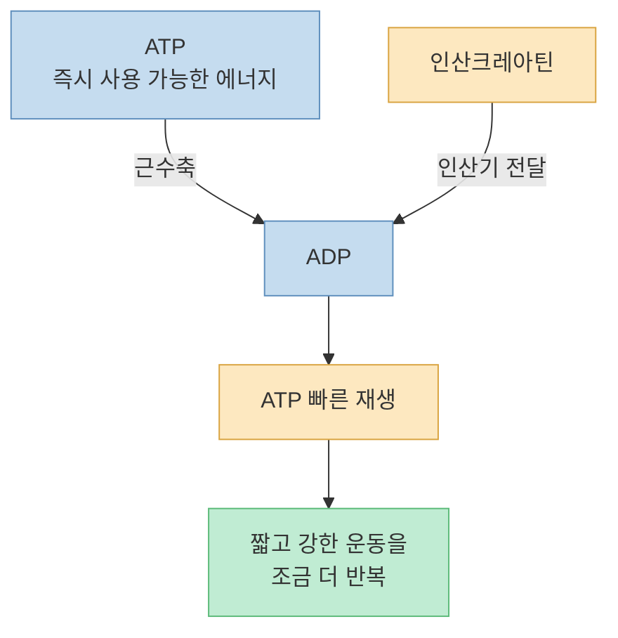
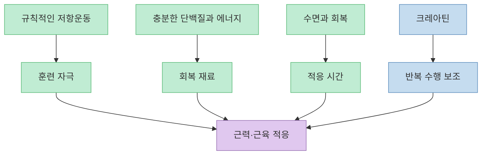
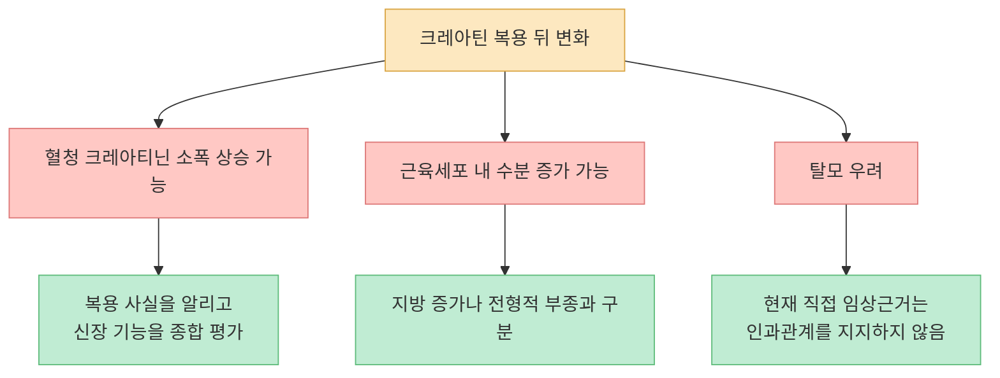
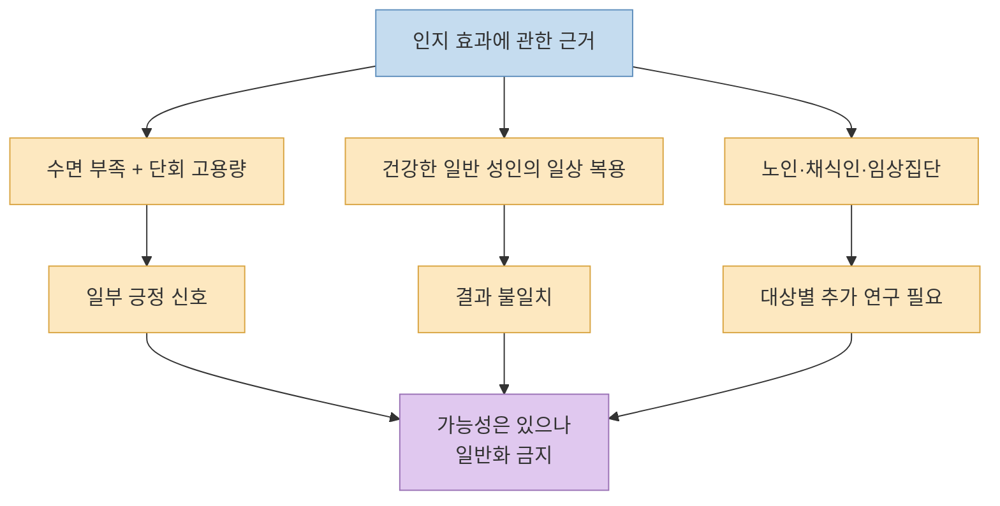
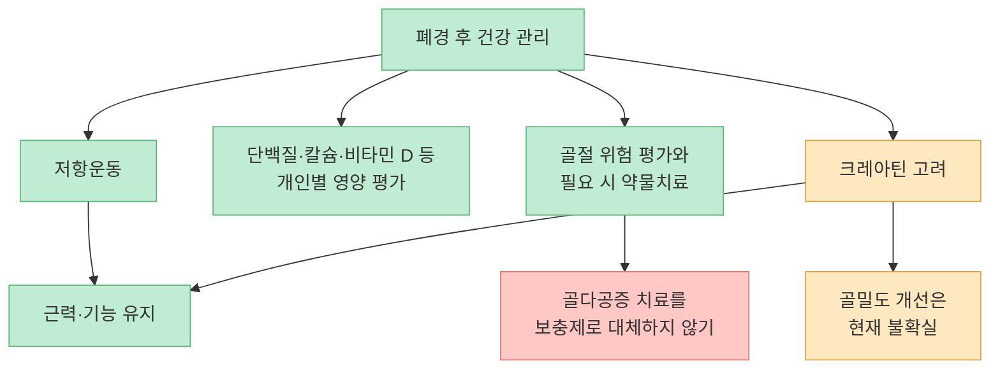
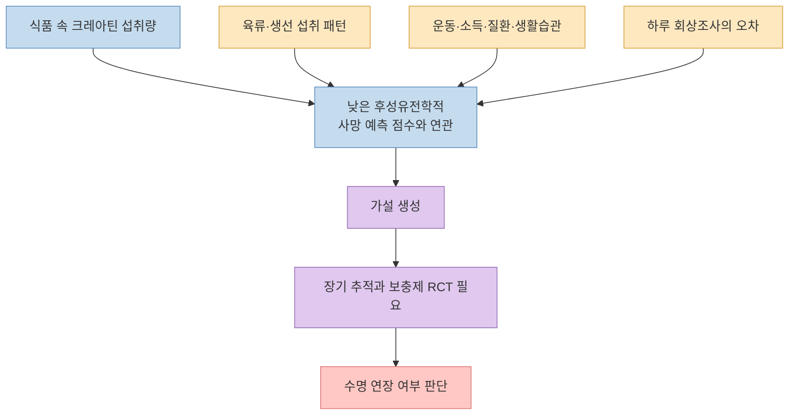
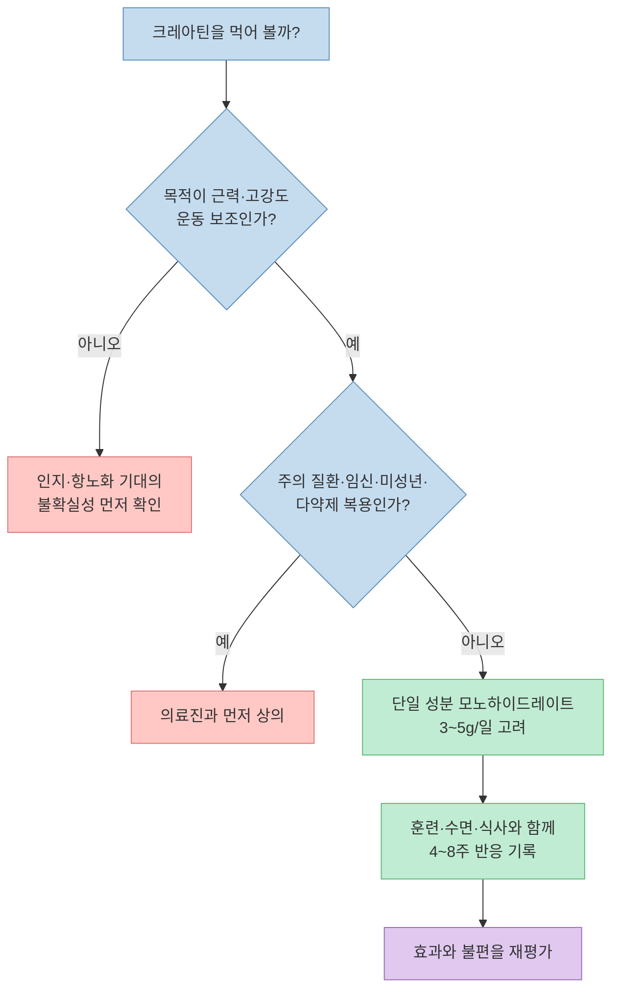

[닥터딩요의 이 영상](https://youtu.be/s9uMukg7fYg?t=0)은 크레아틴을 근육 운동용 보충제에서 더 넓은 건강 보조 수단으로 확장해 살펴봅니다. 영상은 ATP를 빠르게 재충전하는 원리부터 신장·탈모에 관한 오해, 수면 부족 상태의 인지 기능, 폐경 후 뼈 건강, 후성유전학적 노화 지표까지 약 30분 동안 다룹니다.

결론부터 말하면 크레아틴의 근력·고강도 운동 효과는 상당히 잘 확립돼 있지만, **인지·뼈·항노화 효과는 같은 확신으로 묶을 수 없습니다.** 특히 "`크레아틴을 1g 더 먹을 때마다 생체 나이가 1.3세 젊어진다`"는 관찰적 연관성을 보충제의 회춘 효과로 계산한 것이어서 그대로 받아들이면 안 됩니다.

따라서 이 글은 크레아틴을 찬양하거나 배척하기보다, **무엇은 바로 활용할 수 있고 무엇은 아직 흥미로운 가설에 머무는지** 를 근거의 강도에 따라 구분해 보겠습니다.

<!--more-->

## Sources

- [YouTube - 최신 과학이 밝힌 크레아틴의 항노화, 뇌인지 기능, 뼈 건강 추가 효과ㅣ닥터딩요](https://youtu.be/s9uMukg7fYg?si=zNaTwyK32NPzEbVY)
- [NIH ODS - Dietary Supplements for Exercise and Athletic Performance](https://ods.od.nih.gov/factsheets/ExerciseAndAthleticPerformance-HealthProfessional/)
- [PubMed - Effect of Creatine Supplementation on Kidney Function: Systematic Review and Meta-analysis](https://pubmed.ncbi.nlm.nih.gov/41199218/)
- [EFSA - Creatine and Improvement in Cognitive Function](https://efsa.onlinelibrary.wiley.com/doi/10.2903/j.efsa.2024.9100)
- [Scientific Reports - Single-dose Creatine during Sleep Deprivation](https://www.nature.com/articles/s41598-024-54249-9)
- [PubMed - Creatine Supplementation and Cognitive Function in Adults](https://pubmed.ncbi.nlm.nih.gov/39070254/)
- [PMC - Creatine and Exercise for Postmenopausal Bone Health](https://pmc.ncbi.nlm.nih.gov/articles/PMC10487398/)
- [PubMed - Creatine 3g/day and Bone Health in Older Women](https://pubmed.ncbi.nlm.nih.gov/31257405/)
- [Lifestyle Genomics - Creatine Intake and Epigenetic Biomarkers of Mortality](https://karger.com/lfg/article-pdf/doi/10.1159/000547260/4403126/000547260.pdf)
- [PMC - Does Creatine Cause Hair Loss?](https://pmc.ncbi.nlm.nih.gov/articles/PMC12020143/)
- [PubMed - Safety of Creatine Supplementation in Active Adolescents and Youth](https://pubmed.ncbi.nlm.nih.gov/30547033/)
- [PubMed - Creatine Monohydrate in Mental Disorders](https://pubmed.ncbi.nlm.nih.gov/41558805/)
- [OPSS - Why Third-party Certification Is Important](https://www.opss.org/article/why-third-party-certification-important-dietary-supplements)

> 이 글은 영상과 연구를 정리한 일반 정보입니다. 신장질환, 양극성장애, 임신·수유, 복용 중인 약이 있거나 미성년자라면 개인 판단으로 시작하지 말고 의료진과 상의해야 합니다.

## 1. 크레아틴의 본업: 짧고 강한 운동을 위한 빠른 에너지 재생

영상은 크레아틴을 우리 몸의 "`보조 배터리`"에 비유합니다. [세포가 ATP를 사용해 ADP로 바꾸면](https://youtu.be/s9uMukg7fYg?t=62), 근육에 저장된 인산크레아틴이 인산기를 내주어 ATP를 빠르게 다시 만드는 데 기여합니다. 에너지를 새로 무한히 생산하는 것이 아니라, 이미 가진 에너지 시스템이 순간적인 수요를 조금 더 버티게 하는 구조입니다.

이 특성 때문에 효과가 기대되는 운동과 그렇지 않은 운동이 갈립니다. 영상은 [스프린트나 고중량 근력운동처럼 순간적으로 에너지가 고갈되는 상황](https://youtu.be/s9uMukg7fYg?t=124)에서는 한두 번의 반복을 더 수행하게 도울 수 있지만, 중저강도 장거리 운동에서는 역할이 작다고 설명합니다. NIH ODS 역시 크레아틴이 반복되는 고강도·간헐적 활동의 힘과 파워를 높일 수 있지만 장거리 지구력 운동에는 가치가 작다고 정리합니다.

중요한 점은 크레아틴이 스스로 근육을 만드는 약이 아니라는 사실입니다. **저항운동의 훈련량과 품질을 높이는 보조 수단** 에 가깝습니다. 운동을 하지 않으면서 크레아틴만 먹는 것과, 점진적으로 중량을 높이는 훈련에 크레아틴을 더하는 것은 기대할 수 있는 결과가 다릅니다.

## 2. 신장, 수분 증가, 탈모: 오해를 풀되 조건을 지워서는 안 된다

### 크레아티닌 상승과 신장 손상은 같은 말이 아니다

영상은 [크레아틴 섭취 뒤 혈액의 크레아티닌이 올라갈 수 있는 이유](https://youtu.be/s9uMukg7fYg?t=248)를 세면대의 물높이에 비유합니다. 크레아티닌은 신장 기능을 추정하는 데 쓰이는 표지자이지만 크레아틴의 분해산물이기도 합니다. 따라서 보충제를 먹은 뒤 수치가 약간 올라간 상황을 곧바로 신장이 손상됐다는 뜻으로 해석하면 오류가 생길 수 있습니다.

[2025년 체계적 문헌고찰과 메타분석](https://pubmed.ncbi.nlm.nih.gov/41199218/)도 크레아틴 섭취군에서 혈청 크레아티닌이 소폭 상승할 수 있지만, 사구체여과율의 유의한 저하를 확인하지는 못했습니다. 영상이 [크레아틴 복용 사실을 의료진에게 알리고 필요하면 시스타틴 C처럼 다른 지표를 함께 보자고 한 대목](https://youtu.be/s9uMukg7fYg?t=373)은 실용적인 조언입니다.

다만 여기서 "`건강한 성인의 연구에서 신장 손상이 확인되지 않았다`"와 "`신장질환이 있는 누구에게나 안전하다`"를 혼동하면 안 됩니다. 기존 신장질환이 있거나 신장 기능에 영향을 주는 약을 복용한다면 검사 해석과 복용 여부를 담당 의료진이 결정해야 합니다.

### 몸무게가 늘 수 있지만 전형적인 부종과는 다르다

크레아틴은 근육세포 안으로 수분을 끌어들이므로, 특히 초기에는 체중이 늘 수 있습니다. 영상도 [근육세포의 수분 증가와 조직 사이에 물이 차는 부종을 구분](https://youtu.be/s9uMukg7fYg?t=404)합니다. NIH ODS는 한 달 안에 체중이 1~2kg 늘 수 있다고 설명하지만 개인차가 큽니다.

따라서 체중계 숫자가 올랐다고 지방이 그만큼 늘었다고 해석할 필요는 없습니다. 반대로 이 변화를 "`근육이 실제로 1~2kg 생겼다`"고 해석해도 안 됩니다. 초기 변화의 상당 부분은 수분입니다.

### 탈모를 일으킨다는 근거는 현재까지 약하다

탈모 우려는 과거 소규모 럭비선수 연구에서 DHT가 상승한 결과로 시작됐습니다. 영상은 [2025년 12주 무작위 대조시험에서 호르몬과 모낭 건강의 차이가 없었다](https://youtu.be/s9uMukg7fYg?t=497)고 설명합니다. 실제 해당 연구는 크레아틴 5g/일과 위약을 비교했으며 DHT, 테스토스테론, 모발 밀도와 성장 지표에서 유의한 악화를 찾지 못했습니다.

이 결과는 "`크레아틴이 탈모를 일으킨다`"는 주장을 지지하지 않지만, 젊은 남성을 대상으로 한 12주 연구 하나가 모든 연령·성별의 장기 위험을 완전히 닫은 것은 아닙니다. 복용 시점과 뚜렷하게 맞물린 탈모 변화가 있다면 보충제 하나로 단정하지 말고 피부과 진료로 다른 원인을 함께 확인하는 편이 낫습니다.

## 3. 인지 기능: 흥미로운 신호는 있지만 "두뇌 영양제"로 확정되지 않았다

뇌도 많은 에너지를 사용하는 기관이므로, 크레아틴이 뇌의 에너지 완충에 도움을 줄 수 있다는 가설은 생물학적으로 그럴듯합니다. 영상은 [21시간 수면을 제한한 성인에게 고용량 크레아틴을 한 번 투여한 실험](https://youtu.be/s9uMukg7fYg?t=590)을 소개합니다. 이 무작위·이중맹검·교차시험에서는 수면 부족 상태에서 일부 인지 수행과 뇌 에너지 대사 지표가 개선됐습니다.

하지만 이 연구에서 사용한 용량은 **체중 1kg당 0.35g의 단회 고용량** 이었습니다. 70kg 성인이라면 약 24.5g으로, 일반적인 유지용량 3~5g과 전혀 다릅니다. 한 번의 작은 실험을 근거로 밤샘할 때 고용량을 임의 복용하거나, 크레아틴으로 수면을 대신해도 된다고 결론 내려서는 안 됩니다.

영상은 [카페인이 피로 신호를 가리는 것과 달리 크레아틴은 에너지 완충을 돕는다고 비유](https://youtu.be/s9uMukg7fYg?t=652)합니다. 설명을 이해하는 데는 유용하지만, 둘이 실제 생활에서 서로 완전히 대체 가능한 물질이라는 뜻은 아닙니다.

더 넓은 결론은 아직 혼재합니다. [2024년 메타분석](https://pubmed.ncbi.nlm.nih.gov/39070254/)은 기억과 일부 주의 지표에서 긍정적 신호를 보고했지만 여러 인지 영역의 근거 확실성이 낮다고 평가했습니다. [EFSA의 2024년 과학적 검토](https://efsa.onlinelibrary.wiley.com/doi/10.2903/j.efsa.2024.9100)는 같은 문헌군을 검토하면서 참가자 중복 계산과 연구 방법의 문제를 지적했고, 일반 성인의 인지 기능 개선에 대한 인과관계가 확립되지 않았다고 결론 내렸습니다.

따라서 현재의 균형 잡힌 해석은 다음과 같습니다. **에너지 스트레스가 큰 특정 상황이나 일부 집단에서 도움이 될 가능성은 있지만, 모든 성인의 기억력·집중력을 확실히 높이는 보충제로 인정된 단계는 아닙니다.**

## 4. 여성과 뼈 건강: 근육 효과와 골밀도 효과를 분리해야 한다

영상은 [여성에게 특히 크레아틴과 근력운동을 권할 근거로 폐경 후 뼈 건강을 제시](https://youtu.be/s9uMukg7fYg?t=811)합니다. 근력과 근육량을 지키는 일이 낙상·기능 저하 위험을 줄이는 데 중요하다는 큰 방향은 타당합니다. 크레아틴이 저항운동의 적응을 돕는다면 간접적으로 일상 기능을 지키는 데 기여할 가능성도 있습니다.

그러나 **근육에 도움이 된다는 근거가 곧 골밀도를 높인다는 증거는 아닙니다.** 폐경 후 여성 237명이 운동 프로그램과 함께 2년간 크레아틴 또는 위약을 복용한 무작위 대조시험에서는 골밀도의 유의한 차이가 없었습니다. 다만 대퇴골 근위부의 일부 기하학적 지표는 개선됐습니다. 또 골감소증이 있는 고령 여성에게 3g/일을 2년 투여한 별도 연구에서도 뼈 건강 개선이 확인되지 않았습니다.

영상도 [골다공증 약을 대체한다는 뜻은 아니라고 선을 긋지만](https://youtu.be/s9uMukg7fYg?t=842), "`골다공증 약만큼 효과가 있다`"거나 "`골밀도 감소를 확실히 막는다`"는 인상을 남길 수 있습니다. 현재 근거로는 그렇게 말하기 어렵습니다.

여성도 근력운동을 해야 한다는 결론은 크레아틴의 골밀도 효과가 확정되지 않았더라도 변하지 않습니다. 다만 그 이유는 "`크레아틴이 뼈를 치료해서`"가 아니라, **저항운동이 근력·균형·일상 기능을 지키는 핵심 행동이기 때문** 입니다.

## 5. 항노화 연구: 연관성을 "몇 살 회춘"으로 계산할 수 없는 이유

영상의 핵심 소재는 [50세 이상 미국 성인의 식이 크레아틴 섭취량과 후성유전학적 사망 예측 지표를 분석한 2025년 연구](https://youtu.be/s9uMukg7fYg?t=1027)입니다. 연구에는 NHANES 1999~2002 자료의 4,983명이 포함됐고 평균 연령은 67.6세, 평균 식이 크레아틴 섭취량은 0.77g/일이었습니다.

분석에서는 식품으로 섭취한 크레아틴이 많을수록 GrimAgeMort와 GrimAge2Mort 점수가 낮은 연관성이 나타났습니다. 인구학적 변수 등을 보정한 모델에서 1g/일 증가가 각 지표의 약 1.3점 감소와 연결됐습니다. 영상은 이를 바탕으로 [3g을 더 먹으면 생체 나이가 약 네 살 어려진다고 산술적으로 해석](https://youtu.be/s9uMukg7fYg?t=1089)합니다.

하지만 이 계산은 다음 이유로 성립하지 않습니다.

1. **단면 관찰연구** 라서 크레아틴이 지표를 낮췄는지, 더 건강한 생활을 하는 사람이 크레아틴이 든 식품을 더 먹었는지 시간 순서를 알 수 없습니다.
2. 섭취량은 **하루 한 번의 24시간 회상조사** 로 추정돼 평소 식습관을 정확히 반영하지 못할 수 있습니다.
3. 조사한 것은 음식 속 크레아틴이며 **보충제 섭취는 포함하지 않았습니다.** 식품에서 관찰된 관계를 보충제 3g에 그대로 외삽할 수 없습니다.
4. GrimAgeMort는 실제 나이를 되돌리는 측정값이 아니라 DNA 메틸화로 계산한 **간접 사망위험 예측 지표** 입니다.
5. 크레아틴이 많은 육류·생선을 먹는 사람의 단백질, 비타민 B12, 철, 소득, 운동, 질환 상태 같은 **남은 교란요인** 을 완전히 제거할 수 없습니다.
6. 논문이 보고한 상관계수는 약 -0.04 수준으로 작았습니다. 통계적으로 유의하다는 사실과 개인에게 큰 회춘 효과가 있다는 주장은 다릅니다.

영상도 뒤에서는 [단면연구라 인과관계를 밝힐 수 없고 보충제 자료가 빠졌다고 한계를 설명](https://youtu.be/s9uMukg7fYg?t=1308)하며, [사람에게 수명 연장이 입증된 연구는 없다고 정리](https://youtu.be/s9uMukg7fYg?t=1368)합니다. 이 후반부의 신중한 설명이 앞의 "`네 살 회춘`"이라는 문장보다 과학적으로 더 정확합니다.

크레아틴이 고령자의 저항운동을 돕고 근력과 기능 유지에 기여한다면, 그 자체로 **건강수명을 지지하는 간접 도구** 가 될 수는 있습니다. 그러나 그것은 생물학적 나이를 되돌리는 항노화 물질이나 수명 연장제로 입증됐다는 뜻이 아닙니다.

## 6. 복용한다면: 단순한 형태, 보수적인 용량, 꾸준한 섭취

영상은 [별도 로딩 없이 크레아틴 모노하이드레이트를 매일 3~5g 먹는 방법](https://youtu.be/s9uMukg7fYg?t=1616)을 제안합니다. 일반적인 건강한 성인이 근력·고강도 운동 보조 목적으로 선택한다면 근거가 가장 많은 형태는 **크레아틴 모노하이드레이트** 입니다. 더 비싼 변형 제품이 근육 크레아틴 증가, 흡수, 안전성에서 우월하다고 입증되지는 않았습니다.

복용 전략은 복잡하지 않습니다.

- **형태:** 단일 성분 크레아틴 모노하이드레이트를 우선합니다.
- **용량:** 보통 3~5g/일을 사용합니다. 체격과 목적, 위장관 내약성에 따라 달라질 수 있습니다.
- **로딩:** 빠르게 저장량을 높이려면 5~7일간 20g/일을 나눠 먹는 연구 방식도 있지만 필수는 아닙니다. 3~5g/일을 꾸준히 먹어도 더 천천히 포화됩니다.
- **시간:** 운동 직후만 고집할 결정적 이유는 없습니다. 매일 잊지 않고 먹을 수 있는 시간이 더 중요합니다.
- **불편감:** 한 번에 먹었을 때 속이 불편하다면 용량을 나누거나 식사와 함께 복용하는 방법을 고려할 수 있습니다.
- **기대치:** 체중 증가 일부는 세포 내 수분이며, 보충제만으로 운동·단백질·수면을 대체할 수 없습니다.

영상은 [독일산 특정 원료 마크를 제품 선택의 정답처럼 제시](https://youtu.be/s9uMukg7fYg?t=1647)합니다. 특정 상표 원료가 품질 관리의 한 단서가 될 수는 있지만, "`독일산은 안전하고 중국산은 독성 위험이 있다`"처럼 원산지만으로 품질을 단정할 근거는 충분하지 않습니다.

더 일반화할 수 있는 기준은 다음과 같습니다.

1. 크레아틴 모노하이드레이트의 **1회 함량이 명확히 표시** 돼 있는가?
2. 불필요한 혼합 성분이나 "`독점 블렌드`"가 없는가?
3. 제조사와 로트, 유통기한, 고객 문의 정보가 분명한가?
4. 가능하면 NSF Certified for Sport, Informed Sport, USP Verified처럼 신뢰할 수 있는 **독립 제3자 시험·인증** 을 받았는가?

제3자 인증도 효능과 개인별 안전성을 보장하는 만능 도장은 아닙니다. 다만 표시 성분과 실제 내용물이 맞는지, 오염물질이나 스포츠 금지성분을 어떤 범위로 검사했는지 확인하는 데 도움을 줍니다.

## 7. 먼저 의료진과 상의해야 하는 사람

영상은 [신장질환, 양극성장애, 임신·수유, 알레르기가 있는 사람을 주의 대상으로 제시](https://youtu.be/s9uMukg7fYg?t=1522)하고, [청소년은 안전성 자료가 충분하지 않다며 보수적으로 접근](https://youtu.be/s9uMukg7fYg?t=1584)합니다. "`절대 금지`"와 "`자료 부족으로 전문가 판단이 필요`"는 다르지만, 개인 판단으로 시작하지 않는다는 실천은 같습니다.

특히 다음에 해당한다면 먼저 의료진과 상의하는 편이 안전합니다.

- 만성콩팥병이 있거나 신장 기능 검사에서 이상을 들은 사람
- 신장에 영향을 줄 수 있는 약을 복용하는 사람
- 양극성장애 또는 조증·경조증 병력이 있는 사람
- 임신 중이거나 수유 중인 사람
- 미성년자
- 여러 보충제와 약을 동시에 복용하는 사람
- 원인을 모르는 부종, 급격한 체중 변화, 지속적인 위장관 증상이 있는 사람

[2025년 정신질환 대상 체계적 문헌고찰](https://pubmed.ncbi.nlm.nih.gov/41558805/)에서는 연구 수가 매우 적었고, 양극성 우울증 시험의 크레아틴군 17명 중 2명에게 경조증·조증이 보고됐습니다. 작은 수치라 위험의 크기를 확정할 수는 없지만, 양극성장애 환자가 임의 복용을 피해야 할 이유로는 충분합니다.

청소년 연구도 성인보다 훨씬 제한적입니다. "`위험이 입증되지 않았다`"를 "`장기 안전성이 입증됐다`"로 바꾸어 읽으면 안 됩니다. 운동선수인 미성년자라면 보호자, 소아청소년과 또는 스포츠의학·영양 전문가와 함께 식사와 훈련부터 점검해야 합니다.

## 실전 적용 포인트

크레아틴을 고민하고 있다면 다음 순서가 현실적입니다.

1. **목적을 먼저 정합니다.** 근력운동의 반복 수행과 적응을 돕는 것이 목적이라면 근거가 가장 분명합니다. 막연한 회춘이나 두뇌 향상이 목적이라면 기대치를 낮춰야 합니다.
2. **기본 행동을 확인합니다.** 주 2~3회 이상의 저항운동, 충분한 단백질과 총에너지, 수면이 빠져 있다면 먼저 그 기반을 만듭니다.
3. **건강 상태를 확인합니다.** 신장질환, 양극성장애, 임신·수유, 미성년자, 다약제 복용은 전문가 상담 영역입니다.
4. **단일 성분 모노하이드레이트를 고릅니다.** 화려한 변형 원료보다 성분표와 함량, 제3자 인증을 봅니다.
5. **3~5g/일을 일관되게 사용합니다.** 로딩이나 운동 직후 섭취는 필수가 아닙니다.
6. **반응을 기록합니다.** 체중, 위장관 불편, 운동 수행, 복용 누락을 4~8주 정도 기록하면 막연한 느낌보다 판단하기 쉽습니다.
7. **검사 전에 복용 사실을 알립니다.** 크레아티닌을 해석하는 의료진에게 제품명과 용량, 복용 기간을 전달합니다.

## 핵심 요약

- 크레아틴은 인산크레아틴 시스템을 통해 ATP의 빠른 재생을 도와 **반복되는 짧고 강한 운동** 의 수행과 훈련 적응을 보조합니다.
- 건강한 성인의 일반적인 용량에서 신장 손상을 뒷받침하는 근거는 부족하지만, 혈청 크레아티닌이 소폭 올라 검사 해석에 영향을 줄 수 있습니다.
- 초기 체중 증가는 주로 세포 내 수분과 관련될 수 있으며, 지방 증가나 전형적인 부종과 같지 않습니다.
- 2025년 12주 시험에서는 탈모나 DHT 증가가 확인되지 않았지만, 모든 사람의 장기 위험을 완전히 배제한 것은 아닙니다.
- 수면 부족 상태의 고용량 단회 연구에서 인지 효과가 나타났지만, 일반 성인의 일상적인 두뇌 향상에 대한 인과관계는 아직 확립되지 않았습니다.
- 폐경 후 여성의 근력과 기능 유지에는 저항운동이 중요하지만, 크레아틴이 골밀도를 확실히 개선한다는 근거는 없습니다.
- 식품 속 크레아틴과 낮은 후성유전학적 사망 예측 점수의 연관성은 **항노화나 수명 연장의 증명** 이 아닙니다.
- 제품은 특정 국가나 상표만 보기보다 단일 성분 모노하이드레이트, 명확한 함량, 신뢰할 수 있는 제3자 인증을 확인하는 편이 낫습니다.
- 신장질환, 양극성장애, 임신·수유, 미성년자, 다약제 복용자는 먼저 의료진과 상의해야 합니다.

## 결론

크레아틴은 근거가 풍부한 운동 보충제입니다. 그래서 오히려 경계를 분명히 해야 합니다. **고강도 운동과 저항운동의 보조 효과** 는 강한 근거 위에 있지만, **일반적인 인지 향상, 골밀도 개선, 항노화와 수명 연장** 은 아직 같은 수준의 결론이 아닙니다.

영상의 표현을 가장 안전하게 번역하면 이렇습니다. "`크레아틴은 모두를 젊게 만드는 필수 영양소`"가 아니라, **건강한 성인이 명확한 운동 목적을 가지고 사용할 때 효과와 안전성 자료가 비교적 잘 쌓인 선택지** 입니다. 고령자에게도 가장 먼저 붙어야 할 조건은 보충제 자체보다 저항운동입니다.

보충제의 가치는 기본을 대신할 때가 아니라 기본을 조금 더 잘 수행하게 할 때 생깁니다. 크레아틴을 선택한다면 회춘의 숫자보다 **꾸준한 훈련, 적절한 용량, 검사 정보 공유, 개인 반응 기록** 에 집중하는 것이 가장 과학적인 사용법입니다.
