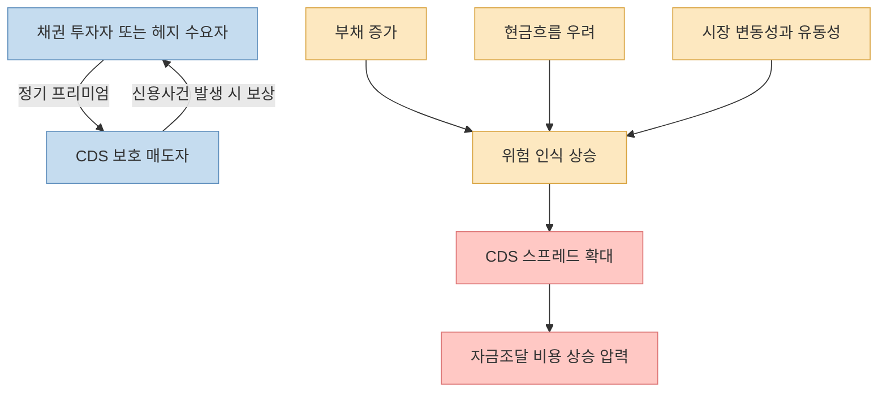
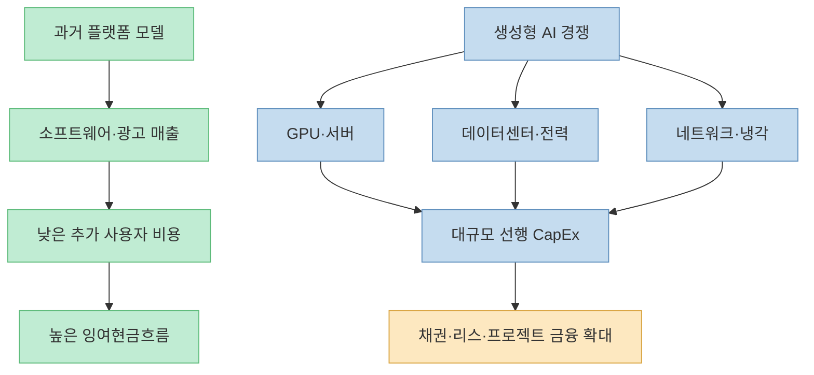
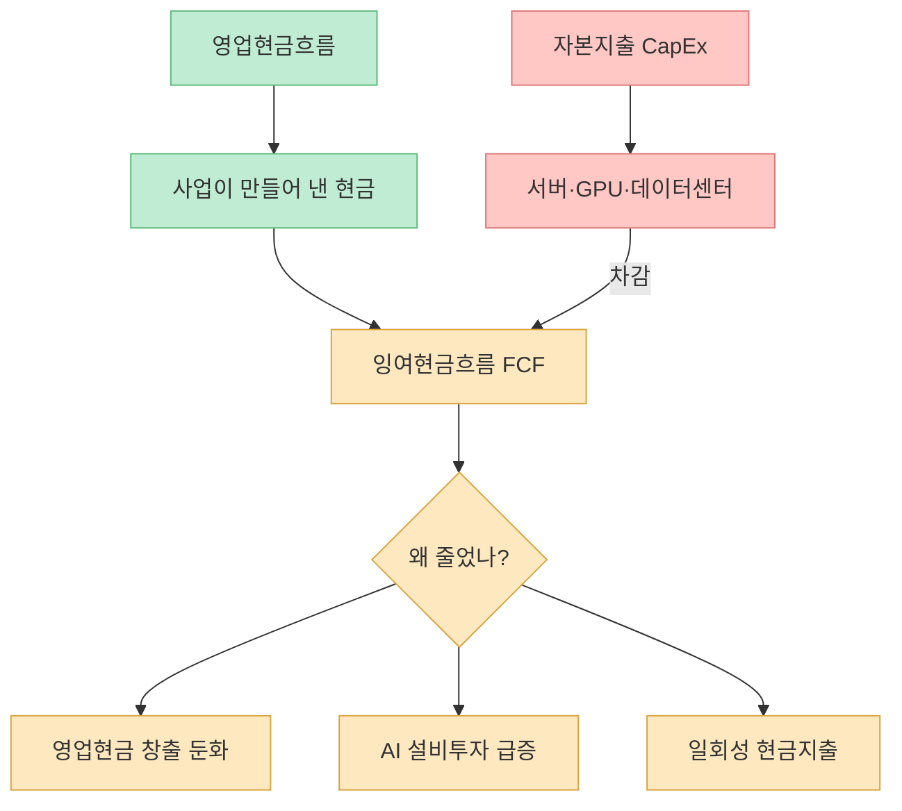
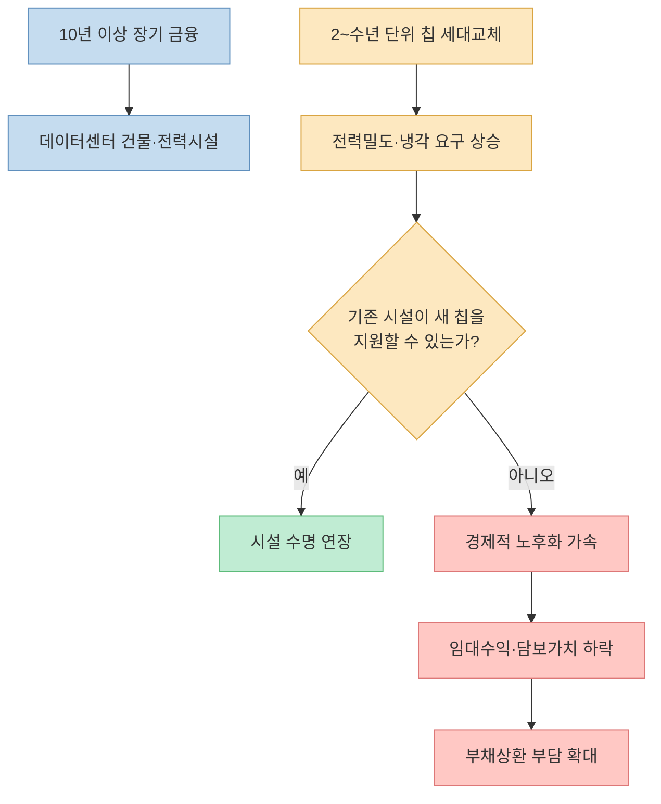
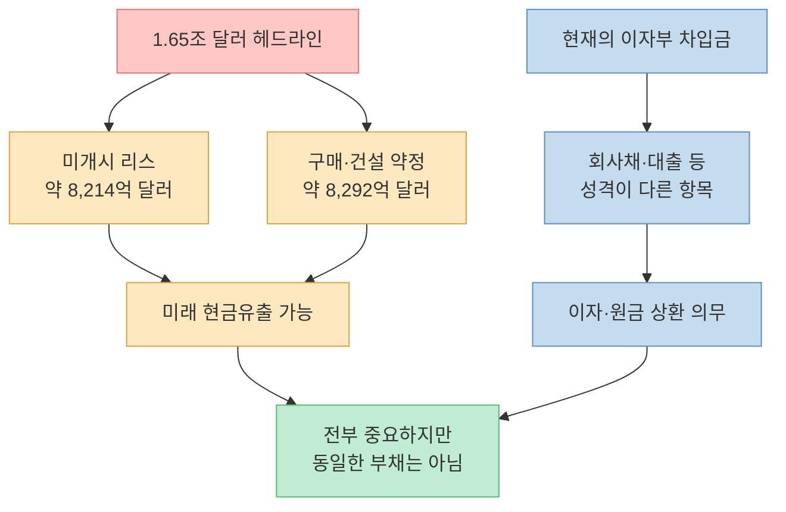
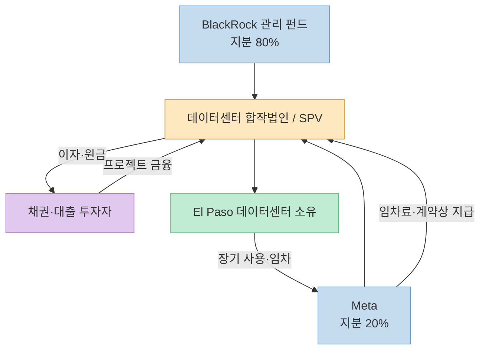
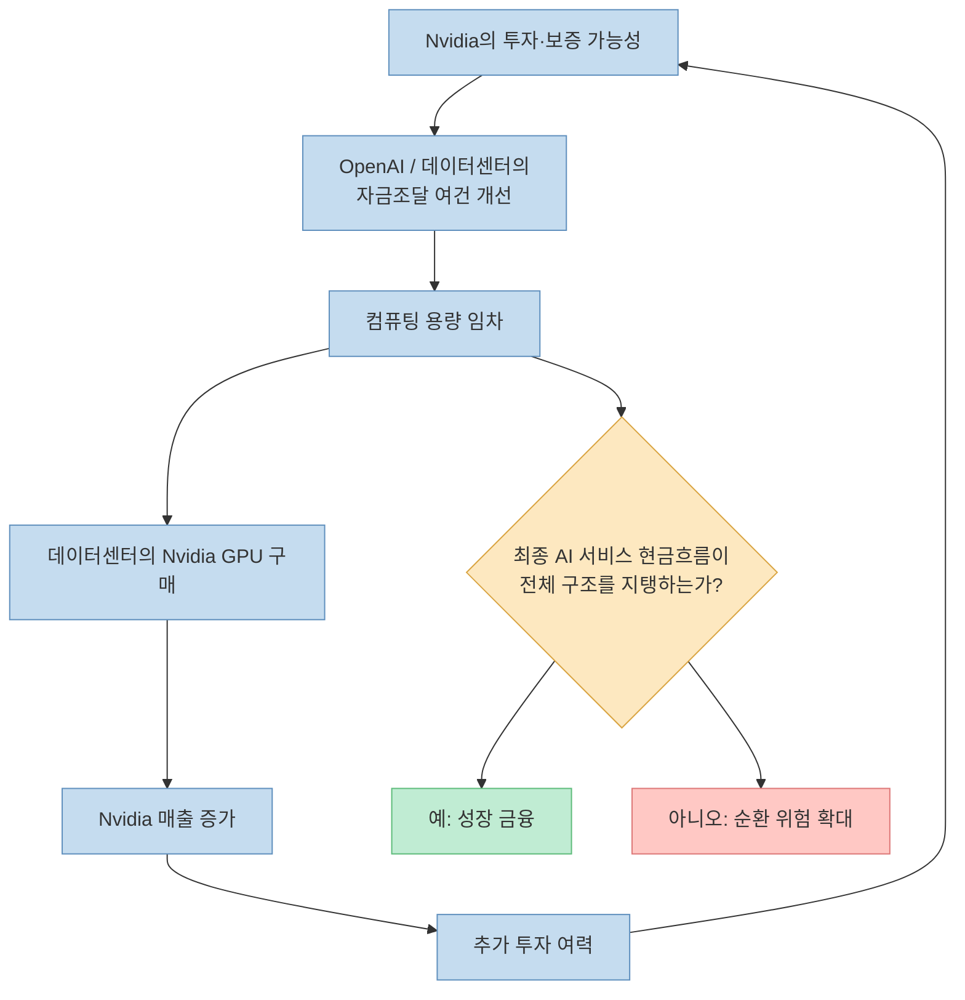
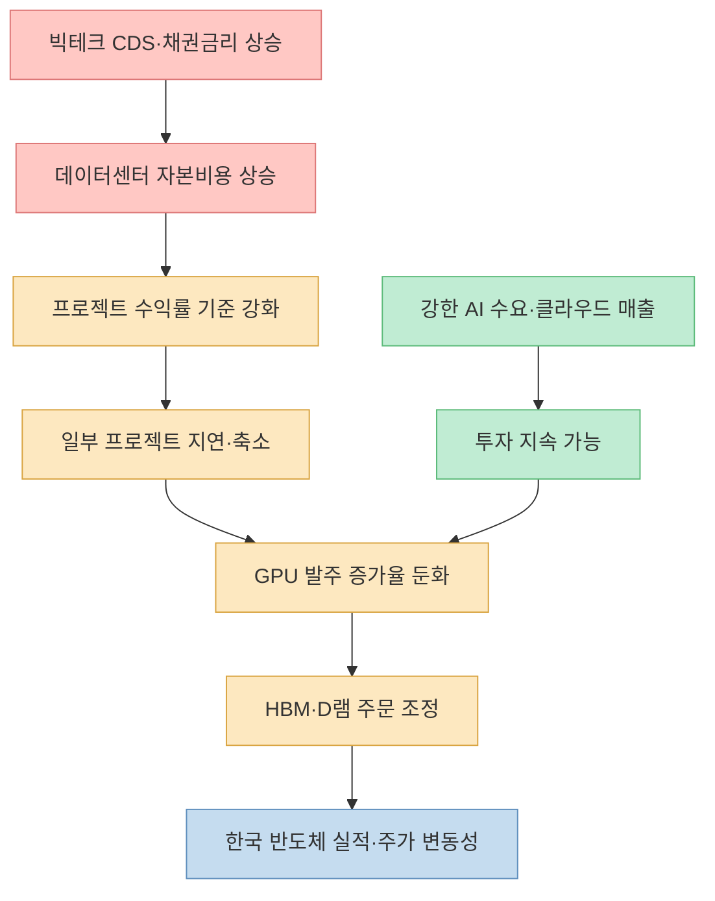
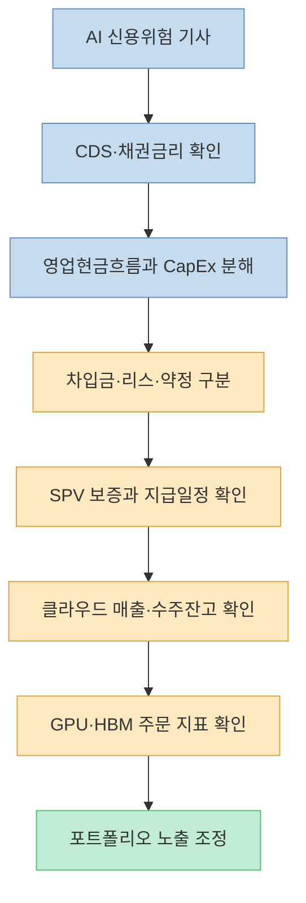

[에스오디 SOD의 이 영상](https://youtu.be/DdfKlOlFOIg?t=0)은 빅테크의 신용부도스와프(CDS), 줄어드는 잉여현금흐름, 데이터센터 특수목적법인, 엔비디아와 OpenAI의 순환금융 논란을 하나의 경고 신호로 연결합니다. 제목에 등장하는 숫자는 무려 **1.65조 달러** 입니다. 원화로 환산하면 2천조원이 넘는 규모라 "`AI 제국이 빚으로 세워졌다`"는 인상을 줍니다.

그러나 이 숫자를 전부 은행 대출이나 회사채 같은 "`숨긴 빚`"으로 읽으면 핵심을 놓칩니다. 여기에는 아직 사용이 시작되지 않은 데이터센터의 장기 임차료와 앞으로 장비·전력·서비스를 구매하기로 한 계약상 약정이 함께 들어 있습니다. 모두 미래 현금유출을 만들 수 있는 중요한 의무지만, 이자와 원금을 갚는 **현재의 차입금** 과는 회계적·경제적 성격이 다릅니다.

그렇다고 위험이 사라지는 것도 아닙니다. 더 정확한 질문은 "`빅테크가 당장 부도나는가`"가 아니라, **AI가 약속한 현금흐름이 장기 계약과 자본비용을 감당할 만큼 빠르게 커질 수 있는가** 입니다. 이 글에서는 영상의 경고를 그대로 확대하지 않고, 무엇이 확인된 사실이고 무엇이 아직 시나리오인지 구분해 보겠습니다.

<!--more-->

## Sources

- [YouTube - “이러다 진짜 망한다” 빅테크 숨은빚 2,390조원, AI 제국에 균열 터졌다 ㄷㄷ](https://youtu.be/DdfKlOlFOIg?si=pPl7-8i0OzOBC00s)
- [Bank of England - Financial Stability Report, July 2026](https://www.bankofengland.co.uk/-/media/boe/files/financial-stability-report/2026/financial-stability-report-july-2026.pdf)
- [Reuters - AI Investment Boom Puts Big Tech’s Free Cash Flow under Pressure](https://www.investing.com/news/stock-market-news/analysisai-investment-boom-puts-big-techs-free-cash-flow-under-pressure-4804645)
- [SEC - Meta 2026 Q1 Form 10-Q](https://www.sec.gov/Archives/edgar/data/1326801/000162828026028526/meta-20260331.htm)
- [Meta - BlackRock와 El Paso 데이터센터 합작법인 발표](https://about.fb.com/news/2026/07/meta-announces-new-venture-with-blackrock-to-develop-data-center-in-el-paso/)
- [Nikkei Asia - Five US Tech Giants’ Hidden Debts Soar to $1.65tn](https://asia.nikkei.com/business/technology/five-us-tech-giants-hidden-debts-soar-to-1.65tn-on-opaque-ai-funding)
- [Finterm - No, Big Tech Isn’t Hiding $1.65 Trillion of Debt](https://finterm.ai/blog/big-tech-hidden-debt-fact-check.html)
- [Bloomberg Law - Nvidia’s $750 Billion in Deals Reignite Circular AI Fears](https://news.bloomberglaw.com/business-and-practice/nvidias-750-billion-in-deals-reignite-circular-ai-fears-1)
- [LSEG/FTSE Russell - Korean Equities: Macro Recovery, Reform and AI](https://www.lseg.com/en/insights/ftse-russell/korean-equities-macro-recovery-reform-and-ai)
- [S&P Global Ratings - Digital Infrastructure Credit Outlook](https://spratings.spglobal.com/ratings/en/regulatory/delegate/getPDF?articleId=3595989&defaultFormat=PDF&type=COMMENTS)

> 이 글은 특정 종목의 매수·매도 권유가 아닙니다. CDS와 계약상 의무는 시점과 조건에 따라 빠르게 달라지므로, 실제 투자 판단에는 최신 기업 공시와 채권시장 자료를 다시 확인해야 합니다.

## 1. CDS가 오르면 회사가 곧 망한다는 뜻일까

영상은 [엔비디아·메타·오라클·알파벳의 부도에 대비한 보험 거래가 급증하고 있다고 시작](https://youtu.be/DdfKlOlFOIg?t=0)합니다. 여기서 말하는 CDS는 채권의 신용위험을 사고파는 파생계약입니다. 보호 매수자는 정기적으로 프리미엄을 내고, 계약에서 정한 신용사건이 발생하면 보호 매도자에게 보상을 받습니다.

이 구조가 보험과 비슷하기 때문에 "`부도 보험`"이라는 설명은 이해하기 쉽습니다. 다만 자동차보험과 달리 CDS는 실제 채권을 반드시 보유하지 않아도 거래할 수 있고, 유동성·시장 심리·헤지 수요에도 가격이 움직입니다. 따라서 CDS 스프레드 상승은 **시장이 요구하는 신용위험 보상 증가** 를 뜻하지만, 부도가 확정됐다는 선고는 아닙니다.

영상이 강조한 사례 중 가장 분명한 것은 오라클입니다. [5년 CDS가 2008년 말부터 제공되는 데이터 중 최고 수준에 도달했다는 대목](https://youtu.be/DdfKlOlFOIg?t=157)은 당시 시장의 불안을 보여 줍니다. 오라클은 대규모 AI 인프라를 부채와 리스에 더 많이 의존해 확장하고 있어, 다른 현금 부자 빅테크보다 신용 재평가가 빠르게 나타났습니다.

하지만 영상의 "`빅테크 CDS 거래량이 전년 대비 600% 증가했다`"는 숫자는 어떤 기업군·거래소·기간·명목금액을 썼는지 출처가 충분히 제시되지 않습니다. 거래량과 보험료도 서로 다른 지표입니다. 이 숫자는 확정 사실로 재인용하기보다 **신용 헤지 수요가 빠르게 커졌다는 방향성 주장** 으로만 받아들이는 편이 안전합니다.

## 2. AI는 빅테크를 자산이 가벼운 회사에서 자본집약 회사로 바꾸고 있다

검색, 광고, 소프트웨어 플랫폼의 장점은 이용자가 늘어도 물리적 자산을 같은 비율로 늘리지 않고 매출을 확장할 수 있다는 점이었습니다. 그러나 생성형 AI는 GPU, 네트워크, 냉각, 전력, 토지, 데이터센터 건물에 선행 투자를 요구합니다. 빅테크의 사업모델 안에 거대한 제조·전력 인프라와 비슷한 자본집약성이 들어온 것입니다.

[영상은 AI 투자 규모가 자체 현금으로 감당할 선을 넘으면서 회사채·사모대출·담보대출과 합작법인을 사용한다고 설명](https://youtu.be/DdfKlOlFOIg?t=62)합니다. 영란은행의 2026년 7월 금융안정보고서에 따르면, 메타·알파벳·아마존·마이크로소프트·오라클의 **2026년 상반기 투자등급 채권 발행액은 이미 2025년 연간 발행액을 넘어섰습니다.** Barclays 분석은 2026년 하이퍼스케일러 투자 수요 가운데 약 2,400억 달러가 투자등급 신용시장에서 조달될 수 있다고 추정했습니다.

[영상은 다섯 하이퍼스케일러의 시장 조달액과 향후 칩 금융 수요를 함께 제시](https://youtu.be/DdfKlOlFOIg?t=283)합니다. [Reuters가 LSEG 전망치를 분석한 결과](https://www.investing.com/news/stock-market-news/analysisai-investment-boom-puts-big-techs-free-cash-flow-under-pressure-4804645), 다섯 하이퍼스케일러의 2026년 자본지출 전망치는 1월 약 4,850억 달러에서 7월 약 7,300억 달러로 높아졌습니다. 현재 전망 경로가 이어지면 2027년에는 합산 자본지출이 합산 잉여현금흐름을 넘어설 수 있습니다.

이것만으로 투자 실패를 뜻하지는 않습니다. 같은 Reuters 분석은 Microsoft의 AI 사업 연환산 매출이 370억 달러를 넘어섰고 AWS도 높은 성장률을 기록하는 등 **수익화 신호 역시 나타나고 있다**고 설명합니다. 위험의 핵심은 지출 자체가 아니라, 지출 증가 속도와 AI 매출·마진·현금회수 속도의 격차입니다.

## 3. 메타의 잉여현금흐름 91% 감소를 어떻게 읽어야 하나

영상은 [메타의 자유롭게 쓸 수 있는 현금이 1년 만에 91% 줄었다고 강조](https://youtu.be/DdfKlOlFOIg?t=0)합니다. 2026년 2분기 잉여현금흐름이 7억8,400만 달러로, 전년 동기 85억5,000만 달러보다 91% 감소한 것은 사실입니다. 하지만 이것을 "`본업이 무너져 현금이 사라졌다`"고 번역하면 과장입니다.

잉여현금흐름은 일반적으로 영업현금흐름에서 설비투자를 뺀 값입니다. 광고·메시징 사업에서 현금이 들어와도 데이터센터와 서버에 더 많은 돈을 지출하면 FCF는 급격히 줄 수 있습니다. 즉 감소는 **영업 부진과 투자 확대가 함께 반영되는 결과** 이므로 두 항목을 분리해 봐야 합니다.

메타의 2026년 1분기 SEC 공시는 연간 자본지출을 1,250억~1,450억 달러로 예상하면서도, 보유 현금·영업현금흐름·금융조달 능력이 향후 운영과 투자 수요를 충족할 수 있다고 밝혔습니다. 회사의 설명을 그대로 믿을 필요는 없지만, **분기 FCF 급감과 지급불능은 매우 먼 개념** 이라는 점은 분명합니다.

투자자는 한 분기의 감소율보다 다음 항목을 함께 봐야 합니다.

- 영업현금흐름이 매출과 함께 성장하는가?
- CapEx 증가율이 얼마나 오래 유지되는가?
- AI 관련 매출과 클라우드 수주잔고가 투자를 따라오는가?
- 감가상각비와 전력·운영비가 영업이익률을 얼마나 누르는가?
- 투자 뒤에도 배당·자사주·채무상환 여력이 남는가?

## 4. 장기 금융과 짧은 기술수명의 불일치가 진짜 위험이다

영상은 [10년 할부로 산 스마트폰이 3년 뒤 구형이 되는 상황](https://youtu.be/DdfKlOlFOIg?t=220)에 빗댑니다. 비유 자체는 과장됐지만 문제의식은 영란은행 보고서와 맞습니다. 현재 AI 투자 관련 부채는 대체로 10년이 넘는 장기 만기이며, 주로 GPU 자체보다 데이터센터 건물과 전력·냉각 시설을 조달하는 데 쓰였습니다.

건물은 칩보다 오래 사용할 수 있지만, 새 GPU를 수용할 전력밀도·냉각·네트워크가 부족하면 경제적 가치가 예상보다 빨리 떨어질 수 있습니다. 담보가치와 임대수익이 낮아지면 프로젝트가 벌어들이는 현금만으로 이자와 원금을 갚기 어려워집니다.

다만 "`GPU 수명이 짧으니 10년짜리 데이터센터 대출은 모두 부실하다`"고 단정해서도 안 됩니다. 시설은 칩을 교체하며 재사용할 수 있고, 장기 임차계약·기업 보증·전력계약이 현금흐름을 지지할 수 있습니다. 실제 위험은 다음 세 가지가 겹칠 때 커집니다.

1. AI 수요나 가격이 예상보다 빠르게 둔화한다.
2. 시설 개조비와 전력비가 예상보다 크게 증가한다.
3. 임차인 또는 보증인의 신용이 악화하거나 계약이 약하다.

그래서 영란은행도 위험은 단순한 만기 길이보다 **리스와 보증의 품질, 레버리지, 최종 위험 부담자가 누구인지** 에 달렸다고 봅니다.

## 5. 1.65조 달러는 정말 장부 밖에 숨긴 차입금인가

영상은 [Nikkei가 계산한 빅테크의 숨은 부채가 1.65조 달러라고 설명](https://youtu.be/DdfKlOlFOIg?t=377)합니다. Nikkei가 재무제표 주석과 자료를 모아 계산한 숫자 자체는 허공에서 만들어진 것이 아닙니다. 문제는 서로 다른 항목을 모두 "`debt`"라는 한 단어로 묶은 해석입니다.

기업 공시를 재구성한 [Finterm의 검증](https://finterm.ai/blog/big-tech-hidden-debt-fact-check.html)에 따르면 1.6507조 달러는 크게 두 범주로 나뉩니다.

- 약 **8,214억 달러:** 아직 사용이 시작되지 않은 데이터센터 등의 미래 리스 지급액
- 약 **8,292억 달러:** 장비·용량·전력·건설·서비스 등의 구매 및 건설 약정

같은 분석이 계산한 당시 다섯 기업의 이자부 차입금은 약 4,300억 달러였습니다. 또한 1.35조 달러라는 비교 대상도 순수 차입금이 아니라 매입채무·미지급비용·이연수익·세금 등을 포함한 **총부채(total liabilities)** 에 가까웠습니다.

"`숨겼다`"는 표현도 조심해야 합니다. 이 의무들은 재무제표 주석에 공개돼 있습니다. 예를 들어 메타는 2026년 3월 말 기준 아직 시작되지 않은 운영·금융리스 지급의무가 약 **1,828.8억 달러** 이며 계약기간은 1년 초과에서 최대 30년에 이른다고 SEC 공시에 적었습니다. 장부 본문에 즉시 리스부채로 잡히지 않은 것은 시설을 아직 사용할 수 없는 등 회계상 개시 조건이 충족되지 않았기 때문입니다.

따라서 더 정확한 표현은 **숨긴 빚이 아니라, 장부 밖 주석에 공개된 대규모 미래 계약 의무** 입니다. 이 구분은 위험을 축소하려는 말장난이 아닙니다. 이자부 차입금, 리스, 구매계약은 취소 가능성·보증·담보·지급시점·회수자산이 모두 달라 각각 다른 방식으로 스트레스 테스트해야 합니다.

## 6. 특수목적법인과 합작법인: 위험을 없애는 것이 아니라 나누고 옮긴다

영상은 [메타가 텍사스의 1GW 데이터센터를 별도 법인으로 만들고 BlackRock 측이 80%, 메타가 20%를 보유한다고 설명](https://youtu.be/DdfKlOlFOIg?t=346)합니다. 메타의 공식 발표에 따르면 El Paso 프로젝트의 일부 BlackRock 투자는 125억 달러의 부채금융으로 조달되며, 지분구조 조정을 위해 메타가 약 10억 달러의 일회성 배분을 받습니다.

이 구조에서는 합작법인이나 특수목적법인(SPV)이 자산을 소유하고 자금을 빌리며, 메타는 지분 일부와 장기 사용계약을 가집니다. 프로젝트 부채가 메타 본사의 직접 차입금으로 모두 보이지 않을 수 있지만, 메타가 임차료·최소사용량·손실보전·잔존가치 보증을 약속했다면 경제적 부담은 다른 형태로 남습니다.

SPV가 무조건 회계 꼼수라는 뜻도 아닙니다. 대규모 발전소·공항·통신망처럼 현금흐름을 분리할 수 있는 인프라에서는 프로젝트 단위로 자본과 위험을 나누는 것이 일반적입니다. 빅테크는 모든 건물을 직접 소유하지 않고도 컴퓨팅 자원을 확보하고, 연기금·보험사·인프라펀드는 장기 임대수익에 투자할 수 있습니다.

하지만 계약이 복잡해질수록 투자자가 확인해야 할 질문도 늘어납니다.

- 부채에 대한 최종 보증인은 누구인가?
- 임차인이 계약을 중도 종료하면 누가 손실을 부담하는가?
- 시설이 구형이 됐을 때 잔존가치를 누가 보장하는가?
- SPV의 부채가 본사로 소급 청구되는가?
- 임차료와 구매 약정이 어느 시점부터 얼마씩 현금유출을 만드는가?

즉 SPV는 **위험 삭제 장치가 아니라 위험 배분 장치** 입니다. 계약 주석을 읽지 않고 본사 재무상태표의 차입금 숫자만 보면 전체 부담을 놓칠 수 있다는 것이 영상에서 건질 수 있는 핵심입니다.

## 7. 엔비디아와 OpenAI의 순환금융 논란은 무엇인가

영상은 [엔비디아가 OpenAI의 컴퓨팅 임차 금융에 최대 2,500억 달러를 보증하고, OpenAI가 그 자금으로 엔비디아 칩을 사는 구조를 설명](https://youtu.be/DdfKlOlFOIg?t=408)합니다. Bloomberg 보도의 정확한 표현은 엔비디아가 미국 데이터센터 프로젝트에서 OpenAI가 컴퓨팅 파워를 임차하도록 **최대 2,500억 달러를 지원하는 방안을 논의 중** 이라는 것입니다. 완료된 보증이나 이미 확정된 부채로 쓰면 안 됩니다.

[영상이 문제 삼는 순환성](https://youtu.be/DdfKlOlFOIg?t=439)의 핵심은 공급자가 고객의 자금조달을 지원하고, 고객이 그 돈으로 공급자의 제품을 사면서 매출이 생기는 구조입니다. 이런 판매자 금융은 항공기·산업장비·자동차 등에서도 존재하며 그 자체로 사기는 아닙니다. 문제는 최종 고객의 현금창출보다 금융지원이 수요를 더 크게 만드는지, 그리고 고객이 실패했을 때 공급자가 매출과 신용손실을 동시에 떠안는지입니다.

따라서 "`현금을 쓰지 않고 가짜 매출을 만들었다`"는 식의 단정은 공개된 정보보다 앞서갑니다. 실제 판단에는 보증 범위, 손실 우선순위, 임대계약, 매출인식 조건, OpenAI의 지급능력, 외부 고객이 지불하는 AI 서비스 매출이 필요합니다. 현재 확인할 수 있는 것은 **잠재적 이해관계의 순환성이 커졌고 시장이 계약 품질을 더 엄격하게 볼 이유가 생겼다** 는 정도입니다.

## 8. 미국 데이터센터의 신용위험은 한국 반도체에 어떻게 전달될까

영상은 [하이퍼스케일러의 자금조달 비용이 오르면 데이터센터 수익성이 낮아지고, 투자가 지연되면 GPU와 HBM·D램 주문이 감소할 수 있다고 설명](https://youtu.be/DdfKlOlFOIg?t=220)합니다. 이 전달 경로는 충분히 가능합니다. 다만 모든 단계가 자동으로 이어지는 것은 아닙니다.

[영상은 한국 증시의 AI 관련주 의존도가 높아졌다고 경고](https://youtu.be/DdfKlOlFOIg?t=469)합니다. [LSEG/FTSE Russell 자료](https://www.lseg.com/en/insights/ftse-russell/korean-equities-macro-recovery-reform-and-ai)에 따르면 2026년 3월 기준 기술·통신 업종은 FTSE Korea 지수의 58.6%를 차지했습니다. 한국 기업은 글로벌 HBM 시장에서 약 80%의 점유율을 가진 것으로 추정돼 AI 설비투자의 직접적인 수혜를 받습니다. 동시에 고객과 산업 사이클의 집중도가 높기 때문에 기대가 바뀔 때 지수 전체의 변동성도 커질 수 있습니다.

그러나 CDS 상승 → 데이터센터 투자 중단 → HBM 주문 폭락을 확정된 미래처럼 연결하면 안 됩니다. 하이퍼스케일러 대부분은 여전히 높은 신용등급과 낮은 부채비율을 보유하고 있으며, 영란은행도 2026년 초 기준 AI 기업의 전체 부채 재고가 비교적 작아 **당장의 금융안정 위험을 억제하고 있다**고 평가했습니다. 채권 발행도 지금까지 시장에서 원활하게 소화됐습니다.

한국 투자자가 봐야 할 것은 공포성 CDS 기사 하나가 아니라 전달 경로의 각 단계입니다.

- 미국 빅테크의 CapEx 가이던스가 추가로 상향되는가, 하향되는가?
- 클라우드 수주잔고와 AI 서비스 매출이 투자 증가를 따라오는가?
- 데이터센터 프로젝트 채권의 스프레드와 발행조건이 악화하는가?
- GPU 리드타임과 주요 고객 발주가 줄어드는가?
- HBM 계약가격·출하량·재고일수가 동시에 악화하는가?
- 삼성전자와 SK하이닉스의 고객 집중도와 설비투자 계획이 어떻게 변하는가?

## 실전 적용 포인트

이 영상을 투자 판단에 활용하려면 "`AI 버블이 터진다`"는 한 문장보다 아래의 점검 순서가 유용합니다.

1. **CDS와 주가를 분리합니다.** 주가는 성장 기대, CDS는 주로 채무상환 위험과 유동성의 가격입니다. 둘이 함께 악화할 때 신호가 더 강합니다.
2. **현금흐름을 분해합니다.** 매출과 영업현금흐름이 성장하는데 FCF만 줄었다면 CapEx의 성격과 회수기간을 봅니다.
3. **의무를 종류별로 나눕니다.** 회사채·대출, 이미 시작된 리스, 미개시 리스, 구매 약정, 보증은 같은 숫자로 합치지 않습니다.
4. **절대금액보다 지급 일정을 봅니다.** 30년에 걸친 계약금액과 1년 안에 갚아야 할 차입금은 위험도가 다릅니다.
5. **SPV의 계약을 봅니다.** 지분율보다 임차료, 손실보전, 잔존가치 보증, 소급청구 조건이 중요합니다.
6. **AI 수익화 지표를 함께 봅니다.** 클라우드 성장, 수주잔고, AI 서비스 매출, 사용률, 마진이 CapEx를 따라오는지 확인합니다.
7. **한국 반도체는 주문 지표로 확인합니다.** CDS 뉴스만으로 매매하기보다 GPU 발주, HBM 가격, 재고, 고객 가이던스를 연결합니다.
8. **포트폴리오 집중도를 제한합니다.** 한국 지수 자체가 AI 하드웨어에 집중돼 있으므로 국내 지수와 반도체 개별주를 함께 보유하면 체감보다 노출이 클 수 있습니다.

## 핵심 요약

- CDS 스프레드 상승은 시장이 더 높은 신용위험 보상을 요구한다는 뜻이지, 빅테크의 부도가 임박했다는 확정 신호는 아닙니다.
- AI는 빅테크의 사업모델을 자산이 가벼운 플랫폼에서 GPU·전력·데이터센터가 필요한 자본집약 구조로 바꾸고 있습니다.
- 메타의 분기 잉여현금흐름 91% 감소는 사실이지만, 본업 붕괴보다 대규모 설비투자 증가의 영향이 크므로 영업현금흐름과 함께 봐야 합니다.
- 장기 데이터센터 금융의 핵심 위험은 채무 만기 자체보다 기술 변화로 시설의 경제적 수명이 짧아질 가능성입니다.
- 1.65조 달러는 모두 숨긴 차입금이 아닙니다. 미개시 리스와 장기 구매·건설 약정을 합친 추정치이며 대부분 재무제표 주석에 공개돼 있습니다.
- SPV와 합작법인은 위험을 없애지 않고 본사·인프라펀드·채권투자자 사이에 나눕니다. 최종 보증과 임차계약을 봐야 합니다.
- 엔비디아의 OpenAI 2,500억 달러 지원은 논의 중인 방안이며, 확정된 보증으로 표현하면 안 됩니다.
- 한국 증시는 AI 하드웨어 비중이 높아 미국 하이퍼스케일러의 자본비용과 투자 사이클에 민감하지만, HBM 주문 감소는 아직 확정된 미래가 아닙니다.

## 결론

영상의 가장 중요한 문제 제기는 맞습니다. AI 인프라 경쟁은 빅테크를 전례 없이 큰 장기 계약과 외부 금융으로 끌어들이고 있으며, CDS와 데이터센터 채권시장은 그 위험을 가격에 반영하기 시작했습니다. 한국 투자자도 미국 빅테크의 현금흐름과 자금조달 조건을 남의 나라 채권 이야기로 넘길 수 없습니다.

하지만 "`숨은 빚 1.65조 달러`"를 곧바로 부도 시한폭탄으로 해석하는 것도 정확하지 않습니다. 숫자의 상당 부분은 수십 년에 걸친 리스와 구매 약정이고 공시 주석에 공개돼 있습니다. 반대로 장부에 차입금으로 잡히지 않았다는 이유로 무시해서도 안 됩니다. AI 수익화가 늦어지면 이 장기 계약은 비용 절감이 어려운 고정 부담으로 바뀔 수 있습니다.

결국 투자자가 추적할 것은 거대한 제목 하나가 아니라 **신용 스프레드, 영업현금흐름, CapEx, 계약상 의무의 종류와 만기, 클라우드 수주, GPU·HBM 주문** 입니다. AI 기술의 장기 성장과 AI 금융 구조의 단기 취약성은 동시에 존재할 수 있습니다. 두 사실을 함께 보는 것이 낙관과 공포 어느 한쪽에 휩쓸리지 않는 방법입니다.
