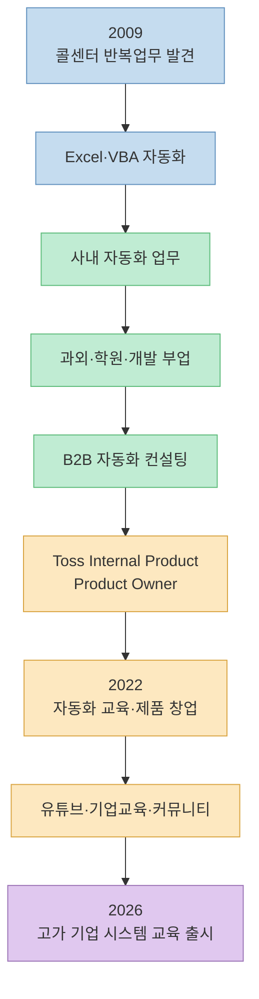
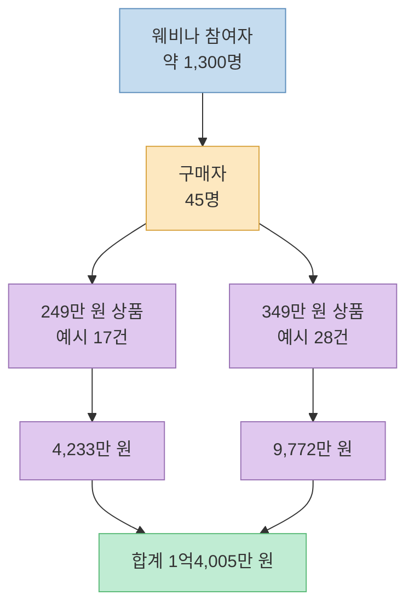
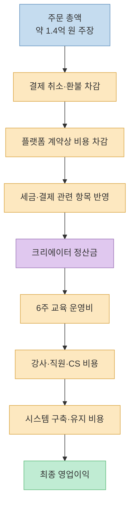
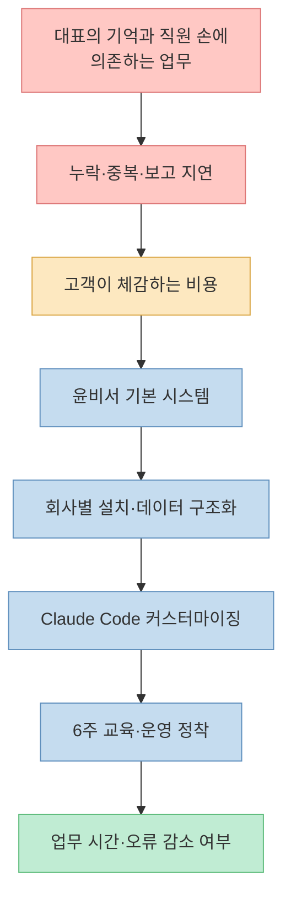
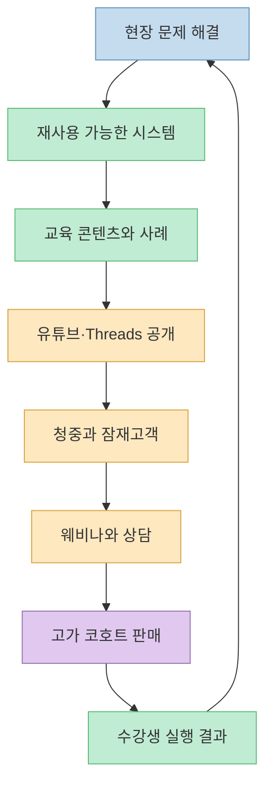
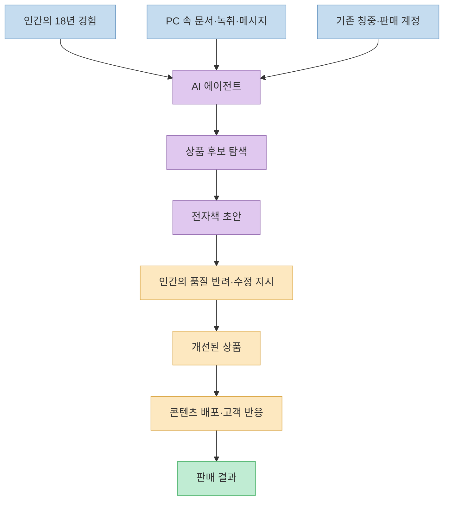
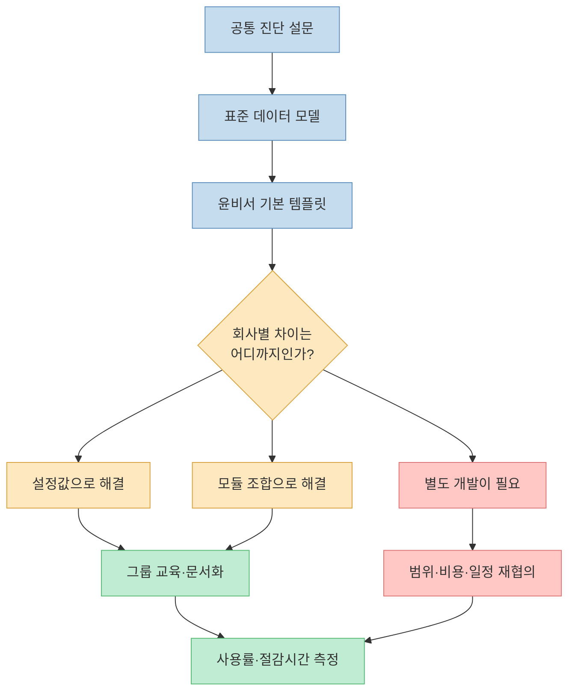
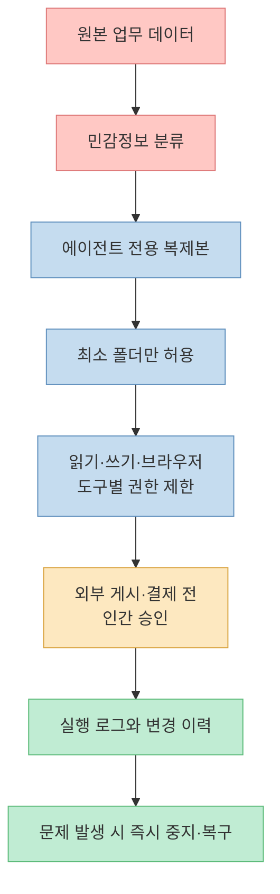

“3시간 만에 1.4억 원을 벌었다”는 문장은 강렬합니다. [윤자동의 Threads 게시물](https://www.threads.com/share/BAXjN7XOSg/)은 콜센터 상담원으로 시작해 업무 자동화 개발자와 토스 Product Owner를 거쳐 창업한 뒤, 클래스101 웨비나에서 249만 원·349만 원짜리 교육을 45개 이상 판매했다는 이야기를 담고 있습니다.

숫자의 산술은 성립합니다. 정확히 45명이 결제했다고 가정하면 349만 원 상품 28개와 249만 원 상품 17개의 합은 **1억4,005만 원** 입니다. 그러나 이것만으로 “AI가 3시간 일해 1.4억 원의 이익을 만들었다”고 해석하면 핵심을 놓칩니다. 같은 글에는 웨비나를 2주간 준비했고, 80장의 발표 자료를 만들었으며, 그전까지 18년간 자동화를 경험하고 80주 넘게 유튜브 라이브를 진행했다는 설명도 나옵니다.

따라서 이 사례에서 배울 것은 단기 수익 비법보다 **오랫동안 쌓인 전문성·콘텐츠·고객 신뢰·운영 시스템이 짧은 결제 시간에 압축되는 구조** 입니다. 동시에 주문 총액과 최종 정산액, 매출과 이익, AI의 실행과 인간이 미리 만든 자산을 구분해야 합니다. 이 글에서는 성공담을 그대로 홍보하거나 의심하는 대신, 사업 모델의 각 층을 분해해 보겠습니다.

<!--more-->

## Sources

- [Threads 공유 링크 - 3시간 만에 1.4억 원 매출 후기](https://www.threads.com/share/BAXjN7XOSg/)
- [Threads 원문 - 윤자동(@yun_ja_dong)](https://www.threads.com/@yun_ja_dong/post/DblScn8E_Yh)
- [Threads - AI에게 72시간 안에 100만 원을 벌어오라고 한 실험](https://www.threads.com/@yun_ja_dong/post/Da7ijDOk4oo)
- [조쉬의 뉴스레터 - 고졸 CS 직원이 토스 PO 입사, 월 3000을 버는 창업가가 되기까지](https://maily.so/josh/posts/xyowmpn1z28)
- [윤자동 공식 홈페이지 - 기업교육](https://www.yunjadong.com/Businessedu)
- [클래스101 크리에이터 이용약관](https://creator.class101.net/docs/terms/subscription)
- [국가법령정보센터 - 평생교육법 제28조](https://www.law.go.kr/LSW/lsLinkCommonInfo.do?chrClsCd=010202&lsJoLnkSeq=1026278783)
- [국가법령정보센터 - 학습비 반환기준](https://law.go.kr/LSW/flDownload.do?flSeq=55809941&gubun=)
- [한국소비자원 - 고액 온라인 부업 강의 피해예방주의보](https://www.kca.go.kr/home/sub.do?menukey=4005&mode=view&no=1004008089)
- [Anthropic - Claude Code 시작하기](https://docs.anthropic.com/en/docs/claude-code/getting-started)
- [Anthropic - Claude Code CLI와 권한 옵션](https://docs.anthropic.com/en/docs/claude-code/cli-usage)
- [Anthropic - 민감정보 입력 시 주의사항](https://support.anthropic.com/en/articles/8325621-i-would-like-to-input-sensitive-data-into-my-free-pro-or-max-plan-claude-account-who-can-view-my-conversations)

> 이 글의 1.4억 원 판매액과 AI 전자책 판매액은 작성자가 공개한 단일 출처 주장입니다. 독립된 정산서나 회계자료로 감사된 숫자가 아니므로, 주문 총액의 개연성과 최종 이익의 입증을 구분해서 읽어야 합니다. 또한 특정 강의의 구매 또는 판매를 권하지 않습니다.

## 1. 2009년부터 2026년까지: 결과 시간과 축적 시간을 분리하라

원문의 시작점은 AI가 아니라 엑셀 VBA입니다. 작성자는 2009년 대학교를 휴학하고 콜센터에서 일하던 중 반복 업무를 자동화했고, 성과가 알려지면서 내부 자동화 업무로 이동했다고 설명합니다. 이후 퇴근 뒤 과외·학원 강의·개발 외주를 병행했고, 자동화 솔루션 회사의 컨설턴트를 거쳐 토스 Internal Product Team의 PO로 일했다고 합니다.

이 경력의 큰 흐름은 2025년 공개 인터뷰에서도 확인됩니다. 인터뷰는 윤자동의 본명이 윤용승이며 KTis 콜센터에서 Excel과 VBA 자동화를 시작했고, 토스의 Internal Product Team에서 PO로 일한 뒤 교육과 자동화 프로그램 판매를 주 사업으로 삼았다고 소개합니다. 세부 성과와 소득은 여전히 본인 진술에 의존하지만, 갑자기 등장한 익명의 판매 사례는 아닙니다. 공식 홈페이지에도 주식회사 윤자동의 사업자 정보와 기업교육 서비스가 공개돼 있습니다.

여기서 가장 중요한 구분은 **결제가 일어난 시간** 과 **결제 가능성을 만든 시간** 입니다. 결제창은 3시간 열렸을 수 있지만, 그 앞에는 다음 자산이 있었습니다.

- 약 18년간의 자동화 문제 해결 경험
- 수백 명을 대상으로 한 과외·학원 강의 경험이라는 본인 설명
- 100곳 이상 기업 강의라는 본인 설명과 공개된 기업교육 사업
- 80주 넘게 이어진 주간 유튜브 라이브
- 약 2만 명의 Threads 팔로워와 기존 고객 커뮤니티
- 2주간 만든 80장짜리 웨비나 자료
- 실제 회사 운영에 사용하던 “윤비서” 시스템

3시간이라는 숫자는 이 긴 선행 기간을 지우는 **결과의 압축률** 에 가깝습니다. 복제해야 할 것은 3시간의 발표가 아니라, 발표 전까지 신뢰와 사례를 쌓고 고객이 구매할 수 있는 형태로 묶는 과정입니다.

## 2. 1.4억 원의 산술은 성립하지만, 사실 확인은 별개다

원문은 약 1,300명이 웨비나에 참여했고 249만 원과 349만 원 상품이 45개 이상 판매됐다고 적습니다. 바로 뒤 글에서는 45명의 수강생과 6주 과정을 시작한다고 하므로, 45건을 기준으로 계산해 볼 수 있습니다.

모든 구매가 249만 원 상품이면 1억1,205만 원이고, 모두 349만 원 상품이면 1억5,705만 원입니다. 349만 원 상품 28건과 249만 원 상품 17건이면 1억4,005만 원이 됩니다. 따라서 **가격×판매량으로 본 주문 총액 1.4억 원은 수학적으로 가능한 범위** 입니다.

거칠게 계산하면 웨비나 참여자 1,300명 중 45명이 샀을 때 전환율은 약 **3.46%** 이고, 1.4억 원을 45건으로 나눈 평균 표시가격은 약 **311만 원** 입니다. 참여자 수가 반올림됐고 판매량도 “45개 이상”으로 표현됐으므로 정밀 지표는 아니지만, 퍼널의 크기를 이해하기에는 충분합니다.

다만 산술적 개연성은 실제 결제·수납·정산·이익을 증명하지 않습니다. 확인하려면 최소한 상품별 판매 수량, 결제 완료액, 취소와 환불, 플랫폼 정산 내역, 부가가치세 처리, 강의 제공 비용이 필요합니다. 공개 글에는 이 자료가 없으므로 “작성자가 말한 주문 총액” 이상으로 확대해서는 안 됩니다.

## 3. 주문 총액 1.4억 원과 순이익 1.4억 원은 다르다

사업 숫자는 층별로 읽어야 합니다. 고객이 결제한 금액, 플랫폼이 판매로 집계한 금액, 크리에이터에게 정산되는 금액, 회사에 회계상 인식되는 매출, 모든 비용을 뺀 이익은 서로 다를 수 있습니다.

클래스101 크리에이터 이용약관도 “정산금”을 클래스 판매 수익 중 플랫폼이 크리에이터에게 지급하는 금액으로 따로 정의합니다. 크리에이터 센터에서는 서비스 수수료와 판매대금 정산 정보를 확인하도록 돼 있으며, 구체적인 조건은 개별 계약과 운영정책에 따릅니다. 이번 상품의 수수료율은 공개되지 않았으므로 임의의 비율을 적용하면 안 됩니다.

환불 가능성도 무시할 수 없습니다. 평생교육법은 일정한 경우 학습자가 학습을 포기하면 학습비를 반환하도록 규정하고, 시행령의 반환기준은 수업 진행 정도에 따라 반환액을 나눕니다. 이 상품에 정확히 어떤 규정과 계약이 적용되는지는 상품 약관을 봐야 하지만, **판매 첫날의 주문액과 과정 종료 뒤 남는 매출은 다를 수 있다** 는 점은 분명합니다.

더구나 이 상품은 영상 파일을 한 번 만들어 무제한 판매하는 구조가 아닙니다. 원문에 따르면 45명과 6주 동안 각 회사의 시스템을 만들고, “윤비서”를 설치한 뒤 Claude Code로 커스터마이징하는 과정입니다. 매출이 늘수록 이행해야 할 노동과 지원도 함께 증가하는 고접촉 서비스에 가깝습니다.

## 4. 진짜 엔진은 고가 강의가 아니라 ‘문제-시스템-증거’의 연결이다

원문이 선택한 고객은 “기업 대표와 C-Level”입니다. 개인에게 코딩 기능을 가르치는 대신, 고객관리·할 일·프로젝트·일정·매출·입금·세금계산서·회의록·견적서·계약서를 한 시스템에서 운영하게 해 주겠다는 제안입니다. 고객의 지불 능력만 본 것이 아니라, 시스템 부재로 생기는 손실이 수백만 원보다 큰 집단을 고른 것입니다.

고가 상품의 가격은 강의 영상 길이에서 나오기 어렵습니다. 고객 회사의 운영 흐름을 진단하고, 실제 시스템을 설치하고, 현업에 맞게 바꾸며, 대표나 직원이 스스로 수정할 수 있게 만드는 **성과와 이행 범위** 에서 나옵니다. 원문의 표현대로 약속한 가치를 실제로 전달하는지가 판매 이후의 핵심입니다.

이 구조에서 웨비나는 단순 설명회가 아닙니다. 무료 세션에서 문제를 구체화하고, 실제 자동화 사례를 보여 주고, 질문에 답하면서 구매 전 위험을 낮추는 장치입니다. 기존 유튜브 라이브와 기업교육 경험은 발표자의 전문성을 검증하는 사회적 증거로 작동합니다. 1,300명의 청중은 어느 날 광고로 갑자기 만들어진 것이 아니라 이전 콘텐츠와 고객관계에서 모인 수요입니다.

이를 사업 플라이휠로 바꾸면 다음과 같습니다.

지속 가능한지는 마지막 화살표에 달렸습니다. 45개 판매 화면이 아니라 6주 뒤 몇 개 회사가 시스템을 실제 운영하는지, 업무 시간이 얼마나 줄었는지, 유지보수 없이도 수정할 수 있는지가 다음 판매의 증거가 됩니다.

## 5. AI가 16시간에 100만 원을 번 실험에서 인간이 이미 제공한 것

이번 1.4억 원 사례 앞에는 “AI에게 72시간 안에 100만 원을 벌어오라고 시켰다”는 전자책 실험이 있습니다. 작성자의 설명에 따르면 Claude Code는 로컬 PC의 녹취·이메일·업무 결과·메신저 기록을 살펴보고 판매할 수 있는 지식을 찾았습니다. 처음에는 220만 원 컨설팅을 제안했고, 이후 8만9천 원짜리 전자책을 만들었습니다. 사람이 초안을 보고 품질이 낮다며 반려하자 다시 집필했고, Threads와 오픈채팅에서 판매 활동을 수행했다고 합니다.

이 실험을 “AI가 무에서 돈을 만들었다”고 표현하면 과장입니다. AI가 조합한 재료와 실행 환경은 이미 사람이 구축해 놓았습니다.

- 18년간의 업무 노하우와 사례
- 이메일·메신저·녹취에 저장된 원천 콘텐츠
- 사람 이름으로 쌓인 평판과 기존 팔로워
- Threads·오픈채팅 등 배포 채널
- 상품 등록과 결제를 처리할 계정·플랫폼
- 초안의 품질을 판단하고 방향을 수정한 인간
- 판매 뒤 환불과 고객응대를 책임질 사업체

그래도 의미 있는 변화는 있습니다. 과거에는 사람이 자료를 뒤지고, 상품 가설을 만들고, 초안을 쓰고, 여러 채널에 게시하고, 반응을 확인하는 모든 단계를 직접 연결해야 했습니다. 에이전트는 이 반복 루프의 실행비용을 낮추고 속도를 높입니다. **AI 네이티브 회사** 를 단순히 직원 대신 AI를 쓰는 회사가 아니라, 회사의 지식과 업무가 에이전트가 읽고 실행할 수 있는 형태로 정리되고 인간은 목표·승인·예외 판단을 맡는 회사라고 정의할 수 있습니다.

## 6. 판매보다 어려운 것은 45개 회사에 가치를 전달하는 일이다

고가 상품은 판매 순간보다 이행 단계에서 무너질 가능성이 큽니다. 45명의 고객이 각기 다른 업종·직원·데이터·보안정책·기존 도구를 가지고 있다면, 시스템 설치와 커스터마이징은 동일한 강의안을 전달하는 것보다 훨씬 복잡합니다.

45개 회사를 6주 동안 지원하면 한 주에 평균 7~8개 회사의 진척을 동시에 관리해야 합니다. 모든 고객에게 완전히 다른 코드를 만들어 주면 매출과 함께 지원 부담이 선형 이상으로 커질 수 있습니다. 반대로 템플릿만 제공하면 “우리 회사에 맞는 시스템”이라는 약속이 약해집니다. 확장의 핵심은 표준화와 맞춤화의 경계를 정하는 것입니다.

판매자가 추적해야 할 지표도 첫날 매출에서 과정 성과로 이동해야 합니다.

- 6주 과정 출석과 과제 완료율
- 회사별 시스템 설치 완료율
- 주간 활성 사용자와 실제 업무 등록률
- 자동화 전후 처리시간과 오류 건수
- 수강생이 스스로 수정한 기능의 비율
- 문의 건수, 평균 응답시간, 심각한 장애 수
- 환불·중도포기·추가 개발 요청 비율
- 30일·90일 뒤 유지 사용률

이 숫자가 좋아야 첫 코호트가 단발성 매출이 아니라 다음 코호트의 신뢰 자산이 됩니다. 원문 작성자도 “중요한 것은 이제부터이며 약속한 가치를 정말 전달하느냐”라고 적었습니다. 이 부분이 성공담에서 가장 현실적인 문장입니다.

## 7. AI가 이메일과 메신저를 읽을 때 생기는 데이터 위험

전자책 실험은 로컬 에이전트가 PC의 녹취·이메일·업무처리 결과·메신저를 읽었다고 설명합니다. 개인의 PC에서도 조심해야 하지만, 기업 시스템에 적용하면 고객정보·계약서·매출·세금계산서·직원정보가 함께 들어갈 수 있습니다. 생산성 실험이 곧 개인정보와 영업비밀 처리 시스템이 되는 것입니다.

Claude Code는 로컬에서 실행되지만 AI 처리를 위한 인터넷 연결이 필요합니다. 공식 CLI에는 추가 접근 디렉터리, 허용 도구, 금지 도구를 지정하는 옵션이 있고, 권한 확인을 건너뛰는 `--dangerously-skip-permissions`에는 주의가 붙습니다. “내 PC에서 돌아간다”는 말만으로 모든 데이터가 기기 밖으로 나가지 않는다고 가정해서는 안 됩니다.

Anthropic도 소비자 제품에 금융정보, 건강기록, 비밀번호와 로그인 자격증명, 기밀 문서를 넣을 때 신중하라고 안내합니다. 기업 운영에 쓰려면 사용 플랜과 계약의 데이터 처리 조건까지 확인해야 합니다.

실무에서는 다음과 같은 통제가 필요합니다.

1. 원본 메일함과 메신저 전체 대신 필요한 자료만 비식별화해 복사합니다.
2. 고객명·계좌·주민번호·비밀번호·API 키를 제거합니다.
3. 에이전트 전용 OS 계정과 브라우저 프로필을 사용합니다.
4. 기본은 읽기 전용으로 두고 필요한 폴더만 쓰기를 허용합니다.
5. SNS 게시, 이메일 발송, 결제, 삭제는 항상 인간 승인을 거칩니다.
6. 실행 명령과 변경 파일, 외부 전송 내역을 기록합니다.
7. 권한 확인을 건너뛰는 옵션을 상시 운영에 사용하지 않습니다.

AI 네이티브의 성숙도는 에이전트가 얼마나 많은 일을 몰래 하는지가 아니라, **어떤 데이터에 어떤 권한으로 접근했고 누가 결과를 승인했는지 설명할 수 있는가** 로 판단해야 합니다.

## 실전 적용 포인트

### 판매자라면

1. **결과 시간을 마케팅하되 준비 시간을 기록합니다.** 3시간 매출과 18년 축적을 함께 공개해야 재현 가능한 교훈이 됩니다.
2. **주문 총액·정산금·순이익을 나눕니다.** 취소, 환불, 플랫폼 계약, 세금, 팀 인건비와 이행 비용을 별도로 추적합니다.
3. **가격을 콘텐츠 분량이 아니라 고객 가치에 연결합니다.** 절약되는 시간, 줄어드는 오류, 빨라지는 매출 회수처럼 측정 가능한 결과를 정합니다.
4. **맞춤화 경계를 계약에 씁니다.** 기본 템플릿, 설정 변경, 모듈 조합, 별도 개발을 구분합니다.
5. **첫 코호트를 사례 생산 과정으로 봅니다.** 판매 화면보다 30일·90일 사용률과 실제 절감시간을 공개합니다.
6. **AI 권한을 최소화합니다.** 고객 데이터와 자격증명에 대한 접근 범위, 보관, 삭제, 외부 전송 정책을 문서화합니다.

### 구매자라면

한국소비자원은 고액 온라인 부업 강의를 결제하기 전에 환급 규정, 상세 교육과정, 강사의 전문성을 확인하고 “강의만 들으면 수익이 난다”는 표현에 현혹되지 말라고 안내합니다. 이번 사례가 곧 피해 사례라는 뜻은 아니지만, 수백만 원대 상품을 평가할 때 같은 기준은 유용합니다.

1. 249만 원과 349만 원 상품의 차이가 무엇인지 서면으로 확인합니다.
2. 설치되는 소프트웨어의 소유권, 라이선스, 유지보수 기간을 확인합니다.
3. 회사별 커스터마이징의 범위와 추가 비용을 확인합니다.
4. 6주 뒤 무엇이 완성돼야 하는지 검수 기준을 정합니다.
5. 수업 시작 전후 환불 기준과 플랫폼 약관을 저장합니다.
6. 강사의 매출이 아니라 이전 수강생의 운영 성과와 유지 사용률을 봅니다.
7. 회사 데이터를 AI에 넣을 때 처리 위치, 보관 기간, 접근자와 삭제 방법을 확인합니다.
8. “수익화”가 교육 목표라면 보장 여부가 아니라 필요한 영업·마케팅·지원 활동을 구체적으로 묻습니다.

## 핵심 요약

- 249만 원·349만 원 상품 45건으로 1.4억 원 주문 총액이 만들어지는 산술은 성립합니다. 예시로 고가형 28건과 저가형 17건이면 1억4,005만 원입니다.
- 그러나 1.4억 원은 작성자 단일 출처의 판매액 주장입니다. 독립 정산자료가 없으며 주문 총액, 최종 정산금, 회계상 매출, 순이익은 서로 다를 수 있습니다.
- “3시간”은 결제창의 시간입니다. 실제 선행 자산에는 18년 경험, 기존 고객, 약 2만 Threads 팔로워, 80주 이상 라이브, 2주 준비와 80장 발표 자료가 있었습니다.
- 사업의 핵심은 AI 자체보다 현장 문제를 시스템으로 만들고, 사례를 콘텐츠로 바꾸며, 청중을 웨비나와 고가 코호트로 연결하는 플라이휠입니다.
- AI 전자책 실험에서도 AI는 무에서 돈을 만든 것이 아니라 기존 문서·평판·청중·판매 계정과 인간의 품질 판단을 연결했습니다.
- 45개 회사에 6주간 시스템을 정착시키는 이행 능력이 첫날 매출보다 중요합니다. 표준화 범위, 지원 비용, 사용률과 절감시간을 측정해야 합니다.
- 로컬 AI가 이메일·메신저·계약서에 접근하면 개인정보와 영업비밀 위험이 생깁니다. 최소 권한, 데이터 비식별화, 인간 승인과 감사 로그가 필요합니다.

## 결론

이 사례의 가장 좋은 해석은 “AI로 3시간 만에 1.4억 원 버는 법”이 아닙니다. **오랫동안 축적한 전문성과 신뢰를 시스템과 콘텐츠로 바꾸고, 고객의 큰 문제에 맞는 고가 제안으로 압축한 출시 사례** 입니다. AI는 자료 탐색과 초안 작성, 반복 배포와 반응 확인의 비용을 낮추지만, 팔 수 있는 경험과 청중, 품질 기준과 결과 책임까지 대신 만들지는 않습니다.

판매자에게 다음 시험은 1.4억 원 주문이 아니라 45개 회사가 6주 뒤 실제로 더 잘 일하게 되는지입니다. 구매자에게 필요한 것도 판매자의 매출 인증보다 자신의 문제, 제공 범위, 환불 조건, 데이터 안전과 결과 측정 방식입니다. 짧은 숫자에 감탄하기 전에 긴 축적과 긴 이행을 함께 볼 때, 이 성공담에서 재현 가능한 사업 원리를 얻을 수 있습니다.
