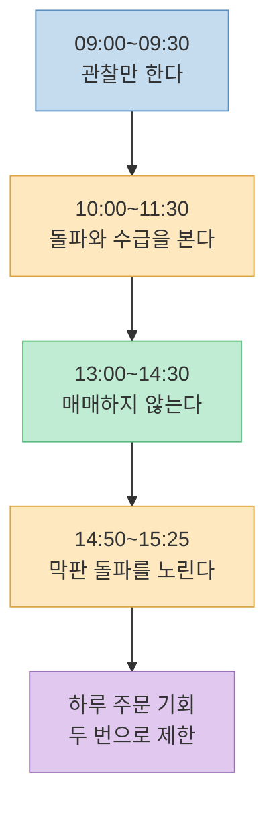
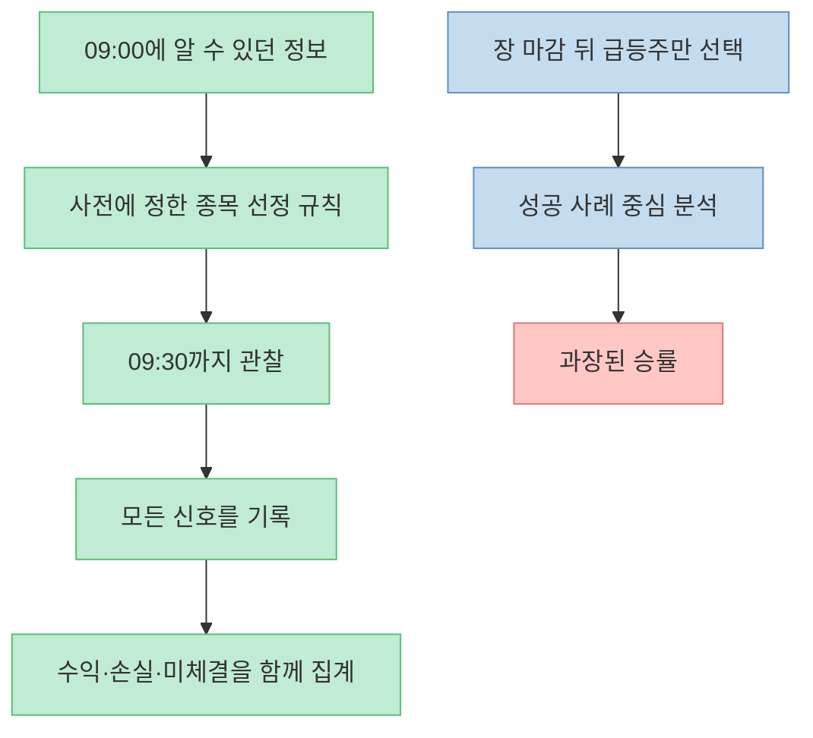
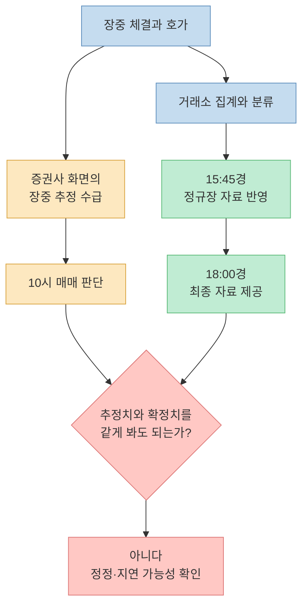
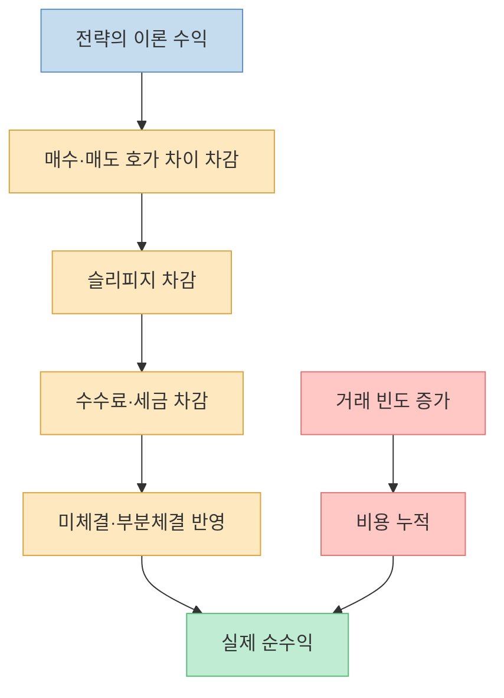
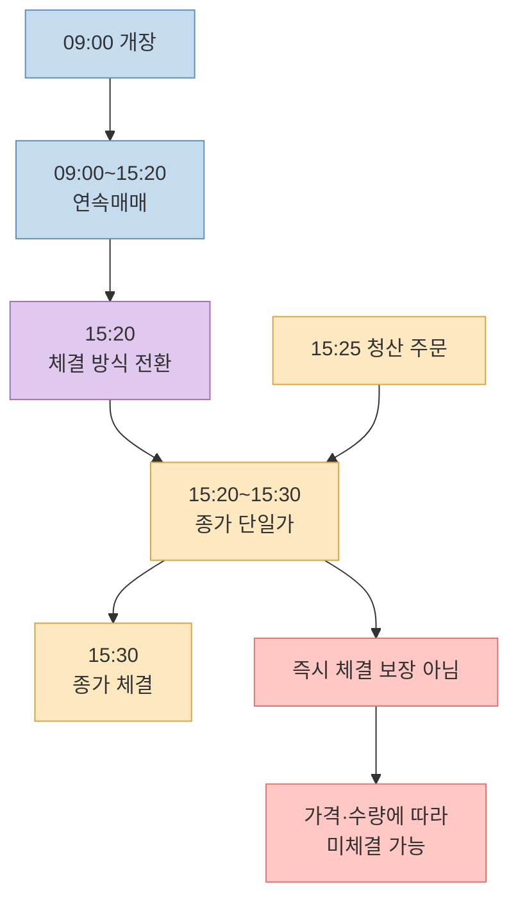
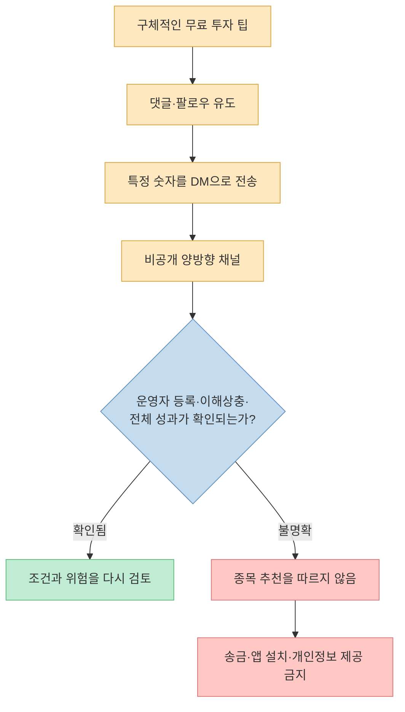
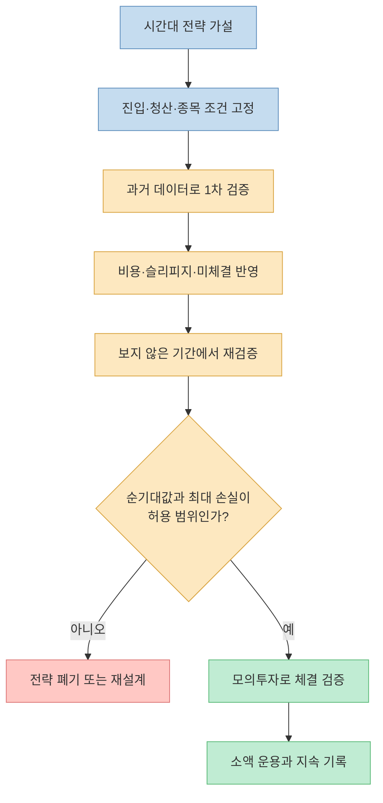

주식 단타 조언은 구체적일수록 믿음직하게 들립니다. “9시 30분 전에는 보지 말고, 10시부터 기관을 따라가며, 점심에는 쉬고, 2시 50분부터 다시 승부하라”는 식의 시간표는 특히 기억하기 쉽습니다. 실제로 [Threads에서 확산된 한 게시물](https://www.threads.com/share/BAHCTjjcwF/)은 이 규칙을 10년 넘는 경험에서 얻은 원칙이라고 소개합니다.

하지만 **구체적인 규칙** 과 **검증된 규칙** 은 같은 말이 아닙니다. 게시물에는 “9시 30분 전 고점 형성 종목이 80%를 넘는다”, “점심 매매로 돈 번 날이 열에 하나도 안 된다”, “오전 매매가 일일 수익의 60%를 만든다”는 수치가 등장하지만, 표본과 기간·거래비용·전체 거래 기록은 제시되지 않습니다. 성공 사례로 든 2018년 삼성SDI 매매도 정확한 날짜와 주문 내역이 없어 재현할 수 없습니다.

더 중요한 문제도 있습니다. 한국거래소의 장 마감 10분은 일반적인 연속매매가 아니라 **종가 단일가 매매** 구간입니다. 장중 HTS에 보이는 투자자별 수급 역시 장 마감 뒤 확정되는 KRX 데이터와 구분해야 합니다. 이 글에서는 바이럴 게시물의 시간표를 그대로 따라 하는 대신, 거래소 제도와 데이터의 성격을 기준으로 하나씩 검증해 보겠습니다.

<!--more-->

## Sources

- [Threads 공유 링크 - 시간대별 단타 매매 원칙](https://www.threads.com/share/BAHCTjjcwF/)
- [Threads 원문 - 상한가맛집(@sealtielgamerx)](https://www.threads.com/@sealtielgamerx/post/DbqOW6TGv4X)
- [KRX - KOSPI 시장 거래시간](https://global.krx.co.kr/contents/GLB/06/0602/0602010201/GLB0602010201T1.jsp)
- [KRX - 변동성완화장치와 연속·종가 단일가 구간](https://global.krx.co.kr/contents/GLB/06/0602/0602010204/GLB0602010204T9.jsp)
- [KRX - 시간대별 주문 유형](https://global.krx.co.kr/contents/GLB/06/0602/0602020202/GLB0602020202T5.jsp)
- [KRX 데이터 마켓플레이스 - 투자자별 순매수 상위 종목](https://data.krx.co.kr/contents/MDC/MDI/outerLoader/index.cmd?screenId=MDCSTAT024)
- [Fernando Chague 외 - Day Trading for a Living?](https://papers.ssrn.com/sol3/papers.cfm?abstract_id=3423101)
- [SEC - Special Study: Report on Day-Trading Broker-Dealers](https://www.sec.gov/news/studies/daytrading.htm)
- [금융위원회 - SNS 리딩방 이용 선행매매 관련 투자자 유의사항](https://www.fsc.go.kr/edu/news/83658)

> 이 글은 특정 종목이나 매매 시점을 추천하지 않습니다. 원문의 주장을 교육 목적으로 검토한 것이며, 실제 투자에서는 원금 손실과 체결 실패가 발생할 수 있습니다.

## 1. 원문이 제시한 하루 두 번의 시간표

게시물의 메시지는 복잡하지 않습니다. 하루를 네 구간으로 나눈 뒤 실제 주문은 두 구간에만 집중하라는 것입니다.

1. **09:00~09:30:** 주문하지 않고 관심 종목 10개의 고가·저가와 거래량을 관찰한다.
2. **10:00~11:30:** 박스권 상단을 거래량과 함께 돌파하고 기관 순매수가 3분 연속 나타나는 종목을 매수한다.
3. **13:00~14:30:** 거래량과 호가가 얇아진다며 매매하지 않는다.
4. **14:50~15:25:** 거래대금 500억 원 이상이면서 전고점을 돌파하고 5분봉 거래량이 급증한 종목에 진입한 뒤 장 마감 전에 청산한다.

이 네 구간을 묶는 최종 원칙은 “하루에 단 두 번만 승부한다”입니다. 주문 횟수를 제한하고 충동 매매를 줄인다는 행동 규칙 자체는 이해하기 쉽습니다. 다만 시간대와 조건을 고정했다고 해서 기대수익이 자동으로 양수가 되는 것은 아닙니다.

원문에는 좋은 습관과 검증되지 않은 예측이 섞여 있습니다. 거래 횟수 제한, 미리 정한 조건, 거래량 확인은 규율을 만드는 장치입니다. 반면 “기관이 3분 연속 사면 가격이 더 오른다”거나 “특정 시간대에만 수익의 90%가 발생한다”는 문장은 별도의 데이터 검증이 필요한 시장 예측입니다. 둘을 분리해서 읽어야 합니다.

## 2. 09:00~09:30 관망은 안전 규칙이지 80% 법칙이 아니다

개장 직후에는 전날 장 마감 이후 쌓인 뉴스와 주문이 한꺼번에 가격에 반영될 수 있습니다. 거래량과 변동성이 커지고, 전일 종가와 크게 떨어진 가격에서 시작하는 갭도 나타납니다. 경험이 적은 투자자가 첫 움직임을 추격하지 않고 관찰하는 것은 과잉 매매를 줄이는 보수적 규칙이 될 수 있습니다.

그러나 원문의 “경험상 9시 30분 전에 고점을 찍고 내려오는 종목이 80%를 넘었다”는 주장은 현재 상태로 검증할 수 없습니다. 최소한 다음 정보가 있어야 80%의 의미를 판단할 수 있습니다.

- 대상이 KOSPI 전체인지, 거래대금 상위주인지, 작성자가 고른 관심 종목인지
- 고점이 당일 최고가인지, 오전 최고가인지, 진입 뒤 일정 시간의 최고가인지
- 조사 기간과 거래일 수가 얼마인지
- 상한가·신규 상장·거래정지 종목을 어떻게 처리했는지
- 미래 정보를 보지 않고 매일 같은 시점에 종목을 선정했는지

관심 종목을 사후에 고르면 결과는 쉽게 좋아집니다. 당일 많이 오른 종목을 장 마감 뒤 골라 “이 종목의 아침 움직임”을 분석하면, 실제 09:00에 알 수 없던 정보를 사용하게 됩니다. 이를 **선택 편향** 또는 **룩어헤드 편향** 이라고 합니다.

따라서 “개장 직후에는 충동적으로 추격하지 않는다”는 원칙과 “대부분의 종목이 09:30 전에 고점을 만든다”는 통계 주장을 따로 평가해야 합니다. 전자는 개인의 위험관리 선택이고, 후자는 데이터가 있어야 확인할 수 있는 명제입니다.

## 3. 10시의 ‘기관 3분 순매수’는 확정 데이터가 아니다

원문은 10시 이후 박스권 돌파 시 HTS의 기관 순매수 창을 보고, 기관이 3분 연속 순매수일 때만 진입하라고 말합니다. 여기서 가장 먼저 확인해야 할 것은 화면에 표시되는 숫자의 출처와 확정 여부입니다.

KRX 데이터 마켓플레이스는 당일 투자자별 정규시장 매매 내역을 **정규장 마감 뒤인 15:45경** 반영하고, 시간외 거래까지 포함한 최종 내역을 **18:00경** 제공한다고 안내합니다. 오류나 지연이 있을 수 있다는 주의문도 함께 표시합니다. 따라서 오전 10시 HTS에 나타나는 숫자를 장후 확정되는 KRX 투자자 분류와 동일하게 보면 안 됩니다. 증권사가 장중 추정치를 제공할 수는 있지만, 계산 방식·갱신 주기·정정 가능성을 먼저 확인해야 합니다.

또한 기관 순매수와 이후 가격 상승이 함께 나타났다고 해서 전자가 후자의 원인이라고 바로 결론 낼 수 없습니다. 가격이 오르자 추세 추종 주문이 유입됐을 수도 있고, 같은 뉴스가 가격과 주문 흐름을 동시에 움직였을 수도 있습니다. “가격만 오르면 개인 물량이니 거른다”는 원문의 설명은 시장 참여자를 지나치게 단순화합니다.

원문이 든 2018년 삼성SDI 사례도 검증 자료가 부족합니다. “10시 40분경 18만 원대 돌파, 기관 3분 연속 5만 주 이상 순매수, 11시 20분까지 5% 수익”이라고 적었지만, 거래 날짜·정확한 주문 가격·수량·수수료·세금·체결 내역이 없습니다. 성공한 한 건을 기억해서 소개하는 것과 동일 규칙을 모든 신호에 적용한 성과는 전혀 다릅니다.

## 4. 13:00~14:30 매매 금지는 검증 가능한 가설이다

게시물은 점심 이후 거래량이 줄고 호가가 얇아져 슬리피지가 늘어난다고 설명합니다. **슬리피지** 는 주문을 내기 전에 본 가격과 실제 평균 체결가격의 차이입니다. 주문 수량이 호가 잔량보다 크거나 가격이 빠르게 움직이면 예상보다 불리한 가격에 여러 번 나뉘어 체결될 수 있습니다.

이 메커니즘은 타당할 수 있지만, 모든 종목과 모든 거래일에 똑같이 적용되지는 않습니다. 실적 발표, 정책 뉴스, 지수 편입, 시장 급변이 있는 날에는 오후 거래량이 오히려 급증할 수 있습니다. 대형주와 소형주의 호가 깊이도 다릅니다. 그래서 “열에 하나도 돈을 벌지 못했다”는 개인 경험을 시장 법칙으로 일반화할 수 없습니다.

SEC의 단타 관련 위험 안내도 변동성이 크거나 거래가 중단된 시장에서는 원하는 가격에 포지션을 빨리 정리하기 어렵거나 불가능할 수 있으며, 반복 거래 비용이 손실을 늘리거나 이익을 크게 줄일 수 있다고 경고합니다. 한국 시장과 미국 규정은 다르지만 **체결 위험과 비용이 짧은 보유기간의 기대수익을 잠식한다** 는 원리는 같습니다.

점심 매매를 피하는 규칙이 자신에게 도움이 되는지 확인하려면 실제 체결 기록을 시간대별로 나누면 됩니다. 승률만 보지 말고 평균 이익, 평균 손실, 손익비, 최대 손실, 슬리피지와 비용을 모두 포함해야 합니다. 그 결과 오후 구간의 순기대값이 반복해서 음수라면 매매 금지가 합리적인 개인 규칙이 될 수 있습니다.

## 5. 15:25 청산 규칙이 놓친 종가 단일가 매매

가장 분명하게 제도와 대조할 수 있는 부분은 장 막판 규칙입니다. KRX 주식 정규장은 09:00부터 15:30까지이지만, 체결 방식은 끝까지 같지 않습니다.

- **09:00~15:20:** 주문이 조건에 맞을 때 계속 체결되는 연속매매
- **15:20~15:30:** 주문을 모아 하나의 종가로 체결하는 종가 단일가 매매

원문은 15:10 전후 5분봉 거래량 폭발을 확인한 뒤 진입하고 15:25 전에 무조건 청산하라고 합니다. 하지만 15:25는 이미 종가 단일가 구간입니다. 이 구간에서는 15:25에 주문을 냈다고 그 시각의 표시가격으로 즉시 체결되는 것이 아닙니다. 주문은 종가 결정을 위한 호가에 참여하며, 주문 가격과 수량에 따라 전부 체결되지 않을 수도 있습니다.

KRX는 IOC·FOK 조건도 연속매매에서만 허용한다고 설명합니다. 따라서 장 마감 전에 반드시 포지션을 없애야 한다는 위험관리 목표가 있다면, “15:25 주문”이 아니라 **15:20 이전 연속매매 구간에서의 체결 완료 여부** 까지 포함해 규칙을 설계해야 합니다. 이것도 매도 성공을 보장하지는 않습니다. 급격한 가격 하락, 거래정지, 호가 공백이 생기면 합리적인 가격에 신속히 청산하지 못할 수 있습니다.

## 6. 60%·30% 수익이라는 숫자는 왜 전략 성과가 아닌가

원문은 오전 구간이 일일 수익의 60%, 막판 구간이 나머지 30%를 책임진다고 말합니다. 합치면 90%지만 나머지 10%가 무엇인지, 손실일은 어떻게 처리했는지 설명하지 않습니다. 이런 비율은 다음 조건이 없으면 전략 통계로 해석할 수 없습니다.

- 총 거래일과 총 신호 수
- 수익이 난 거래뿐 아니라 손실·미체결을 포함한 전체 기록
- 종목 선정 규칙과 매수·매도 호가
- 포지션 크기와 일별 위험 한도
- 수수료·세금·슬리피지 반영 여부
- 비교 대상인 단순 보유 또는 무거래 기준
- 학습 데이터와 검증 데이터를 분리한 아웃오브샘플 결과

단타의 기본 확률도 가볍지 않습니다. 브라질 주가지수 선물시장에서 신규 단타 투자자를 추적한 Chague·De-Losso·Giovannetti의 연구에서는 300일 넘게 지속한 개인의 97%가 손실을 냈고, 거래를 계속하면서 실력이 향상된다는 증거도 발견하지 못했습니다. 이 결과를 한국 현물주식의 손실률로 그대로 옮길 수는 없습니다. 시장, 상품, 레버리지, 조사 기간이 다르기 때문입니다. 다만 간단한 시간 규칙만으로 장기 수익이 쉽게 생긴다는 주장에 강한 반례를 제공합니다.

전략을 평가할 때는 승률보다 다음 식이 중요합니다.

> 거래당 기대값 = 승률 × 평균 이익 − 패배율 × 평균 손실 − 거래비용

승률이 70%여도 평균 이익이 작고 한 번의 평균 손실이 크면 기대값은 음수일 수 있습니다. 반대로 승률이 낮아도 손실을 작게 제한하고 이익을 크게 가져가면 양수가 될 수 있습니다. “어느 시간에 샀다”보다 **모든 결과와 비용을 포함한 기대값이 반복해서 양수인가** 를 물어야 합니다.

## 7. 동일 문구 복제와 ‘99 DM’ 유도는 별도의 경고 신호다

원문 페이지를 수집할 당시 Threads의 관련 게시물 영역에는 같은 도입부를 사용한 계정이 최소 다섯 개 보였습니다. 이들은 대상 계정보다 약 10시간 앞서 동일한 문장을 게시했습니다. 이것만으로 최초 작성자가 누구인지, 특정 계정이 어떤 방식으로 문구를 얻었는지 확정할 수는 없습니다. 그러나 “10년 넘게 몸으로 만든 고유한 원칙”이라는 서사를 신뢰하기 전에 출처를 더 확인해야 할 이유는 됩니다.

스레드 마지막의 행동 유도도 본문과 따로 평가해야 합니다. 게시물은 팔로우한 뒤 “99”라고 DM을 보내면 장중 실시간 진입·청산 시점과 관심 종목을 무료로 공유하겠다고 제안합니다. 정보가 무료라는 사실은 정확성, 이해상충, 운영자의 등록 여부를 보증하지 않습니다.

금융위원회는 양방향 채널로 투자정보를 제공하는 운영자가 금융위원회에 등록된 투자자문업자인지 확인하라고 안내합니다. 이는 이 계정이 불법이라고 단정하는 말이 아닙니다. 현재 자료만으로 특정 계정의 등록 여부나 법 위반 여부를 판단할 수 없기 때문입니다. 다만 공개 글에서 DM으로 이동한 뒤 실시간 종목과 매매 시점을 받는 구조라면 다음을 먼저 확인해야 합니다.

- 운영 주체의 실명·회사명과 금융위원회 등록 여부
- 손실 가능성, 수수료, 환불 조건의 명시 여부
- 추천 전에 운영자가 해당 종목을 보유했는지 등 이해상충
- 과거 수익 인증이 전체 계좌와 전체 기간을 보여 주는지
- 별도 앱 설치, 원격제어, 개인 계좌 입금이나 추가 송금을 요구하는지

## 8. 시간표를 믿기 전에 직접 검증하는 방법

시간대 전략은 신앙의 대상이 아니라 검증 가능한 가설입니다. 실제 돈을 넣기 전에 최소한 다음 절차를 거칠 수 있습니다.

### 가설을 숫자로 고정한다

“거래량이 터진다” 대신 최근 20일 같은 시간대 평균의 몇 배인지 정합니다. “기관이 산다”는 조건을 쓸 때는 데이터 제공자의 산출 방식과 정정 여부를 명시합니다. 진입·청산 가격도 다음 봉의 시가, 지정가, 시장가처럼 재현 가능한 규칙으로 바꿉니다.

### 종목 선정 시점을 고정한다

매일 09:00 전에 알 수 있는 정보만 사용해 대상 종목을 정합니다. 장 마감 뒤 거래대금 상위주를 보고 아침으로 돌아가는 방식은 금지합니다. 상장폐지 종목과 거래정지 종목을 빼면 생존자 편향이 생길 수 있으므로 포함 기준도 미리 정합니다.

### 비용과 체결 실패를 넣는다

매수·매도 호가 차이, 수수료, 세금, 슬리피지, 부분체결과 미체결을 포함합니다. 특히 15:20 이후 주문은 종가 단일가 규칙으로 모형화해야 합니다. 분봉 종가에 항상 전량 체결됐다고 가정하면 실제보다 결과가 좋아질 가능성이 큽니다.

### 보지 않은 기간에서 다시 시험한다

규칙을 만든 기간과 성과를 확인할 기간을 나눕니다. 여러 시간과 조건을 반복해서 바꾼 뒤 가장 좋은 조합만 고르면 우연을 전략으로 착각하기 쉽습니다. 상승장·하락장·급변장에서도 결과가 유지되는지 확인해야 합니다.

## 실전 적용 포인트

바이럴 투자 글을 만났을 때 바로 적용할 수 있는 점검 순서는 다음과 같습니다.

1. **제도부터 확인합니다.** 장 운영시간, 단일가, 거래정지, 주문 유형은 KRX 자료로 확인합니다.
2. **화면 숫자의 성격을 확인합니다.** 장중 추정치인지 장후 확정치인지, 누가 어떤 방식으로 계산하는지 봅니다.
3. **화려한 비율의 분모를 찾습니다.** 80%, 60%, 30%가 몇 번의 거래와 어느 기간에서 나왔는지 확인합니다.
4. **전체 기록을 요구합니다.** 성공 화면 몇 장보다 손실·미체결·비용을 포함한 전체 거래 내역이 중요합니다.
5. **출처와 문구 복제를 검색합니다.** 동일 문장이 더 오래된 다른 계정에 있는지 확인합니다.
6. **공개 글과 DM 유도를 분리해서 봅니다.** 무료 정보가 비공개 종목 추천, 송금, 앱 설치로 이어지면 즉시 멈춥니다.
7. **검증 전에는 실제 자금을 넣지 않습니다.** 모의투자에서도 재현되지 않는 규칙은 실전에서 더 좋아질 이유가 없습니다.

## 핵심 요약

- 09:00~09:30에 관망하고 주문 횟수를 제한하는 것은 충동 매매를 줄이는 개인 위험관리 규칙이 될 수 있습니다.
- “09:30 전 고점 종목 80%”, “점심 매매 성공이 열에 하나 미만”, “오전과 막판이 수익의 90%”라는 수치는 표본과 전체 기록이 없어 검증되지 않았습니다.
- KRX 확정 투자자별 매매 데이터는 정규장 마감 뒤 반영됩니다. 오전 HTS의 기관 수급은 산출 방식과 정정 가능성을 확인해야 합니다.
- 15:20~15:30은 종가 단일가 구간입니다. 15:25 주문이 표시가격에 즉시 체결되는 것은 아니므로 “15:25 무조건 청산”은 체결 제도를 충분히 반영하지 못합니다.
- 브라질 주가지수 선물 연구는 장기 지속한 개인 단타 투자자의 97%가 손실을 냈다고 보고했습니다. 한국 현물시장에 그대로 적용할 수는 없지만 단순 시간 규칙을 낙관하기 어렵게 만드는 근거입니다.
- 동일 문구의 선행 게시물과 “99 DM”을 통한 실시간 종목 공유 유도는 출처·등록 여부·이해상충을 확인해야 할 경고 신호입니다.

## 결론

이 Threads 게시물에서 건질 수 있는 가장 유용한 원칙은 “10시와 2시 50분에 매수하라”가 아니라 **충동적으로 계속 거래하지 말라** 는 부분입니다. 반면 특정 시간, 기관 추정 수급, 거래량 조건이 반복 수익을 만든다는 핵심 주장은 현재 공개된 정보만으로 검증되지 않습니다.

시장 시간표는 행동을 통제하는 틀이 될 수 있지만 수익의 원천은 아닙니다. 거래소의 실제 체결 방식, 데이터가 확정되는 시점, 모든 거래의 순기대값을 확인하지 않은 시간 규칙은 전략이라기보다 이야기입니다. 특히 공개 조언이 DM의 실시간 종목 추천으로 이어질 때는 수익 가능성보다 먼저 운영자와 이해상충, 손실 경로를 확인해야 합니다.
