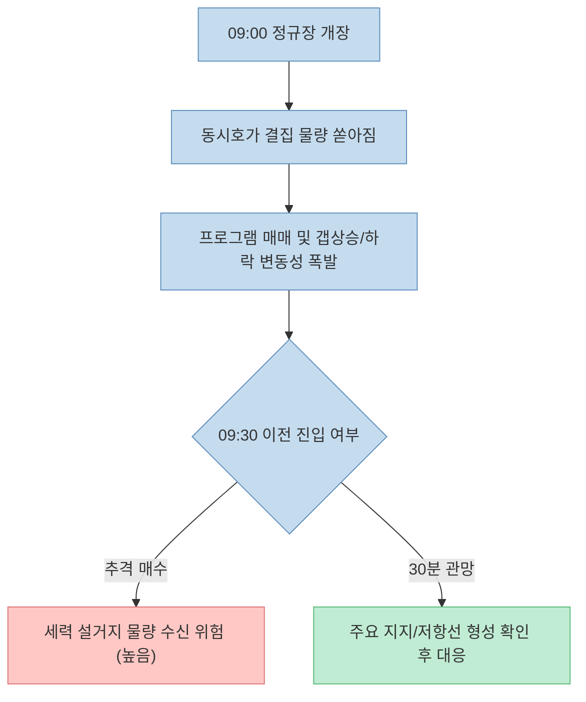
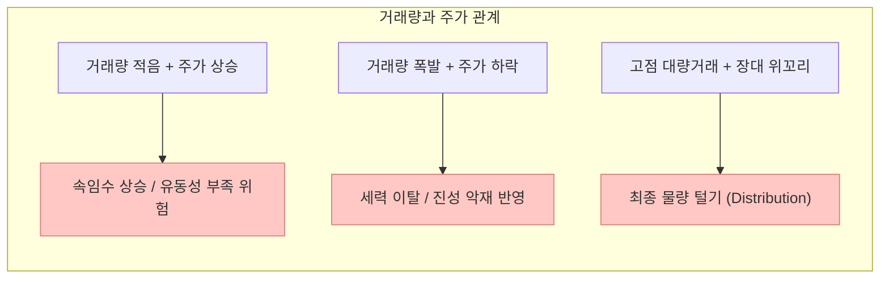
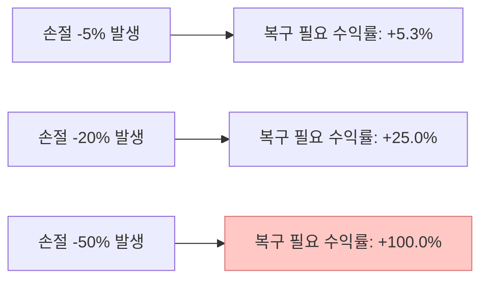

주식 시장에는 수많은 매매 기법과 지표가 존재하지만, 수십 년간 생존한 전업 투자자들이 한목소리로 강조하는 것은 단순한 원칙과 철저한 리스크 관리입니다. 최근 [Threads에서 화제가 된 한 20년 차 전업 개미의 게시물](https://www.threads.com/share/_vR0CQdgx/)은 마이너스 4억 원의 손실로 시작해 200억 원대 자산을 일군 경험담과 함께 "복잡한 지표를 다 끄고 딱 8가지만 본다"는 매매 규칙을 소개해 큰 호응을 얻었습니다.

이 글에 담긴 메시지는 뇌동매매로 손실을 입기 쉬운 개인 투자자들에게 강력한 직관과 경각심을 줍니다. 하지만 직관적으로 타당해 보이는 원칙이라 하더라도, 이를 모든 장세와 종목에 무비판적으로 적용하는 것은 위험합니다. 시장 제도의 특성, 거래량의 정량적 의미, 그리고 행동재무학적 리스크 요소를 객관적으로 떼어놓고 검증해야만 비로소 나만의 실제 매매 기준이 될 수 있습니다.

이 글에서는 해당 스레드가 제시한 8가지 원칙을 하나씩 살펴보고, 주식 시장의 구조적 특징과 팩트를 기준으로 깊이 있게 분석해보겠습니다.

<!--more-->

## Sources

- [Threads 원문 게시물 - 20년 차 전업 개미의 8가지 원칙 (@lenic_bellacitta)](https://www.threads.com/share/_vR0CQdgx/)
- [KRX 한국거래소 - KOSPI/KOSDAQ 시장 매매체결 제도](https://global.krx.co.kr/contents/GLB/06/0602/0602010201/GLB0602010201T1.jsp)
- [KRX 한국거래소 - 변동성완화장치(VI) 및 단일가 매매 안내](https://global.krx.co.kr/contents/GLB/06/0602/0602010204/GLB0602010204T9.jsp)
- [U.S. SEC - Day Trading: Your Dollars at Risk & Broker-Dealer Special Study](https://www.sec.gov/news/studies/daytrading.htm)
- [Daniel Kahneman & Amos Tversky - Prospect Theory: An Analysis of Decision under Risk (Econometrica, 1979)](https://www.jstor.org/stable/1914185)
- [Fernando Chague et al. - Day Trading for a Living? (SSRN Working Paper)](https://papers.ssrn.com/sol3/papers.cfm?abstract_id=3423101)

> 이 글은 특정 종목 매수/매도를 추천하지 않으며, 원문에 언급된 매매 원칙을 금융 구조와 시장 데이터 관점에서 객관적으로 분석한 교육적 목적의 글입니다.

---

## 1. 20년 차 개미가 제시한 8가지 매매 원칙 요약

스레드 원문은 복잡한 보조지표를 지우고 시장의 본질에 집중할 것을 권하며 8가지 핵심 시간표와 행동 원칙을 정리했습니다.

1. **09:30 전 관망:** 장 시작 후 30분간은 외국인·기관 프로그램 물량이 분출하는 구간이므로 시초가 급등 추격 매수를 금지한다.
2. **거래량 중심 해석:** 거래량 없는 상승은 세력의 속임수이며, 거래량이 폭발하는 하락은 진성 악재/이탈 신호다.
3. **역발상 매매 (음봉 매수, 양봉 매도):** 대중이 환호하는 양봉에 팔고, 공포에 던지는 음봉 구간에 매수 포지션을 취한다.
4. **점심시간 횡보주 금지:** 12:00~14:00 거래량이 죽어있는 지루한 횡보 구간에는 자금을 묶어두지 않고 휴식을 취한다.
5. **뉴스/재료 소멸 대응:** 호재가 언론 메인에 도달한 시점은 세력의 물량 넘기기 단계이므로 미련 없이 익절한다.
6. **사전 손절가 준수:** 매수 전 -3%~-5% 등 손절선을 명확히 확정하고 이탈 시 기계적으로 손절한다.
7. **줄 때 먹는 단기 익절:** 3%~5% 수익 발생 시 상한가 욕심을 버리고 확정 수익을 챙긴다.
8. **고점 대량 거래 위꼬리 청산:** 연일 폭등 후 장중 대량 거래량과 함께 장대 위꼬리가 발생하면 미련 없이 전량 청산한다.

---

## 2. 시간대별 매매 제한의 메커니즘과 한계

### 장 초반 30분 관망 (09:00 ~ 09:30)

장 개장 직후 30분은 동시호가 갭상승/하락 물량과 함께 전날 장 마감 후 발생한 미처 반영되지 않은 뉴스, 해외 증시 지수 변화, 프로그램 매매 자동 체결이 일시에 쏟아집니다.

한국거래소(KRX)의 동시호가 체결 제도와 변동성완화장치(VI) 작동 메커니즘을 감안할 때, 초반 30분은 체결 가격의 미세 조정이 지속되는 구간입니다. 따라서 뇌동매매를 방지하기 위해 초반 30분 관망 원칙을 지키는 것은 개인 투자자의 심리적 안정감을 확보하는 매우 유용한 림(Rim) 역할을 합니다. 

다만, 시초가 매매 전략(Open-Range Breakout)이나 뉴스 호재 갭상승 단타를 전문으로 하는 스캘퍼의 경우, 초반 30분이 하루 일일 거래대금과 변동성의 40% 이상이 집중되는 가장 중요한 구간이기도 합니다. 즉, **"모든 투자자가 9시 30분까지 관망해야 한다"**기보다는 **"리스크 관리가 미숙한 개인은 변동성 극대화 구간을 피하는 것이 안전하다"**로 해석하는 것이 정확합니다.

### 점심시간 횡보주 피하기 (12:00 ~ 14:00)

점심시간대는 기관·외국인 매매 주체들의 거래 참여가 감소하면서 전반적인 거래량이 감소하는 경향을 보입니다. 호가창 두께가 얇아지면 적은 수량의 주문으로도 가격 변동이 심해지거나, 반대로 장시간 거래 없이 횡보하는 현상이 발생합니다.

이때 발생하는 주요 위험은 **슬리피지(Slippage)**입니다. 거래량이 소멸한 횡보주에 자금이 묶이면, 정작 오후장(14:30 이후)이나 종가 매매 시점에 주도주가 등장했을 때 기회비용을 잃게 됩니다.

---

## 3. 거래량과 봉 차트의 구조적 해독

### 거래량 없는 상승 vs 거래량 터진 하락

원문에서 가장 강조한 신호 중 하나는 거래량과 주가 흐름의 불일치입니다.

- **거래량 없는 상승:** 소액의 주문으로 호가를 올리는 일종의 '소수 계좌 의도적 주가 부양'이거나 시장 전체의 관심이 부족한 상태에서의 부유 상승일 가능성이 높습니다. 수급의 실체가 없으므로 소량의 매도 물량에도 급락할 위험이 큽니다.
- **대량 거래량 터진 음봉/하락:** 주포(세력) 및 대형 기관의 실제 매도 물량이 출회되었음을 뜻합니다. 주가 거래량이 급증하며 음봉을 그리는 것은 매수 세력이 매도 세력의 물량을 감당하지 못하고 손바뀜 없이 이탈하고 있다는 가장 명확한 증거입니다.

### 고점 대량 거래 위꼬리의 위험성

주가가 일정 기간 급등한 상태에서 장중 긴 위꼬리(Upper Shadow)와 함께 거래량이 최고치를 기록하는 것은 **세력의 분산(Distribution)** 단계의 전형적인 패턴입니다. 

장중에 주가를 끌어올려 개미 투자자들의 추격 매수세를 유인한 뒤, 세력이 고점에서 대량 매도 물량을 던지면서 주가가 밀려 내려오는 현상입니다. 이 경우 상단에 형성된 대량의 매물대는 강력한 저항선으로 작용하여 향후 회복에 수개월 이상 소요되거나 주가가 장기 하락 전환할 가능성이 매우 높습니다.

---

## 4. 매매 규율과 행동재무학적 팩트체크

### 음봉 매수 vs 양봉 매수 (역발상 매매의 양날의 검)

음봉 매수 원칙은 행동재무학에서 말하는 **프로스펙트 이론(Prospect Theory)** 및 대중 심리의 쏠림 현상(FOMO)을 극복하기 위한 수단입니다. 대중이 환호하며 폭등하는 양봉 시점에 매수하면 고점 상투를 잡을 확률이 높기 때문에, 눌림목 음봉 구간에서 안정적인 매수 타점을 잡는 전략입니다.

그러나 음봉 매수에도 명확한 전제 조건이 필요합니다.

1. **상승 추세 유지:** 주가가 20일/60일 이동평균선 등 유의미한 지지선 위에 있어야 합니다.
2. **거래량 감소:** 음봉이 발생할 때 거래량이 이전 양봉 대비 대폭 줄어들어야 합니다.

단순히 주가가 떨어지는 파란불(음봉)이라고 해서 무작정 매수하는 것은 '떨어지는 칼날을 잡는 행위(Catching a falling knife)'가 되어 연속 하락폭에 물릴 위험이 큽니다.

### 기계적 손절선과 위험 대비 보상 비율

스레드 작성자가 강조한 "매수 전 손절가 설정 및 기계적 이행"은 수많은 손실 개미와 장기 생존자를 가르는 핵심 기준입니다.

손실 회피 성향(Loss Aversion)으로 인해 인간은 본능적으로 손절을 미루고 "곧 반등하겠지"라는 희망 회로를 돌리게 됩니다. 그러나 단 한 번의 -30% 손실을 복구하기 위해서는 +42.8%의 수익률이 필요하며, -50% 손실은 +100%의 수익률을 거둬야 본전이 됩니다.

$$\text{필요 수익률} = \left( \frac{1}{1 - L} - 1 \right) \times 100\%$$

*($L$은 손실 비율)*

따라서 매수 전에 이미 **손절선(-3%~-5%)과 익절선(+5%~+10%)**을 세팅하고, 손익비(Risk-Reward Ratio)가 1:2 이상이 확보되는 타점에서만 진입하는 정량적 매매 규칙이 필수적입니다.

---

## 5. 실전 투자자가 적용할 핵심 체크리스트

바이럴된 8가지 원칙 중 내 매매에 바로 적용할 수 있는 실용적인 5단계 체크리스트입니다.

| 단계 | 검증 항목 | 원칙 적용 여부 |
|:---|:---|:---:|
| **1단계** | 현재 시각이 09:30 이후인가? (초반 변동성 안정화 확인) | [ ] |
| **2단계** | 매수 타점이 상승 추세 속 눌림목(거래량 감소 음봉)인가? | [ ] |
| **3단계** | 진입 전 손절선(-3%~-5%)을 시스템에 예약(STOP LOSS)했는가? | [ ] |
| **4단계** | 단순 언론 뉴스 호재로 인한 장대 양봉 추격 매수는 아닌가? | [ ] |
| **5단계** | 고점에서 거래량이 급증하며 기다란 위꼬리가 나오지 않았는가? | [ ] |

---

## 6. 결론

Threads에서 소개된 20년 차 전업 개미의 8가지 원칙은 **"시장에서 살아남기 위한 행동 규율과 감정 통제"** 측면에서 매우 훌륭한 가이드를 제공합니다. 특히 장 초반 뇌동매매 금지, 거래량 신호 확인, 사전 손절선 준수는 어떠한 장세에서도 변하지 않는 리스크 관리의 핵심입니다.

그러나 주식 시장에 100% 승률을 보장하는 절대 공식은 존재하지 않습니다. 음봉 매수도 전체 추세와 거래량을 수반하여 분석해야 하며, 시간대별 규칙 역시 본인의 매매 스타일(스캘핑, 데이트레이딩, 스윙)에 맞추어 유연하게 다듬을 때 비로소 나만의 자산을 지켜주는 강력한 무기가 될 것입니다.
