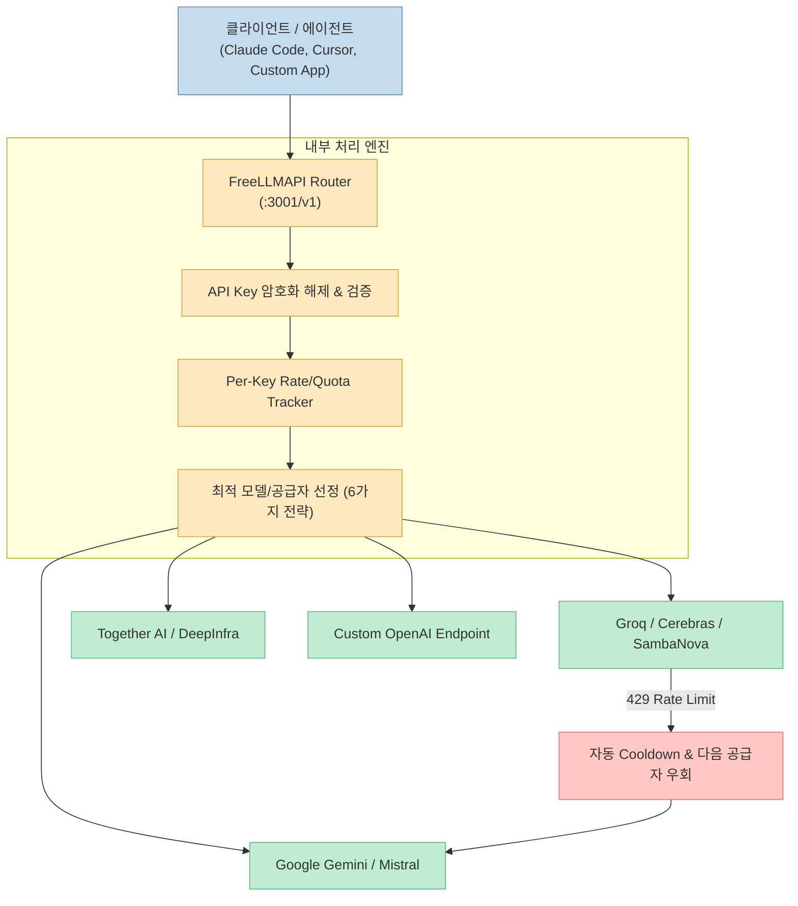

인공지능 연구소와 API 공급사들이 경쟁적으로 무료 플랜(Free Tier)을 출시함에 따라, 개발자 개개인이 활용할 수 있는 무료 토큰 용량은 월 수억 토큰 수준에 이르게 되었습니다. 하지만 각 공급자마다 별도의 API 키를 발급받아야 하고, 낮은 분당 요청 제한(RPM/TPM)이나 `429 Rate Limit` 에러를 직접 처리해야 하는 번잡함이 존재합니다.

최근 오픈소스로 공개된 [FreeLLMAPI (tashfeenahmed/freellmapi)](https://github.com/tashfeenahmed/freellmapi)는 28개 이상의 주요 무료 LLM 서비스(약 358개 모델 엔드포인트)를 하나의 단일 API 엔드포인트 뒤로 묶어 주는 역방향 프록시(Reverse Proxy) 프로젝트입니다.

이 글에서는 FreeLLMAPI의 아키텍처 구조, 라우팅 및 장애 조치(Failover) 메커니즘, 그리고 개발자가 얻을 수 있는 이점과 한계를 종합적으로 분석해보겠습니다.

<!--more-->

## Sources

- [GitHub Repository - tashfeenahmed/freellmapi](https://github.com/tashfeenahmed/freellmapi)
- [FreeLLMAPI Official Catalog](https://freellmapi.co)
- [OpenAI API Reference](https://platform.openai.com/docs/api-reference)
- [Anthropic Messages API Documentation](https://docs.anthropic.com/claude/reference/messages_post)

---

## 1. FreeLLMAPI 핵심 아키텍처 개요

FreeLLMAPI는 개별 서비스 공급자들의 무료 티어를 모아 총 **월 40억 토큰** 분량의 처리 용량을 단일 엔드포인트로 노출합니다. 클라이언트는 복잡한 개별 키 관리 없이 표준 OpenAI 규격으로 요청을 전송하기만 하면 됩니다.



---

## 2. 주요 지원 엔드포인트 및 클라이언트 호환성

FreeLLMAPI는 단순한 텍스트 완성에 그치지 않고, 다양한 프로토콜 규격을 자체 레이어에서 번역하여 상용 도구들과 완벽하게 연동됩니다.

### 1) OpenAI 완벽 호환 (`/v1`)
- `/v1/chat/completions`: 일반 챗 및 도구 호출(Tool Calling), 스트리밍 지원
- `/v1/completions`: 에디터 코드 자동 완성(Ghost-Text)
- `/v1/responses`: Codex CLI 전용 엔드포인트 지원
- `/v1/embeddings`, `/v1/images/generations`, `/v1/audio/speech`: 임베딩 및 미디어 생성 라우팅

### 2) Anthropic Messages 규격 (`/v1/messages`)
- Anthropic의 와이어 프로토콜(Wire Format)을 해석하여 백엔드 무료 모델 풀로 라우팅합니다.
- 이에 따라 **Claude Code**나 Anthropic SDK 기반 에이전트를 무료 모델 풀에 연결하여 구동할 수 있습니다.

### 3) Gemini 및 Ollama 에뮬레이션
- Gemini CLI 지원을 위한 `/v1beta` 엔드포인트를 노출합니다.
- Zed, JetBrains 등 로컬 모델 클라이언트를 위해 Ollama 호환 NDJSON 엔드포인트를 제공합니다.

---

## 3. 라우팅 및 쿼터 관리 메커니즘

### 자동 우회(Failover) 및 쿨다운
특정 공급자에서 `429 (Rate Limit Exceeded)` 또는 `5xx` 에러가 수신되면, 해당 키 및 공급자를 일시적 쿨다운(Cooldown) 상태로 지정하고, 대체 체인(Fallback Chain)의 다음 공급자로 즉시 재요청을 시도합니다.

### 키별 사용량 실시간 추적 (Per-Key Rate Tracking)
`(Platform, Model, Key)` 조합별로 RPM(분당 요청), RPD(일당 요청), TPM(분당 토큰), TPD(일당 토큰) 수치를 메모리 상에서 실시간으로 갱신하여, 무료 플랜 한도를 초과하지 않도록 선제 제어합니다.

### 퓨전(Fusion) 멀티 모델 합성
가상 모델인 `fusion`을 호출하면 입력 프롬프트가 여러 무료 모델로 병렬 전송되고, 수신된 복수의 드래프트 답변을 판정(Judge) 모델이 평가하여 가장 뛰어난 답변 하나로 합성해냅니다.

---

## 4. 설치 및 실행 가이드

Docker를 이용해 한 줄로 손쉽게 호스팅할 수 있습니다.

```bash
docker run -d \
  --name freellmapi \
  -p 3001:3001 \
  -p 5173:5173 \
  -v freellmapi-data:/app/data \
  ghcr.io/tashfeenahmed/freellmapi:latest
```

실행 후 웹 대시보드(`http://localhost:5173`)에 접속하여 발급받은 무료 API 키들을 등록하면, 단일 프록시 엔드포인트(`http://localhost:3001/v1`)를 통해 즉시 서비스를 이용할 수 있습니다.

---

## 5. 결론 및 유의사항

FreeLLMAPI는 분산되어 있던 수십 개 AI 서비스의 무료 쿼터를 효과적으로 집약하여 개인 개발 환경의 비용을 획기적으로 낮춰주는 강력한 도구입니다.

다만, 무료 티어의 특성상 일몰 시간대에는 주요 최고 성능 모델의 하루 한도 소진으로 성능 저하가 발생할 수 있으며 SLA가 보장되지 않으므로, **상용 프로덕션 서비스보다는 개인 프로젝트, 에이전트 개발, 학습 및 실험용 환경**으로 활용하는 것이 가장 바람직합니다.
