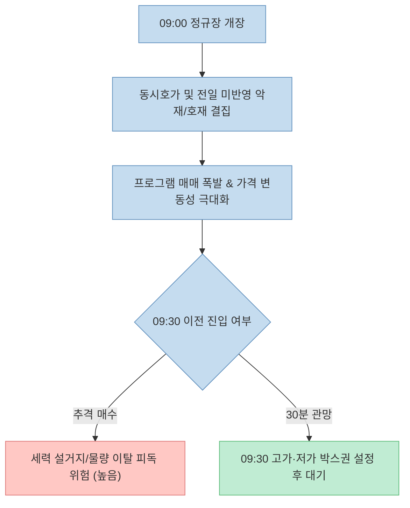
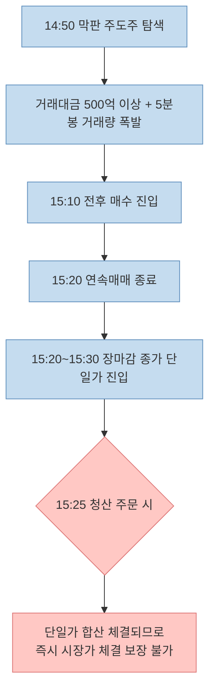

주식 단타 매매에서 가장 많은 손실을 유발하는 원인 중 하나는 **시간대별 시장 성격에 대한 이해 부족과 뇌동매매**입니다. 수많은 데이트레이더들이 "오전에 번 수익을 오후 횡보장에 다 까먹고 손실로 마감했다"는 경험을 토로합니다.

최근 [Threads에서 큰 화제를 모은 10년 차 전업 투자자(@sealtielgamerx)의 게시물](https://www.threads.com/share/_lDQ6BNm5/)은 "하루 종일 주식 창을 보는 것이 아니라 하루 딱 두 번만 승부해야 승률이 올라간다"며 4가지 시간대별 매매 철칙을 제시해 많은 주목을 받았습니다.

이 글에서는 해당 스레드가 제시한 시간대별 매매 가이드를 정밀하게 분석하고, 한국거래소(KRX)의 실제 매매 체결 제도, 수급 추정치와 확정치의 차이, 슬리피지(Slippage) 및 행동재무학적 리스크 요소를 객관적으로 팩트체크해보겠습니다.

<!--more-->

## Sources

- [Threads 원문 게시물 - 상한가맛집 (@sealtielgamerx)](https://www.threads.com/share/_lDQ6BNm5/)
- [KRX 한국거래소 - KOSPI/KOSDAQ 시장 매매체결 제도](https://global.krx.co.kr/contents/GLB/06/0602/0602010201/GLB0602010201T1.jsp)
- [KRX 데이터 마켓플레이스 - 투자자별 순매수 데이터 제공 시점 안내](https://data.krx.co.kr/)
- [U.S. SEC - Day Trading: Your Dollars at Risk](https://www.sec.gov/news/studies/daytrading.htm)
- [Daniel Kahneman & Amos Tversky - Prospect Theory: An Analysis of Decision under Risk (1979)](https://www.jstor.org/stable/1914185)

> 이 글은 특정 종목 매수/매도를 추천하지 않으며, 공개된 단타 매매 전략을 금융 제도와 시장 데이터 관점에서 객관적으로 분석한 교육용 글입니다.

---

## 1. 원문이 제시한 4가지 시간대 매매 수칙 요약

스레드 원문은 장 시작부터 마감까지의 하루를 4가지 구간으로 분할하고, 거래 기회를 엄격히 제한하는 원칙을 정리했습니다.

1. **09:00 ~ 09:30 (관망 구간):** 절대 주문을 내지 않는다. 장 초반 30분은 외국인과 기관의 전일 프로그램 정리 구간이며, 9시 30분 전 고점을 찍고 밀리는 종목이 80% 이상이다. 10개 관심 종목의 9시 30분 고가·저가 박스권을 확인한다.
2. **10:00 ~ 11:30 (오전 주력 승부 구간):** 9시 30분까지 형성된 횡보 박스권을 거래량과 함께 상방 돌파하고, HTS 수급 창에서 기관이 3분 연속 순매수로 유입되는 종목을 매수한다. 일일 수익의 60%를 이 시간대에 달성한다.
3. **13:00 ~ 14:30 (점심시간 매매 금지):** 거래량이 뚝 떨어지고 호가가 얇아져 슬리피지가 증가하는 구간이므로 매매를 완전 중단하고 휴식을 취한다.
4. **14:50 ~ 15:25 (오후 막판 승부 및 당일 전량 청산):** 당일 거래대금 500억 이상 + 2~3% 선 지지 + 3시 10분 전후 5분봉 거래량 폭발 종목 진입 후, 3시 25분 동시호가 진입 직전 전량 청산한다. 하루 수익의 나머지 30%를 담당한다.
5. **최종 핵심 룰:** "하루에 단 두 번(오전 10~11시 반, 오후 2시 50분~3시 25분)만 승부한다."

---

## 2. 시간대별 매매 구조와 KRX 제도 팩트체크

### 장 초반 30분 관망 (09:00 ~ 09:30)

장 시작 직후 30분은 동시호가 체결 물량, 해외 증시 갭상승/하락, 그리고 수많은 외국인·기관 알고리즘의 프로그램 매매가 집중되는 시점입니다.

개인 투자자 입장에서 장 개장 직후 30분간 관망하며 박스권 상·하단을 설정하는 것은 뇌동매매와 시초가 갭상승 후 장대음봉 밀림을 방지하는 유용한 림(Rim) 역할을 합니다.

### 오전 기관 수급 돌파 (10:00 ~ 11:30) 및 수급 데이터의 한계

원문은 HTS 수급 창에서 "기관이 3분 연속 순매수로 들어오는지 확인해야 한다"고 설명합니다. 하지만 투자자가 유의해야 할 팩트가 있습니다.

- **장중 추정치 vs 장후 확정치:** KRX 한국거래소의 정규 투자자별 순매수 통계는 **장 마감 이후(15:45/18:00)**에 확정됩니다. 장중 HTS에 표시되는 수급 창은 일부 주요 창구의 주문 내역을 기반으로 한 **증권사 집계 추정치**입니다.
- 지연 발생이나 정정 가능성이 존재하므로, HTS 수급 창의 3분 연속 순매수 신호 하나만을 절대적인 확신으로 삼아서는 안 되며, 반드시 **실제 체결량 및 거래대금 증가**를 동반 확인해야 합니다.

### 점심시간 횡보와 슬리피지 (13:00 ~ 14:30)

점심시간에는 시장 참여자들의 거래 빈도가 낮아지며 호가 잔량이 얇아집니다.

- **슬리피지(Slippage) 위험:** 호가가 얇은 상태에서 매수/매도 주문을 넣으면 본인이 본 가격보다 1~2호가 불리하게 체결될 확률이 높아집니다.
- 변동성과 유동성이 둔화된 장세에서 무리하게 진입하는 것은 거래 수수료와 슬리피지로 인해 계좌를 서서히 피마르게 만드는 주원인이 됩니다.

---

## 3. 장 막판 매매와 종가 단일가 체결 구조

원문은 14:50부터 전고점 돌파 종목을 찾아 진입하고 **15:25 전에 무조건 청산**하라고 권고합니다.

KRX 주식 정규장의 체결 방식은 **15:20**을 기점으로 달라집니다.

- **09:00 ~ 15:20:** 가격과 시간이 맞으면 즉시 체결되는 연속매매 구간
- **15:20 ~ 15:30:** 주문을 모아 15:30에 단 하나의 종가로 체결시키는 **종가 단일가 매매** 구간

따라서 15:25분에 청산 주문을 내는 것은 연속매매가 아닌 종가 단일가 호가 제출이므로, 원하는 가격에 즉시 빠져나오지 못할 수 있습니다. 당일 무조건 오버나이트 없이 포지션을 종료하려는 투자자는 **15:20 이전 연속매매 구간에서 체결을 마치는 것**이 안전합니다.

---

## 4. 거래 횟수 제한과 승률의 확률론

원문의 가장 핵심적인 통찰은 **"하루에 단 두 번만 승부한다"**는 거래 횟수 제한 법칙입니다.

$$\text{일일 총 기대수익} = \sum_{i=1}^{N} \left( P_{\text{win}} \cdot R_{\text{win}} - P_{\text{loss}} \cdot R_{\text{loss}} - C_{\text{cost}} \right)$$

*($N$은 총 거래 횟수, $C_{\text{cost}}$는 세금 및 거래비용)*

거래 횟수($N$)가 많아질수록 뇌동매매와 세금/수수료 누적으로 인해 기대값이 음수(-)로 수렴할 위험이 높아집니다. 거래 횟수를 하루 2회로 제한하면 감정적 추격 매수가 억제되고 승률이 높은 최상급 타점에만 자금을 집중할 수 있습니다.

---

## 5. 실전 단타 체크리스트

| 단계 | 매매 검증 항목 | 체크 |
|:---|:---|:---:|
| **1단계** | 현재 시각이 09:30 이후이며, 09:30 고가·저가 박스권이 설정되었는가? | [ ] |
| **2단계** | 박스권 상단 돌파 시 대량 거래량과 수급이 동시에 확인되는가? | [ ] |
| **3단계** | 점심시간(13:00~14:30) 얇은 호가창 횡보주 매매를 피하고 있는가? | [ ] |
| **4단계** | 오후 막판 매매 시 15:20 이전 연속매매 구간에서 청산을 완료했는가? | [ ] |
| **5단계** | 오늘 일일 매매 횟수가 2회를 넘지 않았는가? | [ ] |

---

## 6. 결론

@sealtielgamerx의 4가지 시간대 매매 원칙은 **"충동적인 과잉 매매를 막고 나만의 거래 횟수를 통제한다"**는 점에서 개인 투자자들에게 실전적으로 매우 유용한 리스크 관리 틀을 제시합니다.

다만, HTS 장중 수급 추정치의 정정 가능성 및 15:20 이후 종가 단일가 구간의 체결 메커니즘을 숙지하여, 실제 매매에서는 15:20 이전 청산과 정량적 손절선을 결합할 때 비로소 완성도 높은 매매 전략을 구축할 수 있습니다.
