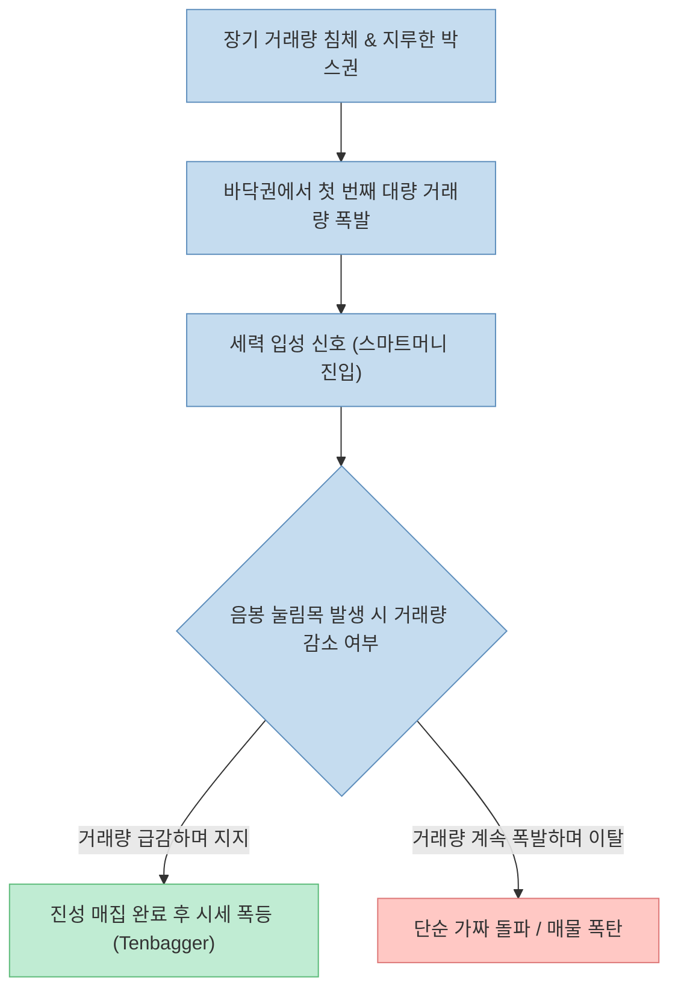
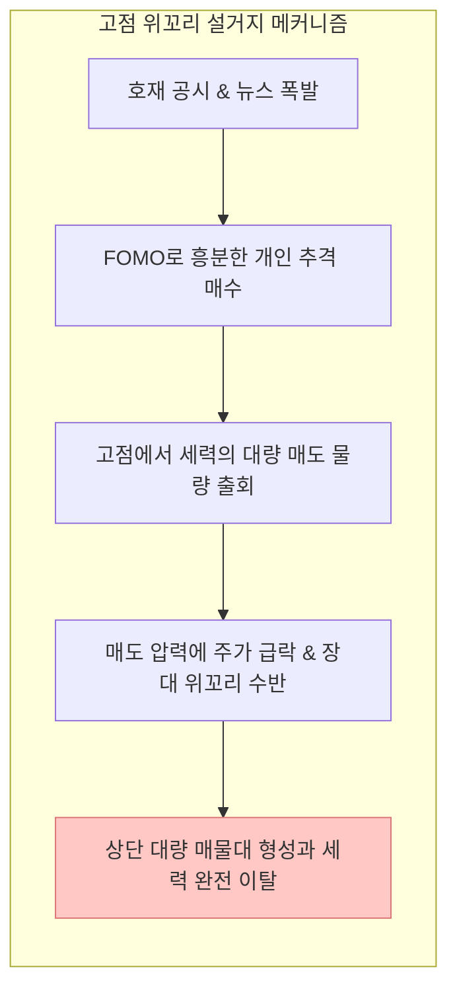

주식 시장에서 주가는 세력이나 대형 기관의 의도적 호가 제출로 단기 속임수(Fakeout)를 만들 수 있지만, **거래량(Volume)은 수급의 실체를 은폐할 수 없는 가장 명확한 증거**로 꼽힙니다.

최근 [Threads에서 큰 호응을 얻은 한 투자자의 게시물(@buoll.story1)](https://www.threads.com/share/BAQFtNwlav/)은 "세력이 절대로 속이지 못하는 것은 거래량"이라며, 실제 국내 종목(제주반도체, HLB, 휴림로봇)의 차트 사례를 통해 **매집, 개미 털기, 고점 설거지**의 3가지 핵심 패턴을 쉽게 설명해 주식 초보자들에게 큰 관심을 받았습니다.

이 글에서는 원문이 제시한 3가지 거래량 패턴과 종목 사례를 주식 시장의 구조적 수급 원리, 와이코프(Wyckoff) 매집/분산 이론, 거래량 분석의 팩트와 한계점을 바탕으로 깊이 있게 조명해보겠습니다.

<!--more-->

## Sources

- [Threads 원문 게시물 - buoll.story1 (@buoll.story1)](https://www.threads.com/share/BAQFtNwlav/)
- [KRX 한국거래소 - KOSPI/KOSDAQ 주식 매매체결 및 호가 정보](https://global.krx.co.kr/)
- [Richard D. Wyckoff - Method of Trading and Investing in Stocks (1931)](https://www.wyckoffanalytics.com/)
- [U.S. SEC - Day Trading Risk Disclosure & Market Manipulation Overview](https://www.sec.gov/news/studies/daytrading.htm)

> 이 글은 특정 종목에 대한 매수/매도 추천이 아니며, 공개된 기술적 분석 패턴과 수급 메커니즘을 학습 목적으로 검증한 분석 글입니다.

---

## 1. 원문이 제시한 3가지 거래량 패턴 요약

원문은 주식 차트에서 개미 투자자들이 세력의 물량 이동을 읽어낼 수 있는 3가지 명확한 거래량 신호를 실제 종목 사례와 함께 설명했습니다.

1. **매집 (제주반도체 080220 / 2023년 11월):** 평소 거래량이 침체되어 있던 바닥권에서 갑자기 미친 듯한 거래량 폭발이 발생하며 주포(세력)의 진입 신호를 알림.
2. **개미 털기 (HLB 028300 / 2024년 1월):** 1차 상승 후 주가가 계속 밀려 내려가지만, 거래량이 거래 정지 수준으로 현저히 감소함. 이는 세력 이탈이 아니라 물량을 털어내는 과정.
3. **고점 설거지 (휴림로봇 090710):** 주가가 연일 폭등한 최고점 부근에서 역대급 대량 거래량과 함께 장대 위꼬리가 발생함. 대중(개미)에게 물량을 넘기고 이탈하는 탈출 신호.

---

## 2. 3가지 거래량 패턴의 기술적 분석 및 팩트체크

### 패턴 1: 바닥권 대량 거래량 매집 (Accumulation)

**제주반도체(080220)**의 2023년 11월 차트는 전형적인 와이코프 매집 3단계(Phase C/D)의 양상을 보여줍니다. 

장기간 거래량이 소멸한 채 기어가던 주가가 거래량 수십 배 폭발과 함께 첫 장대양봉을 뽑아내는 것은 **스마트 머니(Smart Money)의 진입**을 뜻합니다. 바닥권에서의 첫 대량 거래량은 세력이 시장 매물을 싹쓸이하여 유동성을 확보하는 과정이며, 이후 일시적인 음봉 눌림목에서도 거래량이 줄어들며 지지받는다면 급등 시세의 전초 단계가 됩니다.

### 패턴 2: 거래량 소멸 하락 (Low-Volume Pullback / Shakeout)

**HLB(028300)**의 2024년 1월 사례처럼, 1차 폭등 후 주가가 수일간 급락하는데 거래량이 씨가 마르는 현상은 **개미 털기(Shakeout)**의 정석입니다.

- **진성 이탈 하락:** 주가가 하락할 때 대량 거래량이 터지는 경우. 세력이 유동성을 챙기고 실체 매도를 진행한 것임.
- **가짜 하락 (Shakeout):** 주가가 하락함에도 거래량이 이전 상승 거래량의 1/10 이하로 줄어드는 경우. 수급의 주포가 주식을 던지지 않은 채 개인들의 손절 물량을 저가에서 받아먹는 과정임.

거래량이 안 터진 하락은 공포에 질려 손절할 자리가 아니라, 차트의 주요 이동평균선(20일/60일선)이나 전고점 지지선에서의 반등을 노리는 **눌림목 매수 기회**로 해석할 수 있습니다.

### 패턴 3: 고점 대량 거래량 위꼬리 (Distribution / Blow-off Top)

**휴림로봇(090710)** 사례와 같이 주가가 수배 폭등한 고점 자리에서 역대급 대량 거래량과 함께 장대 위꼬리가 형성되는 것은 **분산(Distribution)과 설거지**의 전형입니다.

주가가 이미 많이 오른 상태에서 언론 매체의 호재 뉴스와 함께 대량 거래가 유입되면 대중은 추가 상승(상한가)을 기대하며 추격 매수에 나섭니다. 그러나 세력은 이때 수직으로 몰려드는 개인들의 매수세를 이용해 자신들의 대량 보유 물량을 넘기고 시장을 떠납니다. 

---

## 3. 거래량 분석 시 반드시 주의해야 할 팩트와 한계

거래량이 가장 신뢰도 높은 기술적 지표인 것은 사실이지만, 100% 무결한 신호는 아닙니다.

1. **자전거래 (Wash Trading) 주의:** 세력이 자신이 소유한 복수의 계좌 간에 동일 가격으로 대량 매수/매도 주문을 주고받아 의도적으로 거래량을 부풀리는 경우가 있습니다.
2. **거래대금 미확인:** 유통 주식 수가 적은 품절주나 단가가 낮은 동전주의 경우 거래량 착시가 생길 수 있으므로 항상 **거래대금(거래량 × 주가)**을 함께 계산해야 합니다.
3. **돌파 체결 실패 (Fakeout):** 바닥권 대량 거래량 양봉이 나온 뒤에도 악재나 시장 지수 급락으로 거래량을 깨고 내려가는 경우가 있으므로 정량적 손절선(-3%~-5%) 배치가 필수적입니다.

---

## 4. 실전 거래량 분석 체크리스트

| 검증 단계 | 차트 및 거래량 확인 항목 | 체크 |
|:---|:---|:---:|
| **1단계 (매집)** | 장기 횡보 후 바닥권에서 평소 거래량의 5~10배 이상 폭발하는 양봉이 발생했는가? | [ ] |
| **2단계 (눌림)** | 주가 조정 시 거래량이 현저히 줄어들며 20일선 등 핵심 지지선을 지키는가? | [ ] |
| **3단계 (경계)** | 주가 고점에서 언론 호재 뉴스 폭발과 함께 역대급 거래량 대량 위꼬리가 달리지 않았는가? | [ ] |
| **4단계 (리스크)** | 거래량 정량 신호 외에도 당일 거래대금이 최소 300억~500억 이상 유입되었는가? | [ ] |

---

## 5. 결론

@buoll.story1의 거래량 분석법은 **"가격이라는 표면적 착시에 속지 말고 거래량이라는 수급의 본질을 보라"**는 측면에서 주식 투자자들에게 매우 직관적이고 강력한 가이드라인을 제공합니다.

바닥권 대량 거래량(매집), 저거래량 조정(개미털기), 고점 대량 거래 위꼬리(설거지)의 3가지 패턴을 명확히 숙지하고, 손절선 배치 및 거래대금 조건을 결합한다면 세력의 물량 넘기기 희생양이 되는 위험을 현저히 낮출 수 있습니다.
