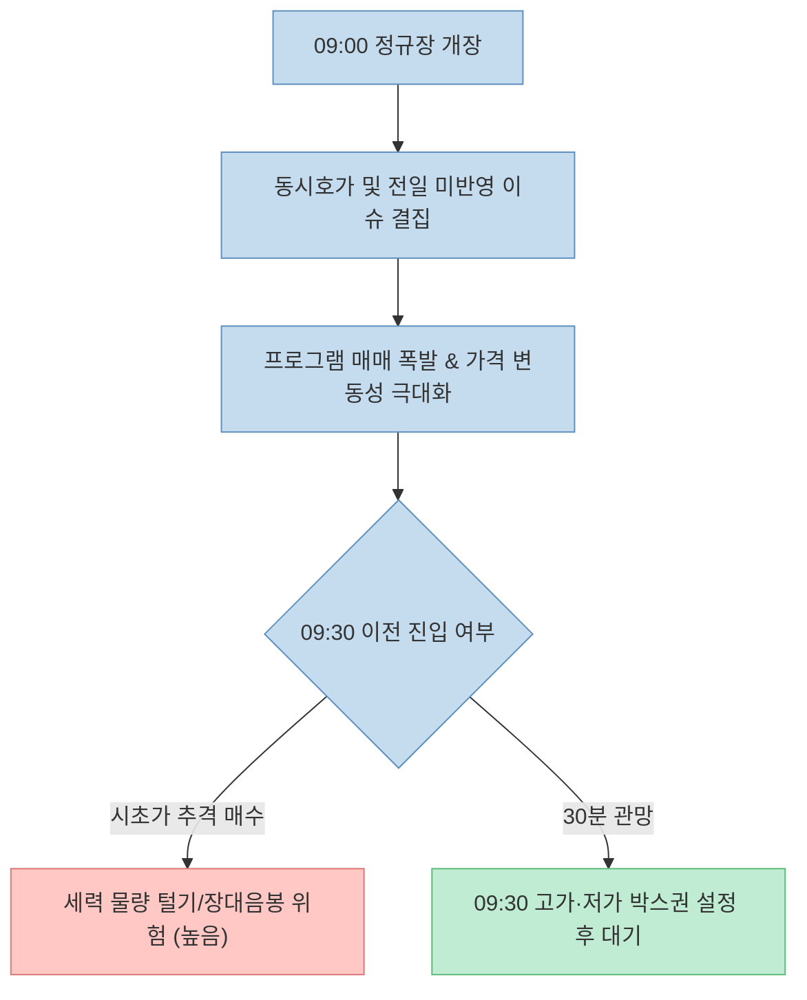
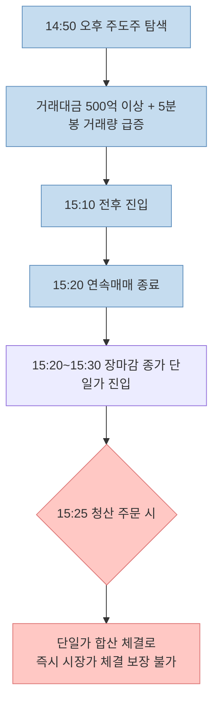

주식 시장에서 단기 매매(데이트레이딩)로 꾸준한 수익을 내는 것은 복잡한 기술적 지표보다 **시장의 시간대별 특성을 이해하고 자신의 매매 횟수를 통제하는 것**에서 시작됩니다. 수많은 개인 투자자들이 "오전에 번 수익을 오후 지루한 장세에서 뇌동매매로 모두 까먹었다"고 토로하곤 합니다.

최근 [Threads에서 큰 화제를 모은 투자자의 게시물](https://www.threads.com/share/_5q4QuRB_/)은 "1,000만 원에서 1억 원까지 10년이 걸렸지만, 1억 원에서 35억 원까지는 2년밖에 걸리지 않았다"는 경험담과 함께, 자신을 진정으로 바꾼 핵심 비결로 **4가지 시간대별 매매 수칙**을 소개해 많은 호응을 얻었습니다.

이 글에서는 해당 스레드가 제시한 시간대별 매매 전략을 정밀하게 검토하고, 한국거래소(KRX)의 실제 매매 체결 제도, 수급 데이터의 한계, 슬리피지(Slippage) 및 행동재무학적 리스크 요소를 객관적으로 팩트체크해보겠습니다.

<!--more-->

## Sources

- [Threads 원문 게시물 - 1,000만 원에서 35억 원 단타 매매 원칙](https://www.threads.com/share/_5q4QuRB_/)
- [KRX 한국거래소 - KOSPI/KOSDAQ 시장 매매체결 제도](https://global.krx.co.kr/contents/GLB/06/0602/0602010201/GLB0602010201T1.jsp)
- [KRX 데이터 마켓플레이스 - 투자자별 순매수 통계 안내](https://data.krx.co.kr/)
- [U.S. SEC - Day Trading: Your Dollars at Risk](https://www.sec.gov/news/studies/daytrading.htm)
- [Fernando Chague et al. - Day Trading for a Living? (SSRN Working Paper)](https://papers.ssrn.com/sol3/papers.cfm?abstract_id=3423101)

> 이 글은 특정 종목에 대한 매수/매도 추천이 아니며, 시중에 공유된 기술적 단타 전략과 수급 메커니즘을 제도 및 데이터 관점에서 객관적으로 분석한 교육용 글입니다.

---

## 1. 원문이 제시한 4가지 시간대 매매 수칙 요약

스레드 원문은 하루 동안 HTS에 계속 매달리는 대신, 하루 단 두 번만 엄격하게 매매하는 시간대별 규율을 제시했습니다.

1. **09:00 ~ 09:30 (장 초반 절대 관망):** 개장 후 30분간은 외국인·기관의 프로그램 물량이 쏟아지는 시기이므로 주문을 내지 않는다. 9시 30분까지 형성된 당일 고가·저가 박스권을 관찰하며 대기한다.
2. **10:00 ~ 11:30 (오전 핵심 주력 타점):** 9시 30분까지의 횡보 박스를 거래량 폭발과 함께 상방 돌파하는 종목을 노린다. HTS 기관 수급 창에서 기관의 3분 연속 순매수를 확인한 뒤 진입한다. (일일 수익의 60% 창출)
3. **13:00 ~ 14:30 (점심시간 매매 절대 금지):** 거래량이 뚝 떨어지고 호가가 얇아져 슬리피지가 늘어나는 구간이므로 매매를 완전 중단하고 휴식을 취한다.
4. **14:50 ~ 15:25 (오후 막판 승부 & 당일 전량 청산):** 당일 거래대금 500억 이상, 2~3% 선 지지, 3시 10분 전후 5분봉 거래량 폭발 주도주 진입 후, 3시 25분 동시호가 전 무조건 전량 청산한다. (일일 수익의 나머지 30% 담당)
5. **최종 핵심 룰:** "하루에 단 두 번(오전 10:00~11:30, 오후 14:50~15:25)만 승부한다."

---

## 2. 시간대별 매매 구조와 KRX 제도 팩트체크

### 장 초반 30분 관망 (09:00 ~ 09:30)

개장 직후 30분은 전날 장 마감 후 발생한 이슈, 동시호가 결집 물량, 해외 증시 지수 반영 및 외국인·기관 알고리즘의 대량 프로그램 매매가 일시에 분출하는 변동성 극대화 구간입니다.

개인 투자자가 장 초반 30분간 관망하며 9시 30분 기준 고가·저가 박스권을 설정하는 것은, 시초가 갭상승 후 긴 음봉으로 밀리는 종목에 물리거나 뇌동매매를 벌이는 위험을 효과적으로 방지해 줍니다.

### 오전 기관 수급 돌파 (10:00 ~ 11:30) 및 HTS 데이터의 주의점

원문은 횡보 박스 돌파 시 HTS의 기관 3분 연속 순매수를 확인하라고 말합니다. 그러나 투자자가 유의해야 할 정량적 사실이 있습니다.

- **장중 추정치 vs 장후 확정치:** KRX 한국거래소의 공식 투자자별 순매수 데이터는 정규장 마감 후인 **15:45 및 18:00경**에 최종 확정됩니다. 장중 HTS에 표시되는 수급 창은 주요 창구 거래를 기반으로 한 **증권사 추정 데이터**입니다.
- 지연이나 수정 가능성이 있으므로, 수급 창의 숫자에만 의존하기보다는 반드시 **실제 체결 거래대금 및 분봉 거래량 급증**을 함께 검증해야 합니다.

### 점심시간 횡보와 슬리피지 (13:00 ~ 14:30)

점심시간에는 참여자 감소로 호가 잔량이 얇아집니다.

- **슬리피지(Slippage) 위험:** 호가창이 얇으면 의도한 매수가보다 1~2호가 불리하게 체결되기 쉽습니다.
- 거래량과 유동성이 소멸된 상태에서 지루하게 옆으로 기어가는 종목에 진입하는 것은 거래 수수료와 슬리피지로 인해 기회비용을 허비하는 결과를 낳습니다.

---

## 3. 장 막판 매매와 종가 단일가 체결 구조

원문은 14:50부터 주도주를 탐색하고 **15:25 전에 무조건 청산**하라고 강조합니다.

KRX 주식 정규장의 체결 방식은 **15:20**을 기점으로 변화합니다.

- **09:00 ~ 15:20:** 조건에 맞으면 즉시 체결되는 연속매매 구간
- **15:20 ~ 15:30:** 주문을 모아 15:30에 단 하나의 종가로 일괄 체결하는 **종가 단일가 매매** 구간

따라서 15:25분에 낸 청산 주문은 15:30 종가 확정 전까지 체결이 보장되지 않는 단일가 호가로 참여하게 됩니다. 당일 오버나이트 없이 완전 청산을 원하는 데이트레이더는 **15:20 이전 연속매매 구간에서 체결을 완료하는 것**이 안전합니다.

---

## 4. 거래 횟수 제한과 기대값 수학 공식

이 매매 전략의 가장 핵심적인 규칙은 **하루 2회로 거래 횟수를 제한**하는 것입니다.

$$\text{일일 총 기대수익} = \sum_{i=1}^{N} \left( P_{\text{win}} \cdot R_{\text{win}} - P_{\text{loss}} \cdot R_{\text{loss}} - C_{\text{cost}} \right)$$

*($N$은 거래 횟수, $C_{\text{cost}}$는 세금 및 거래 수수료)*

단타 매매에서 거래 횟수($N$)가 지나치게 많아지면 세금 및 슬리피지 비용($C_{\text{cost}}$)이 기하급수적으로 누적되고 뇌동매매 확률이 급증합니다. 하루 매매 횟수를 2회로 제한하는 것은 감정을 통제하고 승률이 가장 높은 구간에만 승부하는 리스크 관리 도구가 됩니다.

---

## 5. 실전 단타 5단계 체크리스트

| 단계 | 매매 검증 항목 | 체크 |
|:---|:---|:---:|
| **1단계** | 현재 시각이 09:30 이후이며, 09:30 박스권 상·하단이 설정되었는가? | [ ] |
| **2단계** | 박스권 상단 돌파 시 분봉 거래량과 수급 거래대금이 급증하는가? | [ ] |
| **3단계** | 거래량이 소멸하고 호가가 얇은 점심시간(13:00~14:30) 매매를 피했는가? | [ ] |
| **4단계** | 오후 막판 청산 시 15:20 이전 연속매매 구간에서 완료했는가? | [ ] |
| **5단계** | 오늘 나의 일일 총 거래 횟수가 2회를 초과하지 않았는가? | [ ] |

---

## 6. 결론

1,000만 원에서 35억 원을 일군 단타 개미의 4가지 시간대 매매 수칙은 **"하루 종일 주식 창을 보며 무분별하게 거래하지 말고, 정해진 시간대의 최상급 타점에만 승부하라"**는 명확한 규율을 제시합니다.

KRX의 15:20 종가 단일가 변환 타이밍과 장중 HTS 수급 추정치의 특징을 함께 이해하고 적용할 때, 비로소 나만의 자산을 지키는 안정적인 단타 매매 시스템을 구축할 수 있을 것입니다.
