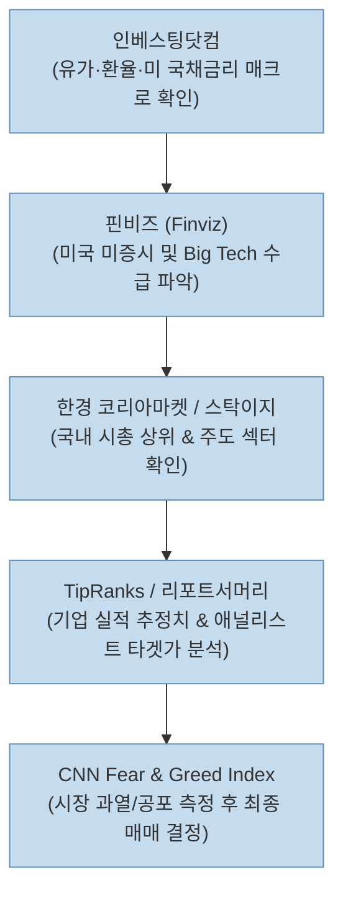

현대 주식 시장에서는 단순히 뉴스나 소문에 의존해 투자하는 것보다 **신뢰할 수 있는 데이터 플랫폼을 활용해 글로벌 매크로 환경, 시장 수급, 기업 가치 및 투자자 심리를 종합적으로 분석하는 것**이 승률을 높이는 핵심 요소입니다.

최근 [Threads에서 큰 호응을 얻은 투자 노트 게시물(@_market_note)](https://www.threads.com/share/_mcp7VEHY/)은 국내외 주식 투자 시 꼭 알아두어야 할 **필수 사이트 TOP 8**을 정리해 주식 초보자부터 전업 투자자까지 큰 관심을 받았습니다.

이 글에서는 원문에 추천된 8개 사이트의 세부 기능과 장점을 분석하고, 매크로 지표부터 개별 종목 리서치까지 이어지는 실전 활용 워크플로우를 정량적으로 정리해보겠습니다.

<!--more-->

## Sources

- [Threads 원문 게시물 - 주식 투자할 때 유용한 사이트 TOP 8 (@_market_note)](https://www.threads.com/share/_mcp7VEHY/)
- [한경 코리아마켓 코스피/코스닥 히트맵](https://markets.hankyung.com/marketmap/kospi)
- [ETF CHECK 모바일/웹 플랫폼](https://www.etfcheck.co.kr/)
- [Investing.com 글로벌 금융 지표](https://kr.investing.com/)
- [Finviz 미국 주식 스크리너 및 히트맵](https://finviz.com/map.ashx?t=sec)
- [TipRanks 월가 애널리스트 투자의견 분석](https://www.tipranks.com/)
- [CNN Fear & Greed Index](https://edition.cnn.com/markets/fear-and-greed)

> 이 글은 특정 플랫폼이나 금융 상품에 대한 광고가 아니며, 정보 분석용 오픈 데이터 사이트들의 특징을 정리한 교육용 글입니다.

---

## 1. 추천 사이트 TOP 8 핵심 개요

원문은 국내 증시 시각화, ETF 비교, 글로벌 매크로 지표, 미 증시 분석, 투자 심리 지수까지 분야별로 가장 뛰어난 8개 플랫폼을 소개했습니다.

1. **한경 코리아마켓:** 국내 코스피/코스닥 시가총액 및 섹터별 주가 등락 현황 시각적 히트맵 제공.
2. **ETF CHECK:** 국내외 다양한 ETF 구성 종목, 순자산 규모, 수수료 및 테마별 라인업 비교.
3. **인베스팅닷컴 (Investing.com):** 지수 선물, 원자재(WTI, 금), 원·달러 환율, 미 국채 10년물 금리 실시간 조회.
4. **핀비즈 (Finviz):** 미국 S&P 500 및 전체 섹터별 등락 현황을 색상과 기업 크기로 직관적 시각화.
5. **TipRanks:** 월가 애널리스트들의 목표가, 매수/매도 투자의견 및 애널리스트 예측 적중률 통계 제공.
6. **리포트서머리 (WiseReport):** 국내 주요 증권사 리서치 센터의 종목/산업 보고서 핵심 요약본 제공.
7. **스탁이지 (StockEasy):** 장중 실시간 테마주 및 섹터 수급 동향 통합 모니터링.
8. **CNN Fear & Greed Index:** 미국 증시의 투자자 심리 상태(0~100 수치) 계측 지표.

---

## 2. 카테고리별 사이트 세부 특징 및 실전 활용법

### 1) 국내 증시 시각화 및 수급 모니터링

#### 한경 코리아마켓 & 스탁이지

장 시작 후 어떤 섹터로 수급이 몰리는지 한눈에 파악하는 것은 단타 및 스윙 투자에서 필수적입니다.

- **한경 코리아마켓 히트맵:** 코스피/코스닥 전체 시가총액 비중별로 블록 크기가 정해져 있어, 삼성전자, SK하이닉스, 2차전지, 바이오 등 대형주와 주도 섹터의 강세를 즉각 파악할 수 있습니다.
- **스탁이지 (StockEasy):** 당일 주도 테마와 섹터별 수급 집중도를 파악하는 데 특화되어 있어 장중 빠른 대응에 유리합니다.

### 2) ETF 종목 파악 및 기업 분석 리포트

#### ETF CHECK & 리포트서머리

개별 종목 발굴이 어렵거나 특정 산업 섹터 전체에 투자하고자 할 때 ETF 분석 도구가 유용합니다.

- **ETF CHECK:** ETF 내부 보유 종목(PDF)과 비중, 펀드 수수료(TER), 최근 수급 유입 현황을 정밀하게 검토할 수 있어 포트폴리오 구성에 필수적인 서비스입니다.
- **리포트서머리 (FnGuide / WiseReport 기반):** 개별 기업의 3개년 실적 추정치(Consensus), 영업이익률, PER/PBR 밸류에이션 및 증권사 애널리스트의 목표주가 변경 내역을 요약해서 읽을 수 있습니다.

### 3) 글로벌 매크로 환경 및 미 증시 분석

#### 인베스팅닷컴 & 핀비즈 (Finviz)

한국 증시는 글로벌 거시경제 변수(미국 금리, 환율, 유가)에 강하게 동기화됩니다.

- **인베스팅닷컴:** 미 국채 10년물 금리 급등, 달러 인덱스 상승, 유가 변동 등 시장 위험 요인을 실시간 추적할 수 있는 글로벌 필수 플랫폼입니다.
- **핀비즈 (Finviz Map):** 미국 장 마감 후 Big Tech(애플, 엔비디아, 마이크로소프트 등)를 포함한 전 섹터의 흐름을 한눈에 시각화하여 글로벌 수급 향방을 가늠할 수 있게 해줍니다.

### 4) 전문가 의견 및 심리 지표 분석

#### TipRanks & CNN Fear & Greed Index

- **TipRanks:** 미국 주식 분석 시 단순한 목표가뿐 아니라 해당 애널리스트의 과거 1년간 추천 적중률과 수익률 스코어를 함께 공개하여 정보의 신뢰도를 판단할 수 있습니다.
- **CNN Fear & Greed Index:** 주가 변동성, 풋/콜 옵션 비율, 시장 유동성 등 7가지 하부 지표를 종합하여 0(극도의 공포)에서 100(극도의 탐욕)으로 나타냅니다. 지수가 20 미만인 극도의 공포 구간은 역발상 매수 기회가 되며, 80 이상인 탐욕 구간은 현금 비중 확대의 신호가 됩니다.

---

## 3. 실전 5단계 스마트 투자 체크리스트

| 단계 | 투자 분석 체크리스트 | 사용 사이트 |
|:---|:---|:---:|
| **1단계** | 미 국채 금리, 환율, 원유 가격 등 매크로 지표가 안정적인가? | 인베스팅닷컴 |
| **2단계** | 글로벌 증시 및 미 증시 빅테크 주도 섹터의 흐름이 양호한가? | 핀비즈 (Finviz) |
| **3단계** | 현재 시장 심리가 극단적 과열(80 이상) 상태는 아닌가? | CNN Fear & Greed |
| **4단계** | 국내 주도 섹터 및 관심 ETF의 종목 구성과 수급이 유입되고 있는가? | 한경 / ETF CHECK |
| **5단계** | 대상 기업의 실적 컨센서스와 애널리스트 타겟가가 적정한가? | TipRanks / 리포트서머리 |

---

## 4. 결론

추천된 8가지 사이트는 단순한 주식 차트 조회를 넘어 **글로벌 매크로 현황 분석 -> 세부 주도 섹터 파악 -> 기업 실적 및 애널리스트 검증 -> 시장 심리 측정**으로 이어지는 체계적인 투자 판단 프로세스를 구축하게 해줍니다.

자신만의 루틴을 만들어 매일 장 시작 전후로 이 플랫폼들을 정량적으로 점검한다면, 감정에 휘둘리지 않는 성공적인 투자를 이어갈 수 있을 것입니다.
