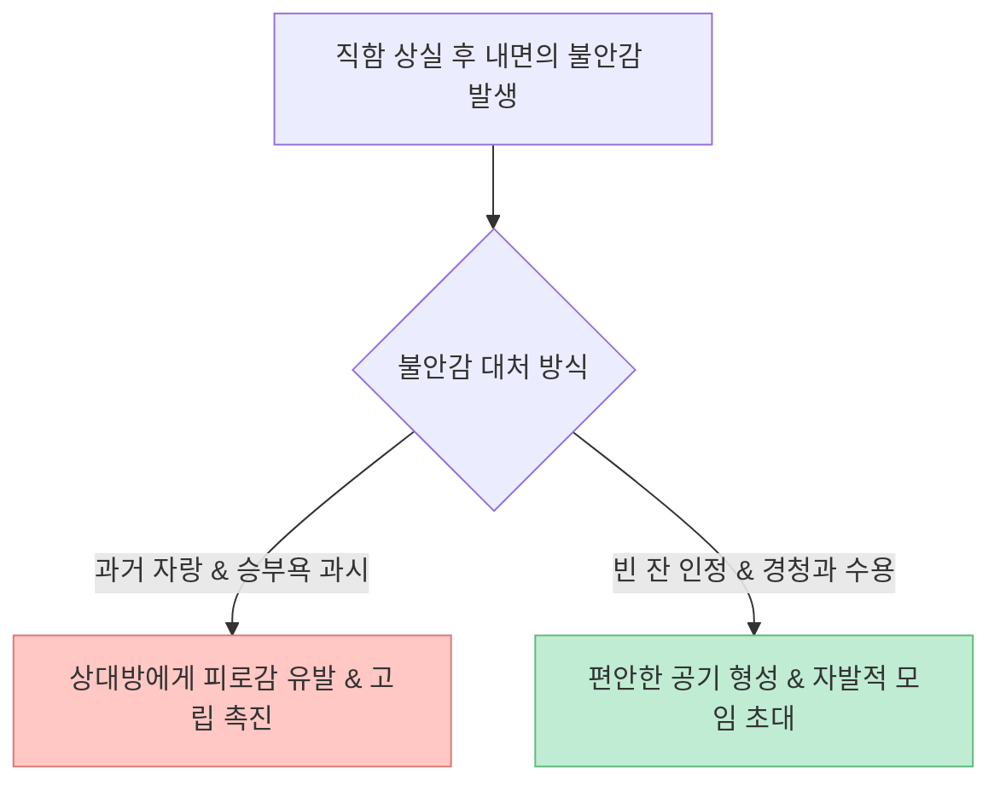

직장에서 최고 승진 코스를 달리고 평생 사회적 인정을 받던 인사라 할지라도, 은퇴 후 직함과 명함을 내려놓는 순간 **심각한 정체성 혼란과 사회적 고립**을 겪는 경우가 많습니다. 특히 인생 후반전에 타인과 나누는 대화의 습관은 남아있는 인간관계를 풍요롭게 만들기도 하고, 반대로 지독한 고독 속으로 몰아넣기도 합니다.

최근 [유튜브 오디오북 콘텐츠에서 큰 울림을 준 이야기("은퇴 후 '이 말'만은 절대 하지 마세요")](https://youtu.be/V9COwFDk5fU)는 30년간 은행에 헌신하며 부지점장 자리에 올랐지만 은퇴식에 불과 8명만 찾아온 58세 강태오 씨의 경험담을 통해, **60대부터 대인관계를 천국과 지옥으로 가르는 7가지 대화 실수**를 생생하게 다루어 큰 공감을 얻었습니다.

이 글에서는 주인공의 스토리 속에 담긴 대화 습관을 노년심리학의 역할 정체성(Role Identity) 이론, 사회적 관계망 구축 및 감정 조절 원칙과 대조하여 깊이 있게 팩트체크해보겠습니다.

<!--more-->

## Sources

- [유튜브 오디오북 - "은퇴 후 '이 말'만은 절대 하지마세요" 58세 은행 부지점장 이야기](https://youtu.be/V9COwFDk5fU)
- [Stryker, S. - Symbolic Interactionism: A Social Structural Version (1980 / 역할 정체성 이론)](https://www.sciencedirect.com/)
- [Carstensen, L. L. - Socioemotional Selectivity Theory (1992 / 사회감정적 선택 이론)](https://psycnet.apa.org/)

> 이 글은 특정 특정인을비하하거나 비판하기 위한 목적이 아니며, 시중에 공유된 은퇴 후 소통 방식과 심리학적 분석 모델을 바탕으로 노후 대인관계 관리 전략을 검증한 교육용 글입니다.

---

## 1. 58세 강태오 부지점장의 은퇴식과 '빈 잔'의 의미

30년 직장 생활 동안 실적으로 승리하고 논리로 이기며 부지점장에 오른 강태오 씨는 정작 은퇴식 날 8명의 하객만을 맞이해야 했습니다. 반면, 평생 만년 2등이자 느긋했던 친구 윤상철 씨 곁에는 언제나 사람들로 북적였습니다.

회전초밥집에서 만난 상철 씨가 태오 씨에게 던진 직언은 은퇴자들이 겪는 불안의 핵심을 관통합니다.

> *"부지점장 명함을 떼고 나니까 텅 빈 껍데기가 된 것 같아서 겁이 났지? 빈 잔이어도 컵은 컵이다. 빈 잔이 뻘쭘하다고 허세나 과거 자랑으로 억지로 채우려고 덜그럭덜그럭 소리만 안 내면 돼."*

은퇴 후 직함이 사라진 자신의 상태를 부정하려 억지로 과거의 자랑이나 우월함을 과시하는 소리(덜그럭거림)가 오히려 사람들을 멀어지게 만든 원인이었던 것입니다.

---

## 2. 60대부터 인간관계를 가르는 7가지 결정적 대화 실수 팩트체크

### 1) 과거의 영광과 낡은 직함 자랑 ("나 때는 말이야")

직함이 사라진 자리에서 느껴지는 불안감을 가리기 위해 과거 부지점장 시절의 성과나 수식어를 반복적으로 언급하는 행동입니다. 심리학에서는 이를 **불안에 대한 과잉 보상(Overcompensation)**으로 봅니다.

### 2) 기어이 남을 이겨 먹으려는 승부욕

대화할 때마다 상대의 말을 바로잡고 실적이나 논리로 이기려 드는 태도입니다. 실상은 "나는 아직 괜찮은 존재"임을 증명하고 싶어 덜덜 떨고 있는 가장 약한 심리 상태의 역설적 표현입니다.

### 3) 남 깎아내리기와 뒷담화(험담)

자신의 불안을 해소하기 위해 타인의 허물을 씹거나 동조하며 편을 가르는 습관입니다. 험담은 즉각적인 동질감을 주는 것 같지만, 주변 사람들에게 "언젠가 나도 씹힐 수 있다"는 경계심을 심어 결국 쌀랑한 공기만을 남깁니다.

### 4) 조언을 가장한 지적과 훈수

상대방의 이야기가 끝나기도 전에 라켓 그립이나 대화 자세 등 미숙한 부분을 지적하고 훈수를 두려는 태도입니다. 진정한 소통은 가르침이 아니라 **상대의 마음을 들어주는 침묵**에서 시작됩니다.

### 5) 자신의 '빈 잔'을 인정하지 못하는 허세

명함과 직함이 사라진 실제 알맹이(주름지고 배 나온 자기 자신)를 스스로 인정하지 못하고, 억지로 외적인 화려함이나 자랑거리로 잔을 채우려 소리를 내는 행위입니다.

### 6) 타인의 말을 경청하지 않는 태도

상대방의 고민을 들을 때 "그렇군요, 답답하시겠어요" 하고 고개를 끄덕여주기보다 자신의 이야기로 주도권을 빼앗아 오려는 태도입니다.

### 7) '잘 저어주는 법'을 배우지 못한 경쟁 본능

평생을 이겨야만 살아남는 환경에서 성장한 세대가 가지는 한계점입니다. 상대에게 편안하게 저어주고 배려하는 수용성을 배우지 못해 자신도 모르게 타인을 배척하게 됩니다.

---

## 3. 노년심리학 관점에서의 해석: 사회감정적 선택 이론

카스텐센(Carstensen)의 **사회감정적 선택 이론(Socioemotional Selectivity Theory)**에 따르면, 인간은 인생의 남아있는 시간이 유한하다고 느낄수록 지식 획득이나 경쟁적 확장보다는 **감정적 만족과 깊이 있는 관계**를 우선시합니다.

은퇴 후에도 직장인 시절의 경쟁적 대화 모드를 유지하는 투자자는 나이가 들수록 주변 사람들이 감정적 피로감을 느끼며 떠나가는 리스크에 직면하게 됩니다.

---

## 4. 인생 후반전 5단계 소통 체크리스트

| 단계 | 대화 및 인간관계 검증 항목 | 체크 |
|:---|:---|:---:|
| **1단계** | 과거 내 직함이나 영광을 억지로 자랑하려 하지 않는가? | [ ] |
| **2단계** | 상대방과의 대화에서 이기거나 바로잡으려는 욕망을 삼켰는가? | [ ] |
| **3단계** | 타인의 험담이나 편 가르기에 맞장구치지 않고 단호히 멈추었는가? | [ ] |
| **4단계** | 훈수나 지적 대신 "그렇군요, 답답하시겠어요" 하고 끄덕여주는가? | [ ] |
| **5단계** | 내 빈 잔을 받아들이고 억지로 소리 내어 채우려 하지 않는가? | [ ] |

---

## 5. 결론

"은퇴 후 이 말만은 절대 하지 마세요"라는 가르침의 핵심은 **"명함을 불태우고 남은 알맹이인 자기 자신을 먼저 사랑하고 받아들이라"**는 데에 있습니다.

자신이 텅 빈 잔임을 솔직하게 인정하고, 훈수와 자랑을 멈춘 채 타인의 이야기에 가만히 귀를 기울일 때, 마침내 인생 후반전의 진정한 온기와 온전한 사람들의 초대가 시작될 것입니다.
