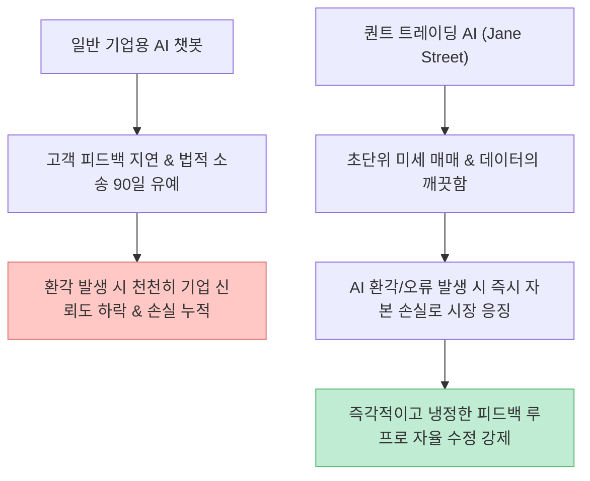
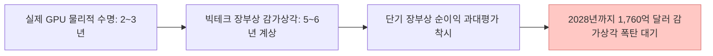

빅테크 기업들과 언론이 거대한 인공지능(AI) 혁명을 연일 쏟아내고 있지만, 한편에서는 수많은 포춘 500대 IT 기업의 CEO들이 비싼 자금을 들여 구축하던 **기업용 AI 챗봇 및 자동화 프로젝트를 조용히 중단**하거나 규모를 축소하고 있습니다. 

최근 [유튜브 시황 콘텐츠에서 화제를 모은 영상("왜 IT CEO들이 조용히 AI 계획를 접고 있을까?")](https://youtu.be/qzcb-ZEnYP8)은 일반 기업들의 AI 챗봇 실패 원인과 더불어, 정작 모두가 AI 거품을 경고할 때 수십조 원의 순이익을 쓸어 담은 **퀀트 트레이딩 기업(Jane Street)의 은밀한 실체**, 그리고 데이터센터 부채 위기와 회계적 감가상각 꼼수를 다루어 큰 인상을 남겼습니다.

이 글에서는 해당 영상이 지적한 4가지 핵심 이슈를 주식 시장 수급, 기업 회계 기준, 스탠퍼드 연구진의 LLM 환각률 벤치마크 및 퀀트 피드백 매커니즘 관점에서 정밀하게 팩트체크해보겠습니다.

<!--more-->

## Sources

- [유튜브 영상 - 왜 IT CEO들이 조용히 AI 계획를 접고 있을까?](https://youtu.be/qzcb-ZEnYP8)
- [Jane Street 2025 Financial Results & Quant Trading Benchmarks](https://www.janestreet.com/)
- [Stanford University - LLM Hallucination Rates in Enterprise & Legal Domains](https://law.stanford.edu/)
- [U.S. SEC Filings - CoreWeave & Microsoft Capital Expenditure Disclosures](https://www.sec.gov/edgar)
- [Michael Burry / Scion Asset Management - Hyperscaler GPU Depreciation Analysis](https://www.sec.gov/)

> 이 글은 특정 종목에 대한 매수/매도 추천이 아니며, 글로벌 AI 산업의 재무적 리스크와 기술적 한계를 오픈 데이터 및 분석 리포트 기준으로 검증한 교육용 글입니다.

---

## 1. 영상이 지적한 4가지 핵심 포인트 요약

영상은 거대한 AI 열풍 뒤에 감춰진 수익 구조의 양극화와 회계적 리스크를 4가지 축으로 설명했습니다.

1. **기업용 AI 챗봇 프로젝트의 조용한 중단:** LLM의 원초적 한계인 **환각(Hallucination) 현상**으로 인해, 5번 중 1번꼴로 확신에 찬 거짓말을 하는 챗봇이 실제 기업 운영 및 고객 응대에서 막대한 손실과 소망을 유발하여 프로젝트가 철회되는 추세.
2. **AI 혁명의 진짜 은밀한 승자 (Jane Street):** 이메일 작성이나 챗봇이 아닌, **초단위 금융 매매에 AI를 도입한 퀀트 트레이딩 기업(제인 스트리트)**은 2025년 396억 달러(약 53조 원)의 거래 수익을 기록하며 골드만삭스와 JP모건 전체 트레이딩 부문을 능가함.
3. **인프라 부채 시한폭탄 (CoreWeave & MS):** AI GPU 서버를 대여해 주는 코어위브는 매출의 62%가 마이크로소프트에 집중되어 있으며, 50억 달러의 부채와 2026년까지 75억 달러의 이자 부담을 안고 있음.
4. **마이클 버리의 감가상각 꼼수 경고 & 중국의 저비용 추격:** 빅테크들이 수명 2~3년짜리 엔비디아 GPU 수명을 5~6년으로 늘려잡아 **1,760억 달러 상당의 감가상각을 과소 평가**함. 여기에 1/16 가격의 중국 저비용 오픈웨이트 AI 모델과 개인용 데스크톱 AI가 등장하며 거대 데이터센터 투자의 당위성이 둔화됨.

---

## 2. 세부 이슈별 정량적 팩트체크

### 1) 기업용 LLM 챗봇의 환각률(Hallucination)과 ROI 실패

스탠퍼드 연구진 및 2025/2026 벤치마크에 따르면, 최고의 성능을 자랑하는 기업용 LLM 모델조차 영역별로 상당한 환각률을 기록했습니다.

- **법률 관련 질의 환각률:** 58% ~ 88%
- **의료 사례 요약 환각률:** 약 64%
- **기업 선도 모델 평균 환각률:** 약 22% (다섯 번 중 한 번 이상 잘못된 답변 유출)

다음 토큰을 확률적으로 예측하는 텍스트 생성 매커니즘상 **환각을 수학적으로 완전히 0으로 만드는 것은 불가능**합니다. 기업이 막대한 자금을 투입해 고객 응대 자동화를 시도했지만, 잘못된 안내로 인한 법적 소송 위험과 관리 비용이 늘어나면서 "돈은 돈대로 쓰고 위험만 커진다"는 판단하에 프로젝트를 중단하는 것입니다.

### 2) 퀀트 트레이딩 기업 Jane Street는 왜 AI로 53조 원을 벌었을까?

제인 스트리트(Jane Street)는 2025년 2분기 단 한 분기에만 101억 달러를 벌어들이며 역대 최고 실적을 세웠습니다. 시타델(122억 달러/년), 허드슨리버(123억 달러/년)와 함께 글로벌 퀀트 수익의 절반 이상을 독식하고 있습니다.

일반 기업용 챗봇은 잘못된 답변을 내놓아도 반응이 느리거나 소송 유예 기간이 존재하지만, **금융 시장의 초단위 매매 환경에서는 AI의 작은 오류 하나가 곧바로 수백만 달러의 즉각적인 금전적 손실로 반영**됩니다. 시장이라는 가장 냉정한 심판이 실시간으로 모델을 벌하고 강제로 수정하게 만드는 **'피드백 루프(Feedback Loop)'의 차이**가 성공을 갈랐습니다.

---

## 3. 인프라 부채와 감가상각 과소 평가 리스크

### 코어위브(CoreWeave)와 마이크로소프트의 집중 리스크

코어위브는 GPU 인프라 대여 서비스로 매출이 2022년 1,600만 달러에서 2024년 19억 달러로 급성장했습니다.

- **단일 고객 집중도:** 전체 매출의 **62%**가 마이크로소프트(MS) 한 곳에서 발생합니다.
- **부채 부담:** 총 50억 달러의 부채와 2026년 말까지 75억 달러의 이자 지출 예정.
- **마이크로소프트의 자유현금흐름(FCF) 감소:** 최근 MS의 FCF가 급감하며 자사주 매입 동결 등 자금 여력이 둔화되는 조짐을 보이고 있어, 2001년 닷컴버블의 '다크 파이버(Dark Fiber) 통신망 과잉 투자' 잔혹사가 재현될 우려가 제기됩니다.

### 마이클 버리의 감가상각 과소 계상 경고

2008년 금융위기를 예측했던 마이클 버리(Michael Burry)는 하이퍼스케일러(빅테크)들이 엔비디아 GPU 칩의 회계상 감가상각 기간을 물리적 수명(2~3년)보다 긴 **5~6년**으로 설정하고 있다고 주장했습니다.

- **숨겨진 감가상각 갭:** 2028년까지 약 **1,760억 달러(약 230조 원) 규모의 감가상각 비용이 회계 장부상 과소 평가**되어 장부상 이익이 착시를 일으키고 있다는 지적입니다.

---

## 4. 기업 및 투자자를 위한 실전 AI 체크리스트

| 단계 | AI 프로젝트 및 빅테크 투자 검증 항목 | 체크 |
|:---|:---|:---:|
| **1단계** | 도입하려는 AI 모델의 환각률이 법적/운영상 수용 가능한 범위 내에 있는가? | [ ] |
| **2단계** | AI 시스템이 실시간 피드백 루프(오류 시 즉각적 손실 반영 및 학습)를 가지고 있는가? | [ ] |
| **3단계** | 투자 대상 인프라 기업이 단일 고객 의존도(50% 이상)나 부채 부담이 과도하지 않은가? | [ ] |
| **4단계** | 빅테크의 GPU 감가상각 수명이 3년 이하로 정직하게 장부에 반영되어 있는가? | [ ] |

---

## 5. 결론

"왜 IT CEO들이 조용히 AI 계획을 접고 있는가"에 대한 대답은 **"실체 없는 챗봇과 환각에 대한 낭만적 기대가 끝나고 냉정한 ROI와 재무제표의 시간이 도래했기 때문"**입니다.

냉정한 시장 피드백을 수용해 진짜 실적을 내는 퀀트 기업처럼, 향후 AI 시장은 과도한 인프라 거품과 회계 착시를 걷어내고 실질적인 피드백 구조를 갖춘 서비스 중심으로 재편될 것입니다.
