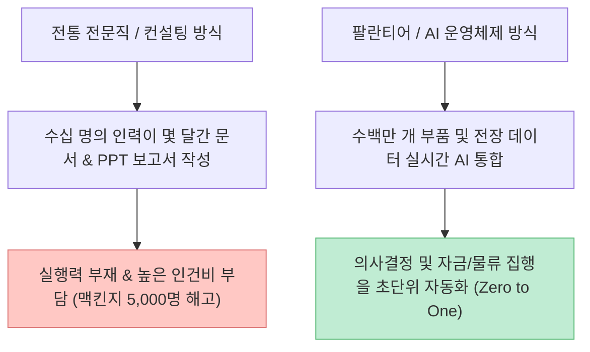

수십 년간 대한민국 사회에서 "공부 열심히 해서 전문직 자격증을 따거나 대형 컨설팅 펌에 들어가라"는 조언은 가장 완벽한 인생의 정답처럼 여겨졌습니다. 변호사, 공인회계사, 전략 컨설턴트라는 타이틀은 철옹성 같은 기득권과 고연봉을 평생 보장해 주는 튼튼한 동아줄이었습니다.

그러나 최근 [유튜브 시황 콘텐츠에서 큰 화제를 모은 영상("이 직업은 이제 망했습니다")](https://youtu.be/Ai0HYwT00HM)은 **변호사, 회계사, 전략 컨설팅 등 최상위 엘리트 전문직 시장의 채용 빙하기와 구조적 붕괴 실태**를 충격적인 데이터로 고발하며, 그 틈새를 파고든 **피터 틸의 팔란티어(Palantir)**가 보여주는 새로운 시대의 생존 법칙을 제시해 큰 주목을 받았습니다.

이 글에서는 영상이 지적한 3대 전문직의 위기 지표를 고용 노동 통계, 회계법인 AI 감사 도입률, 맥킨지 구조조정 수치, 그리고 피터 틸의 'Zero to One' 혁신 모델 관점에서 정밀하게 팩트체크해보겠습니다.

<!--more-->

## Sources

- [유튜브 영상 - "이 직업은 이제 망했습니다" 연봉 1억 전문직 몰락 3가지](https://youtu.be/Ai0HYwT00HM)
- [한국공인회계사회(KICPA) - 2025/2026 공인회계사 수습기관 지정 현황 보고서](https://www.kicpa.or.kr/)
- [U.S. Bureau of Labor Statistics (BLS) - Legal & Financial Services Employment Projections](https://www.bls.gov/)
- [Peter Thiel - Zero to One: Notes on Startups, or How to Build the Future (2014)](https://zerotoonebook.com/)
- [Palantir Technologies - Enterprise AI & Defense Operating Systems Whitepaper](https://www.palantir.com/)

> 이 글은 특정 직업군을 비하하기 위한 목적이 아니며, AI 기술 발전이 전문 서비스 시장의 노동 구조와 비즈니스 모델에 미치는 영향을 데이터 기반으로 분석한 교육용 글입니다.

---

## 1. 붕괴하는 3대 고소득 전문직 실태 팩트체크

영상은 자격증과 학벌이라는 철옹성이 무너지고 있는 3가지 대표 분야를 지목했습니다.

### 1) 변호사 (법조계 신입 채용 시스템의 붕괴)

전 미국 노동통계국장 윌리엄 비치(William Beach)는 전미 경제학회에서 **"앞으로 자녀가 법조계로 가겠다면 도시락 싸 들고 말려라"**고 단언했습니다.

- **원인:** 신입 변호사가 밤을 새워 하던 수십 건의 판례 검색과 기초 서면 작성을 법률 특화 AI가 **단 3초 만에 완료**합니다.
- **현실:** 대형 로펌들이 신입을 채용해 일을 가르치는 도제식 사다리가 완전히 부서졌으며, 저연차 변호사들은 번듯한 사무실 대신 공유 오피스의 핫데스크를 전전하고 있습니다.

### 2) 공인회계사 (합격자 74%가 백수가 된 미지정 사태)

한국공인회계사회 통계에 따르면, 공인회계사 시험 합격자 약 1,200명 중 수습 법인에 입사한 비율은 **단 26%(338명)**에 불과했습니다.

- **원인:** 삼일, 삼정, 안진, 한영 등 소위 '빅4' 회계법인들이 AI 감사 시스템을 대거 도입하면서 연간 수만 시간의 데이터 대조 업무를 자동화했습니다.
- **결과:** 전국 수석 합격자조차 수습처를 구하는 데 3개월이 걸리고, 합격 후 택배 상하차 알바를 뛰어야 하는 극심한 일자리 미스매칭이 발생했습니다.

### 3) 전략 컨설팅 펌 (맥킨지 5,000명 해고와 신뢰 붕괴)

세계 최고의 전략 컨설팅 펌으로 군림하던 **맥킨지(McKinsey)**는 전 세계 정예 직원 4만 명 중 **무려 5,000명 규모의 대규모 구조조정(해고)**을 단행했습니다.

- **원인:** 화려한 PPT 보고서와 공포 마케팅에 의존하던 전통 컨설팅 대신, 기업들은 **실시간 데이터를 연동해 현장을 직접 통제하는 소프트웨어 솔루션**으로 눈을 돌렸습니다.
- **개원가·세무사:** 개업 3년 차 세무사 폐업률이 35%에 육박하고, 강남 개원의가 매출 20억을 올려도 마케팅 광고비 폭탄으로 적자를 기록하는 등 '사'자 직업 전반이 지식 자영업자의 한계에 직면했습니다.

---

## 2. 피터 틸의 'Zero to One'과 팔란티어의 파괴적 혁신

맥킨지가 5,000명을 자르고 로펌이 신입 채용을 멈추는 동안, 기술 시장의 권력은 **팔란티어(Palantir Technologies)** 같은 AI 운영체제 기업으로 이동하고 있습니다.

### 미 국방부를 상대로 소송을 걸어 이긴 야수성

팔란티어는 미 국방부가 록히드마틴 등 전통 방산 공룡들과의 유착으로 자사 소프트웨어를 문전박대하자, **"상용 시장에 더 싸고 좋은 솔루션이 있으면 이를 우선 검토해야 한다"는 연방법을 들어 국방부를 고소**하여 승소했습니다.

- 1조 원 규모의 국방부 계약을 따낸 이 사건은 **기존 관습과 카르텔을 기술력과 법전으로 부수고 들어간 실리콘밸리 역사상 가장 상징적인 승리**로 꼽힙니다.
- 에어버스 항공기 수백만 개 부품 관리부터 우크라이나 전장의 실시간 타격 지점 분석까지, 팔란티어는 '보고서'가 아닌 '살아 숨 쉬는 결과물'로 시장을 지배했습니다.

---

## 3. 2030 세대와 지식 노동자를 위한 새로운 생존 공식

과거의 성공 공식(명문대 -> 자격증 취득 -> 거대 시스템의 부품 되기)은 이제 유효하지 않습니다.

1. **무너지는 성벽 밖으로 나오기:** 채용 문이 닫힌 대형 로펌이나 회계법인이라는 성벽 안으로 들어가려고 줄을 설 것이 아니라, 성벽 밖 야생에서 새로운 무기(AI 툴)를 들고 자신만의 영토를 개척해야 합니다.
2. **지식 자영업자로의 전환:** 자격증 하나로 평생 보장받던 시대는 끝났습니다. 단순 계산과 리서치는 AI에 맡기고, **실제 문제를 해결하고 사람을 설득하며 신뢰(Personal Brand)를 파는 자**만이 살아남습니다.
3. **AI 도구의 민주화 활용:** 과거 대형 컨설팅 펌만이 독점하던 방대한 데이터 분석력과 통찰을 이제는 개인도 저렴한 AI 도구를 통해 활용할 수 있습니다.

---

## 4. 실전 커리어 & 비즈니스 생존 체크리스트

| 단계 | 전문직 및 지식 노동자 생존 자가 검증 항목 | 체크 |
|:---|:---|:---:|
| **1단계** | 나의 업무 중 50% 이상이 AI로 3초 만에 대체 가능한 단순 리서치/정리는 아닌가? | [ ] |
| **2단계** | 보고서나 자격증 뒤에 숨지 않고, 실제 고객의 문제를 해결하는 실행력을 갖추었는가? | [ ] |
| **3단계** | 기존 업계의 비효율을 AI 툴을 활용해 혁신하는 'Zero to One' 프로젝트를 시도하고 있는가? | [ ] |
| **4단계** | 나만의 고유한 전문성과 신뢰를 증명하는 퍼스널 브랜딩(유튜브, 저술 등)을 구축하고 있는가? | [ ] |

---

## 5. 결론

"문서 한 장 잘 쓰고 자격증 하나 땄다고 평생 안락함을 보장받던 시대"는 완전히 막을 내렸습니다.

그러나 이는 절망이 아닌 거대한 기회입니다. 낡은 배에 매달려 침몰하기보다, AI라는 거대한 파도 위에 올라타 기존 시스템의 비효율을 부수고 새로운 대륙으로 나아가는 실행가들에게 역사상 가장 큰 부와 기회가 주어질 것입니다.
