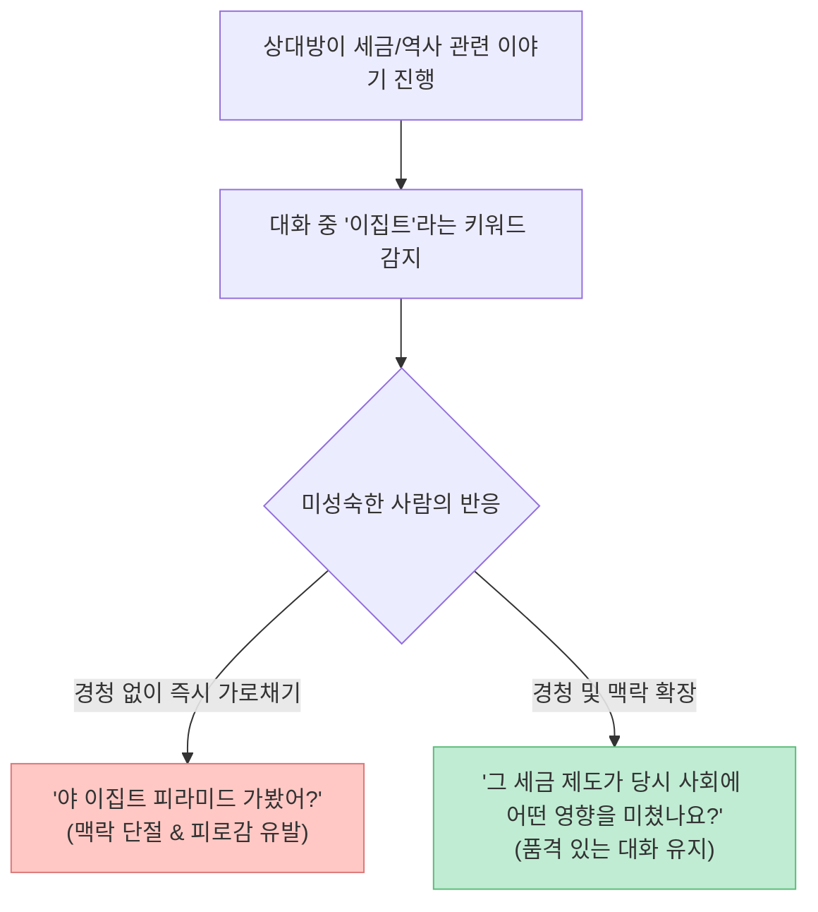

나이가 들고 사회적 지위가 올라간다고 해서 내면의 성숙함과 인품이 저절로 깊어지는 것은 아닙니다. 신체는 어른이지만 대화와 인간관계, 돈을 대하는 태도에서는 여전히 유아기적 자기중심성에 갇혀 주변 사람들에게 피로감을 주는 이들이 많습니다.

최근 [유튜브 '지식한상' 채널에서 큰 화제를 모은 인지심리학자 김경일 교수(아주대학교)의 강연 영상](https://youtu.be/ksatAniUxvQ)은 "몸만 어른이고 정신 연령이 낮은 사람들이 입에 달고 사는 말과 행동"을 인지심리학의 실증적 연구와 흥미로운 사례를 통해 명쾌하게 풀어내 큰 호응을 얻었습니다.

이 글에서는 김경일 교수가 제시한 5가지 핵심 심리 법칙을 인지심리학의 상호작용 이론, 외적 과시의 역효과, 대화 맥락 유지 능력, 그리고 돈을 대하는 행동 통제 시스템 관점에서 깊이 있게 팩트체크해보겠습니다.

<!--more-->

## Sources

- [유튜브 지식한상 - "정신 연령이 낮다" 몸만 어른인 사람들이 입에 달고 사는 '이 말' (김경일 교수)](https://youtu.be/ksatAniUxvQ)
- [Kim, K. I. et al. - Cognitive Biases and Metacognitive Awareness in Adult Interactions](https://www.apa.org/)
- [Kasser, T. - The High Price of Materialism (MIT Press / 물질주의 과시의 심리학)](https://mitpress.mit.edu/9780262611978/)
- [Van de Ven, N. - Envy and Its Differential Consequences: Benign and Malicious Envy](https://journals.sagepub.com/)

> 이 글은 특정인을 비하하기 위한 목적이 아니며, 인지심리학적 연구와 공개된 대화 모델을 바탕으로 성숙한 인간관계와 자산 관리 태도를 검증한 교육용 글입니다.

---

## 1. 영상이 제시한 5가지 핵심 심리 원칙 요약

김경일 교수는 나이가 들어도 품격이 없고 주변 사람들을 떠나게 만드는 미성숙한 사람들의 5가지 공통된 인지적 오류를 짚었습니다.

1. **외적 과시의 역효과 (명품·외제차의 착시):** 물질적 소유물로 자신을 과하게 치장할수록 타인의 호감도가 올라가지 않고, 오히려 협업 거부감과 비판적 평가가 증가함.
2. **말 못 하는 사람의 치명적 습관 (얕은 지식 뽐내기):** 얕은 지식을 자랑하려고 상대방의 말을 경청하지 않고 단어 하나만 낚아채 대화의 맥락을 끊어버림.
3. **"내 주변엔 이상한 사람밖에 없다"는 불평의 진실:** 좋은 사람을 '인품'이 아닌 '100억 자산가, 외제차 소유자' 등 외적 조건으로만 규정하기 때문에 본인의 낮은 기준에 맞는 이상한 사람만 꼬임.
4. **질투를 넘어 "솔직하게 부럽다"고 말하는 용기:** 타인의 성공을 깎아내리지 않고 솔직하게 부러움을 인정하는 사람만이 열등감 없이 진짜 귀인(貴人)을 알아봄.
5. **돈과 지출을 대하는 인지심리학적 안전장치:** 지출은 매일 자주 들여다보며 줄이고, 투자는 덜 들여다보는 안전장치를 만들어야 자존감과 부를 동시에 지킬 수 있음 ("재수 없으면 150살까지 산다"는 장기전 마인드).

---

## 2. 세부 심리 법칙별 팩트체크

### 1) 명품과 외제차 과시가 호감도를 떨어뜨리는 이유

물질주의 심리학 연구(Kasser et al.)에 따르면, 고가의 명품이나 고급 승용차를 과도하게 과시하는 사람을 마주했을 때 관찰자는 무의식적으로 **'협력 가능성(Cooperation Likelihood)'을 낮게 평가**합니다.

- **소유(Having) vs 존재(Being):** 사람들은 상대의 시계나 자동차를 그 사람의 본질로 보지 않고 '외적 껍데기'로 분리하여 인식합니다.
- 오히려 과도한 과시는 내면의 불안감과 자존감 결핍을 감추려는 보상 행동으로 해석되어 타인에게 감정적 거리감을 유발합니다.

### 2) 대화의 맥락을 가로채는 인지적 기제 (Conversation Hijacking)

대화가 서툰 사람들의 대표적인 특징은 경청의 부재와 맥락 가로채기입니다.



얕은 지식 몇 가지를 가진 사람은 이를 빨리 써먹고 싶은 조급함 때문에 상대의 말을 끝까지 듣지 못하고 특정 단어에 꽂혀 화제를 자기 쪽으로 강탈합니다. 반면 품격 있는 소통자는 상대의 말을 관찰하고 **맥락을 연결해 주는 질문**을 던집니다.

### 3) "솔직하게 부럽다"고 인정하는 힘 (양성 부러움의 심리학)

심리학자 반 드 벤(Van de Ven)은 부러움을 두 가지로 구분합니다.

- **악성 질투 (Malicious Envy):** "저게 뭐가 대단해? 다 운이 좋아서 그런 거지"라며 상대의 성과를 깎아내리고 폄하하는 태도.
- **양성 부러움 (Benign Envy):** "진짜 솔직하게 너무 부럽다! 어떻게 그렇게 해냈어?"라고 자신의 감정을 인정하고 배움의 기회로 삼는 태도.

자신의 부러움을 솔직하게 드러낼 수 있는 사람만이 내면의 결핍에 휘둘리지 않고, 주변의 성공한 인물들을 진짜 아군과 귀인으로 만들 수 있습니다.

---

## 3. 돈을 지키는 인지적 안전장치: "지출은 자주, 투자는 덜"

김경일 교수는 마이너스 통장을 졸업하고 자산을 형성한 경험을 바탕으로 행동 통제의 핵심 시스템을 제시했습니다.

$$\text{자산 통제력} = \frac{\text{지출 점검 빈도 (자주)}}{\text{투자 조회 빈도 (드물게)}}$$

```mermaid
flowchart LR
    subgraph 지출 관리 (High Frequency)
        A["매일 지출 내역 점검"] --> B["통신비/구독료 등 불필요 누수 차단"]
        B --> C["자존감 향상 & 통제력 회복"]
    end

    subgraph 투자 관리 (Low Frequency)
        D["주식/투자 계좌 접속 제한"] --> E["감정적 뇌동매매 및 손실회피 방지"]
        E --> F["장기 복리 수익 달성"]
    end

    classDef high fill:#c0ecd3,stroke:#5dbb7a,stroke-width:1px,color:#333
    classDef low fill:#c5dcef,stroke:#5f8fbd,stroke-width:1px,color:#333

    class C high
    class F low
```

- **지출 계좌:** 매달 한 번 카드 명세서를 볼 때만 고통스러워하면 돈이 새는 구멍을 막을 수 없습니다. 매일 자주 들여다보며 작은 고정비를 통제해야 합니다.
- **투자 계좌:** 주식 계좌를 매일 들여다보면 손실 회피 편향으로 인해 뇌동매매를 벌이게 되므로, 접속 비밀번호를 길게 바꾸는 등 물리적 안전장치를 두어 덜 보게 만들어야 합니다.

---

## 4. 품격 있는 어른을 위한 5단계 자기 점검 체크리스트

| 단계 | 소통 및 심리 자가 점검 항목 | 체크 |
|:---|:---|:---:|
| **1단계** | 외적인 브랜드나 소유물로 나를 과하게 포장하려 하지 않는가? | [ ] |
| **2단계** | 상대의 말에서 단어 하나만 낚아채 내 자랑으로 화제를 돌리지 않는가? | [ ] |
| **3단계** | 타인의 성공에 억지 비아냥 대신 "솔직히 부럽다"고 말할 수 있는가? | [ ] |
| **4단계** | 좋은 사람의 기준을 자산이나 외제차가 아닌 인품과 배려로 정의하는가? | [ ] |
| **5단계** | 지출은 매일 점검하고 투자 계좌는 덜 들여다보는 안전장치를 두었는가? | [ ] |

---

## 5. 결론

"나이 든다고 저절로 어른이 되지 않는다"는 말은 단순한 격언이 아닌 명백한 인지심리학적 팩트입니다.

타인을 이기려는 조급함을 버리고, 나의 감정을 솔직하게 인정하며, 지출을 꼼꼼하게 통제하는 인지적 안전장치를 구축할 때 비로소 우리는 나이 들수록 깊은 향기와 품격을 지닌 진짜 어른으로 성장할 수 있습니다.
