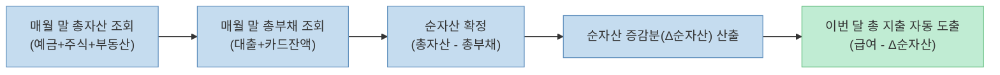

많은 사람들이 매일 밤샘 야근을 하고 허리띠를 졸라매며 아끼는데도 통장 잔고가 늘지 않고 만성적인 경제적 불안에 시달립니다. 반면 소위 '진짜 부자'들은 자신이 일하지 않아도 꼬박꼬박 돈이 들어오는 시스템을 구축해 시간적·경제적 자유를 누립니다.

최근 [유튜브 머니인사이드/지식한상 채널에서 큰 화제를 모은 영상("경제적 여유가 생기고 알게 된 가난의 진짜 이유")](https://youtu.be/KTqoMy___nk)은 베스트셀러 작가이자 전업 투자자인 **사경인 회계사**가 20년 넘게 회계와 자본시장을 연구하며 깨달은 **진짜 자산과 가짜 자산의 구분, 가계부의 한계를 극복하는 순자산 측정법, 그리고 노동 소득을 시스템 소득으로 바꾸는 '김치찌개 레시피' 비유**를 명쾌하게 풀어내 큰 호응을 얻었습니다.

이 글에서는 사경인 회계사가 제시한 자산 관리 및 투자 철학을 회계학적 자산 정의(K-IFRS), 피터 드러커의 경영학적 측정 원리, 현금흐름(Cash Flow) 모델 및 확률적 의사결정 관점에서 깊이 있게 팩트체크해보겠습니다.

<!--more-->

## Sources

- [유튜브 머니인사이드 - 경제적 여유가 생기고 알게된 가난의 진짜 이유 (사경인 회계사)](https://youtu.be/KTqoMy___nk)
- [한국채택국제회계기준(K-IFRS) - 개념체계 제4장 재무제표의 요소 (자산의 정의)](https://www.kasb.or.kr/)
- [Peter F. Drucker - The Practice of Management (1954 / 측정과 관리 이론)](https://www.harpercollins.com/)
- [Sa, K. I. - 진짜 부자 가짜 부자 & 재무제표 모르면 주식투자 절대로 하지마라](https://www.yes24.com/)

> 이 글은 특정 금융 상품이나 종목에 대한 매수/매도 추천이 아니며, 회계학적 자산 개념과 지출 관리 프레임워크를 객관적으로 검증한 교육용 글입니다.

---

## 1. 영상이 제시한 4가지 핵심 부의 법칙 요약

사경인 회계사는 평생 열심히 일해도 가난에서 벗어나지 못하는 사람들의 인지적 오류를 4가지 축으로 분석했습니다.

1. **진짜 자산 vs 가짜 자산의 구분:** 회계상 진짜 자산은 **보유하는 순간 내 소득(현금흐름)을 늘려주는 것**이다. 반면 갖고 있을수록 유지비와 세금으로 돈을 빼앗아 가는 것은 '가짜 자산(비용 발생체)'이다.
2. **가계부의 함정과 '월 1회 순자산 측정' 공식:** 매일 700원 생수값을 적는 것은 피로감만 줄 뿐 자산 증식에 도움이 안 된다. 한 달에 딱 한 번 **`순자산(총자산 - 총부채)`**을 기록하고 전월 대비 증가분을 급여와 비교하면 지출이 자동으로 산출된다.
3. **'김치찌개 레시피' 비유 (노동 소득 vs 시스템 소득):** 주방에서 하루 종일 일해 월 2,000만 원을 버는 노동 소득 대신, 레시피를 대기업에 팔아 월 1,000만 원의 로열티를 받는 시스템 소득을 구축해야 내 시간의 자유를 얻는다.
4. **주식 투자의 치명적 착각:** 전문가의 목표주가만 믿고 사는 것은 기업이 아니라 '전문가의 말'에 돈을 건 도박이다. 내가 무엇을 하는지 알고 확률적 우위(승률과 손익비)를 확보해야 한다.

---

## 2. 세부 주제별 정량적 팩트체크

### 1) 회계학적 자산의 본질: 현금흐름을 만드는가?

국제회계기준(K-IFRS)에서 자산(Asset)은 **"과거 사건의 결과로 기업이 통제하며 미래 경제적 효익이 유입될 것으로 기대되는 자원"**으로 정의됩니다.

- **진짜 자산:** 예금 이자, 주식 배당금, 임대 부동산 월세, 저작권 인세 등 내가 가만히 있어도 내 통장으로 현금을 꽂아주는 자산입니다.
- **가짜 자산:** 대출을 가득 끼고 산 거주용 고가 아파트나 고급 자동차는 소유자가 지속적으로 감가상각비, 이자, 취득세, 보험료 등 현금을 지출하게 만드는 '부채형 자산'에 가깝습니다.

### 2) 가계부의 비효율과 '월 1회 순자산 측정' 수학 공식

피터 드러커는 **"측정할 수 없으면 관리할 수 없다(If you can't measure it, you can't manage it)"**고 강조했습니다. 사경인 회계사는 매일 가계부를 쓰며 지치기보다, 오픈뱅킹을 활용해 월 1회 대차대조표를 작성할 것을 제안합니다.

$$\text{순자산} = \text{총자산} - \text{총부채}$$

$$\Delta\text{순자산} = \text{이번 달 말 순자산} - \text{지난 달 말 순자산}$$

$$\text{이번 달 총 지출} = \text{이번 달 세후 급여} - \Delta\text{순자산}$$



매일 생수값이나 지하철 요금을 메모하는 스트레스 없이, 한 달에 딱 한 번 엑셀이나 노트에 자산과 부채를 적는 것만으로도 나의 총소비와 순자산 성장률을 정밀하게 통제할 수 있습니다.

---

## 3. 부의 레버리지: '김치찌개 레시피' 비유 (노동 소득 vs 시스템 소득)

사경인 회계사는 고소득 전문직이라도 노동 소득에만 머물러 있으면 평생 일의 굴레에서 벗어날 수 없다고 경고합니다.

```mermaid
flowchart TD
    subgraph 노동 소득의 덫 (Labor Income Trap)
        A["직접 김치찌개 식당 운영"] --> B["하루 종일 주방에서 노동 투입"]
        B --> C["월 2,000만 원 고수익 달성"]
        C --> D["질병/사고 발생 시 소득 즉시 0원 전락"]
    end

    subgraph 시스템 소득의 플라이휠 (System Income Flywheel)
        E["김치찌개 레시피(IP) 판매"] --> F["대기업 프랜차이즈 로열티 계약"]
        F --> G["일하지 않아도 월 1,000만 원 자동 입금"]
        G --> H["확보된 시간으로 책 저술 & 배당 자산 추가 구축"]
    end

    classDef danger fill:#ffc8c4,stroke:#d77,stroke-width:1px,color:#333
    classDef safe fill:#c0ecd3,stroke:#5dbb7a,stroke-width:1px,color:#333

    class D danger
    class G,H safe
```

사경인 회계사 역시 아침 일찍 나가서 강의실에서 목이 터져라 떠드는 고액 오프라인 강의를 줄이고, 책(저작권)을 출간하고 배당주 및 부동산 시스템을 구축함으로써 일하지 않아도 현금이 유입되는 진정한 경제적 자유를 달성했습니다.

---

## 4. 주식 투자의 착각: 전문가 추종 vs 확률적 사고

많은 개인 투자자들이 전문가의 "이 종목 400만 원 간다"는 말에 300만 원에 매수합니다.

- 이는 기업의 내재가치에 투자한 것이 아니라 **'전문가 개인의 권위'에 맹목적으로 베팅한 것**입니다.
- 진정한 주식 투자는 해당 기업의 재무제표와 비즈니스 모델을 분석하고, 과거 통계상 **승률(Win Rate)**과 **손익비(Risk-Reward Ratio)**가 높은 구간을 선택해 기대값이 양수(+)인 베팅을 반복하는 확률적 게임입니다.

---

## 5. 실전 순자산 관리 5단계 체크리스트

| 단계 | 개인 재무제표 검증 항목 | 체크 |
|:---|:---|:---:|
| **1단계** | 내가 가진 자산 중 꼬박꼬박 현금흐름(배당·이자·월세)을 주는 자산 비중이 높은가? | [ ] |
| **2단계** | 매월 말 오픈뱅킹을 통해 총자산과 총부채를 조회해 순자산을 기록하고 있는가? | [ ] |
| **3단계** | 전월 대비 순자산 증가분을 확인하고 이번 달 총 지출을 객관적으로 파악했는가? | [ ] |
| **4단계** | 내 노동력을 100% 투입하지 않아도 들어오는 시스템 소득(IP, 배당 등) 파이프라인이 있는가? | [ ] |
| **5단계** | 주식 투자 시 단순 목표가 맹종이 아닌 재무제표와 확률적 손익비를 검토했는가? | [ ] |

---

## 6. 결론

"경제적 여유가 생기고 알게 된 가난의 진짜 이유"는 열심히 일하지 않아서가 아니라, **자산을 측정하지 않고 노동 소득을 시스템 소득으로 바꾸지 못했기 때문**입니다.

매일 가계부를 쓰며 지치기보다 매월 말 순자산을 기록하고, 내 주머니에 현금을 넣어주는 진짜 자산을 차근차근 모아갈 때 비로소 우리는 일의 노예에서 벗어나 진정한 경제적 자유에 도달할 수 있습니다.
