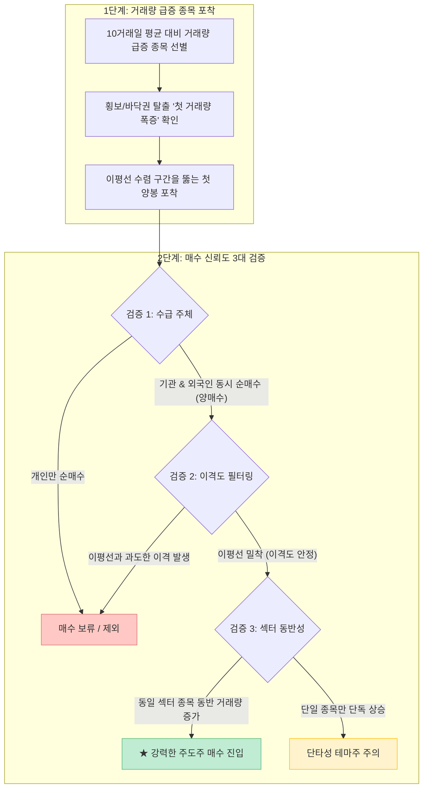

개인 투자자들이 주식 시장에서 가장 자주 범하는 실수는 이미 주가가 20~30% 이상 폭등하여 언론과 커뮤니티에서 시끄러워진 뒤에야 뒤늦게 추격 매수(FOMO)하여 고점에 물리는 것입니다. 

최근 [스레드 주식 콘텐츠(@rightnow.gaeideuk)에서 큰 화제를 모은 '상승 초입 선취매 전략'](https://www.threads.com/share/BAYJWwSaTV/)은 위험천만한 고점 추격 매수를 원천 차단하고, **10거래일 평균 대비 첫 거래량 폭증과 이평선 수렴·발산, 그리고 외국인·기관의 양매수 수급**을 통해 시장의 주도주를 가장 안전한 바닥권에서 포착하는 2단계 실전 매매 프레임워크를 공개해 큰 호응을 얻었습니다.

이 글에서는 해당 매매법이 제시한 2단계 선취매 프로세스를 기술적 분석(이동평균선 수렴도, 이격도 지표)과 퀀트 수급 데이터(메이저 양매수 및 섹터 동조화) 관점에서 정밀하게 팩트체크해보겠습니다.

<!--more-->

## Sources

- [스레드 원문 - 거래량으로 주도주를 찾는 '상승 초입' 선취매 전략 (@rightnow.gaeideuk)](https://www.threads.com/share/BAYJWwSaTV/)
- [Murphy, J. J. - Technical Analysis of the Financial Markets (New York Institute of Finance)](https://www.nyif.com/)
- [O'Neil, W. J. - How to Make Money in Stocks (CAN SLIM & Volume Breakout)](https://www.investors.com/)
- [한국거래소(KRX) - 투자자별 순매수 데이터 및 업종별 동반 상승률 분석](http://data.krx.co.kr/)

> 이 글은 특정 종목에 대한 매수/매도 추천이 아니며, 거래량 지표와 이평선 분석을 활용한 리스크 관리 기법을 데이터 기준으로 검증한 교육용 글입니다.

---

## 1. 상승 초입 선취매 2단계 프로세스 요약

원문 콘텐츠는 상승 초기 단계에서 주도주를 안전하게 포착하는 2단계 검증법을 제시했습니다.

---

## 2. 세부 매매 법칙별 기술적·통계적 팩트체크

### 1) 1단계: 10거래일 평균 거래량 돌파와 '첫 거래량'의 의미

윌리엄 오닐(William O'Neil)의 캔슬림(CAN SLIM) 전략과 기술적 분석 이론에 따르면, 주가의 추세 전환을 알리는 가장 강력한 신호는 **'기준봉의 첫 대량 거래량'**입니다.

- **10거래일 평균 대비 거래량 급증:** 평소 거래량이 메말라 있던 박스권 횡보 구간에서 10일 평균 거래량의 300% 이상을 상회하는 첫 대량 거래가 실려야 세력의 매집 및 방향성 전환으로 해석할 수 있습니다.
- **첫 거래량의 중요성:** 이미 2~3일 연속 장대양봉이 터진 뒤에는 단기 차익 실현 매물이 쏟아질 확률이 높으므로, **박스권을 막 탈출하는 '첫 번째 거래량 증가'**에만 집중해야 손익비(Risk-Reward Ratio)가 극대화됩니다.

### 2) 이동평균선의 수렴(Compression)과 발산(Expansion)

이동평균선(5일, 20일, 60일)이 한곳으로 촘촘히 뭉쳐 있다는 것은 **단기·중기 매수자들의 평균 단가가 거의 일치하여 매물대 저항이 최소화된 상태**를 의미합니다.

- 수렴된 이평선 다발을 대량 거래량과 함께 강하게 상향 돌파하는 첫 장대양봉은 강력한 에너지 분출의 시작점이 됩니다.

### 3) 2단계: 매수 신뢰도를 높이는 3대 필터링 조건

1. **외국인 & 기관의 '양매수' 확인:** 개인 투자자들의 추격 매수로만 올라간 종목은 연속성이 떨어집니다. 메이저 수급 주체(외국인·기관)의 쌍끌이 순매수가 동반되어야 추세적 상승 동력이 유지됩니다.
2. **이격도(Disparity) 필터링:** 주가가 20일 이동평균선과 110% 이상 벌어진 과열 구간은 아무리 호재가 있어도 진입을 피해야 합니다. 이평선과 밀착된 상태여야 손절선(-2~3%)을 짧게 잡을 수 있습니다.
3. **섹터 동반 상승 여부 (주도 섹터 판별):** 개별 종목 혼자 급등하는 것은 일회성 찌라시 테마일 확률이 높습니다. 반면 동일 업종 내 3~5개 종목이 동시에 거래량이 터지며 상승하면 시장의 자금이 집중되는 **'진짜 주도 섹터'**로 판단할 수 있습니다.

---

## 3. 상승 초입 VS 과열 구간 비교 분석

| 구분 기준 | 🟢 상승 초입 (Safe Entry) | 🔴 과열 구간 (Danger Zone) |
|:---|:---|:---|
| **거래량 상태** | 오랜 횡보/바닥권 후 **첫 급증(거래량 폭증)** 발생 | 이미 수일간 **연속적인 거래량 폭발** 지속 중 |
| **이평선 이격도** | 이동평균선들이 촘촘히 모인 **밀착(수렴) 상태** | 주가가 급등하여 이평선과 **멀리 벌어진 상태** |
| **수급 주체** | 기관/외국인 메이저 세력의 **양매수 유입 시작** | 개인 투자자의 추격 매수 및 세력의 차익 실현 출회 |
| **기대 수익 / 위험** | **높은 기대 수익률** & 손절선이 짧아 손익비 우수 | **세력의 설거지(물량 털기)**에 걸려 고점 물릴 위험 극대화 |

---

## 4. 실전 선취매 5단계 자가 점검 체크리스트

| 단계 | 매수 전 필수 점검 항목 | 체크 |
|:---|:---|:---:|
| **1단계** | 10거래일 평균 대비 의미 있는 첫 대량 거래량이 발생했는가? | [ ] |
| **2단계** | 단·중기 이동평균선들이 수렴한 상태에서 돌파하는 첫 양봉인가? | [ ] |
| **3단계** | 당일 수급에서 외국인과 기관의 '양매수'가 확인되었는가? | [ ] |
| **4단계** | 주가와 20일선 간 이격도가 과열되지 않고 손절 기준선이 명확한가? | [ ] |
| **5단계** | 해당 종목이 속한 섹터/테마의 타 종목들도 동반 거래량이 실렸는가? | [ ] |

---

## 5. 결론

"주식에서 호구되지 않는 비결"은 화려하게 날아가는 종목을 부러워하며 뒤늦게 뛰어드는 것이 아니라, **조용히 에너지를 응축한 뒤 첫 거래량을 터뜨리는 상승 초입의 주도주를 원칙대로 선취매하는 것**입니다.

이평선 수렴, 첫 거래량, 메이저 양매수, 그리고 주도 섹터 동반성이라는 4가지 필터를 엄격히 적용할 때 감정에 휘둘리지 않는 안전하고 지속 가능한 계좌 성장을 이룰 수 있습니다.
