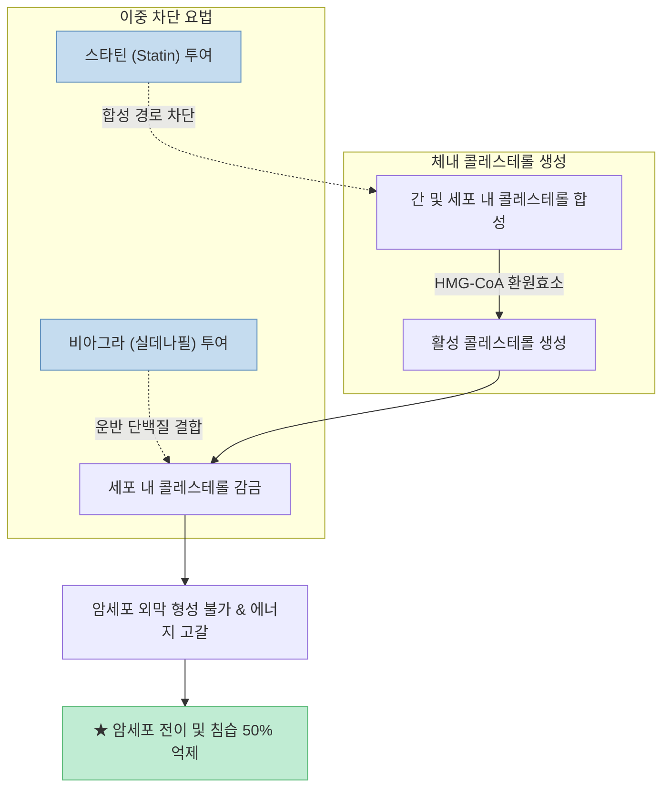

현대 의학에서 암 환자의 사망 원인 중 90% 이상은 원발 부위의 종양이 아니라 **다른 장기로 암세포가 퍼져나가는 '전이(Metastasis)'**에서 발생합니다. 전통적인 항암 치료는 암세포를 직접 독하게 공격해 죽이는 데 초점을 맞추었으나, 정상 세포 파괴와 내성이라는 심각한 부작용을 수반해 왔습니다.

최근 [유튜브 과학 채널 '하이젠버그'에서 다룬 영상("비아그라는 위대했다")](https://youtu.be/vG839R7f6Go)은 국립암연구소(NCI)와 라빈 메디컬 센터 등의 연구진이 밝혀낸 **발기부전 치료제 비아그라(실데나필)와 고지혈증 치료제 스타틴(Statin)의 암 전이 차단 메커니즘**을 소개해 전 세계 의학계와 대중의 폭발적인 관심을 모았습니다.

이 글에서는 해당 연구가 제시한 콜레스테롤 보급로 차단 기전, 세포 및 동물 실험 데이터, 500만 명의 임상 빅데이터 통계 및 약물 재창출(Drug Repurposing)의 의학적 의미를 깊이 있게 팩트체크해보겠습니다.

<!--more-->

## Sources

- [유튜브 영상 - “비아그라는 위대했다” 현재 의학계 연구 1위, 전세계를 뒤흔든 역대급 암치료법 (하이젠버그)](https://youtu.be/vG839R7f6Go)
- [National Cancer Institute (NCI) & Rabin Medical Center - Sildenafil & Statin Synergy in Metastasis Suppression](https://www.cancer.gov/)
- [PubMed / Cancer Research - Targeting Intracellular Cholesterol Trafficking to Inhibit Tumor Cell Motility](https://pubmed.ncbi.nlm.nih.gov/)
- [World Health Organization (WHO) - Global Cancer Survival and Metastasis Mortality Statistics](https://www.who.int/)

> 이 글은 의학 연구 논문의 기전을 분석한 교육용 정보이며, 특정 질환의 자가 치료를 목적으로 하지 않습니다. 모든 약물 복용은 반드시 담당 전문의와의 상담을 거쳐야 합니다.

---

## 1. 연구가 밝혀낸 4가지 핵심 발견 요약

영상은 암세포를 무차별 공격하는 대신 **암세포의 이동 자원(보급로)을 끊는 전략**을 4가지 핵심 축으로 설명했습니다.

1. **암 전이의 필수 영양소 '콜레스테롤':** 암세포가 혈관을 타고 이동해 다른 장기에 정착할 때 세포막을 리모델링하고 신호를 전달하기 위해 막대한 양의 콜레스테롤을 소모함.
2. **비아그라(실데나필)의 콜레스테롤 감금 효과:** 실데나필이 콜레스테롤 운반 단백질과 결합하여 세포 내부의 콜레스테롤이 밖으로 이동하지 못하도록 가둠.
3. **스타틴(Statin)과의 이중 차단 시너지:** 스타틴이 체내 콜레스테롤 합성을 차단하고 비아그라가 이동을 봉쇄하여 암세포의 세포막 형성과 에너지 생산을 완벽히 고갈시킴.
4. **정량적 임상 결과:** 유방암·대장암의 폐 전이가 **최대 50% 급감**하였으며, 500만 명 빅데이터 분석 결과 두 약물을 병용한 암 환자의 5년 내 사망 위험이 **32% 감소**함.

---

## 2. 세부 의학 메커니즘 팩트체크

### 1) 암세포의 아킬레스건: 왜 콜레스테롤 보급로인가?

암세포가 원발 부위에서 떨어져 나와 혈관을 통해 폐나 간으로 전이되는 과정은 고도의 에너지를 소모하는 이주 작업입니다.

- **지질 뗏목(Lipid Rafts)과 세포막 유연성:** 새로운 장기에 침투해 세포막을 끊임없이 뜯어고치고 전이 신호를 교환하려면 지질막의 핵심 성분인 콜레스테롤이 필수적입니다.
- 연구진은 암세포 자체를 죽이지 못하더라도 **콜레스테롤 공급을 차단하면 암세포의 이동성과 침습 능력이 현저히 무력화된다는 점**에 착안했습니다.

### 2) 비아그라 + 스타틴 이중 차단 다이어그램

- **스타틴:** 간에서 콜레스테롤이 합성되는 효소 경로 자체를 억제합니다.
- **실데나필 (비아그라):** 기존의 혈관 확장(PDE-5 억제) 작용 외에, 콜레스테롤 수송 복합체와 결합하여 콜레스테롤이 세포 밖으로 배출되어 전이에 사용되는 것을 물리적으로 가둡니다.

---

## 3. 정량적 실험 데이터 및 500만 명 빅데이터 분석

국립암연구소 및 라빈 메디컬 센터 연구팀은 쥐 동물 실험과 20년간 수집된 500만 명의 의료 빅데이터를 교차 분석했습니다.

### 1) 전임상 동물 및 세포 실험 결과
- **유방암 및 대장암 세포:** 폐로의 전이율이 대조군 대비 **거의 50% 급감**.
- **폐암 세포:** 암세포의 이동 능력이 약 20~30% 감소하며 전이 억제율 40% 기록.
- 흥미롭게도 실험실에서 콜레스테롤을 인위적으로 재공급했을 때 암세포의 이동 능력이 다시 회복되어, **콜레스테롤 결핍이 전이 억제의 직접적 원인**임이 증명되었습니다.

### 2) 500만 명 환자 빅데이터 분석 결과
- **실데나필 3회 이상 처방 환자:** 비복용군 대비 5년 내 사망 위험 **26% 감소**.
- **실데나필 + 스타틴 병용 처방 환자:** 비복용군 대비 5년 내 사망 위험 **32% 감소**.

---

## 4. 약물 재창출(Drug Repurposing)의 의의와 주의사항

신약 하나를 개발하는 데는 평균 10~15년의 시간과 2조 원 이상의 비용이 소요되며 성공률은 1% 미만입니다.

- **약물 재창출의 강점:** 비아그라와 스타틴은 이미 수십 년간 수억 명에게 처방되어 인체 안전성, 독성, 부작용 프로파일이 완벽하게 입증되어 있어 임상 적용 기간을 획기적으로 단축할 수 있습니다.
- **필수 주의사항:** 본 연구는 세포·동물 모델 및 후향적 코호트 분석 결과이므로, **의사의 처방 없이 암 환자가 임의로 비아그라나 고용량 스타틴을 복용해서는 절대 안 됩니다.** 심혈관계 부작용 및 저혈압 쇼크 등의 위험이 따를 수 있습니다.

---

## 5. 결론

"비아그라가 암 전이를 막는다"는 발견은 우연한 해프닝이 아니라, **암세포의 대사적 약점(콜레스테롤 보급로)을 정확히 타격한 정밀 의학의 쾌거**입니다.

암세포를 독하게 공격해 정상 세포까지 손상시키는 과거의 방식에서 벗어나, 이미 검증된 안전한 약물들로 암의 전이 경로를 차단하는 지능적인 암 정복의 시대가 성큼 다가오고 있습니다.
