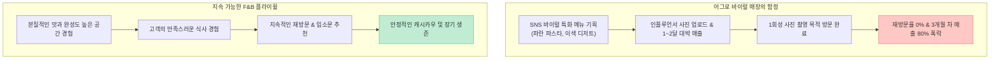

SNS를 보면 매달 수천만 원에서 1억 원의 매출을 올린다는 화려한 핫플레이스 카페와 맛집들이 넘쳐납니다. 하지만 정작 1~2년 뒤에 가보면 소리 소문 없이 간판이 바뀌어 있거나 폐업 절차를 밟는 곳이 부지기수입니다.

최근 [유튜브 채널 '지식한상/합석'에서 다룬 영상("월 매출 1억 찍고도 요즘 카페들 줄줄이 망하는 이유")](https://youtu.be/YXvb55DFxeI)은 익선동·성수동·창신동 등을 기획한 공간 기획의 거장 글로우서울 **유정수 대표**와 F&B 전문 **이장원 세무사**가 출연하여, 겉보기 매출의 착시와 원가·인건비의 덫, SNS 어그로 메뉴의 치명적 한계, 그리고 사장의 주방 장악 필요성을 실전 데이터와 현장 경험으로 생생하게 풀어내 자영업계에 큰 경종을 울렸습니다.

이 글에서는 두 전문가가 제시한 5가지 핵심 자영업 실패 원인과 생존 전략을 외식업 원가 구조, 국세청 홈택스 소득률 지표, 그리고 지속 가능한 브랜딩 관점에서 깊이 있게 팩트체크해보겠습니다.

<!--more-->

## Sources

- [유튜브 영상 - 월 매출 1억 찍고도 요즘 카페들 줄줄이 망하는 이유 (유정수 X 이장원)](https://youtu.be/YXvb55DFxeI)
- [국세청(NTS) - 3개년 동일 업종·지역별 평균 소득률 및 부가가치율 신고 가이드](https://www.hometax.go.kr/)
- [소상공인시장진흥공단 - 전국 F&B 및 커피전문점 폐업률 실태조사 보고서](https://www.semas.or.kr/)
- [Glow Seoul - Spatial Branding & Sustainable F&B Concept Architecture](https://glowseoul.co.kr/)

> 이 글은 특정 브랜드를 비하하기 위한 목적이 아니며, 외식업 창업 및 매장 운영 시 반드시 고려해야 할 세무·재무적 리스크와 공간 기획 원리를 분석한 교육용 글입니다.

---

## 1. 영상이 지적한 5가지 핵심 자영업 실패 원인 요약

유정수 대표와 이장원 세무사는 겉만 화려하고 실속 없이 무너지는 매장들의 공통된 원인을 5가지로 짚었습니다.

1. **월 매출 1억의 착시와 원가의 덫:** 매출 1억 원이 나와도 식자재 원가(35~40%), 인건비(25~30%), 임대료(10~15%), 부가세·종합소득세, 카드 수수료 등을 빼면 사장 손에 쥐어지는 순이익은 마이너스이거나 월 100~200만 원에 불과함.
2. **'오토 매장(Auto)'의 환상과 파멸:** 매장을 열어두고 직원들로만 돌리며 사장은 골프를 치러 다닌다는 '오토병'은 로스 누수와 서비스 품질 붕괴로 사장의 몫을 0원으로 만듦.
3. **SNS 어그로 메뉴의 단명 ("어그로로 흥한 자, 어그로로 망한다"):** 파란 파스타나 반짝 유행 디저트처럼 사진용 방문에만 의존하는 아이템은 설비 투자금을 회수하기도 전에 재방문율 0%로 추락해 폐업함.
4. **사장의 주방 기술 장악 필수성:** 사장이 요리 레시피와 주방 기술을 모르면 주방장에게 끌려다니며 식자재 리베이트나 갑작스러운 퇴사 협박에 속수무책으로 당함.
5. **홈택스 '동종 업종 소득률' 자가진단:** 국세청에서 제공하는 동일 업종 평균 소득률보다 내 매장의 이익률이 낮다면 이는 경영 실패의 명백한 신호임.

---

## 2. 세부 주제별 정량적 팩트체크

### 1) F&B 매장의 실제 손익 구조: 매출 1억의 배신

외식업에서 매출은 회사의 것이 아니라 잠시 스쳐 지나가는 통로에 불과합니다.

$$\text{순이익} = \text{총매출} - (\text{원가율 35\%} + \text{인건비 30\%} + \text{임대료 15\%} + \text{세금 및 수수료 12\%} + \text{감가상각·기타 5\%})$$

- 1억 원을 팔아도 고정비와 변동비가 조금만 통제를 벗어나면 **영업이익률은 3% 미만(300만 원 이하)**으로 떨어지며, 부가세 납부의 달에는 순식간에 적자로 전환됩니다.

### 2) SNS 바이럴 Hype 사이클 vs 지속 가능한 재방문 플라이휠

유정수 대표의 실제 실패 사례처럼, 파란색 까르보나라가 SNS에서 화제가 되어 첫 달 6,000만 원의 매출을 기록했더라도 맛의 본질과 재방문 가치가 없으면 3개월 만에 1,000만 원 이하로 폭락하여 회복 불능 상태에 빠집니다.

---

## 3. 사장의 포지셔닝: 주방 기술 통제와 홀 서비스의 조화

외식업 사장이 가져야 할 가장 중요한 덕목은 **핵심 기술(주방)의 장악**입니다.

- **주방에 종속된 사장의 비극:** 사장이 레시피를 모르면 주방장이 더 비싼 식자재를 발주해 리베이트를 챙기거나 갑자기 월급 인상을 요구해도 그만둘까 봐 눈치만 봅니다.
- **가장 이상적인 사장의 위치:** 사장이 주방 시스템을 100% 이해하고 대체할 수 있는 상태에서 **홀에서 손님을 응대하고 서비스 퀄리티를 관리할 때** 매장의 권위와 수익성이 극대화됩니다.

---

## 4. 국세청 홈택스로 내 사업 객관화하기

이장원 세무사는 매년 5월 종합소득세 신고 시 홈택스에서 제공하는 **'동종 업종 평균 소득률'**을 반드시 점검할 것을 조언합니다.

- **소득률 저조 경고:** 동일 지역·동일 업종의 평균 영업이익률이 15%인데 내 매장이 5%에 불과하다면, 이는 원가나 인건비에서 심각한 누수가 발생하고 있다는 객관적인 데이터입니다.
- 사장은 매장의 감에 의존하지 말고 원가율과 인건비 비율을 정량적으로 재조정해야 합니다.

---

## 5. 실전 F&B 매장 생존 5단계 체크리스트

| 단계 | 자영업 및 F&B 매장 필수 점검 항목 | 체크 |
|:---|:---|:---:|
| **1단계** | 식자재 원가율이 35% 이하, 인건비가 30% 이하로 통제되고 있는가? | [ ] |
| **2단계** | 사장이 자리를 비워도 매장이 돌아간다는 '오토 매장'의 환상에 빠져 있지 않은가? | [ ] |
| **3단계** | 메뉴가 1회성 SNS 사진용이 아닌 본질적인 맛과 재방문율을 보장하는가? | [ ] |
| **4단계** | 주방장이 갑자기 퇴사해도 사장이 주방을 직접 통제하고 대체할 수 있는가? | [ ] |
| **5단계** | 홈택스 동종 업종 평균 소득률 대비 내 매장의 이익률이 건강한 수준인가? | [ ] |

---

## 6. 결론

"월 매출 1억"이라는 껍데기 숫자는 자영업자를 흥분시키는 가장 위험한 착시입니다.

외식업의 승패는 화려한 매출이 아니라 **단 1%의 원가를 아끼고, 주방 기술을 장악하며, 고객이 다시 찾아오게 만드는 본질적인 가치**에서 결정됩니다.
