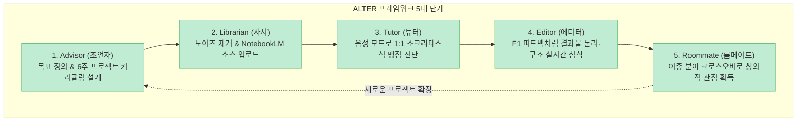

인터넷에는 하버드, MIT, 스탠퍼드 등 세계 최고 명문대의 명강의들이 무료로 널려 있습니다. 하지만 이 무료 강의(MOOC)에 등록한 수강생 중 끝까지 완강하는 비율은 고작 12%에 불과하며, **무려 88%가 중도에 포기**합니다. 지식이 부족해서가 아니라, 능동적인 피드백과 나에게 맞춘 상호작용이 없기 때문입니다.

최근 [유튜브 테크 채널 'Tech Bridge'에서 공개된 영상("[한글자막] AI로 혼자서도 압도적인 실력을 쌓는 독학 방법")](https://youtu.be/lF8_DX2NxjI)은 생성형 AI(ChatGPT, Gemini, Google NotebookLM 등)를 활용해 누구나 자신만의 **'상자 속 개인 대학(University in a Box)'**을 구축할 수 있는 **ALTER 프레임워크**를 제시해 전 세계 학습자들에게 큰 영감을 주었습니다.

이 글에서는 해당 영상이 소개한 ALTER 프레임워크의 5대 역할과 실전 실행 프로토콜을 교육 심리학(벤자민 블룸의 2시그마 문제), 인지 과학 및 최신 AI 도구의 특성에 기반하여 정밀하게 팩트체크해보겠습니다.

<!--more-->

## Sources

- [유튜브 영상 - [한글자막] AI로 혼자서도 압도적인 실력을 쌓는 독학 방법 (Tech Bridge)](https://youtu.be/lF8_DX2NxjI)
- [Bloom, B. S. - The 2 Sigma Problem: The Search for Methods of Group Instruction as Effective as One-to-One Tutoring (Educational Researcher, 1984)](https://www.jstor.org/stable/1175554)
- [MIT & Harvard edX Research - MOOC Completion Rates and Dropout Analysis (2013-2020)](https://news.mit.edu/)
- [Google Labs - NotebookLM Grounding & Audio Overview Deep Dive](https://notebooklm.google.com/)
- [Catmull, E. - Creativity, Inc. (Pixar University & Cross-Training Model)](https://www.pixar.com/)

> 이 글은 특정 AI 유료 툴의 판촉 목적이 아니며, 인공지능을 활용한 메타인지적 학습 설계와 독학 프로세스를 데이터와 교육 이론으로 검증한 교육용 글입니다.

---

## 1. 온라인 무료 강의의 88%가 실패하는 이유: 수동적 시청의 함정

MIT와 하버드가 공동 설립한 edX의 6년간 1,200만 명 학습자 데이터 분석에 따르면, 온라인 코스의 중도 탈락률은 88%에 달합니다.

- **수동적 동영상 시청의 한계:** 모니터 앞에서 일방적인 강의를 듣는 것은 뇌에 '이해했다는 착각(Fluency Illusion)'만 줄 뿐, 실제 문제 해결 능력으로 전이되지 않습니다.
- **피드백과 강제성의 부재:** 내가 어디서 막혔는지 진단해 주는 튜터와 과제를 점검해 주는 에디터가 없으면, 인간의 뇌는 인지적 피로를 이기지 못하고 학습을 중단합니다.

---

## 2. ALTER 프레임워크 5대 핵심 역할과 실전 프로토콜

영상은 생성형 AI를 활용해 대학의 핵심 기능 5가지를 완전히 대체하는 **ALTER 모델**을 제시합니다.

### 1) A - Advisor (조언자): 맞춤형 6주 커리큘럼 설계
- **원리:** 학습의 성패는 목표의 구체성에 달려 있습니다.
- **실전 5단계 결정:** ① 달성할 최종 목표, ② 나의 현재 수준, ③ 주당 가용 시간, ④ 선호하는 학습 스타일, ⑤ 6주 후 손에 쥘 결과물(글, 코드, 기획서)을 AI에게 제공하고, 6주 단위의 마일스톤 커리큘럼을 생성합니다.

### 2) L - Librarian (사서): 노이즈 제거와 원천 자료(Ground Truth) 앵커링
- **원리:** 열린 인터넷을 방황하는 AI는 환각(Hallucination)을 일으킵니다.
- **도구 활용:** Gemini Deep Research, Claude 등으로 엄선한 논문·서적·인터뷰를 **Google NotebookLM**에 업로드하여 AI가 오직 내가 제공한 팩트에만 근거해 답하도록 통제합니다.
- **오디오 오버뷰(Audio Overview):** 문서들을 2인 진행 팟캐스트 형태로 변환하여 출퇴근길에 청각으로 학습하고, AI 진행자에게 질문을 던지며 핵심 요약을 흡수합니다.

### 3) T - Tutor (튜터): 2시그마 문제를 깨는 일대일 음성 소크라테스 문답
- **벤자민 블룸의 2시그마 문제 (Two-Sigma Problem):** 1:1 튜터링을 받은 학생은 일반 교실 수업을 들은 학생의 상위 98% 성과를 냅니다. 과거 부유층만 누릴 수 있었던 1:1 과외를 AI 음성 모드로 구현합니다.
- **실전 프롬프트:**
  > *"너는 지금부터 내 튜터야. 한 번에 하나씩만 질문하고, 내 답변에서 논리적 맹점을 찾아내 날카롭게 파고들어줘. 절대 먼저 답을 길게 설명하지 말고, 내가 스스로 깨달을 때까지 질문을 던져줘."* (`Teach me` & `Test me`)

### 4) E - Editor (에디터): F1 레이스팀의 실시간 피드백
- **원리:** 튜터가 이해를 돕는다면, 에디터는 결과물의 '납품 완성도(Delivery)'를 보장합니다.
- **탁월함은 피드백에 있다 (Excellence lives in feedback):** F1 레이싱팀이 0.1초를 줄이기 위해 수천 개 데이터를 실시간 피드백하듯, 내가 작성한 글·기획서·코드의 군더더기, 논리적 모순, 구조적 취약점을 AI에게 가차 없이 첨삭받습니다.

### 5) R - Roommate (룸메이트): 픽사(Pixar)식 다학제적 렌즈
- **원리:** 전문성이 깊어질수록 시야가 좁아지는 함정에 빠집니다.
- **픽사 유니버시티 사례:** 애니메이터에게 조각을 가르치고 회계사에게 드로잉을 가르치듯, 전혀 다른 이종 도메인의 렌즈를 빌려와 내 분야를 새롭게 조망합니다.
- **프롬프트 질문:** *"요리의 맛 밸런스 원리와 금융 자산 배분의 공통점은?", "재즈의 즉흥 연주 방식이 애자일 소프트웨어 개발팀에 주는 시사점은?"*

---

## 3. 실전 AI 독학 5단계 체크리스트

| 단계 | ALTER 독학 시스템 실행 점검 항목 | 체크 |
|:---|:---|:---:|
| **1단계 (Advisor)** | 6주 후 손에 쥘 구체적인 결과물(포트폴리오) 기반 커리큘럼을 짰는가? | [ ] |
| **2단계 (Librarian)** | NotebookLM에 신뢰할 수 있는 원천 자료를 넣어 환각을 방지했는가? | [ ] |
| **3단계 (Tutor)** | 음성 모드로 AI에게 날카로운 질문을 요구하며 내 맹점을 테스트했는가? | [ ] |
| **4단계 (Editor)** | 작성한 결과물의 논리적 결함과 군더더기를 AI에게 냉정하게 첨삭받았는가? | [ ] |
| **5단계 (Roommate)** | 다른 학문이나 일상의 렌즈를 빌려와 창의적 통찰력을 도출했는가? | [ ] |

---

## 4. 결론

"강을 가장 빨리 건너는 배는 무엇인가?"라는 젊은이의 물음에 늙은 사공은 이렇게 답했습니다.

> **"당신이 지금 올라타서 노를 젓기 시작하는 바로 그 배라네."**

어떤 AI 도구가 최고인지 몇 달 동안 비교만 하는 사람은 결코 강을 건너지 못합니다. 오늘 밤, 당장 NotebookLM을 켜고 음성 모드로 튜터에게 첫 질문을 던지는 실천만이 나를 압도적인 실력자로 만들어 줄 것입니다.
