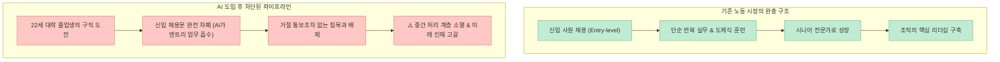

생성형 AI가 도입되면 인간의 노동 시간이 단축되고 업무가 한결 여유로워질 것이라는 환상이 지배적이었습니다. 하지만 현실의 직장인들은 정반대의 고통을 호소합니다. 처리해야 할 데이터와 검토해야 할 초안이 수십 배로 폭증하면서 오히려 업무가 더 꼬이고 피로도는 극에 달하고 있습니다.

최근 [유튜브 테크 심층 인터뷰 영상("AI 때문에, 이제 업무가 더 꼬입니다")](https://youtu.be/mc8txxUSpUI)에서는 팔란티어(Palantir)와 안두릴(Anduril)을 키워낸 실리콘밸리의 거물 투자자 **조 론스데일(Joe Lonsdale)**과 엔터프라이즈 클라우드 제국 Box의 CEO **아론 레비(Aaron Levie)**가 직접 출연하여, 기술의 정점에 선 빅테크 리더들이 마주한 **생산성의 역설, 신입 일자리 사다리의 소리 없는 붕괴, 그리고 AI 창조자들이 자초한 공포 마케팅의 부메랑**을 가감 없이 폭로했습니다.

이 글에서는 두 빅테크 리더의 대담을 바탕으로 기술 경제학의 '그로브-게이츠의 역설', 청년 고용 시장의 보이지 않는 장벽, 그리고 미래 '아령형 사회' 생존 모델을 정밀하게 팩트체크해보겠습니다.

<!--more-->

## Sources

- [유튜브 영상 - AI 때문에, 이제 업무가 더 꼬입니다 (조 론스데일 X 아론 레비 대담)](https://youtu.be/mc8txxUSpUI)
- [Grove, A. S. - Only the Paranoid Survive & High Output Management](https://www.intel.com/)
- [U.S. Bureau of Labor Statistics (BLS) - Tech Sector Hiring & Entry-Level Job Openings Dynamics](https://www.bls.gov/)
- [Kafkas Allegory - Before the Law (법 앞에서) & Algorithmic Gatekeeping in Labor Markets](https://www.kafka.org/)
- [Box & 8VC Research - Enterprise AI Agent Workflows and Productivity Saturation](https://www.box.com/)

> 이 글은 특정 기업이나 인공지능 툴을 홍보하기 위한 글이 아니며, 인공지능 도입이 실제 노동 생산성과 조직 구조, 그리고 청년 고용에 미치는 거시경제적 영향을 분석한 교육용 글입니다.

---

## 1. '그로브-게이츠의 역설(Grove-Gates Paradox)': 왜 업무는 줄지 않고 폭증하는가?

과거 테크 업계에는 유명한 격언이 있었습니다.

> *"앤디 그로브(인텔 CEO)가 하드웨어 성능을 주면, 빌 게이츠(마이크로소프트)가 소프트웨어로 삼켜버린다." (What Grove giveth, Gates taketh away)*

인텔이 CPU 처리 속도를 2배로 올려놓으면 사용자가 여유로워지는 것이 아니라, 윈도우 OS와 응용 프로그램이 훨씬 무거워져 그 늘어난 성능을 고스란히 집어삼켰습니다.

지금 생성형 AI 시대의 일터에서도 똑같은 역설이 벌어지고 있습니다.

- **생산성 향상의 함정:** AI 에이전트가 투입되어 마케팅 문구 작성을 10배 빠르게 끝내주면, 인간이 일찍 퇴근하는 것이 아닙니다.
- **기준선(Baseline)의 폭등:** 예전에는 한 캠페인에 광고 시안 5개를 만들면 충분했지만, 이제는 AI로 **5,000개의 개인화 광고**를 뽑아냅니다.
- **검토와 조율 비용의 폭발:** 초안을 생성하는 한계비용은 0원에 가까워졌지만, 수천 개의 결과물을 검수하고 법적 리스크를 걸러내며 최종 결정을 내리는 인간의 인지적 조율 비용은 수십 배로 치솟아 업무가 극단적으로 꼬이게 됩니다.

---

## 2. Kimi K3와 프롬프트 한 장의 충격: 코딩 노가다의 종말과 '기획력'의 재정의

영상에서는 최신 모델 Kimi K3가 기획서 단 한 장짜리 프롬프트로 **8인 멀티플레이어 3D 브라우저 레이싱 게임**을 실시간 생성하는 실제 사례를 조명했습니다.

- 플레이어들의 실시간 위치 동기화 서버 구축
- 3D 툴을 통한 캐릭터와 카트 에셋 실시간 생성
- 브라우저 기반 동시 접속 및 충돌 물리 엔진 구현

과거에는 수명의 프론트엔드·백엔드·3D 개발자가 수개월간 달라붙어야 했던 코딩 노가다가 단 몇 분 만에 끝납니다.

이것이 시사하는 바는 명확합니다. 단순 문법 암기나 코드 작성 기술은 완벽히 자동화되었으며, 이제 인간의 유일한 경쟁력은 **"무엇을 만들고 무엇을 만들지 말아야 할지, 어디까지가 합격선인지"**를 명확한 구조로 정의하는 **'도메인 기획력과 디렉팅 능력'**으로 완전히 이동했습니다.

---

## 3. 소리 없는 고용 위기: '해고'가 아니라 '신입의 문'이 닫혔다

고용 지표를 보면 대규모 해고율은 높지 않아 노동 시장이 안전해 보입니다. 하지만 이것은 심각한 착시입니다.

- **카프카의 '문지기' 비유:** 프란츠 카프카의 단편 《법 앞에서》처럼, 청년들은 자신이 능력이 부족해서 떨어진 것인지 아니면 애초에 문이 닫힌 것인지조차 알지 못한 채 문턱 앞에서 멍하니 서 있습니다.
- **엔트리 레벨의 실종:** 기존 경력자는 AI 툴을 쓰며 자리를 지키지만, 초보자가 실무를 배우며 성장해야 할 엔트리 레벨(신입) 자리를 AI가 전부 대체하면서 세대 간 성장 사다리가 침묵 속에 끊어지고 있습니다.

---

## 4. 빅테크가 자초한 공포 마케팅과 규제의 부메랑

조 론스데일과 아론 레비는 기술 업계 리더들이 스스로를 옭아맨 역설을 통렬하게 비판했습니다.

- **만든 자들이 먼저 떤 공포:** AI 창조자들은 모델을 발표할 때마다 "인류 멸망", "통제 불능"을 외치며 지나치게 공포를 자극했습니다.
- **정치권과 대중의 적개심:** 그 결과 대중은 "만든 사람들도 두려워하는데 왜 우리가 좋아해야 하는가?"라는 반감을 품게 되었고, 뉴욕주의 데이터 센터 건설 일시 중단 등 초유의 규제 장벽으로 이어졌습니다.
- 업계가 진정한 혁신 사례(수명 연장, 난치병 정복, 생산성 도약)를 전면에 내세우지 않고 공포 마케팅에 의존한 대가를 고스란히 치르고 있는 셈입니다.

---

## 5. 해법: 양극이 두터운 '아령(Dumbbell)형 사회'

이 거대한 기술 충격 속에서 공멸을 피하기 위해 조 론스데일과 아론 레비가 제시한 사회적 모델은 **'아령형 사회'**입니다.

- **받쳐주는 안전망 (한쪽 끝):** AI 전환 과정에서 일자리를 잃고 재진입하지 못하는 사람들을 국가가 단단히 떠받쳐주는 보편적 사회 안전망 구축.
- **내달리는 자유 (다른 한쪽 끝):** 기회를 쫓아 혁신을 만들고 창업에 뛰어드는 기술자와 기업가들의 발목을 낡은 규제로 묶지 않는 완전한 자유 보장.
- 가운데를 억지로 평준화하려다 양쪽을 모두 망치는 대신, 바닥은 견고하게 받치고 천장은 활짝 열어두는 입체적 구조가 필요합니다.

---

## 6. AI 시대 실전 커리어 생존 5대 수칙

- **1. 단순 생성자가 아닌 '최종 디렉터'가 되어라:** 코딩이나 카피라이팅 초안 작성을 넘어, 요구사항을 정의하고 퀄리티를 판정하는 디렉팅 역량을 길러야 합니다.
- **2. 생산성 도구의 역설을 경계하라:** AI로 결과물의 양을 무한정 늘리기보다, 노이즈를 줄이고 핵심 본질에 집중하는 '선별력'을 우선해야 합니다.
- **3. 엔트리 레벨의 붕괴를 직시하라:** 회사가 나를 가르쳐주길 기대하지 말고, 스스로 AI를 부하 직원 삼아 프로젝트를 완결해보는 '1인 실전 포트폴리오'를 증명해야 합니다.
- **4. 막연한 공포 대신 실질적 가치를 증명하라:** AI 파멸론에 휘둘리지 말고 내 업무 도메인에서 측정 가능한 구체적 성과를 만들어내는 데 집중해야 합니다.
- **5. 안전망을 확보하고 담대하게 시도하라:** 변화의 속도를 거스르려 하지 말고, 나의 고유한 전문성에 기술 레버리지를 결합해 시장의 기준선 위로 도약해야 합니다.

---

## 7. 결론

"AI가 내 일자리를 대신해 줄 것"이라는 순진한 기대는 끝났습니다. AI는 일자리를 없애기 전에 먼저 업무의 기준선과 복잡성을 성층권까지 끌어올려 인간의 역량을 시험하고 있습니다.

생성된 무수한 초안에 휘둘리는 작업자로 남을 것인가, 명확한 기획서로 AI를 지휘하는 디렉터로 거듭날 것인가. 선택의 기로는 이미 우리 눈앞에 와 있습니다.
