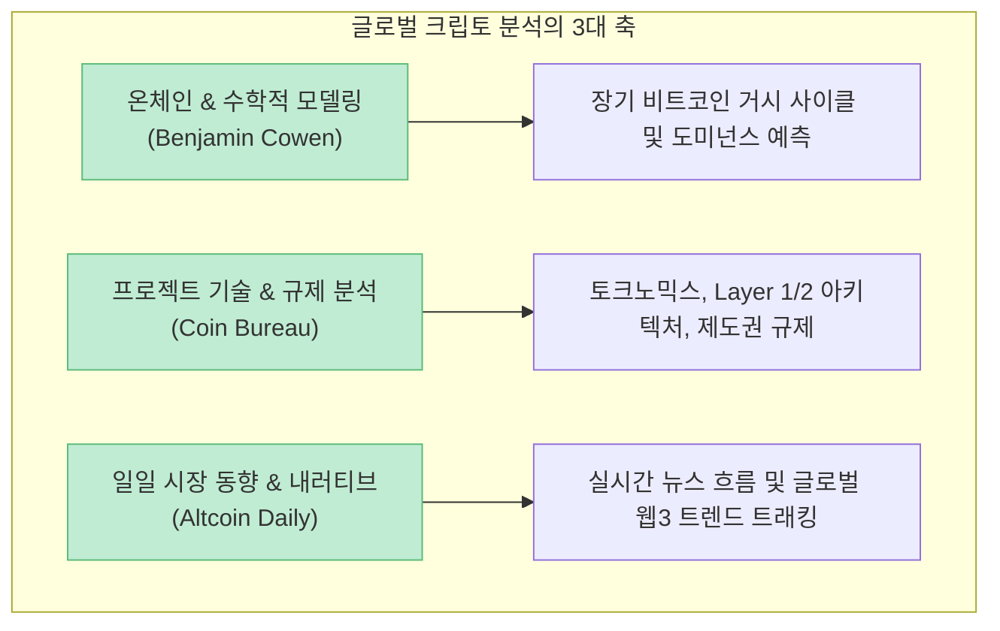

국내 주식 및 코인 유튜브 생태계는 자극적인 테마주 추천, 단기 급등주 리딩, 혹은 비전문적인 풍문성 정보에 치우치기 쉽습니다. 반면 글로벌 영미권 금융 시장에는 실제 월스트리트 프랍 트레이딩 펌(Proprietary Trading Firm), 전직 헤지펀드 매니저, 그리고 수학적 통계 모델을 다루는 온체인 분석가들이 직접 운영하는 양질의 교육 채널들이 방대하게 존재합니다.

최근 [스레드 투자 추천 콘텐츠(@zetoonam)에서 화제를 모은 '해외에서 진짜 많이 보는 트레이딩·주식·코인 유튜버 10명 정리'](https://www.threads.com/share/BAgzrl4Cn4/)는 단순한 유튜브 목록을 넘어, **기술적 분석, 매매 심리, 온체인 사이클, 거시경제 해설까지 투자자가 갖추어야 할 10대 글로벌 지식 소스**를 일목요연하게 큐레이션해 큰 관심을 끌었습니다.

이 글에서는 해당 10대 채널의 핵심 콘텐츠 성격과 투자 철학을 프라이스 액션(Price Action), 시장 미시구조(Market Microstructure), 온체인 계량 분석 관점에서 정밀하게 팩트체크하고 맞춤형 학습 로드맵을 정리해보겠습니다.

<!--more-->

## Sources

- [스레드 원문 - 해외에서 진짜 많이 보는 트레이딩·주식·코인 유튜버 10명 (@zetoonam)](https://www.threads.com/share/BAgzrl4Cn4/)
- [SMB Capital - Proprietary Trading Firm Training & Risk Management Protocols](https://www.smbtraining.com/)
- [Rayner Teo - Price Action Trading & Trend Following Methodologies](https://tradingwithrayner.com/)
- [Cowen, B. - Into The Cryptoverse (Mathematical & Logarithmic Cycle Analysis)](https://intothecryptoverse.com/)
- [Boyle, P. - Quantitative Finance & Applied Portfolio Management](https://www.patrickboyle.com/)

> 이 글은 특정 금융 상품이나 채널의 유료 멤버십을 홍보하기 위한 글이 아니며, 글로벌 금융 정보 비대칭을 해소하고 체계적인 투자 공부를 돕기 위한 교육용 큐레이션입니다.

---

## 1. 실전 트레이딩 & 프라이스 액션(Price Action) 탑티어 채널 5선

### 1) SMB Capital: 월스트리트 프랍 트레이더의 실전 매매 복기
- **핵심 강점:** 뉴욕에 본사를 둔 실제 프랍 트레이딩 펌의 시니어 트레이더들이 운영하는 채널입니다.
- **주요 내용:** 개별 종목의 테이프 리딩(호가창 체결 분석), 1회 거래당 리스크 한도(Risk per Trade) 설정, 트레이딩 플레이북(매매 일지) 작성법 등 기관급 리스크 관리 프로토콜을 배울 수 있습니다.

### 2) Rayner Teo: 프라이스 액션과 추세 추종의 정석
- **핵심 강점:** 복잡한 보조지표를 걷어내고 오직 캔들과 지지·저항, 거래량만으로 시장을 읽는 '가격 행동(Price Action)'의 바이블입니다.
- **주요 내용:** ATR(Average True Range)을 활용한 동적 손절선 설정, 다중 타임프레임 분석, 뇌동매매를 방지하는 룰 베이스 매매 시스템을 알기 쉽게 설명합니다.

### 3) Humbled Trader (Shay): 현실적인 데이트레이더의 심리 관리
- **핵심 강점:** "람보르기니를 타고 하루 1억을 벌었다"는 가짜 전문가(Fake Guru)들의 사기를 폭로하고, 단타 트레이더가 겪는 처절한 현실을 가감 없이 보여줍니다.
- **주요 내용:** 승률(Win Rate)보다 손익비(Risk-Reward Ratio)가 중요한 이유, 손실 만회 심리(Revenge Trading) 차단법, 소액 계좌 우상향 루틴을 공유합니다.

### 4) Warrior Trading (Ross Cameron): 소형주 모멘텀 단타의 극치
- **핵심 강점:** 미국 나스닥 소형주(Small-cap)의 장 초반 갭상승(Gap & Go)과 급등 모멘텀을 공략하는 스캘핑·단타 전문 채널입니다.
- **주요 내용:** 레벨 2 오더북(Level 2 Order Book) 판독, 돌파 매매 타이밍, 단기 변동성 서핑 기법을 다룹니다. (※ 초보자에게는 리스크가 매우 크므로 주의가 필요합니다.)

### 5) The Trading Channel (Steven Hart): 캔들 구조와 가격 패턴 완성
- **핵심 강점:** 초보자가 차트를 객관적 구조로 분해할 수 있도록 기술적 분석의 프레임워크를 체계적으로 강의합니다.
- **주요 내용:** 더블 탑/바텀, 헤드앤숄더, 추세선 이탈 등 클래식 패턴의 실제 성공 확률과 진입 필터링을 다룹니다.

---

## 2. 암호화폐 펀더멘털 & 온체인 거시 사이클 채널 3선

### 6) Benjamin Cowen (Into The Cryptoverse): 수학과 데이터 기반의 사이클 분석
- **핵심 강점:** 감정이나 근거 없는 희망 회로를 배제하고, **로그 회귀 밴드(Logarithmic Regression Bands)**와 통계적 데이터를 바탕으로 비트코인의 거시 사이클을 분석합니다.
- **주요 내용:** 비트코인 도미넌스(BTC Dominance)의 주기적 변화, 반감기 전후의 통계적 패턴, 알트코인의 상대적 위험도를 냉정하게 진단합니다.

### 7) Coin Bureau (Guy): 암호화폐 펀더멘털과 제도권 분석
- **핵심 강점:** 특정 코인의 가격 펌핑이 아닌, 블록체인 프로젝트의 기술적 완성도, 토크노믹스(발행량 및 락업 해제 일정), 그리고 SEC·EU MiCA 등 글로벌 규제 정책을 심층 리포트합니다.
- **주요 내용:** 탈중앙화 인프라, 레이어 2 솔루션의 생존성, 기관 자금 유입 흐름을 객관적으로 다룹니다.

### 8) Altcoin Daily: 매일 아침 업데이트되는 글로벌 크립토 브리핑
- **핵심 강점:** 전 세계 웹3 및 가상자산 업계의 주요 뉴스, 파트너십, 기관 동향을 하루도 빠짐없이 압축 정리해 주는 데일리 큐레이션 채널입니다.

---

## 3. 글로벌 거시경제 & 실시간 시장 모니터링 2선

### 9) Patrick Boyle: 전 헤지펀드 매니저이자 석학의 위트 넘치는 거시경제학
- **핵심 강점:** 전직 퀀트 헤지펀드 매니저이자 런던 대학교 금융학 교수가 운영하는 채널로, 지루할 수 있는 거시경제와 금융 스캔들을 특유의 영국식 블랙코미디와 깊은 통찰력으로 풀어냅니다.
- **주요 내용:** 연준(Fed)의 금리 정책, 글로벌 유동성 위기, 은행 파산 사태의 이면, 금융 사기극의 구조적 원인을 명쾌하게 해설합니다.

### 10) TraderTV Live: 미국 정규장 실시간 라이브 트레이딩
- **핵심 강점:** 뉴욕 증시 개장 전 프리마켓부터 정규장 마감까지 실시간으로 진행되는 전 세계 최대 규모의 금융 라이브 쇼입니다.
- **주요 내용:** 실시간 기업 실적 발표, CPI·고용지표 속보 반응, 기관 수급 집중 종목의 테이프 액션을 라이브로 관찰할 수 있습니다.

---

## 4. 목적별 맞춤형 추천 학습 로드맵

- **차트와 단타 매매의 기본기를 다지고 싶다면:** `Rayner Teo` (프라이스 액션 기초) → `SMB Capital` (프랍 트레이더의 실전 리스크 관리)
- **비트코인 및 코인 투자의 장기 사이클을 보고 싶다면:** `Benjamin Cowen` (온체인 데이터 및 도미넌스) → `Coin Bureau` (프로젝트 펀더멘털)
- **금리, 환율, 글로벌 거시경제의 큰 그림을 읽고 싶다면:** `Patrick Boyle` (헤지펀드 시각의 거시경제) → `TraderTV Live` (실시간 미국장 반응 관찰)

---

## 5. 해외 금융 유튜브 200% 활용 실전 5대 수칙

- **1. 자막 기능을 적극 활용하라:** 유튜브의 자동 번역 및 AI 자막 확장 프로그램을 활용하면 영어 장벽 없이 고품질의 지식을 온전히 흡수할 수 있습니다.
- **2. 화려한 수익률 인증을 경계하라:** "하루에 1,000% 벌었다"는 썸네일 대신, 손실 복기와 리스크 관리를 투명하게 공개하는 채널에 집중해야 합니다.
- **3. 하루 1개 영상, 핵심 원칙 1줄 요약:** 영상을 수십 개 흘려듣는 대신, 하루 1개 영상을 보고 '내 매매 일지에 적용할 단 하나의 규칙'을 기록해야 합니다.
- **4. 차트 패턴을 과거 데이터로 검증하라:** 영상에서 배운 프라이스 액션 기법은 반드시 트레이딩뷰(TradingView)를 켜고 과거 3~5년 차트에서 직접 백테스팅해야 합니다.
- **5. 거시경제와 미시 매매를 결합하라:** 패트릭 보일의 거시경제 뷰로 시장의 큰 조류(Trend)를 파악하고, 레이너 테오의 프라이스 액션으로 정밀한 진입 타점을 잡는 입체적 시각을 길러야 합니다.

---

## 6. 결론

투자 시장에서 가장 위험한 것은 **내가 무엇을 모르는지조차 모르는 상태(무지의 무지)**입니다.

국내의 단기 유행성 소음에서 벗어나, 전 세계 수백만 명의 전문 트레이더들이 검증한 글로벌 지식 소스를 꾸준히 섭취할 때 비로소 우리는 기관과 외국인의 놀이터에서 살아남는 단단한 투자 원칙을 완성할 수 있습니다.
