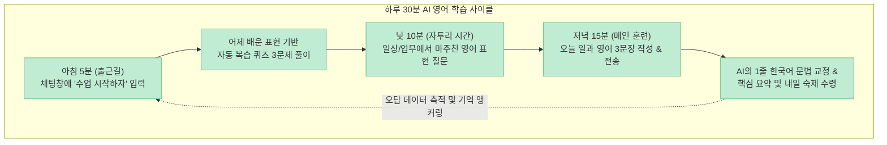

많은 사람들이 영어 회화를 잘하고 싶어서 ChatGPT나 Claude를 켜고 "나랑 영어로 프리토킹하자"라며 몇 번 대화를 시도해 봅니다. 하지만 며칠 지나지 않아 대화는 시들해지고, 내가 어제 무엇을 틀렸는지조차 기억하지 못하는 일회성 번역기 수준으로 전락하고 맙니다. 

최근 [유튜브 교육 채널에서 공개된 영상("99%가 모르는 AI 영어 공부법, 이 영상 하나로 끝내세요")](https://youtu.be/jeMIRXw-OT8)은 단순히 인공지능에 질문을 던지는 수준을 넘어, **Claude의 프로젝트(Projects) 기능이나 ChatGPT의 맞춤형 설정(Custom GPTs)**을 활용해 **어제 배운 내용을 자동으로 복습시키고, 나의 취약한 문법·어휘 패턴만 집요하게 파고드는 '평생 무료 1:1 전담 과외 에이전트'를 세팅하는 법**을 공개해 폭발적인 반응을 얻었습니다.

이 글에서는 해당 영상이 제시한 AI 전담 과외 에이전트 구축 프롬프트, 인지과학적 간격 반복(Spaced Repetition) 메커니즘, 그리고 하루 30분 실전 영어 학습 루틴을 정밀하게 팩트체크해보겠습니다.

<!--more-->

## Sources

- [유튜브 영상 - 99%가 모르는 AI 영어 공부법, 이 영상 하나로 끝내세요](https://youtu.be/jeMIRXw-OT8)
- [Ebbinghaus, H. - Memory: A Contribution to Experimental Psychology (망각곡선과 간격 반복 이론)](https://psychclassics.yorku.ca/Ebbinghaus/)
- [Anthropic - Claude Projects & Custom Instructions System Documentation](https://support.anthropic.com/)
- [OpenAI - Custom GPTs & Instruction Engineering Guide](https://openai.com/)
- [Sweller, J. - Cognitive Load Theory and Instructional Design (인지 부하 최소화 이론)](https://www.springer.com/)

> 이 글은 특정 유료 AI 서비스를 홍보하기 위한 글이 아니며, 최신 거대언어모델(LLM)을 활용한 개인화 학습 설계와 메타인지 훈련법을 객관적으로 검증한 교육용 가이드입니다.

---

## 1. 일회성 챗봇과 '전담 과외 에이전트'의 결정적 차이

일반적인 AI 채팅창에 "영어 과외해 줘"라고 말하는 것과, '프로젝트(Projects)' 기반의 전담 에이전트를 구축하는 것은 완전히 다른 차원의 학습 경험을 제공합니다.

- **일회성 챗봇의 한계 (기억상실증):** 매번 새 대화창을 열 때마다 AI는 학습자의 영어 실력, 목표, 어제 틀렸던 문법 실수를 전혀 기억하지 못합니다. 결국 매번 자기소개만 반복하다 끝납니다.
- **전담 에이전트의 강점 (지속적 맥락 누적):** 고정된 시스템 지침(System Instructions)과 독립된 프로젝트 공간 안에서 대화하면, AI는 학생의 고유한 오류 패턴(예: 전치사 실수, 관계대명사 오남용)을 누적 학습하여 3일 차부터는 **학습자의 약점만 정밀 타격하는 맞춤형 문제**를 스스로 출제합니다.

---

## 2. 1:1 AI 영어 과외 에이전트 시스템 지시문 (Instructions)

Claude의 `Projects` 생성 후 `Instructions(지침)` 탭에, 혹은 ChatGPT의 `Custom GPTs`의 `Instructions`에 입력하는 검증된 프롬프트 템플릿입니다.

```text
너는 나의 1:1 영어 과외 선생님이야. 아래 규칙을 항상 엄격히 지켜.

[학생 정보]
- 현재 레벨: 중급 (수능 3등급, 토익 700점 수준 / 본인 실력에 맞게 수정)
- 학습 목표: 3개월 뒤 해외여행 시 식당 주문 및 현지인과 자연스러운 일상 대화
- 하루 공부 가능 시간: 30분

[수업 규칙]
1. 매 대화 시작 시, 어제 배운 내용에 대한 복습 퀴즈 3문제를 먼저 출제한다.
2. 내가 영어 문장을 쓰면 틀린 부분만 간결히 고쳐주고, 왜 틀렸는지 한국어로 딱 한 줄로 설명한다.
3. 설명 시 문법 전문 용어는 최소화하고, 실생활 예문 2개 이상을 반드시 제시한다.
4. 내가 자주 틀리는 문법/어휘 패턴을 기억해 두었다가 유사한 문제를 반복 출제한다.
5. 세션 종료 시에는 오늘 배운 핵심 표현 요약과 내일 할 숙제 1개를 명확히 내준다.
6. 칭찬은 구체적으로, 지적은 짧고 명확하게 한다.
```

### 지침 설정 시 핵심 디테일
- **학생 정보 3줄의 진실성:** 자존심 때문에 모의고사 5등급인데 3등급이라고 적거나, 토익 500점인데 700점이라고 쓰면 AI가 난이도를 잘못 잡아 포기하게 됩니다. 솔직한 현재 실력과 구체적인 상황 목표를 기재해야 합니다.
- **교재/단어장 파일 업로드 (킬러 기능):** Claude 프로젝트 화면의 `Add Content`를 통해 현재 공부 중인 영어책 목차나 단어장 PDF를 업로드하면, *"내 교재 3단원 범위 안에서만 퀴즈 내줘"*와 같이 시중 교재와 완벽히 연동된 무한 문제 은행이 완성됩니다.

---

## 3. 에빙하우스 망각곡선을 부수는 하루 30분 실전 루틴



### 1) 아침 5분 (출근·등교길): 기억의 인출 훈련
- 채팅창에 **"수업 시작하자"** 딱 다섯 글자만 입력합니다.
- AI가 지침 1번에 따라 어제 틀렸거나 배운 표현으로 복습 퀴즈 3개를 던집니다. 뇌에 망각되려던 시냅스를 아침부터 강제로 깨웁니다.

### 2) 낮 10분 (자투리 시간): 살아있는 표현 수집
- 유튜브 쇼츠, 넷플릭스, 업무 이메일 등에서 마주친 낯선 표현을 그대로 AI에게 던집니다.
- *"이 표현 무슨 뜻이야? 내가 실생활에서 써먹을 수 있는 상황 2가지만 알려줘."*

### 3) 저녁 15분 (메인 훈련): 일기 쓰기와 교정
- 오늘 있었던 일이나 떠오른 생각을 영어로 3문장 작성해 보냅니다.
- AI가 잘못된 어순이나 어색한 표현을 교정해 주고 한국어로 1줄 원리를 설명합니다.
- 마지막에 *"오늘 세션 요약해 줘"*를 입력하여 핵심 정리를 받고 내일의 숙제를 받습니다.

---

## 4. 상위 10%가 되기 위해 피해야 할 3대 치명적 실수

- **실수 1: 교정받은 문장을 눈으로만 읽고 넘어가기**  
  AI가 바르게 고쳐준 문장을 눈으로 보면 "아, 나도 알던 건데 실수했네"라며 착각합니다. 틀린 문장은 **반드시 손으로 직접 타이핑해서 AI에게 다시 보내봐야** 운동 신경과 뇌에 온전히 각인됩니다.
- **실수 2: 매일 새로운 채팅방을 열기 (기억 포맷)**  
  매일 새 채팅을 열면 AI의 메모리가 초기화되어 어제 무엇을 틀렸는지 다 까먹습니다. **반드시 생성해 둔 동일한 프로젝트 방 안에서 계속 대화를 이어가야** 나만의 맞춤형 데이터베이스가 형성됩니다.
- **실수 3: 3일을 못 채우고 일찍 그만두기**  
  AI 에이전트의 진가는 3일 차부터 나타납니다. 내가 반복해서 틀리는 전치사, 시제 불일치 패턴이 누적된 후 3일째에 AI가 내 약점을 콕 집어 문제를 낼 때 비로소 1:1 과외의 강력함을 체감하게 됩니다.

---

## 5. 실전 AI 독학 5대 체크리스트

- **1. 내 실력에 솔직한 프롬프트를 세팅했는가?** (과장 없이 현재 수준과 명확한 3개월 목표 명시)
- **2. Claude 프로젝트나 Custom GPTs에 지침을 고정했는가?** (매번 프롬프트를 다시 치지 않도록 자동화)
- **3. 아침에 '수업 시작하자'로 복습 퀴즈를 풀었는가?** (망각 방지 시스템 작동)
- **4. 교정된 문장을 눈이 아닌 손가락으로 다시 쳤는가?** (능동적 인출 및 근육 기억)
- **5. 동일한 대화방에서 오답 데이터를 누적하고 있는가?** (AI의 개인화 고도화 유지)

---

## 6. 결론

"영어 공부에는 왕도가 없다"는 말은 옛말이 되었습니다. 이제는 매달 수십만 원의 학원비를 내지 않아도, 내 수준과 목표에 완벽히 맞추어 24시간 대기하는 나만의 전담 AI 과외 교사를 누구나 가질 수 있습니다.

지금 바로 Claude나 ChatGPT를 켜고 위의 프롬프트 지침을 등록해 보세요. 내일부터 당신의 아침은 지루한 단어 암기가 아닌, 나만을 위한 흥미진진한 1:1 영어 과외로 시작될 것입니다.
