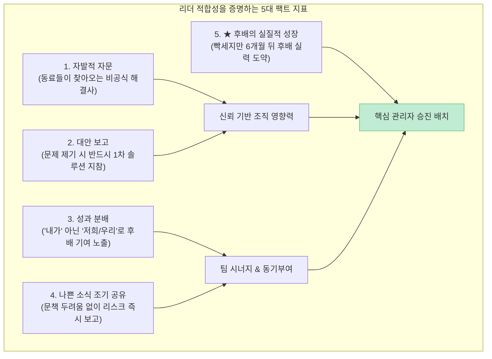

많은 기업들이 인사철마다 치명적인 실수를 반복합니다. 영업 실적이 가장 높은 에이스나 밤새워 일 처리를 완벽하게 해낸 수석 실무자를 팀장으로 승진시키는 것입니다. 하지만 결과는 참담한 경우가 많습니다. 최고의 실무자였던 사람은 무능하고 히스테릭한 관리자가 되고, 그 밑에 있던 팀원들은 줄줄이 퇴사합니다.

최근 [유튜브 경영 교육 채널 가인지TV의 영상("승진시키면 안 되는 사람 vs 승진시켜야 하는 사람")](https://youtu.be/u8ZzBLTNeeM)에서 가인지컨설팅그룹 김경민 대표는 수많은 중소·성장 기업 현장을 컨설팅하며 목격한 **'승진에 대한 거대한 오해'와 피터의 법칙(Peter Principle), 그리고 리더로 세웠을 때 팀을 살리는 진짜 인재의 5가지 행동 지표**를 명쾌하게 제시했습니다.

이 글에서는 해당 강연의 인사이트를 조직 행동론, 피터의 법칙 통계 연구, 그리고 전문가·관리자 '듀얼 트랙' 시스템 관점에서 정밀하게 팩트체크해보겠습니다.

<!--more-->

## Sources

- [유튜브 영상 - 승진시키면 '안 되는' 사람 (+승진시켜야 하는 사람) (가인지TV 김경민 대표)](https://youtu.be/u8ZzBLTNeeM)
- [Peter, L. J. & Hull, R. - The Peter Principle: Why Things Always Go Wrong (1969)](https://www.harpercollins.com/)
- [Benson, A., Li, D., & Shue, K. - Do Great Salespeople Make Great Managers? (Quarterly Journal of Economics, 2019 / NBER Research)](https://www.nber.org/papers/w24343)
- [Drucker, P. F. - The Effective Executive & Management Challenges for the 21st Century](https://www.drucker.institute/)

> 이 글은 특정 기업이나 개인을 평가하기 위한 목적이 아니며, 건전한 조직 성장과 리더십 배치를 위한 인사 관리 원리를 객관적으로 검증한 교육용 글입니다.

---

## 1. 승진에 대한 가장 치명적인 착각: '보상(상)'과 '배치'의 혼동

조직을 망치는 가장 흔한 원인은 **"과거의 성과에 대한 보상으로 승진을 선물하는 것"**입니다.

- **성과에 대한 보상은 돈으로 주어라:** 과거에 뛰어난 실적을 냈다면 성과급, 인센티브, 특별 수당, 연봉 인상으로 확실하게 보상해야 합니다.
- **승진은 미래 역할에 대한 '배치'다:** 승진은 상장이 아닙니다. 직책이 올라간다는 것은 이제 '내 손으로 일하는 사람'이 아니라 **'남을 통해 성과를 내고 사람을 성장시키는 사람'**으로 역할이 180도 바뀌는 것을 의미합니다.
- 개인 플레이어로서의 뛰어난 실력과, 팀원을 조율하고 코칭하는 관리 역량은 완전히 다른 차원의 기술입니다.

---

## 2. 하버드·NBER 실증 연구가 증명한 '피터의 법칙(Peter Principle)'

1969년 로렌스 피터 박사가 주창한 피터의 법칙은 **"계층형 조직에서 모든 직원은 자신의 무능력 수준까지 승진하는 경향이 있다"**는 원리입니다.

실제로 NBER(전미경제조약국)이 214개 미국 기업의 53,035명 영업사원과 1,531명의 관리자 승진 데이터를 5년간 추적 연구한 결과에 따르면:

- **실적 1위 영업사원을 관리자로 승진시켰을 때:** 해당 팀 전체의 영업 성과는 오히려 **평균 7.5% 하락**했습니다.
- 에이스 실무자는 모든 일을 자기 기준대로 직접 통제하려 하거나 팀원의 미숙함을 견디지 못해 팀 전체의 협업을 파괴했습니다.
- 결국 회사는 **'최고의 실무자 하나를 잃고, 최악의 무능한 관리자 하나를 얻는'** 이중의 손실을 입게 됩니다.

---

## 3. 승진시키면 절대 안 되는 3가지 인재 유형

김경민 대표는 현장에서 가장 자주 후회하는 승진 실패 유형 3가지를 명확히 경고했습니다.

- **1. 실적은 1등이지만 팀을 갉아먹는 독불장군:** 개인의 숫자는 화려하지만, 동료들의 사기를 꺾고 공을 독식하며 주변 사람을 소진시키는 사람은 절대 리더로 앉히면 안 됩니다.
- **2. 정보와 무대를 독점하는 사람:** 겉으로는 겸손한 척 손을 모으지만, 핵심 고객 연락처, 정보, 성장 기회를 후배에게 나누지 않고 자기 손에만 쥐고 있는 사람은 권력을 쥐는 순간 조직의 성장을 가로막습니다.
- **3. 자기가 없으면 팀이 멈추는 병목(Bottleneck)형 인간:** 2주 동안 휴가를 떠났을 때 팀 업무가 마비된다면, 시스템을 만든 것이 아니라 모든 의사결정을 자기 권한으로 묶어둔 위험 신호입니다.

---

## 4. 반드시 승진시켜야 하는 사람의 5가지 팩트 지표

진짜 관리자 역량을 갖춘 사람은 직책을 달아주기 전부터 이미 일상에서 다음과 같은 5가지 행동 패턴을 보입니다.

- **1) 사람들이 자발적으로 조언을 구하러 찾아오는 사람:** 직급과 무관하게 업무가 막혔을 때 동료들이 먼저 찾아가 묻는 사람입니다. 이미 조직 내에서 비공식적 신뢰와 영향력을 확보하고 있습니다.
- **2) 문제를 가져올 때 반드시 '대안(솔루션)'을 함께 가져오는 사람:** "대표님 이거 문제예요"라고 징징거리는 불평자가 아니라, 팩트를 정리하고 "제가 1시간 동안 대안 2가지를 짜왔으니 검토해 주십시오"라고 말하는 사람입니다.
- **3) 성과를 말할 때 '저희(우리)'라고 말하는 사람:** 스포트라이트를 독점하지 않고 "정 대리가 거래처를 뚫어줬고, 박 주임이 리포트를 잘 써줘서 성공했습니다"라며 팀원들의 실명을 밝혀주는 사람입니다.
- **4) 나쁜 소식(Bad News)을 가장 빨리 가져오는 사람:** 내가 욕먹을까 봐 문제를 숨기지 않고, 회사 관점에서 리스크를 가장 신속하게 수습하기 위해 클레임과 악재를 가장 먼저 보고하는 투명한 사람입니다.
- **5) ★ 그 사람의 옆자리 후배가 6개월 뒤 비약적으로 자라 있는 사람:** 대신 일해주는 것은 육성이 아닙니다. 함께 일할 때는 치열하고 빡세서 눈물이 쏙 빠지지만, 6개월이 지난 후 뒤돌아봤을 때 "그 선배 덕분에 내가 정말 크게 성장했다"며 감사하게 만드는 사람입니다.

---

## 5. 조직의 파멸을 막는 대안: '듀얼 트랙(Dual Track)' 승진 제도

모든 직원이 관리자가 될 수도 없고, 될 필요도 없습니다. 

- **관리자 라인 (Managerial Track):** 팀장 → 실장 → 본부장 (사람을 이끌고 조직과 팀원을 육성하는 직책).
- **전문가 라인 (Specialist / Individual Contributor Track):** 책임 → 수석 → 마스터 (부하직원 없이도 고유한 연구·기술·영업 전문성으로 조직에 기여하는 직급).
- 올릴 관리자 자리가 없다고 억지로 팀장 자리를 만들어 앉히지 말고, 전문가 트랙을 열어 혼자 일해도 최고의 대우와 승진을 보장하는 인사 제도를 운영해야 합니다.

---

## 6. 실전 승진 심사 5단계 자가 진단 체크리스트

- **1. 과거 실적에 대한 상을 '승진'이라는 직책으로 주려 하지 않았는가?** (성과급과 승진의 분리)
- **2. 그가 2주간 자리를 비워도 팀이 자율적으로 굴러가는 시스템이 있는가?** (병목 여부 확인)
- **3. 성과 발표 자리에서 동료와 후배의 기여를 구체적으로 언급하는가?** (독점 성향 점검)
- **4. 문제가 생겼을 때 변명 대신 실행 가능한 대안을 먼저 제시하는가?** (문제 해결 지향성)
- **5. 그와 함께 일한 후배들의 업무 역량이 지난 6개월간 실제로 상승했는가?** (진정한 육성력)

---

## 7. 결론

"누구를 승진시킬 것인가"는 한 회사의 미래를 결정하는 가장 중대한 경영 행위입니다.

과거의 성과에 도취되어 독불장군에게 완장을 채워주는 순간, 팀은 와해되고 인재는 이탈합니다. 성과에는 아낌없는 금전적 보상을 안겨주되, 승진의 자리에는 **'동료들이 신뢰하고, 나쁜 소식을 투명하게 공유하며, 곁에 있는 사람을 기어이 성장시키고 마는 사람'**을 배치해야 합니다.
