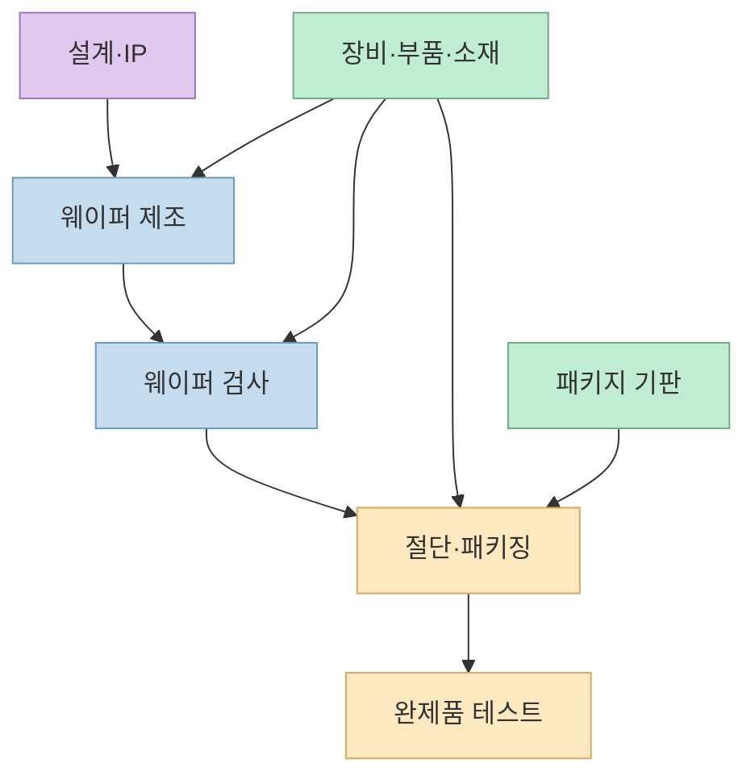
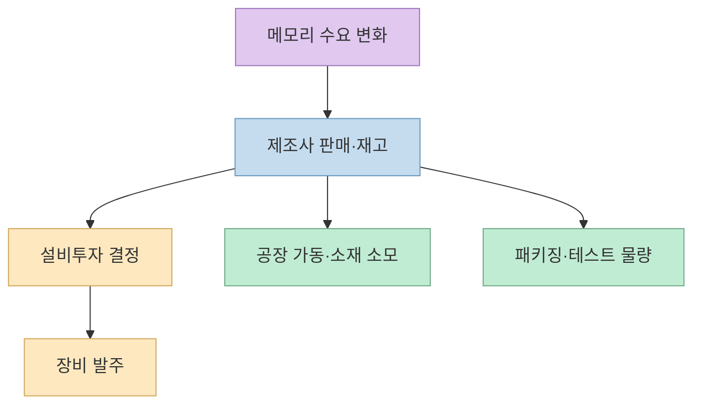
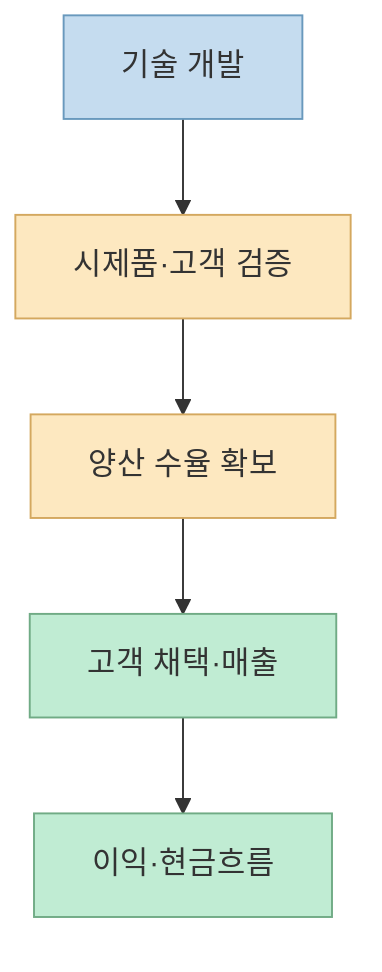

Threads에 올라온 "한 장으로 보는 K증시 반도체" 이미지는 국내 관련 기업을 10개 묶음으로 정리합니다. 처음 반도체 산업을 공부할 때 유용한 **탐색용 지도** 입니다. 다만 한 기업이 여러 공정에 제품을 공급할 수 있고, 같은 묶음에 들어 있어도 매출 구조와 고객, 투자 단계는 다릅니다. 이 글은 원본 목록을 매수 후보표가 아니라 **공급망을 읽기 위한 출발점** 으로 해석합니다.

<!--more-->

## Sources

- [Threads 원본 공유 링크](https://www.threads.com/share/_5bPiY-8r/) — @arahat_ready가 공유한 이미지. 이미지에는 @going_tothe_moon이 표기되어 있습니다.
- [SEMI, 반도체 가치사슬 개요](https://discover.semi.org/rs/320-QBB-055/images/SCC-Scope3-Category1-GHG-Guidelines-2024-FINAL.pdf)
- [SEMI, 반도체 소재의 분류](https://www.semi.org/en/products-services/market-data/materials)
- [삼성반도체, 패키징 공정 설명](https://semiconductor.samsung.com/kr/support/tools-resources/fabrication-process/eight-essential-semiconductor-fabrication-processes-part-9-packaging-to-protect-the-chips-from-external-elements/)
- [삼성반도체, 패키지 턴키 서비스](https://semiconductor.samsung.com/kr/foundry/advanced-package/package-turnkey-service/)
- [SKC, 글라스 기판 사업 소개](https://skc.kr/m/kor/creation/detailView.do?cate1=258&cate2=355&cate3=&cate4=&lang=kor&menuCd=002006)

## 1. 먼저 종목 목록보다 반도체가 만들어지는 순서를 보자

원본 이미지는 메모리, 전공정 장비, 후공정 장비, 부품, 소재, 기판, OSAT, 팹리스, 디자인하우스·IP, 유리기판으로 나눕니다. 그러나 이 10개는 **하나의 순서로 이어지는 10단계** 가 아닙니다. 어떤 항목은 제품 유형(메모리), 어떤 항목은 사업모델(팹리스·OSAT), 어떤 항목은 공급품(장비·소재·부품), 어떤 항목은 기판 기술(유리기판)입니다. SEMI의 가치사슬 자료도 소재·장비, 설계, 칩 제조, 조립·패키징, 최종 제품 통합을 구별합니다. [SEMI 자료](https://discover.semi.org/rs/320-QBB-055/images/SCC-Scope3-Category1-GHG-Guidelines-2024-FINAL.pdf)

이 그림도 개념도일 뿐입니다. 실제 생산에서는 검사와 소재·장비 사용이 여러 시점에 반복됩니다. 삼성반도체의 공정 설명도 웨이퍼 단계의 선별 검사와 패키지 이후 테스트를 구분합니다. 따라서 원본의 "후공정"과 "OSAT"은 같은 말이 아닙니다. 전자는 공정 구간이고, 후자는 조립·패키징·테스트를 외부에서 수행하는 **사업모델** 입니다. [삼성반도체 패키징 설명](https://semiconductor.samsung.com/kr/support/tools-resources/fabrication-process/eight-essential-semiconductor-fabrication-processes-part-9-packaging-to-protect-the-chips-from-external-elements/), [삼성반도체 OSAT 협력 설명](https://semiconductor.samsung.com/kr/foundry/advanced-package/package-turnkey-service/)

## 2. 이미지의 10개 묶음을 어떻게 읽을까

아래 기업명은 **원본 이미지에 등장하는 사례** 입니다. 이 글은 각 기업의 현재 주력 제품, 상장 상태, 반도체 관련 매출 비율, 공급계약을 개별 검증한 종목 목록이 아닙니다. 같은 이름이 여러 묶음에 나오는 것도 오류라고 단정할 수 없습니다. 사업이 여러 구간에 걸쳐 있을 수 있기 때문입니다. [Threads 원본](https://www.threads.com/share/_5bPiY-8r/)

- **메모리:** 원본은 삼성전자와 SK하이닉스를 묶습니다. 이는 장비·소재 공급사가 아니라 메모리 반도체를 생산·판매하는 기업을 가리키는 축입니다.
- **전공정 장비:** 원본은 주성엔지니어링, 원익IPS, 테스, 유진테크, 피에스케이, HPSP, 브이엠, 케이씨텍, 파크시스템스를 적습니다. 공정 장비라는 공통점만으로 각 회사의 장비 종류나 고객 투자가 같다고 보면 안 됩니다.
- **후공정 장비:** 원본은 한미반도체, 한화비전, 이오테크닉스, 피에스케이홀딩스, 테크윙, 인텍플러스, 고영, 기가비스, 와이씨, 디아이, 네오셈, 엑시콘을 적습니다. 검사용 장비와 패키징용 장비 등 세부 용도는 따로 확인해야 합니다.
- **부품:** 원본은 리노공업, ISC, 티에스이, 에스앤에스텍, 티씨케이, 하나머티리얼즈, 에프에스티, 원익QnC, 월덱스, 샘씨엔에스를 포함합니다. 하나의 부품 범주 안에도 소모품, 테스트 관련 부품 등 노출 지점이 다를 수 있습니다.
- **소재:** 원본은 솔브레인, 한솔케미칼, 동진쎄미켐, 켐트로스, 후성, 티이엠씨, 이엔에프테크놀로지, 원익머트리얼즈를 적습니다. SEMI는 소재도 웨이퍼 제조용과 패키징용으로 나눕니다. [SEMI 소재 분류](https://www.semi.org/en/products-services/market-data/materials)
- **기판:** 원본은 삼성전기, LG이노텍, 이수페타시스, 대덕전자, 심텍, 티엘비, 코리아써키트를 적습니다. 이때 "기판"은 넓은 표현이므로 실제로는 패키지 기판인지, 인쇄회로기판인지, 어느 최종 제품에 쓰이는지 구별해야 합니다.
- **OSAT(패키징·테스트):** 원본은 하나마이크론, SFA반도체, 네패스, 두산테스나, 에이팩트를 적습니다. 패키징과 테스트는 수행 범위가 다르므로 각 기업의 서비스 범위를 확인해야 합니다.
- **팹리스(설계):** 원본은 제주반도체, 파두, 퓨리오사AI, 리벨리온, LX세미콘을 적습니다. 이미지의 "국내 반도체 종목"이라는 제목과 달리, 이 목록의 모든 회사를 **증시 상장 종목** 이라고 전제해선 안 됩니다. 상장 여부는 별도 확인이 필요합니다.
- **디자인하우스·IP:** 원본은 가온칩스, 에이디테크놀로지, 세미파이브, 오픈엣지테크놀로지, 퀄리타스반도체, 칩스앤미디어를 적습니다. 설계 지원과 반도체 IP 공급은 같은 매출모델이 아닙니다.
- **유리기판:** 원본은 SKC, 필옵틱스, 제이앤티씨, 켐트로닉스, 와이씨켐을 적습니다. 이 묶음은 기존 실적을 공유하는 동질적 산업군이라기보다 차세대 패키징 기술과의 관련성을 표시한 **테마성 묶음** 으로 보는 편이 안전합니다. SKC는 자사 글라스 기판 사업을 소개하지만, 그것만으로 원본에 나열된 다른 기업들의 사업 단계가 같다고 말할 수는 없습니다. [SKC 사업 소개](https://skc.kr/m/kor/creation/detailView.do?cate1=258&cate2=355&cate3=&cate4=&lang=kor&menuCd=002006)

## 3. 같은 반도체 테마여도 실적이 움직이는 경로는 다르다

메모리 제조사는 제품 가격과 판매량이 중요합니다. 장비사는 고객사의 설비투자와 장비 발주·납품 시점, 소재·부품사는 생산 가동과 소모량, OSAT는 고객 물량과 패키징·테스트 수요를 살펴야 합니다. 이는 **기업군별로 확인할 질문이 다르다** 는 분석 틀이지, 특정 종목의 이익이 반드시 이 방식으로 움직인다는 예측은 아닙니다. 반도체 가치사슬에서 각 참여자의 역할을 구별하는 근거는 [SEMI의 공급망 분류](https://discover.semi.org/rs/320-QBB-055/images/SCC-Scope3-Category1-GHG-Guidelines-2024-FINAL.pdf)입니다.

패키징에서는 기판·테스트·OSAT의 접점이 생깁니다. 삼성반도체는 자체 패키징뿐 아니라 OSAT 및 PCB 공급 생태계와 협력한다고 설명합니다. 따라서 한 최종 제품의 공급망에 서로 다른 회사가 참여할 수 있지만, **참여 가능성** 과 **확인된 고객·매출** 은 구분해야 합니다. [삼성반도체 턴키 패키징](https://semiconductor.samsung.com/kr/foundry/advanced-package/package-turnkey-service/)

## 4. 유리기판은 왜 별도 묶음인가

반도체 패키징용 유리기판은 패키지 내부의 연결과 집적 방식을 바꿀 가능성 때문에 주목받습니다. SKC는 자체 소개 자료에서 평탄성과 대형 패널 가공성 등을 장점으로 제시합니다. 다만 이는 **기업의 기술·사업 설명** 이지, 기술 검증·양산·고객 채택·수익성 확보가 모두 끝났다는 독립적 증거는 아닙니다. [SKC 글라스 기판 소개](https://skc.kr/m/kor/creation/detailView.do?cate1=258&cate2=355&cate3=&cate4=&lang=kor&menuCd=002006)

원본 이미지의 "유리기판 관련" 분류만 보고 위 다섯 단계를 한꺼번에 통과했다고 해석하면 위험합니다. 각 회사별로 **어느 단계에 있고, 어떤 제품·장비·소재를 공급하며, 매출이 실제 발생했는지** 확인해야 합니다.

## 실전 적용 포인트: 종목표를 투자 판단으로 바꾸기 전

1. **사업을 확인한다.** 회사의 최근 사업보고서에서 실제 주력 제품·서비스와 매출 비중을 찾는다.
2. **고객과 공정을 확인한다.** 전공정인지 후공정인지, 메모리용인지 시스템 반도체용인지, 직접 납품인지 간접 공급인지 구분한다.
3. **단계를 확인한다.** 연구개발, 고객 검증, 양산, 매출, 영업이익을 한 단어 "관련주"로 뭉뚱그리지 않는다.
4. **주가와 사업을 분리한다.** 기술에 대한 기대가 사실이어도 이미 높은 가격에 반영됐을 수 있다. 원본 이미지에는 기업 가치평가 정보가 없다.
5. **상장 여부와 종목명을 재확인한다.** SNS 인포그래픽은 투자대상 목록이나 실시간 공시 자료가 아니다.

## 핵심 요약

- 원본의 10개 묶음은 반도체 산업을 훑는 데 유용하지만, 제품·공정·사업모델·테마가 섞인 **서로 다른 분류 축** 입니다.
- 같은 "반도체 관련주"라도 수익을 좌우하는 경로와 확인할 지표가 다릅니다.
- 특히 유리기판처럼 개발 단계가 중요한 테마는 **기술 가능성** 과 **확인된 매출·이익** 을 구분해야 합니다.

## 결론

한 장짜리 종목 지도는 **공부할 기업을 찾는 색인** 으로는 쓸 만합니다. 그러나 분류표에서 곧바로 매수 판단으로 넘어가는 순간 중요한 정보가 빠집니다. 기업별 최신 공시와 사업 비중, 고객 검증 단계, 가격을 따로 확인하세요. 이 글은 산업 구조 설명이며 특정 종목의 매수·매도 권유가 아닙니다.
