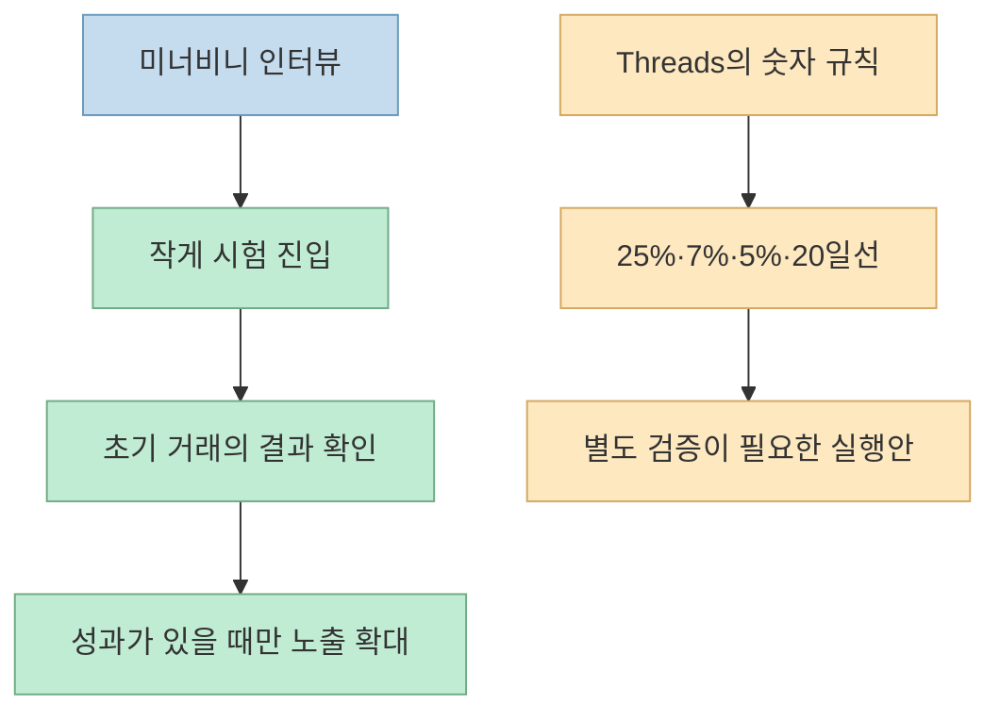
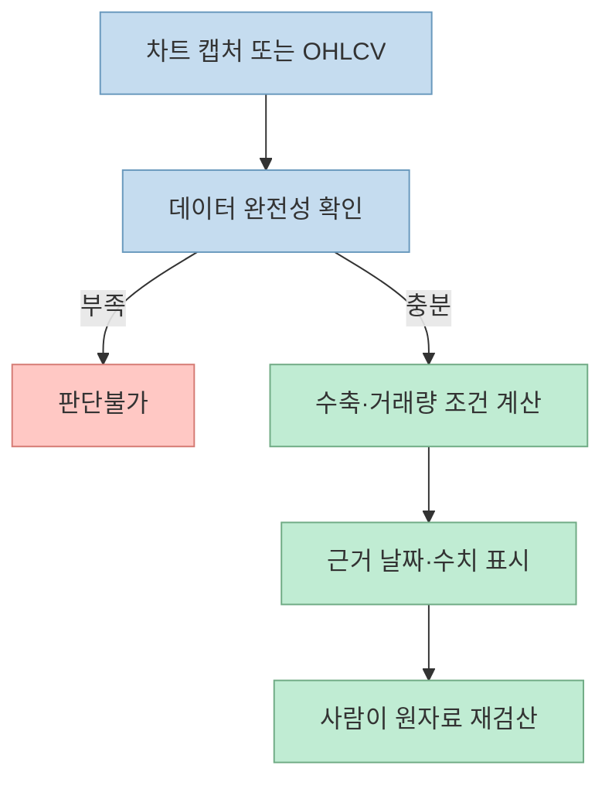
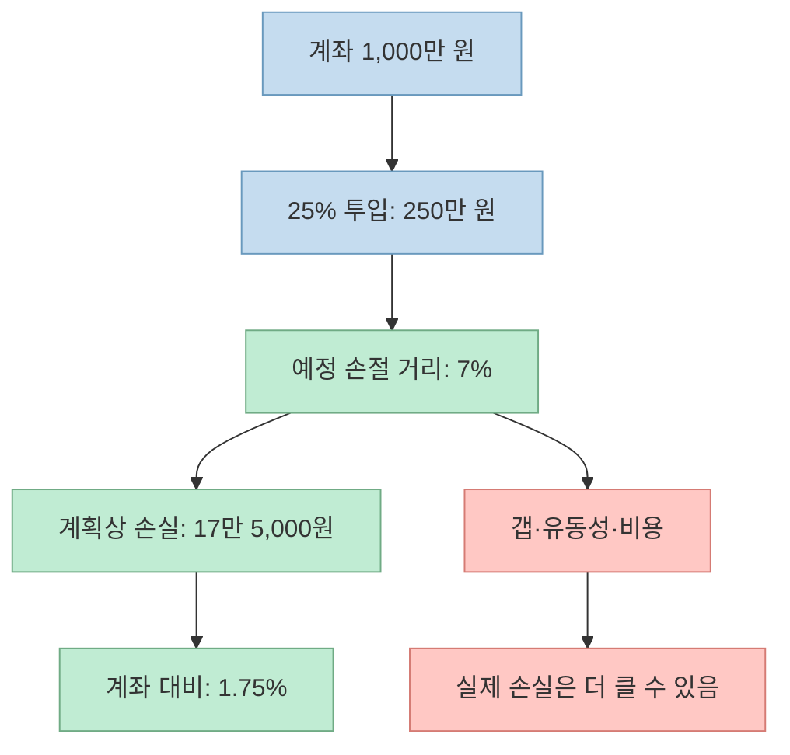
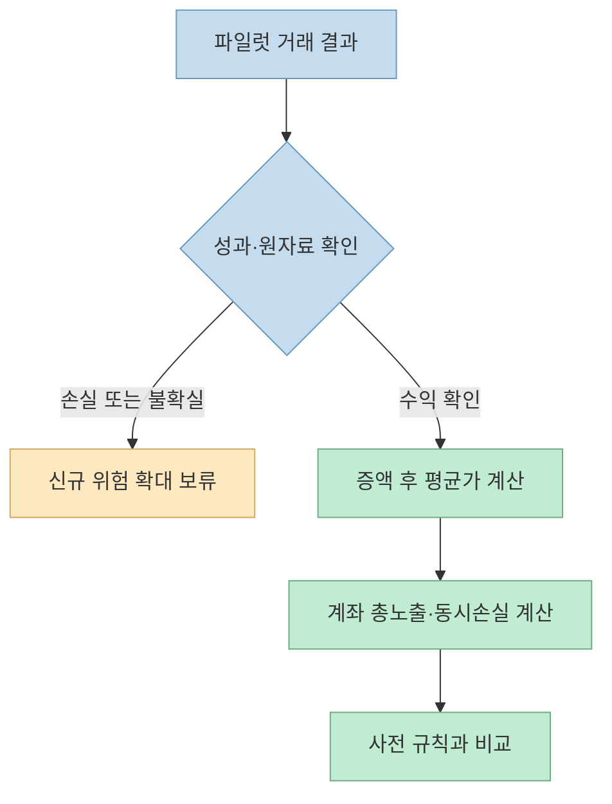

Threads 글은 마크 미너비니의 매매에서 **처음에는 작게 들어가고, 거래 결과가 유리할 때만 노출을 늘린다** 는 아이디어를 뽑아 AI 프롬프트 다섯 개로 정리합니다. 핵심 아이디어는 유용하지만, 게시물의 숫자를 그대로 자동매매 규칙처럼 받아들이면 오히려 위험해질 수 있습니다. AI는 차트를 판독하는 심판보다 **자료를 정리하고 계산을 검산하는 보조 도구** 에 가깝습니다.

<!--more-->

## Sources

- [Threads 원본 공유 링크](https://www.threads.com/share/_woqLnKCU/) — @ai__frontier의 본문과 연속 게시물 5개. 추출 방법: `scrapling-fetch`(단순 GET에서는 본문이 보이지 않아 브라우저 렌더링으로 재시도).
- [미너비니의 2021년 대회 성적 발표](https://www.prnewswire.com/news-releases/stock-trader-wins-us-investing-championship-a-second-time--breaks-record-301466652.html) — 미너비니 측이 배포한 발표 자료.
- [마크 미너비니 인터뷰: 점진적 노출의 의미](https://www.stockopedia.com/content/mark-minervini-interview-how-to-trade-like-a-champion-353963/)
- [SEC Investor.gov: 손절 주문의 체결 위험](https://www.investor.gov/introduction-investing/general-resources/news-alerts/alerts-bulletins/investor-bulletins-15)
- [SEC Investor.gov: AI 투자정보의 한계](https://www.investor.gov/introduction-investing/general-resources/news-alerts/alerts-bulletins/investor-alerts/artificial-intelligence-fraud)

## 1. 먼저 성적과 원칙을 분리하자

원본은 미너비니를 "1년에 투자로 334%를 번 사람"으로 소개합니다. 그가 속한 회사의 [2022년 발표](https://www.prnewswire.com/news-releases/stock-trader-wins-us-investing-championship-a-second-time--breaks-record-301466652.html)에 따르면, 그는 **2021년 U.S. Investing Championship의 100만 달러 이상 주식 부문에서 +334.8%** 를 기록했습니다. 같은 발표는 **1997년에도 1위였고 그해 수익률은 +155%** 라고 적습니다. 그러나 이를 "100만 달러 이상 부문에서 두 번 우승"이라고 쓰는 것은 자료가 확인해 주는 범위를 넘습니다. 1997년과 2021년의 부문을 같은 것으로 단정하지 않겠습니다. 또한 이 발표는 미너비니 측 배포 자료라는 출처 성격도 함께 봐야 합니다.

그의 [인터뷰](https://www.stockopedia.com/content/mark-minervini-interview-how-to-trade-like-a-champion-353963/)에서 확인되는 전략적 핵심은 **progressive exposure**, 즉 소규모 시험 포지션으로 시작해 초기 거래가 성과를 낼 때만 시장 노출을 점차 늘린다는 것입니다. 인터뷰는 계좌 전체 노출이 25% 또는 50%인 단계의 예를 들 뿐, 모든 종목을 반드시 계좌의 25%씩 사라거나 20일선 이탈 시 언제나 전량 매도하라는 고정 공식은 제시하지 않습니다. 원본 Threads의 7% 손절, +5% 증액, 20일선 전량 정리, 돌파 거래량 2배는 **게시물 작성자의 구체적 실행 규칙** 으로 읽는 것이 정확합니다.



## 2. 프롬프트 ①: VCP 차트를 AI가 판독할 수 있을까

첫 프롬프트는 일봉·거래량·200일 및 20일 지수이동평균선이 보이는 차트를 입력받아, 가격의 반복적인 수축, 거래량 감소, 마지막 고점 돌파를 단계별로 판정하도록 합니다. 예시로는 눌림 폭이 25% → 12% → 5%처럼 줄어드는 모습과 돌파 시 평소 거래량의 2배를 듭니다. 구성 자체는 **관찰 항목을 빠뜨리지 않는 체크리스트** 로 유용합니다. 그러나 한 장의 캡처만으로는 화면 밖 기간, 수정주가, 거래량 기준 기간, 장중 가격과 종가의 차이를 확인하기 어렵습니다. [Threads 원본](https://www.threads.com/share/_woqLnKCU/)

따라서 AI에게 먼저 "매수할까?"가 아니라 다음을 물어야 합니다.

```text
입력: 일자별 OHLCV 데이터, 이동평균 계산 방식, 기준 기간
역할: 매수 추천이 아닌 규칙 점검
출력: 각 조건의 충족/미충족/판단불가, 사용한 날짜와 수치,
      누락된 데이터, 다른 해석이 가능한 지점
금지: 보이지 않는 숫자 추정, 실시간 가격을 안다고 주장하기
```



SEC는 AI가 부정확하거나 오래된 정보에 기대거나, 입력이 맞아도 사실과 다른 출력을 만들 수 있다고 경고합니다. **차트 판독 결과를 주문 신호로 자동 연결하지 않는 이유** 입니다. [SEC AI 투자정보 경고](https://www.investor.gov/introduction-investing/general-resources/news-alerts/alerts-bulletins/investor-alerts/artificial-intelligence-fraud)

## 3. 프롬프트 ②: 25% 매수와 7% 손절은 계좌에서 얼마를 잃는가

두 번째 프롬프트는 계좌 잔액의 25%를 첫 매수에 쓰고, 진입가와 손절가 사이가 7%를 넘으면 진입을 기각하도록 합니다. 여기서 가장 중요한 구분은 **포지션 비중** 과 **계좌 위험** 입니다. 진입가 100, 예정 손절가 93, 계좌 1,000만 원이라는 가상 예시를 생각해 봅시다. 25%인 250만 원을 사면 예정 가격에서의 손실은 약 17만 5,000원, 계좌의 **1.75%** 입니다. 계산은 `계좌 × 비중 × 손절 거리 = 1,000만 원 × 0.25 × 0.07`입니다. 이는 수수료·세금·환율·갭 하락을 제외한 **계획상 손실** 이지 실제 손실 상한선이 아닙니다.



**손절 주문은 손절 가격에 체결된다는 보장이 없습니다.** 지정 가격에 도달하면 시장가 주문으로 바뀌는 손절 주문은 실제 체결가가 크게 달라질 수 있고, 손절 지정가 주문은 아예 체결되지 않을 수도 있습니다. 특히 여러 종목이 동시에 하락하거나 유동성이 적을 때는 위의 1.75% 계산을 최대 손실이라고 착각하면 안 됩니다. [SEC 손절 주문 안내](https://www.investor.gov/introduction-investing/general-resources/news-alerts/alerts-bulletins/investor-bulletins-15)

계산 보조 프롬프트에는 계좌금액·진입가·손절가뿐 아니라 **수량 단위, 거래 비용, 미체결 가능성, 포지션 간 동시 손실** 을 별도로 적고, 결과를 "계획상"으로 표시하도록 하는 편이 안전합니다.

## 4. 프롬프트 ③·④: 증액과 계좌 노출을 하나로 보자

세 번째 프롬프트는 첫 거래가 +5% 이상 수익이고 20일 지수이동평균선 위에 있을 때만 25%를 추가하는지 묻습니다. 네 번째 프롬프트는 최근 파일럿 거래의 성공·실패와 현재 계좌 노출을 함께 보여 주도록 합니다. 두 질문은 결국 **개별 종목의 수익** 과 **계좌 전체 위험** 을 연결합니다. [Threads 원본](https://www.threads.com/share/_woqLnKCU/)

추가 매수를 계산할 때는 "첫 진입분이 수익이니 안전하다"고 끝내면 안 됩니다. 증액 후 평균 매입가, 새 손절가, 두 물량을 동시에 팔 때의 계획상 손익, 전체 계좌 노출을 다시 계산해야 합니다. 종목들이 같은 시장 요인에 민감하면 여러 파일럿이 사실상 하나의 큰 베팅이 될 수도 있습니다. 원본의 "20일선 아래 마감이면 전량 정리"는 선택한 전략의 조건일 수 있지만 모든 투자자에게 보편적인 매도 기준은 아닙니다. 그리고 손절가를 첫 매입가 위로 옮겨도 실제 체결가가 그 이상이라는 보장은 없습니다. [SEC 손절 주문 안내](https://www.investor.gov/introduction-investing/general-resources/news-alerts/alerts-bulletins/investor-bulletins-15)



이 점이 미너비니 인터뷰의 점진적 노출과 가장 가까운 부분입니다. 그는 **초기 포지션에서 견인력이 확인되지 않았는데 노출을 크게 늘릴 이유가 없다** 는 취지로 설명합니다. 그러나 어느 종목을 언제 몇 % 추가할지는 그 인터뷰만으로 확정할 수 없습니다. [미너비니 인터뷰](https://www.stockopedia.com/content/mark-minervini-interview-how-to-trade-like-a-champion-353963/)

## 5. 프롬프트 ⑤: AI가 가장 잘할 수 있는 일은 사후 감사다

마지막 프롬프트는 매매 일지에서 피봇 전 선진입, 과도한 손절 거리, 첫 거래가 수익이 나기 전 증액, 손절 직후 재진입, 20일선 이탈 후 보유를 찾아 유형별 횟수와 손익 영향을 정리하게 합니다. 이 다섯 항목은 원본 작성자가 선택한 **자기 점검 규칙** 입니다. 실제로 효과가 있었는지는 거래 기록과 비교군 없이 단정할 수 없습니다. [Threads 원본](https://www.threads.com/share/_woqLnKCU/)

AI에게 매매 일지를 맡길 때는 "나쁜 거래"라는 감상 대신 **규칙 위반 여부의 재현 가능한 판정** 을 요구하는 편이 낫습니다. 각 거래에 대해 진입 전 계획, 실제 주문 시간·가격·수량, 당시 보이던 차트 데이터, 청산 사유를 남겨야 사후적으로 알게 된 결과를 과거 판단에 끼워 넣는 편향을 줄일 수 있습니다. AI가 계산한 위반 건수와 손익 영향은 원장과 대조해야 합니다. [SEC AI 투자정보 경고](https://www.investor.gov/introduction-investing/general-resources/news-alerts/alerts-bulletins/investor-alerts/artificial-intelligence-fraud)

## 실전 적용 포인트

- **AI의 역할을 제한한다.** 숫자 정리, 계산 검산, 규칙 누락 발견까지만 맡기고 주문 결정을 자동화하지 않는다.
- **퍼센트의 분모를 명시한다.** 25%가 한 종목의 목표 비중인지, 계좌의 총 시장 노출인지 먼저 구별한다.
- **계획상 손실과 실제 손실을 분리한다.** 손절 주문·시장 급변·동시 하락을 감안한다.
- **유명 투자자의 실적을 전략의 재현성으로 오해하지 않는다.** 과거 대회 성적은 현재의 프롬프트가 수익을 낸다는 증거가 아니다.

## 핵심 요약

Threads의 다섯 프롬프트는 차트 체크, 파일럿 진입, 증액, 계좌 노출, 매매 감사로 이어지는 **기록 체계** 로 읽으면 유용합니다. 반면 25%·7%·+5%·20일선·거래량 2배를 미너비니의 보편적 공식이나 수익 보장 조건으로 받아들여서는 안 됩니다. 가장 중요한 계산은 `포지션 비중 × 예정 손절 거리`이고, 그 값조차 실제 최대 손실은 아닙니다.

## 결론

AI는 "이 종목을 사라"고 말하는 매매 코치보다 **내가 세운 규칙과 실제 행동 사이의 차이를 드러내는 감사 도구** 일 때 더 쓸모 있습니다. 원본의 숫자들은 자신의 데이터로 검증할 가설로만 다루세요. 이 글은 전략 분석이며 특정 거래나 수익을 권유하지 않습니다.
