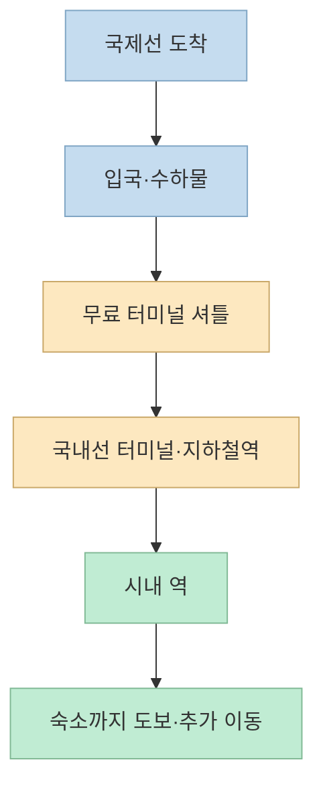
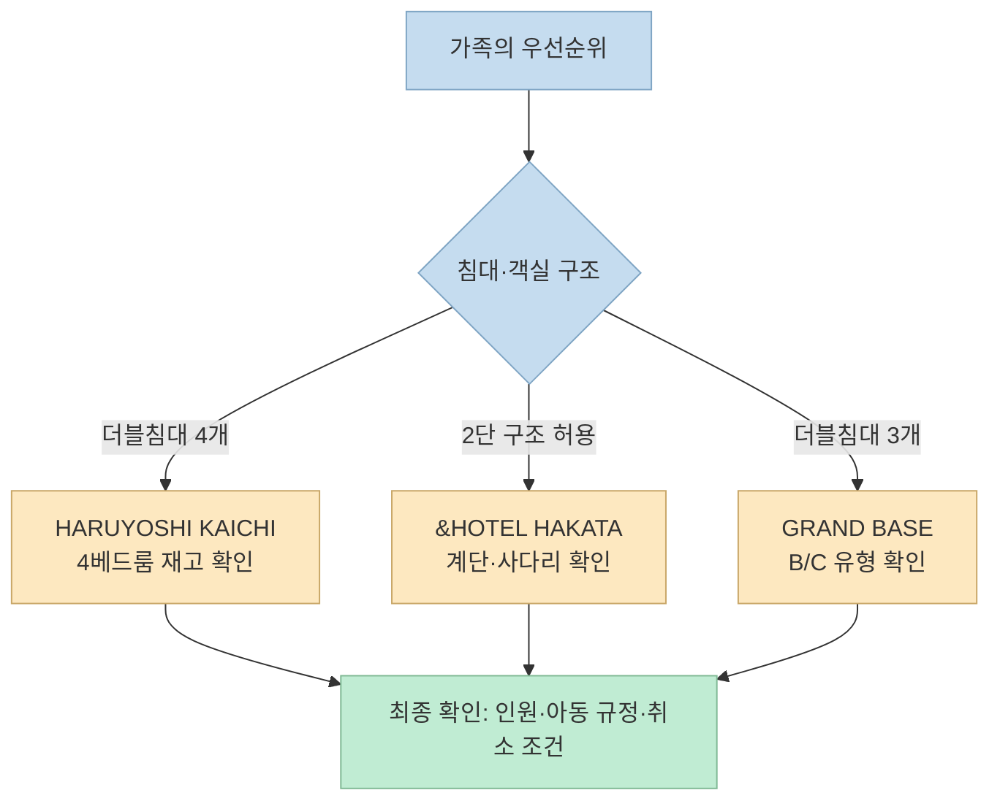
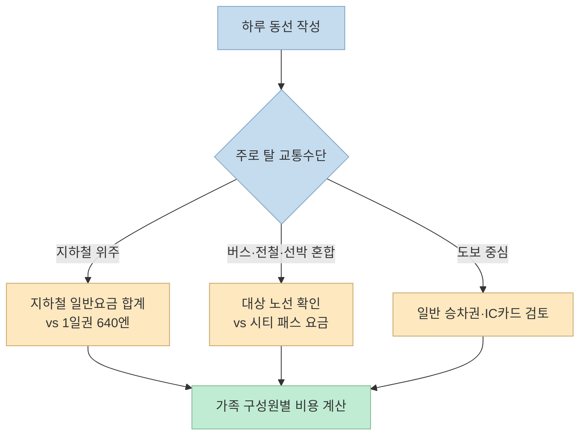

아이와 함께하는 후쿠오카 여행에서는 비행시간만큼이나 **도착 터미널에서 숙소까지의 실제 동선**, 객실의 침대 구성, 체크인 방식이 중요하다. 한 Threads 게시물은 숙소 세 곳과 교통패스를 추천한다. 아래에서는 추천 자체를 그대로 따르기보다, 공식 자료로 확인되는 조건과 예약 전에 다시 물어봐야 할 조건을 나눠 본다.

<!--more-->

## Sources

- [원문: Threads의 후쿠오카 가족여행 숙소 추천](https://www.threads.com/share/BAB2s84FY3/) — 원문과 이어진 게시물에는 **플랫폼 광고 포함, 호텔과는 무관**하다는 표시가 있다. 항공권·패스 구매 링크는 제휴 링크이므로 이 글에는 옮기지 않았다.
- [후쿠오카 공항: 지하철 접근](https://www.fukuoka-airport.jp/en/access/subway.html), [공항 첫 방문 안내](https://www.fukuoka-airport.jp/target/beginner.html)
- [HARUYOSHI KAICHI 공식 FAQ](https://liberatedhotel.com/haruyoshi/ko/faq/), [&HOTEL HAKATA 객실](https://and-hotel.jp/room/), [GRAND BASE 약인오도리 객실·이용 안내](https://grand-base.jp/hotel/gb-yakuinodori/)
- [후쿠오카 투어리스트 시티 패스](https://gofukuoka.jp/ko/citypass.html), [후쿠오카시 지하철 1일승차권](https://subway.city.fukuoka.lg.jp/kor/fare/one/)

## 공항에서 시내까지: ‘지하철 10분’은 전체 이동시간이 아니다

원문은 공항에서 지하철을 타면 시내에 금방 도착한다는 점을 장점으로 든다. 공항 공식 안내에 따르면 **지하철역과 직접 연결된 곳은 국내선 터미널**이다. 국제선 터미널에 도착했다면 무료 터미널 간 셔틀을 타고 국내선 터미널로 이동한 뒤 지하철을 이용해야 한다. 공항역에서 하카타역까지 약 5분, 덴진역까지 약 10분이라는 안내는 **지하철 탑승 구간**의 시간이지 입국 심사, 수하물 수령, 셔틀 대기, 숙소까지 걷는 시간을 포함하지 않는다. [후쿠오카 공항 공식 안내](https://www.fukuoka-airport.jp/target/beginner.html)

따라서 유모차와 큰 짐이 있다면 ‘공항역에서 몇 분’보다 **국제선 도착 → 호텔 객실**의 전체 경로를 지도에서 확인하는 편이 정확하다. 항공편 소요시간도 출발 공항과 운항편에 따라 달라지므로 예약 화면의 실제 일정을 기준으로 잡자.

## 추천 숙소 3곳: 같은 ‘가족 객실’도 구조가 다르다

### 1. LIBERATED HOTEL HARUYOSHI KAICHI — 침대 수는 명확하지만 큰 객실은 드물다

[공식 FAQ](https://liberatedhotel.com/haruyoshi/ko/faq/)에는 총 15실 중 트윈룸 14실에 더블침대 2개, 4베드룸 1실에 더블침대 4개가 있다고 적혀 있다. 4베드룸을 원한다면 호텔 전체에 **1실뿐**이므로 예약 화면의 객실 유형과 인원을 반드시 확인해야 한다. 체크인 가능 시간은 15:00~23:00이고, 체크인 전 짐 보관은 가능하지만 **2026년 1월부터 체크아웃 후 짐 보관은 중단**됐다고 안내한다. 늦은 비행이나 귀국 전 짐 보관 계획에 영향을 줄 수 있다.

원문에는 한국인 직원에 관한 언급도 있지만, 공식 FAQ의 한국어 페이지가 있다는 사실만으로 **현장 한국어 응대가 상시 가능하다고 보장할 수는 없다**. 꼭 필요하다면 예약 전 호텔에 직접 문의하자. [호텔 접근 안내](https://liberatedhotel.com/haruyoshi/access/)에는 덴진미나미역 6번 출구에서 도보 약 4분으로 표시되어 있다.

### 2. &HOTEL HAKATA — 2층 침대 구조를 아이 나이에 맞춰 확인

[호텔 공식 객실 안내](https://and-hotel.jp/room/)의 Group Room / Family Room은 계단과 사다리가 있는 **2단 구조 침대**다. 공간 활용에는 장점이 있지만 어린아이가 위층을 이용해도 되는지, 보호자가 아래층에서 함께 잘 수 있는지 객실 사진과 숙소 규정을 확인해야 한다. 반면 Premium Room은 약 30㎡에 주방이 있다고 안내한다. ‘가족 객실’이라는 이름만으로 객실 구조를 동일하게 생각하지 않는 편이 좋다. [공식 접근 안내](https://and-hotel.jp/access/)상 기온역 2번 출구에서 도보 약 4분이다.

이 숙소 역시 원문의 ‘한국어 응대’ 주장은 공식 객실·접근 안내만으로 확인되지 않았다. 필요하다면 해당 날짜의 응대 가능 여부를 직접 확인하자.

### 3. GRAND BASE 약인오도리 — 여러 침대와 셀프 체크인

[공식 시설 안내](https://grand-base.jp/hotel/gb-yakuinodori/)에는 Standard A가 23㎡·더블침대 1개·정원 2명, Standard B가 35㎡·더블침대 3개·정원 6명, Superior C가 42㎡·더블침대 3개·정원 6명으로 기재돼 있다. ‘더블침대가 여러 개’라는 추천은 **B/C 객실에만** 해당하므로 A 객실을 잘못 예약하지 않도록 주의해야 한다. 같은 안내에는 약인오도리역에서 도보 약 6분이라고 적혀 있다.

프런트는 무인으로 운영되며 태블릿으로 셀프 체크인한다. 출입 비밀번호와 체크인 ID는 숙박일 3일 전과 전날 메시지로 전송되고, 원격 고객지원은 24시간 제공된다고 안내한다. 늦게 도착하는 가족이라면 예약 메시지 수신 여부, 휴대전화 연결, 아이와 짐을 동반한 셀프 체크인 절차를 미리 확인하는 것이 좋다. [공식 시설 안내](https://grand-base.jp/hotel/gb-yakuinodori/)

## 교통패스: ‘많이 타면 이득’을 숫자로 바꿔 보기

원문에 나온 **후쿠오카 투어리스트 시티 패스**는 관광객용 1일권이다. [후쿠오카시 공식 관광 안내](https://gofukuoka.jp/ko/citypass.html)는 시내권을 성인 2,500엔·어린이 1,250엔, 다자이후 포함권을 성인 2,800엔·어린이 1,400엔으로 안내한다. 시내의 대상 버스·전철·지하철·선박을 이용할 수 있지만, 노선별 적용 범위와 제외 교통편을 확인해야 한다. 예컨대 공식 안내는 다자이후 라이너 버스 ‘다비토’는 이용할 수 없다고 명시한다. 가격과 사용 조건은 구매 직전 다시 확인하자.

반면 [후쿠오카시 지하철 1일승차권](https://subway.city.fukuoka.lg.jp/kor/fare/one/)은 성인 640엔·어린이 320엔으로 **지하철 전 노선만** 무제한 탑승할 수 있다. 지하철 위주 일정이라면 시티 패스를 자동으로 살 이유는 없다. 산책 위주로 하루에 한두 번만 탑승한다면 일반 승차권이나 IC카드가 나을 수도 있다.

패스의 손익은 **각자 이용할 구간의 일반요금 합계와 패스값을 비교**해야 판단할 수 있다. 아이의 요금 적용 연령, 휴식으로 취소될 수 있는 이동, 패스 대상 밖 노선까지 넣어 계산하면 과도한 구매를 피할 수 있다.

## 실전 적용 포인트

1. 항공권에서는 출발 공항·도착 시간·수하물 조건을 보고, 숙소까지의 **국제선 터미널 기준** 동선을 찾는다.
2. 숙소는 이름보다 **예약할 객실 유형, 실제 침대 배치, 아동 포함 정원**을 확인한다. 2단 침대라면 아이의 이용 가능 여부도 묻는다.
3. 늦은 체크인, 체크아웃 후 짐 보관, 한국어 응대처럼 여행을 좌우하는 조건은 숙소에 직접 확인한다.
4. 교통패스는 하루 동선을 짠 다음 일반요금 합계와 비교하고, 제휴 링크보다 [공식 이용 범위와 가격](https://gofukuoka.jp/ko/citypass.html)을 먼저 읽는다.

## 핵심 요약

- 후쿠오카 공항의 ‘시내까지 지하철 몇 분’은 **국내선 터미널의 지하철 탑승 시간**이다. 국제선 도착자는 셔틀 환승을 포함해야 한다.
- 추천 숙소 세 곳은 각각 침대 수, 2단 구조, 셀프 체크인 방식이 다르다. **객실 유형을 지정해서** 확인해야 한다.
- 시티 패스는 누구에게나 이득인 정액권이 아니다. 지하철만 탈지, 버스·전철까지 탈지에 따라 다른 선택이 낫다.

## 결론

가족여행의 편의성은 ‘후쿠오카가 가깝다’는 한 문장보다 **터미널부터 객실까지의 실제 이동**, 아이가 안전하게 쓸 수 있는 침대, 필요한 날에 맞는 교통권에서 결정된다. SNS 추천은 후보를 찾는 출발점으로 쓰고, 예약 결정은 공식 안내와 해당 날짜의 숙소 답변으로 마무리하자.
